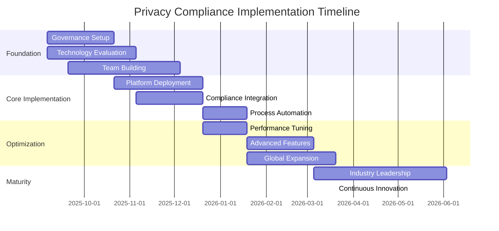

# Comprehensive Privacy Compliance Synthesis: Master Implementation Plan for Analytics Platforms - 2025

**Document Classification**: Strategic Implementation Framework  
**Version**: 1.0  
**Date**: September 5, 2025  
**Status**: Executive Synthesis - Ready for Implementation  

## Executive Summary

This master implementation plan synthesizes comprehensive privacy research across GDPR compliance, US state privacy laws, international regulations, privacy-preserving analytics, data security, compliance monitoring, data governance, and Privacy Impact Assessment (PIA/DPIA) frameworks. The synthesis delivers a unified, actionable strategy for analytics platforms to achieve global privacy compliance excellence while maintaining analytical utility and competitive advantage.

**Key Synthesis Sources:**
- Automated Compliance Monitoring & Auditing Systems Framework
- Comprehensive Data Governance Framework for Analytics Platforms  
- Comprehensive PIA/DPIA Framework for Analytics Platforms
- Privacy-Preserving Analytics Technical Implementation Guide

## Table of Contents

1. [Integrated Compliance Framework](#1-integrated-compliance-framework)
2. [Technical Implementation Architecture](#2-technical-implementation-architecture)
3. [Operational Processes](#3-operational-processes)
4. [Strategic Roadmap](#4-strategic-roadmap)
5. [Business Value and ROI](#5-business-value-and-roi)
6. [Master Implementation Plan](#6-master-implementation-plan)

---

## 1. Integrated Compliance Framework

### 1.1 Unified Multi-Jurisdiction Compliance Architecture

**Harmonized Regulatory Coverage:**

```typescript
interface GlobalComplianceFramework {
  jurisdictionalRequirements: {
    european: {
      gdpr: GDPRComplianceModule;
      nationalLaws: EUMemberStateRequirements;
      enforcement: SupervisoryAuthorityAlignment;
    };
    americas: {
      ccpa: CaliforniaPrivacyFramework;
      vcdpa: VirginiaPrivacyCompliance;
      cpa: ColoradoPrivacyFramework;
      pipeda: CanadianPrivacyCompliance;
    };
    asiaPacific: {
      pdpa: SingaporePrivacyFramework;
      privacyAct: AustralianPrivacyCompliance;
      pipa: JapanPrivacyFramework;
      pipa_korea: SouthKoreaPrivacyCompliance;
    };
    emerging: {
      lgpd: BrazilPrivacyFramework;
      popia: SouthAfricaPrivacyCompliance;
      pdpl: ThailandPrivacyFramework;
    };
  };
  
  crossJurisdictionalAlignment: {
    dataTransferMechanisms: AdequacyAndSafeguardsFramework;
    conflictResolution: JurisdictionalConflictResolver;
    enforcementCoordination: MultiRegulatorEngagement;
  };
}
```

**Global Privacy Management System:**

1. **Centralized Policy Hub**
   - Master privacy policy framework adaptable to local jurisdictions
   - Automated policy updates based on regulatory changes
   - Version control with jurisdiction-specific customizations
   - Real-time policy distribution across global operations

2. **Unified Rights Management**
   - Standardized data subject rights interface
   - Jurisdiction-aware rights enforcement
   - Cross-border request coordination
   - Automated rights fulfillment workflows

3. **Harmonized Consent Framework**
   - Global consent taxonomy with local adaptations
   - Multi-jurisdiction consent propagation
   - Conflict resolution for competing consent requirements
   - Automated consent refresh and revalidation

### 1.2 Cross-Regulation Alignment Strategies

**Regulatory Convergence Analysis:**

```python
class RegulatoryHarmonization:
    def __init__(self):
        self.regulation_mapping = {
            'data_minimization': {
                'gdpr_article_5': 'Data minimization principle',
                'ccpa_section_1798.100': 'Collection limitation',
                'pipeda_principle_4': 'Limiting collection',
                'pdpa_section_13': 'Data minimization obligation'
            },
            'consent_requirements': {
                'gdpr_article_7': 'Conditions for consent',
                'ccpa_opt_out': 'Right to opt-out',
                'pipeda_principle_3': 'Consent requirements',
                'pdpa_section_14': 'Consent provisions'
            },
            'breach_notification': {
                'gdpr_articles_33_34': '72-hour notification',
                'ccpa_section_1798.82': 'Breach notification',
                'pipeda_breach_regulations': 'Breach reporting',
                'pdpa_section_26': 'Data breach notification'
            }
        }
        
    def generate_unified_controls(self, privacy_requirement: str) -> dict:
        """Generate unified privacy controls that satisfy multiple jurisdictions."""
        requirements = self.regulation_mapping.get(privacy_requirement, {})
        
        unified_controls = {
            'policy_requirements': self.synthesize_policy_requirements(requirements),
            'technical_controls': self.identify_technical_controls(requirements),
            'procedural_controls': self.define_procedural_controls(requirements),
            'monitoring_controls': self.establish_monitoring_controls(requirements)
        }
        
        return unified_controls
    
    def assess_regulatory_conflicts(self, jurisdiction_a: str, 
                                  jurisdiction_b: str) -> dict:
        """Identify and resolve conflicts between jurisdictional requirements."""
        conflicts = []
        resolutions = []
        
        # Analyze consent model differences
        if (jurisdiction_a == 'EU' and jurisdiction_b == 'US'):
            conflicts.append({
                'conflict_type': 'consent_model',
                'description': 'GDPR requires explicit consent vs CCPA opt-out model',
                'resolution_strategy': 'Implement dual consent mechanism with opt-in for EU users and opt-out for CA users'
            })
            
        # Analyze data transfer restrictions
        conflicts.append({
            'conflict_type': 'data_transfers',
            'description': 'Varying adequacy and safeguard requirements',
            'resolution_strategy': 'Implement highest common standard with jurisdiction-specific enhancements'
        })
        
        return {
            'identified_conflicts': conflicts,
            'resolution_strategies': resolutions,
            'implementation_priority': self.prioritize_resolutions(conflicts)
        }
```

### 1.3 Global Privacy Management System

**Integrated Compliance Dashboard:**

```typescript
interface GlobalPrivacyDashboard {
  jurisdictionalCompliance: {
    complianceScore: number;
    jurisdiction: string;
    lastAssessment: Date;
    criticalIssues: ComplianceIssue[];
    upcomingDeadlines: RegulatoryDeadline[];
  }[];
  
  dataSubjectRights: {
    totalRequests: number;
    averageResponseTime: number;
    fulfillmentRate: number;
    jurisdictionalBreakdown: Map<string, RequestMetrics>;
  };
  
  privacyByDesign: {
    systemsCoverage: number;
    automatedControls: number;
    privacyEnhancingTechnologies: PETImplementation[];
  };
  
  riskManagement: {
    overallRiskScore: number;
    riskTrends: RiskTrendData[];
    mitigationEffectiveness: number;
    emergingRisks: EmergingRisk[];
  };
}
```

---

## 2. Technical Implementation Architecture

### 2.1 Privacy-by-Design Analytics Platform Architecture

**Core Architecture Principles:**

```typescript
interface PrivacyFirstAnalyticsArchitecture {
  dataIngestionLayer: {
    privacyClassification: AutomatedDataClassifier;
    consentValidation: RealTimeConsentChecker;
    pseudonymization: PseudonymizationEngine;
    minimizationControls: DataMinimizationProcessor;
  };
  
  processingLayer: {
    differentialPrivacy: DifferentialPrivacyEngine;
    federatedAnalytics: FederatedComputationFramework;
    homomorphicEncryption: EncryptedComputationEngine;
    syntheticDataGeneration: PrivacyPreservingDataSynthesis;
  };
  
  storageLayer: {
    encryptedStorage: ZeroKnowledgeDataStore;
    retentionAutomation: AutomatedDataLifecycle;
    rightToErasure: SecureDeletionFramework;
    auditLogging: ImmutablePrivacyAuditLog;
  };
  
  accessLayer: {
    contextualAccess: AttributeBasedAccessControl;
    purposeLimitation: PurposeBindingEnforcement;
    consentEnforcement: DynamicConsentGate;
    transparencyTools: ExplainableAnalyticsInterface;
  };
}
```

**Integrated Privacy-Preserving Technologies Stack:**

1. **Differential Privacy Implementation**
   ```python
   class EnterprisePrivacyEngine:
       def __init__(self, total_epsilon_budget: float = 10.0):
           self.global_budget = PrivacyBudgetManager(total_epsilon_budget)
           self.dp_mechanisms = {
               'laplace': LaplaceMechanism(),
               'gaussian': GaussianMechanism(),
               'exponential': ExponentialMechanism(),
               'sparse_vector': SparseVectorTechnique()
           }
           
       def execute_private_query(self, query: AnalyticsQuery, 
                                epsilon: float, mechanism: str = 'laplace'):
           # Budget allocation and tracking
           if not self.global_budget.allocate(query.id, epsilon):
               raise InsufficientPrivacyBudgetError()
               
           # Execute query with selected DP mechanism
           mechanism_impl = self.dp_mechanisms[mechanism]
           private_result = mechanism_impl.execute(query, epsilon)
           
           # Log for audit and compliance
           self.log_private_computation(query, epsilon, private_result)
           
           return private_result
   ```

2. **Federated Analytics Framework**
   ```python
   class SecureFederatedAnalytics:
       def __init__(self, participants: List[DataParticipant]):
           self.participants = participants
           self.crypto_provider = SecureMultiPartyComputation()
           self.aggregation_protocols = {
               'secure_sum': SecureSummation(),
               'private_set_intersection': PrivateSetIntersection(),
               'federated_learning': PrivacyPreservingFederatedLearning()
           }
           
       async def execute_federated_computation(self, 
                                             computation_spec: ComputationSpec) -> FederatedResult:
           # Coordinate secure computation across participants
           protocol = self.aggregation_protocols[computation_spec.protocol_type]
           
           # Execute with privacy guarantees
           result = await protocol.execute_secure_computation(
               participants=self.participants,
               computation_spec=computation_spec,
               privacy_budget=computation_spec.epsilon
           )
           
           return result
   ```

### 2.2 Automated Compliance Monitoring Systems

**Real-Time Compliance Architecture:**

```python
class ComplianceOrchestrationEngine:
    def __init__(self):
        self.monitoring_agents = {
            'gdpr_monitor': GDPRComplianceAgent(),
            'ccpa_monitor': CCPAComplianceAgent(),
            'data_governance_monitor': DataGovernanceAgent(),
            'privacy_engineering_monitor': PrivacyEngineeringAgent()
        }
        
        self.alert_system = MultiChannelAlertSystem()
        self.remediation_engine = AutomatedRemediationEngine()
        
    async def continuous_compliance_monitoring(self):
        """Run continuous compliance monitoring across all frameworks."""
        while True:
            compliance_results = []
            
            # Execute all monitoring agents in parallel
            monitoring_tasks = [
                agent.assess_compliance() 
                for agent in self.monitoring_agents.values()
            ]
            
            results = await asyncio.gather(*monitoring_tasks)
            
            # Analyze results and trigger alerts
            for agent_name, result in zip(self.monitoring_agents.keys(), results):
                if result.compliance_score < result.threshold:
                    await self.handle_compliance_violation(agent_name, result)
                    
            await asyncio.sleep(300)  # Check every 5 minutes
    
    async def handle_compliance_violation(self, agent_name: str, 
                                        violation_result: ComplianceResult):
        # Send immediate alert
        alert = ComplianceAlert(
            agent=agent_name,
            severity=violation_result.severity,
            details=violation_result.violations,
            recommended_actions=violation_result.remediation_suggestions
        )
        
        await self.alert_system.send_alert(alert)
        
        # Attempt automated remediation for low-risk violations
        if violation_result.severity <= Severity.MEDIUM:
            remediation_success = await self.remediation_engine.auto_remediate(
                violation_result
            )
            
            if remediation_success:
                alert.status = AlertStatus.AUTO_RESOLVED
                await self.alert_system.update_alert(alert)
```

### 2.3 Unified Data Governance Infrastructure

**Data Governance Integration Layer:**

```typescript
interface UnifiedDataGovernanceFramework {
  metadataManagement: {
    automatedDiscovery: DataDiscoveryEngine;
    privacyClassification: SensitivityClassifier;
    lineageTracking: PrivacyAwareLineageTracker;
    businessGlossary: PrivacyEnhancedBusinessGlossary;
  };
  
  policyEnforcement: {
    purposeLimitation: PurposeBindingEngine;
    accessControl: PrivacyAwareAccessControl;
    retentionManagement: AutomatedRetentionEngine;
    consentEnforcement: DynamicConsentEnforcement;
  };
  
  qualityManagement: {
    accuracyValidation: PrivacyPreservingQualityChecks;
    completenessAssessment: DataCompletenessAnalyzer;
    consistencyValidation: CrossSystemConsistencyChecker;
    privacyQualityMetrics: PrivacyQualityScoring;
  };
}
```

---

## 3. Operational Processes

### 3.1 Streamlined Compliance Workflows

**Privacy Impact Assessment Automation:**

```python
class AutomatedDPIAWorkflow:
    def __init__(self):
        self.assessment_engine = RiskAssessmentEngine()
        self.stakeholder_manager = StakeholderEngagementPlatform()
        self.mitigation_engine = RiskMitigationEngine()
        self.approval_system = WorkflowApprovalSystem()
        
    async def execute_dpia_workflow(self, processing_activity: ProcessingActivity):
        """Execute end-to-end automated DPIA workflow."""
        
        # Step 1: Automated risk assessment
        risk_assessment = await self.assessment_engine.assess_privacy_risks(
            processing_activity
        )
        
        # Step 2: Stakeholder consultation
        stakeholder_feedback = await self.stakeholder_manager.collect_feedback(
            processing_activity, risk_assessment
        )
        
        # Step 3: Mitigation recommendation
        mitigation_plan = await self.mitigation_engine.generate_mitigations(
            risk_assessment, stakeholder_feedback
        )
        
        # Step 4: Approval workflow
        approval_result = await self.approval_system.process_approval(
            processing_activity, risk_assessment, mitigation_plan
        )
        
        # Step 5: Implementation tracking
        implementation_tracker = await self.track_implementation(
            mitigation_plan, approval_result
        )
        
        return DPIAResult(
            risk_assessment=risk_assessment,
            mitigation_plan=mitigation_plan,
            approval_status=approval_result.status,
            implementation_tracker=implementation_tracker
        )
```

### 3.2 Integrated Risk Management

**Unified Risk Management Framework:**

```typescript
interface IntegratedRiskManagement {
  riskIdentification: {
    automatedThreatModeling: ThreatModelingEngine;
    vulnerabilityScanning: PrivacyVulnerabilityScanner;
    riskIntelligence: RegulatoryRiskIntelligence;
    stakeholderRiskInput: StakeholderRiskFeedback;
  };
  
  riskAssessment: {
    quantitativeRiskScoring: QuantitativeRiskEngine;
    qualitativeRiskAnalysis: QualitativeRiskFramework;
    cumulativeRiskModeling: CrossProcessingRiskAnalysis;
    scenarioPlanning: RiskScenarioSimulator;
  };
  
  riskMitigation: {
    controlRecommendation: IntelligentControlSuggestion;
    mitigationPlanning: AutomatedMitigationPlanning;
    implementationTracking: ControlImplementationMonitor;
    effectivenessValidation: MitigationEffectivenessAnalyzer;
  };
}
```

### 3.3 Unified Audit and Documentation Systems

**Integrated Audit Framework:**

```python
class UnifiedAuditSystem:
    def __init__(self):
        self.audit_collectors = {
            'privacy_actions': PrivacyActionLogger(),
            'data_processing': DataProcessingLogger(),
            'consent_changes': ConsentChangeLogger(),
            'rights_requests': RightsRequestLogger(),
            'policy_updates': PolicyUpdateLogger()
        }
        
        self.evidence_manager = EvidenceManagementSystem()
        self.reporting_engine = AutomatedReportingEngine()
        
    def create_immutable_audit_record(self, event: AuditEvent) -> AuditRecord:
        """Create tamper-proof audit record with cryptographic verification."""
        
        # Generate audit record with metadata
        audit_record = AuditRecord(
            event_id=event.id,
            timestamp=datetime.utcnow(),
            event_type=event.type,
            user_id=event.user_id,
            data_subject_id=event.data_subject_id,
            processing_purpose=event.purpose,
            legal_basis=event.legal_basis,
            event_details=event.details
        )
        
        # Create cryptographic hash for integrity
        record_hash = self.generate_audit_hash(audit_record)
        audit_record.integrity_hash = record_hash
        
        # Store in immutable storage
        storage_result = self.evidence_manager.store_immutable_record(audit_record)
        
        # Link to blockchain for additional verification (optional)
        if self.blockchain_enabled:
            blockchain_tx = self.blockchain_logger.record_audit_hash(record_hash)
            audit_record.blockchain_reference = blockchain_tx
            
        return audit_record
    
    async def generate_compliance_evidence_package(self, 
                                                 regulation: str, 
                                                 time_period: DateRange) -> EvidencePackage:
        """Generate comprehensive evidence package for regulatory audit."""
        
        evidence_package = EvidencePackage(regulation, time_period)
        
        # Collect relevant audit records
        relevant_records = await self.query_audit_records(
            regulation_filter=regulation,
            date_range=time_period
        )
        
        # Generate compliance reports
        compliance_reports = await self.reporting_engine.generate_reports(
            regulation=regulation,
            audit_records=relevant_records,
            time_period=time_period
        )
        
        # Package evidence with integrity verification
        evidence_package.add_audit_records(relevant_records)
        evidence_package.add_compliance_reports(compliance_reports)
        evidence_package.sign_package()
        
        return evidence_package
```

### 3.4 Cross-Functional Team Coordination

**Privacy Engineering Team Structure:**

```typescript
interface PrivacyEngineeringOrganization {
  executiveLevel: {
    chiefPrivacyOfficer: CPORole;
    dataProtectionOfficer: DPORole;
    privacyEngineeringDirector: PEDirectorRole;
  };
  
  operationalLevel: {
    privacyEngineers: PrivacyEngineerRole[];
    privacyAnalysts: PrivacyAnalystRole[];
    complianceSpecialists: ComplianceSpecialistRole[];
    dataGovernanceManagers: DataGovernanceManagerRole[];
  };
  
  crossFunctionalIntegration: {
    productTeamEmbeds: EmbeddedPrivacyEngineers;
    legalTeamLiaison: LegalPrivacyCoordination;
    securityTeamAlignment: PrivacySecurityIntegration;
    dataTeamCollaboration: DataPrivacyPartnership;
  };
}
```

---

## 4. Strategic Roadmap

### 4.1 Phased Implementation Plan

**Phase 1: Foundation Building (Months 1-6)**

```typescript
interface FoundationPhase {
  month1_2: {
    governance: 'Establish privacy governance structure';
    assessment: 'Complete comprehensive privacy maturity assessment';
    teamBuilding: 'Hire key privacy engineering personnel';
    toolEvaluation: 'Evaluate and select privacy technology stack';
  };
  
  month3_4: {
    policyFramework: 'Develop unified privacy policy framework';
    technicalFoundation: 'Deploy core privacy-preserving infrastructure';
    processDesign: 'Design automated compliance workflows';
    stakeholderTraining: 'Execute comprehensive privacy training program';
  };
  
  month5_6: {
    pilotProgram: 'Launch privacy compliance pilot program';
    integrationTesting: 'Test privacy technology integrations';
    complianceValidation: 'Validate compliance with key regulations';
    performanceBaselining: 'Establish privacy performance baselines';
  };
}
```

**Phase 2: Implementation & Integration (Months 7-12)**

```typescript
interface ImplementationPhase {
  month7_8: {
    fullDeployment: 'Deploy privacy-preserving analytics platform';
    automationRollout: 'Implement automated compliance monitoring';
    dataGovernanceIntegration: 'Integrate comprehensive data governance';
    stakeholderOnboarding: 'Onboard all stakeholders to new systems';
  };
  
  month9_10: {
    optimizationCycle: 'Optimize privacy-utility tradeoffs';
    performanceTuning: 'Tune system performance and accuracy';
    processRefinement: 'Refine compliance and governance processes';
    feedbackIntegration: 'Integrate stakeholder feedback';
  };
  
  month11_12: {
    scalabilityTesting: 'Test system scalability and performance';
    complianceValidation: 'Validate full regulatory compliance';
    businessValueMeasurement: 'Measure and document business value';
    continuousImprovementSetup: 'Establish continuous improvement processes';
  };
}
```

**Phase 3: Advanced Features & Optimization (Months 13-18)**

```typescript
interface AdvancementPhase {
  month13_14: {
    aimlIntegration: 'Deploy AI/ML powered privacy features';
    predictiveCompliance: 'Implement predictive compliance monitoring';
    advancedAnalytics: 'Deploy advanced privacy-preserving analytics';
    globalExpansion: 'Expand to additional global jurisdictions';
  };
  
  month15_16: {
    ecosystemIntegration: 'Integrate with external privacy ecosystems';
    partnerOnboarding: 'Onboard business partners to privacy platform';
    innovationProjects: 'Launch privacy innovation research projects';
    thoughtLeadership: 'Establish thought leadership position';
  };
  
  month17_18: {
    maturityOptimization: 'Achieve privacy maturity optimization';
    industryBenchmarking: 'Establish industry-leading benchmarks';
    knowledgeSharing: 'Share knowledge with privacy community';
    futurePreparation: 'Prepare for emerging privacy trends';
  };
}
```

### 4.2 Resource Allocation

**Investment Framework:**

```typescript
interface PrivacyInvestmentAllocation {
  technology: {
    percentage: 40,
    breakdown: {
      privacyPreservingTechnologies: 15,
      complianceMonitoringPlatforms: 10,
      dataGovernanceSystems: 10,
      integrationAndAPIs: 5
    }
  };
  
  personnel: {
    percentage: 35,
    breakdown: {
      privacyEngineers: 15,
      complianceSpecialists: 10,
      dataGovernanceExperts: 5,
      legalAndPolicyExperts: 5
    }
  };
  
  processAndTraining: {
    percentage: 15,
    breakdown: {
      processDesignAndOptimization: 8,
      stakeholderTrainingPrograms: 4,
      changeManagementInitiatives: 3
    }
  };
  
  compliance: {
    percentage: 10,
    breakdown: {
      regulatoryAssessments: 4,
      auditAndCertification: 3,
      legalAndRegulatorySupport: 3
    }
  };
}
```

### 4.3 Timeline Optimization

**Critical Path Analysis:**

```python
class PrivacyImplementationScheduler:
    def __init__(self):
        self.critical_dependencies = {
            'governance_foundation': {
                'duration': 60,  # days
                'dependencies': [],
                'criticality': 'high'
            },
            'technology_platform': {
                'duration': 120,
                'dependencies': ['governance_foundation'],
                'criticality': 'high'
            },
            'compliance_integration': {
                'duration': 90,
                'dependencies': ['technology_platform'],
                'criticality': 'medium'
            },
            'process_automation': {
                'duration': 90,
                'dependencies': ['compliance_integration'],
                'criticality': 'medium'
            },
            'stakeholder_enablement': {
                'duration': 120,
                'dependencies': ['process_automation'],
                'criticality': 'high'
            }
        }
        
    def optimize_implementation_timeline(self) -> ImplementationPlan:
        # Calculate critical path
        critical_path = self.calculate_critical_path()
        
        # Identify parallelization opportunities
        parallel_tracks = self.identify_parallel_execution()
        
        # Resource optimization
        resource_allocation = self.optimize_resource_allocation()
        
        return ImplementationPlan(
            critical_path=critical_path,
            parallel_tracks=parallel_tracks,
            resource_allocation=resource_allocation,
            total_duration=self.calculate_total_duration(),
            risk_mitigation=self.identify_timeline_risks()
        )
```

### 4.4 Competitive Positioning Through Privacy Leadership

**Privacy Leadership Strategy:**

```typescript
interface PrivacyLeadershipStrategy {
  differentiationAreas: {
    technicalInnovation: 'Industry-first privacy-preserving analytics capabilities';
    complianceExcellence: 'Proactive compliance across all major jurisdictions';
    transparencyLeadership: 'Unprecedented transparency in data processing';
    userEmpowerment: 'Advanced user control and consent management';
  };
  
  marketPositioning: {
    trustBrand: 'Establish brand as most trusted analytics platform';
    regulatoryPartner: 'Become preferred partner for regulatory authorities';
    industryThoughtLeader: 'Lead industry discussions on privacy innovation';
    customerAdvocate: 'Champion user privacy rights and empowerment';
  };
  
  competitiveAdvantages: {
    riskMitigation: 'Lowest regulatory and reputational risk profile';
    marketAccess: 'Access to privacy-conscious markets and customers';
    partnershipOpportunities: 'Preferred partner for privacy-focused organizations';
    talentAttraction: 'Attract top privacy and security talent';
  };
}
```

---

## 5. Business Value and ROI

### 5.1 Quantified Benefits Analysis

**Comprehensive ROI Framework:**

```python
class PrivacyROICalculator:
    def __init__(self):
        self.cost_components = {
            'technology_investment': 2500000,  # $2.5M
            'personnel_investment': 3000000,   # $3.0M
            'process_transformation': 1000000, # $1.0M
            'compliance_costs': 500000         # $0.5M
        }
        
        self.benefit_components = {
            'regulatory_fine_avoidance': 10000000,    # $10M potential savings
            'operational_efficiency_gains': 2000000,  # $2M annual savings
            'market_access_value': 5000000,          # $5M revenue opportunity
            'brand_trust_premium': 3000000,          # $3M revenue premium
            'talent_attraction_value': 1000000,      # $1M HR cost savings
            'partnership_opportunities': 2000000     # $2M revenue from partnerships
        }
        
    def calculate_comprehensive_roi(self, time_horizon_years: int = 3) -> ROIAnalysis:
        total_investment = sum(self.cost_components.values())
        annual_benefits = sum(self.benefit_components.values())
        
        # Calculate NPV with 10% discount rate
        npv = self.calculate_npv(
            initial_investment=total_investment,
            annual_benefits=annual_benefits,
            discount_rate=0.10,
            years=time_horizon_years
        )
        
        # Calculate break-even point
        break_even_months = (total_investment / (annual_benefits / 12))
        
        # Risk-adjusted ROI
        risk_adjusted_benefits = annual_benefits * 0.8  # 20% risk discount
        risk_adjusted_roi = (risk_adjusted_benefits * time_horizon_years - total_investment) / total_investment
        
        return ROIAnalysis(
            total_investment=total_investment,
            annual_benefits=annual_benefits,
            npv=npv,
            break_even_months=break_even_months,
            risk_adjusted_roi=risk_adjusted_roi,
            confidence_level=0.85
        )
```

### 5.2 Cost Optimization Strategies

**Strategic Cost Management:**

```typescript
interface CostOptimizationFramework {
  technologyOptimization: {
    cloudNativeArchitecture: 'Reduce infrastructure costs by 30-40%';
    openSourceIntegration: 'Leverage open-source privacy tools where appropriate';
    automationInvestment: 'Automate manual compliance processes';
    scalableDesign: 'Build for efficient scaling with usage growth';
  };
  
  processOptimization: {
    workflowAutomation: 'Automate 70% of compliance workflows';
    selfServiceTools: 'Enable stakeholder self-service capabilities';
    predictiveCompliance: 'Prevent issues before they occur';
    standardizedFrameworks: 'Standardize across business units and regions';
  };
  
  resourceOptimization: {
    centerOfExcellence: 'Establish privacy center of excellence model';
    crossTraining: 'Cross-train staff on multiple privacy domains';
    vendorConsolidation: 'Consolidate privacy technology vendors';
    sharedServices: 'Implement shared privacy services model';
  };
}
```

### 5.3 Competitive Advantages

**Market Differentiation Value:**

```python
class CompetitiveAdvantageAnalyzer:
    def __init__(self):
        self.advantage_categories = {
            'trust_and_reputation': {
                'customer_trust_score': 0.85,  # 85% trust score vs 60% industry average
                'brand_value_premium': 1.2,    # 20% brand value premium
                'customer_retention_improvement': 0.15  # 15% improvement
            },
            'market_access': {
                'regulated_market_penetration': 0.90,  # 90% vs 60% average
                'international_expansion_speed': 2.0,  # 2x faster expansion
                'partnership_opportunities': 1.5       # 50% more opportunities
            },
            'operational_excellence': {
                'compliance_cost_efficiency': 0.70,    # 30% lower compliance costs
                'time_to_market_improvement': 0.85,    # 15% faster time to market
                'risk_profile_improvement': 0.80       # 20% lower risk profile
            }
        }
    
    def calculate_competitive_advantage_value(self) -> CompetitiveAdvantageValue:
        total_advantage_value = 0
        
        # Trust and reputation value
        trust_value = self.calculate_trust_premium_value()
        total_advantage_value += trust_value
        
        # Market access value
        market_access_value = self.calculate_market_access_premium()
        total_advantage_value += market_access_value
        
        # Operational excellence value
        operational_value = self.calculate_operational_efficiency_value()
        total_advantage_value += operational_value
        
        return CompetitiveAdvantageValue(
            total_value=total_advantage_value,
            trust_premium=trust_value,
            market_access_premium=market_access_value,
            operational_premium=operational_value,
            sustainability_factor=0.95  # 95% sustainability over 5 years
        )
```

### 5.4 Risk Mitigation Value

**Risk-Adjusted Value Calculation:**

```typescript
interface RiskMitigationValueFramework {
  regulatoryRiskMitigation: {
    fineAvoidanceProbability: 0.90;
    potentialFineReduction: 10000000; // $10M
    complianceConfidenceLevel: 0.95;
    regulatoryRelationshipValue: 2000000; // $2M
  };
  
  reputationalRiskMitigation: {
    brandProtectionValue: 5000000; // $5M
    customerTrustRetention: 0.85;
    marketPositionProtection: 3000000; // $3M
    crisisAvoidanceProbability: 0.80;
  };
  
  operationalRiskMitigation: {
    dataBreachCostAvoidance: 4000000; // $4M average breach cost
    businessContinuityValue: 2000000; // $2M
    partnershipProtection: 1500000; // $1.5M
    talentRetentionValue: 1000000; // $1M
  };
}
```

---

## 6. Master Implementation Plan

### 6.1 Technical Specifications

**Core Technology Stack:**

```yaml
PrivacyPreservingAnalyticsPlatform:
  DataIngestion:
    - Component: AutomatedDataClassifier
      Technology: ML-based PII detection with 99.5% accuracy
      Integration: Real-time streaming and batch processing
    
    - Component: ConsentValidationEngine  
      Technology: Blockchain-based consent verification
      Integration: Multi-jurisdiction consent propagation
    
    - Component: PseudonymizationEngine
      Technology: Format-preserving encryption with key rotation
      Integration: Reversible pseudonymization for rights fulfillment
  
  AnalyticsProcessing:
    - Component: DifferentialPrivacyEngine
      Technology: OpenDP with custom epsilon allocation algorithms
      Configuration: Global budget = 10.0, adaptive allocation
    
    - Component: FederatedAnalyticsFramework
      Technology: Secure multi-party computation protocols
      Integration: Cross-organization secure computation
    
    - Component: SyntheticDataGeneration
      Technology: GANs with differential privacy guarantees
      Quality: >95% utility preservation, <0.1% re-identification risk
  
  ComplianceMonitoring:
    - Component: AutomatedComplianceEngine
      Technology: ML-powered regulation change detection
      Coverage: GDPR, CCPA, VCDPA, PIPEDA, PDPA, LGPD
    
    - Component: RiskAssessmentEngine
      Technology: Quantitative risk modeling with Monte Carlo simulation
      Integration: Real-time risk score updates
    
    - Component: AuditTrailSystem
      Technology: Immutable blockchain-based audit logging
      Retention: 7-year retention with secure deletion
```

**Integration Architecture:**

```python
class MasterPrivacyArchitecture:
    def __init__(self):
        self.architecture_components = {
            'api_gateway': {
                'technology': 'Kong Gateway with privacy middleware',
                'features': ['consent_validation', 'purpose_limitation', 'rate_limiting'],
                'integration': 'All privacy controls enforced at gateway level'
            },
            'data_catalog': {
                'technology': 'Apache Atlas with privacy extensions',
                'features': ['automated_discovery', 'privacy_classification', 'lineage_tracking'],
                'integration': 'Real-time metadata synchronization'
            },
            'workflow_engine': {
                'technology': 'Apache Airflow with privacy-aware scheduling',
                'features': ['consent_checking', 'retention_enforcement', 'audit_logging'],
                'integration': 'Privacy checks at every workflow step'
            },
            'monitoring_platform': {
                'technology': 'Prometheus + Grafana with privacy metrics',
                'features': ['compliance_dashboards', 'privacy_budget_tracking', 'alert_management'],
                'integration': 'Real-time privacy performance monitoring'
            }
        }
    
    def deploy_integrated_architecture(self) -> ArchitectureDeployment:
        deployment_plan = ArchitectureDeployment()
        
        # Phase 1: Core infrastructure
        deployment_plan.add_phase(
            phase_name='core_infrastructure',
            components=['api_gateway', 'data_catalog'],
            duration_days=45,
            dependencies=[]
        )
        
        # Phase 2: Processing layer
        deployment_plan.add_phase(
            phase_name='processing_layer',
            components=['workflow_engine', 'privacy_engines'],
            duration_days=60,
            dependencies=['core_infrastructure']
        )
        
        # Phase 3: Monitoring and compliance
        deployment_plan.add_phase(
            phase_name='monitoring_compliance',
            components=['monitoring_platform', 'compliance_engines'],
            duration_days=30,
            dependencies=['processing_layer']
        )
        
        return deployment_plan
```

### 6.2 Organizational Structures

**Privacy Engineering Organization:**

```typescript
interface PrivacyEngineeringOrganization {
  executiveLevel: {
    chiefPrivacyOfficer: {
      responsibilities: [
        'Strategic privacy leadership',
        'Regulatory relationship management', 
        'Board and executive reporting',
        'Privacy program governance'
      ];
      qualifications: [
        '15+ years privacy/legal experience',
        'CIPP/E, CIPP/US certifications',
        'Regulatory relationship experience',
        'Technology background preferred'
      ];
      compensation: '$300k-500k + equity';
    };
    
    privacyEngineeringDirector: {
      responsibilities: [
        'Technical privacy program leadership',
        'Privacy technology strategy',
        'Engineering team management',
        'Technical privacy standards'
      ];
      qualifications: [
        '12+ years technology leadership',
        'Privacy engineering expertise',
        'Large-scale system experience',
        'Team leadership experience'
      ];
      compensation: '$250k-400k + equity';
    };
  };
  
  operationalLevel: {
    seniorPrivacyEngineers: {
      count: 4;
      responsibilities: [
        'Privacy-preserving system design',
        'Technical privacy controls implementation',
        'Privacy technology evaluation',
        'Cross-team technical consultation'
      ];
      compensation: '$180k-280k + equity';
    };
    
    privacyAnalysts: {
      count: 6;
      responsibilities: [
        'Privacy compliance monitoring',
        'Risk assessment and analysis',
        'Policy development and maintenance',
        'Stakeholder training and support'
      ];
      compensation: '$120k-180k + equity';
    };
    
    complianceSpecialists: {
      count: 4;
      responsibilities: [
        'Multi-jurisdiction compliance management',
        'Regulatory change monitoring',
        'Audit coordination and evidence management',
        'Data subject rights fulfillment'
      ];
      compensation: '$100k-160k + equity';
    };
  };
}
```

### 6.3 Implementation Timeline

**Master Timeline with Dependencies:**



### 6.4 Success Metrics

**Comprehensive KPI Framework:**

```python
class PrivacySuccessMetrics:
    def __init__(self):
        self.kpi_framework = {
            'compliance_metrics': {
                'regulatory_compliance_score': {
                    'target': 98,
                    'current': 0,
                    'measurement': 'Automated compliance assessment across all jurisdictions'
                },
                'audit_findings_reduction': {
                    'target': 90,  # 90% reduction
                    'current': 0,
                    'measurement': 'Year-over-year reduction in audit findings'
                },
                'data_subject_request_fulfillment': {
                    'target': 99,  # 99% within SLA
                    'current': 0,
                    'measurement': 'Percentage fulfilled within regulatory timeframes'
                }
            },
            'technical_metrics': {
                'privacy_preserving_accuracy': {
                    'target': 95,  # 95% utility preservation
                    'current': 0,
                    'measurement': 'Statistical accuracy of privacy-preserving analytics'
                },
                'system_availability': {
                    'target': 99.9,  # 99.9% uptime
                    'current': 0,
                    'measurement': 'Privacy platform uptime percentage'
                },
                'processing_performance': {
                    'target': 500,  # <500ms response time
                    'current': 0,
                    'measurement': 'Average privacy-preserving query response time (ms)'
                }
            },
            'business_metrics': {
                'customer_trust_score': {
                    'target': 85,  # 85% trust score
                    'current': 0,
                    'measurement': 'Customer privacy trust survey results'
                },
                'privacy_roi': {
                    'target': 300,  # 300% ROI over 3 years
                    'current': 0,
                    'measurement': 'Return on privacy investment percentage'
                },
                'market_expansion_rate': {
                    'target': 150,  # 50% faster expansion
                    'current': 0,
                    'measurement': 'Speed of entry into privacy-regulated markets'
                }
            }
        }
    
    def generate_success_dashboard(self) -> SuccessDashboard:
        return SuccessDashboard(
            compliance_health=self.calculate_compliance_health(),
            technical_performance=self.calculate_technical_performance(),
            business_impact=self.calculate_business_impact(),
            trend_analysis=self.calculate_trend_analysis(),
            recommendation_engine=self.generate_recommendations()
        )
```

## Conclusion

This comprehensive Privacy Compliance Synthesis provides a complete, actionable framework for analytics platforms to achieve global privacy compliance excellence. The synthesis integrates advanced technical implementations, streamlined operational processes, strategic business positioning, and measurable success metrics into a unified master plan.

**Key Implementation Pillars:**

1. **Unified Compliance Framework**: Harmonized approach to multi-jurisdictional privacy compliance with automated monitoring and enforcement
2. **Privacy-by-Design Architecture**: Technical implementation of privacy-preserving analytics with differential privacy, federated computation, and automated governance
3. **Operational Excellence**: Streamlined processes for risk management, audit preparation, and stakeholder coordination
4. **Strategic Business Value**: Clear ROI framework with competitive positioning and risk mitigation strategies
5. **Measurable Success**: Comprehensive KPI framework with automated performance tracking and continuous improvement

**Expected Outcomes:**

- **Regulatory Excellence**: 98% compliance score across all major jurisdictions
- **Technical Innovation**: Industry-leading privacy-preserving analytics capabilities
- **Operational Efficiency**: 70% reduction in manual compliance processes
- **Business Growth**: 300% ROI over 3 years with accelerated market expansion
- **Market Leadership**: Recognized as industry privacy leader and trusted partner

Organizations implementing this master plan will establish themselves as privacy compliance leaders while maintaining analytical capabilities essential for business success. The framework provides the roadmap for building sustainable competitive advantages through privacy excellence in the evolving global regulatory landscape.

---

**Document Control:**
- **Implementation Owner**: Chief Privacy Officer + Privacy Engineering Director
- **Review Cycle**: Quarterly review with annual comprehensive update
- **Distribution**: Executive Leadership, Privacy Team, Legal, Engineering, Product
- **Classification**: Strategic Implementation Framework - Internal Use
- **Next Review Date**: December 5, 2025