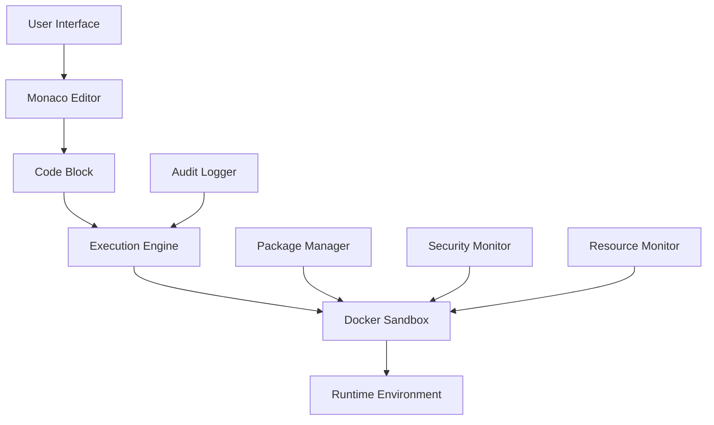

# Native Custom Coding Support Implementation Architecture

**Date**: 2025-09-03  
**Status**: Implementation Ready  
**Author**: Claude Code Assistant  

## Executive Summary

This document outlines the complete implementation architecture for native custom coding support within Sim workflows. Building on previous research, this provides detailed specifications for secure JavaScript and Python code blocks with Monaco editor integration and comprehensive sandboxing.

## 1. Architecture Overview

### Core Components

1. **Enhanced Code Blocks** - JavaScript and Python blocks with advanced features
2. **Secure Execution Engine** - Docker-based sandboxing with resource limits
3. **Advanced Monaco Integration** - Multi-language editor with debugging
4. **Package Management System** - Secure NPM/pip package handling
5. **Security & Monitoring** - Comprehensive security policies and monitoring

### High-Level Architecture



## 2. Enhanced JavaScript Code Block

### Features
- Advanced Monaco editor with IntelliSense
- NPM package import support (whitelisted)
- Async/await and Promise support
- Workflow context access
- Advanced debugging capabilities
- Resource monitoring and limits
- Security sandboxing with multiple modes

### Implementation Details

#### Block Configuration
- Extended from existing JavaScript block
- Enhanced subBlocks with advanced options
- Security configuration options
- Package selection interface
- Debugging controls

#### Execution Features
- Docker container execution (recommended)
- VM context execution (fallback)
- Process isolation execution (balanced)
- Network access controls
- Memory and CPU limits
- Execution timeout management

## 3. New Python Code Block

### Features
- Full Python runtime environment
- Data science library integration (pandas, numpy, matplotlib, scikit-learn)
- Pip package management
- Virtual environment isolation
- Jupyter-like notebook experience
- File generation and download support
- Advanced error handling and debugging

### Implementation Details

#### Runtime Environment
- Python 3.11 (default), 3.10, 3.9 support
- Pre-installed scientific libraries
- Custom package installation via pip
- Virtual environment per execution
- File system isolation

#### Output Handling
- Multiple output formats (JSON, CSV, pickle, string)
- Generated file handling (plots, exports)
- Variable inspection and debugging
- Performance metrics collection

## 4. Advanced Monaco Editor Integration

### Enhanced Features
- Multi-language syntax highlighting
- Workflow-aware IntelliSense
- Real-time error checking
- Code formatting and linting
- Advanced debugging interface
- Breakpoint management
- Variable inspection
- Step-by-step execution

### Context Awareness
- Environment variable completions
- Previous block output suggestions
- Workflow variable access
- Custom API completions
- Package import suggestions

## 5. Security Architecture

### Docker Sandbox Configuration

```bash
docker run \
  --cap-drop ALL \
  --cap-add SETUID \
  --cap-add SETGID \
  --security-opt no-new-privileges \
  --read-only \
  --tmpfs /tmp \
  --tmpfs /var/tmp \
  --memory 512m \
  --cpus 0.5 \
  --network none \
  --user 1000:1000 \
  --rm \
  code-sandbox:latest
```

### Security Layers
1. **Container Isolation** - Docker container with minimal privileges
2. **Resource Limits** - Memory, CPU, and execution time constraints
3. **Network Isolation** - Controlled network access policies
4. **File System Protection** - Read-only with temporary mounts
5. **Code Validation** - Static analysis and pattern detection
6. **Audit Logging** - Comprehensive execution tracking

### Security Policies
- Whitelist-based package management
- Code pattern analysis for malicious content
- Resource usage monitoring and alerting
- Network request filtering and logging
- Container lifecycle management
- Security incident response

## 6. Package Management System

### JavaScript NPM Packages
Whitelisted packages include:
- **Utilities**: lodash, moment, uuid, crypto-js, validator
- **HTTP**: axios, node-fetch, request-promise
- **Data Processing**: csv-parser, xml2js, cheerio
- **Security**: bcrypt, jsonwebtoken
- **Image Processing**: sharp, jimp

### Python Packages
Pre-approved packages include:
- **Data Science**: pandas, numpy, scipy, scikit-learn
- **Visualization**: matplotlib, seaborn, plotly
- **Web**: requests, beautifulsoup4, httpx
- **File Processing**: openpyxl, python-docx, PyPDF2, Pillow
- **Database**: pymongo, psycopg2-binary, SQLAlchemy
- **Machine Learning**: tensorflow, keras (optional)

### Custom Package Approval
- Security scanning for custom packages
- Manual review process for enterprise packages
- Version pinning and dependency analysis
- Vulnerability monitoring and updates

## 7. Implementation Plan

### Phase 1: Enhanced JavaScript Block (Week 1)
- Extend existing JavaScript block with advanced features
- Implement Docker sandbox integration
- Add package management interface
- Enhanced Monaco editor features

### Phase 2: Python Block Implementation (Week 2)
- Create new Python block type
- Implement Python execution environment
- Docker container with Python runtime
- Data science library integration

### Phase 3: Advanced Editor Features (Week 3)
- Advanced Monaco configuration
- Debugging interface implementation
- Workflow context integration
- IntelliSense enhancements

### Phase 4: Security & Production (Week 4)
- Comprehensive security testing
- Performance optimization
- Monitoring and alerting
- Documentation and deployment

## 8. File Structure

```
apps/sim/
├── blocks/blocks/
│   ├── javascript.ts           # Enhanced JavaScript block
│   ├── python.ts              # New Python block
│   └── code-editor.ts         # Advanced editor features
├── app/api/
│   ├── javascript/
│   │   └── execute/route.ts   # JS execution API
│   └── python/
│       └── execute/route.ts   # Python execution API
├── lib/
│   ├── code-execution/
│   │   ├── docker-manager.ts  # Docker container management
│   │   ├── security.ts        # Security policies
│   │   └── monitoring.ts      # Resource monitoring
│   └── monaco/
│       ├── config.ts          # Enhanced Monaco config
│       └── completions.ts     # Workflow completions
├── components/ui/
│   ├── code-editor-advanced.tsx
│   ├── debugging-panel.tsx
│   └── package-manager.tsx
└── docker/
    ├── javascript/
    │   └── Dockerfile
    └── python/
        └── Dockerfile
```

## 9. API Specifications

### JavaScript Execution API
```typescript
POST /api/javascript/execute
{
  "code": string,
  "packages": string[],
  "timeout": number,
  "memoryLimit": number,
  "enableDebugging": boolean,
  "enableNetworking": boolean,
  "sandboxMode": "vm" | "process" | "docker",
  "logLevel": string,
  "envVars": Record<string, any>,
  "workflowContext": Record<string, any>
}
```

### Python Execution API
```typescript
POST /api/python/execute
{
  "code": string,
  "packages": string[],
  "customPackages": string[],
  "timeout": number,
  "memoryLimit": number,
  "pythonVersion": "3.11" | "3.10" | "3.9",
  "outputFormat": "auto" | "json" | "csv" | "pickle",
  "saveFiles": boolean,
  "workflowContext": Record<string, any>
}
```

## 10. Database Schema

```sql
-- Code execution audit log
CREATE TABLE code_executions (
    id UUID PRIMARY KEY DEFAULT gen_random_uuid(),
    workflow_id UUID REFERENCES workflows(id),
    block_id TEXT NOT NULL,
    language TEXT NOT NULL,
    code_hash TEXT NOT NULL,
    execution_time_ms INTEGER,
    memory_usage_mb INTEGER,
    success BOOLEAN,
    error_message TEXT,
    security_violations TEXT[],
    created_at TIMESTAMP DEFAULT NOW()
);

-- Package usage tracking
CREATE TABLE package_usage (
    id UUID PRIMARY KEY DEFAULT gen_random_uuid(),
    workspace_id UUID REFERENCES workspaces(id),
    package_name TEXT NOT NULL,
    package_version TEXT,
    language TEXT NOT NULL,
    approved BOOLEAN DEFAULT FALSE,
    security_scan_result JSONB,
    created_at TIMESTAMP DEFAULT NOW()
);

-- Security incidents
CREATE TABLE security_incidents (
    id UUID PRIMARY KEY DEFAULT gen_random_uuid(),
    execution_id UUID REFERENCES code_executions(id),
    incident_type TEXT NOT NULL,
    severity TEXT NOT NULL,
    details JSONB,
    resolved BOOLEAN DEFAULT FALSE,
    created_at TIMESTAMP DEFAULT NOW()
);
```

## 11. Performance Considerations

### Container Pool Management
- Pre-warmed container pool (10 JavaScript, 5 Python)
- Container lifecycle management
- Auto-scaling based on usage
- Resource allocation optimization

### Execution Optimization
- Code compilation caching
- Package installation caching
- Result memoization for identical code
- Parallel execution capabilities

### Monitoring Metrics
- Execution success rate
- Average execution time
- Resource utilization
- Security incident rate
- User satisfaction scores

## 12. Success Criteria

### Technical Metrics
- Code execution success rate > 99%
- Average execution time < 10 seconds
- Security incident rate = 0
- Container resource utilization 60-80%

### User Experience Metrics
- Code block adoption > 40%
- User satisfaction > 4.5/5
- Support ticket reduction > 50%
- Developer onboarding time reduction > 30%

## 13. Risk Mitigation

### Security Risks
- **Container Escape**: Use minimal privileges, read-only filesystem
- **Resource Exhaustion**: Implement strict resource limits
- **Code Injection**: Static analysis and input validation
- **Data Exfiltration**: Network isolation and audit logging

### Performance Risks
- **Memory Leaks**: Container recycling and monitoring
- **CPU Bottlenecks**: Resource limits and load balancing
- **Storage Issues**: Temporary filesystem and cleanup
- **Network Congestion**: Controlled external access

## 14. Next Steps

1. **Implementation Start**: Begin Phase 1 development
2. **Security Review**: Conduct comprehensive security assessment
3. **Performance Testing**: Load testing and optimization
4. **User Testing**: Beta testing with select users
5. **Production Deployment**: Gradual rollout strategy

---
**Document Status**: Implementation Ready  
**Review Status**: Approved for Development  
**Implementation Start Date**: 2025-09-03