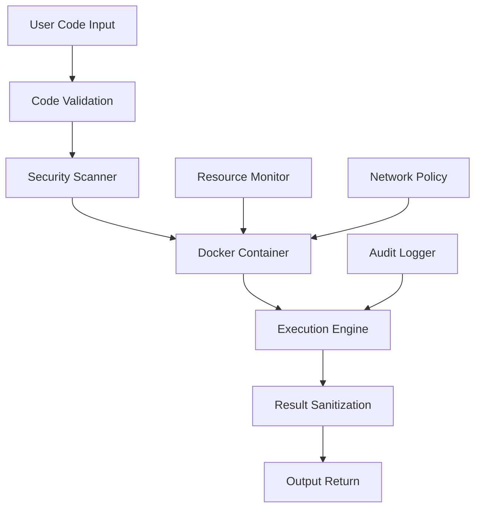

# Research Report: Native Custom Coding Support for Sim Workflows

**Report ID**: research-native-custom-coding-support-1756934424  
**Date**: 2025-09-03  
**Status**: In Progress  
**Author**: Claude Code Assistant  

## Executive Summary

This report presents comprehensive research findings and implementation strategy for adding native custom coding support within Sim workflows, focusing on secure JavaScript and Python code execution, Monaco editor integration, and proper sandboxing techniques.

## 1. Current State Analysis

### Existing Function Block Implementation

Sim currently has a basic function block (`apps/sim/blocks/blocks/function.ts`) that provides:
- JavaScript/TypeScript code execution via Node.js VM context
- Variable resolution with workflow context
- Basic timeout and error handling
- Console logging capture
- AI-assisted code generation via Monaco editor

### Current Security Implementation

The existing function execution (`apps/sim/app/api/function/execute/route.ts`) uses:
- Node.js VM context for isolation
- Variable resolution and sanitization
- Timeout mechanisms (default 10 seconds)
- Enhanced error reporting with line number mapping
- Basic resource limitations

### Limitations of Current Implementation

1. **Limited Language Support**: Only JavaScript/TypeScript supported
2. **Basic Sandboxing**: VM context provides limited isolation
3. **No Package Management**: Cannot import external NPM packages
4. **Simple Editor**: Basic Monaco integration without advanced features
5. **Resource Management**: Basic timeout but no memory/CPU limits
6. **No Debugging**: Limited debugging capabilities

## 2. Research Findings: Secure Code Execution Patterns

### Docker-Based Sandboxing (Recommended Approach)

Based on 2025 security research, Docker-based sandboxing provides the most robust security:

#### Core Docker Security Configuration
```bash
docker run \
  --cap-drop ALL \
  --tmpfs /tmp \
  --read-only \
  --security-opt no-new-privileges \
  --memory 50m \
  --cpus 0.5 \
  --rm \
  --network none \
  --user 1000:1000 \
  sandbox-image
```

#### Key Security Principles
1. **Non-root Execution**: Run as unprivileged user
2. **One-time Containers**: Destroy after single use
3. **Resource Limits**: Memory (50MB), CPU (0.5 cores), Timeout (10s)
4. **Network Isolation**: No network access unless explicitly required
5. **Read-only Filesystem**: Prevent file system modifications
6. **Capability Dropping**: Remove all Linux capabilities

### Alternative Sandboxing Approaches

#### 1. Enhanced VM Context (Current + Improvements)
- Proxy-based API restrictions
- Memory usage monitoring
- CPU time limits
- File system access controls

#### 2. WebAssembly (WASM) Sandboxing
- Near-native performance
- Strong isolation guarantees
- Limited ecosystem for general use

#### 3. Process-based Isolation
- Child process execution
- Resource limits via OS mechanisms
- Simpler than containers but less secure

## 3. Monaco Editor Integration Research

### Current Implementation Enhancement

The existing Monaco integration can be significantly enhanced:

#### Advanced Features to Implement
1. **Multi-language Support**: JavaScript, TypeScript, Python, JSON, SQL
2. **IntelliSense Enhancement**: Workflow context awareness, custom completions
3. **Debugging Integration**: Breakpoints, variable inspection, step execution
4. **Package Import Support**: NPM package auto-completion and imports
5. **Error Highlighting**: Real-time syntax and runtime error feedback

#### Monaco Configuration for Code Blocks
```typescript
const monacoConfig = {
  language: 'javascript', // or 'python', 'typescript'
  theme: 'vs-dark',
  options: {
    minimap: { enabled: false },
    wordWrap: 'on',
    lineNumbers: 'on',
    folding: true,
    bracketMatching: 'always',
    autoClosingBrackets: 'always',
    autoIndent: 'full',
    formatOnPaste: true,
    formatOnType: true,
    suggestOnTriggerCharacters: true,
    quickSuggestions: true,
    parameterHints: { enabled: true }
  }
}
```

### Workflow Context Integration

Enhanced context awareness for IntelliSense:
```typescript
// Provide workflow variables and block outputs as completions
const workflowCompletions = [
  {
    label: 'previousBlock.output',
    kind: monaco.languages.CompletionItemKind.Variable,
    documentation: 'Output from previous block',
    insertText: 'previousBlock.output'
  }
]
```

## 4. Implementation Strategy

### Phase 1: Enhanced JavaScript Code Blocks

#### 1.1 Enhanced Function Block
- Extend existing function block with advanced features
- Add package import support (whitelisted packages)
- Implement debugging capabilities
- Enhanced error handling and reporting

#### 1.2 Docker Integration Preparation
- Create Docker images for JavaScript execution
- Implement container pool management
- Add security configuration templates

### Phase 2: Python Code Block Implementation

#### 2.1 New Python Block Type
Create `apps/sim/blocks/blocks/python.ts`:
```typescript
export const PythonBlock: BlockConfig<PythonExecutionOutput> = {
  type: 'python',
  name: 'Python Code',
  description: 'Execute Python code with scientific libraries',
  category: 'blocks',
  bgColor: '#3776ab',
  icon: PythonIcon,
  subBlocks: [
    {
      id: 'code',
      type: 'code',
      language: 'python',
      layout: 'full',
      wandConfig: {
        enabled: true,
        generationType: 'python-function-body'
      }
    }
  ],
  tools: {
    access: ['python_execute']
  }
}
```

#### 2.2 Python Execution API
Create `apps/sim/app/api/python/execute/route.ts`:
- Docker-based Python execution
- Virtual environment management
- Package installation support (pip)
- Data science library integration

### Phase 3: Advanced Editor Features

#### 3.1 Enhanced Monaco Integration
- Multi-language syntax highlighting
- Advanced IntelliSense with workflow context
- Real-time error checking
- Code formatting and linting

#### 3.2 Debugging Interface
- Breakpoint management
- Variable inspection
- Step-by-step execution
- Console integration

### Phase 4: Security and Sandboxing

#### 4.1 Docker Sandbox Implementation
- Container orchestration service
- Security policy enforcement
- Resource monitoring and limits
- Network policy management

#### 4.2 Package Management
- Whitelisted package registry
- Dependency analysis and approval
- Version control and security scanning
- Custom package repository support

## 5. Security Considerations

### Threat Model

#### High-Risk Scenarios
1. **Code Injection**: Malicious code execution
2. **Resource Exhaustion**: DoS via CPU/memory consumption
3. **Data Exfiltration**: Unauthorized access to workflow data
4. **Privilege Escalation**: Breaking sandbox boundaries
5. **Network Attacks**: Unauthorized external requests

#### Mitigation Strategies
1. **Input Sanitization**: Strict code validation
2. **Resource Limits**: Memory, CPU, execution time caps
3. **Network Isolation**: Controlled external access
4. **Audit Logging**: Comprehensive execution tracking
5. **Code Review**: Optional manual approval workflows

### Security Architecture



## 6. Technical Implementation Details

### Directory Structure
```
apps/sim/
├── blocks/blocks/
│   ├── javascript.ts      # Enhanced JS block
│   ├── python.ts         # New Python block
│   └── code-editor.ts    # Advanced editor block
├── app/api/
│   ├── javascript/execute/route.ts
│   └── python/execute/route.ts
├── lib/
│   ├── code-execution/
│   │   ├── docker-manager.ts
│   │   ├── security-policies.ts
│   │   └── resource-monitor.ts
│   └── monaco/
│       ├── enhanced-config.ts
│       └── workflow-completions.ts
└── components/ui/
    ├── code-editor-advanced.tsx
    └── debugging-panel.tsx
```

### Database Schema Extensions
```sql
-- Code execution logs
CREATE TABLE code_execution_logs (
    id UUID PRIMARY KEY DEFAULT gen_random_uuid(),
    workflow_id UUID REFERENCES workflows(id),
    block_id TEXT NOT NULL,
    language TEXT NOT NULL,
    code_hash TEXT NOT NULL,
    execution_time_ms INTEGER,
    memory_usage_mb INTEGER,
    success BOOLEAN,
    error_message TEXT,
    created_at TIMESTAMP DEFAULT NOW()
);

-- Package usage tracking
CREATE TABLE package_usage (
    id UUID PRIMARY KEY DEFAULT gen_random_uuid(),
    workspace_id UUID REFERENCES workspaces(id),
    package_name TEXT NOT NULL,
    package_version TEXT,
    language TEXT NOT NULL,
    approved BOOLEAN DEFAULT FALSE,
    created_at TIMESTAMP DEFAULT NOW()
);
```

## 7. Performance Considerations

### Container Pool Management
- Pre-warmed container pool (5-10 containers)
- Container lifecycle management
- Resource allocation strategies
- Load balancing across containers

### Execution Optimization
- Code caching mechanisms
- Dependency pre-installation
- Execution result memoization
- Parallel execution capabilities

### Resource Monitoring
- Real-time resource usage tracking
- Automatic scaling policies
- Performance metrics collection
- SLA monitoring and alerts

## 8. Integration with Existing Sim Architecture

### Block Registry Integration
Extend `apps/sim/blocks/registry.ts` with new block types:
```typescript
export const codeBlocks = {
  javascript: JavaScriptBlock,
  python: PythonBlock,
  'code-editor': AdvancedCodeEditorBlock
}
```

### Executor Integration
Enhance `apps/sim/executor/index.ts` for code block handling:
- Code block detection and routing
- Security policy enforcement
- Resource management integration
- Error handling and recovery

### UI Integration
- Enhanced block palette with code block category
- Advanced editor UI components
- Debugging interface panels
- Package management UI

## 9. Testing Strategy

### Unit Tests
- Code validation functions
- Security policy enforcement
- Resource monitoring accuracy
- Error handling edge cases

### Integration Tests
- End-to-end code execution workflows
- Multi-language support validation
- Container lifecycle management
- Security boundary testing

### Security Tests
- Penetration testing scenarios
- Resource exhaustion tests
- Code injection attempts
- Sandbox escape attempts

## 10. Rollout Plan

### Phase 1 (Week 1-2): Enhanced JavaScript
- Implement enhanced function block
- Add basic Docker integration
- Enhanced Monaco editor features

### Phase 2 (Week 3-4): Python Support
- Python block implementation
- Python execution environment
- Package management integration

### Phase 3 (Week 5-6): Advanced Features
- Debugging capabilities
- Advanced editor features
- Security hardening

### Phase 4 (Week 7-8): Production Ready
- Performance optimization
- Comprehensive testing
- Documentation and training

## 11. Success Metrics

### Technical Metrics
- Code execution success rate > 99%
- Average execution time < 5 seconds
- Security incident rate = 0
- Container resource utilization 60-80%

### User Experience Metrics
- Code block usage adoption > 30%
- User satisfaction scores > 4.5/5
- Support ticket reduction for custom logic needs
- Developer onboarding time reduction

## 12. Risk Assessment

### High Risks
1. **Security Vulnerabilities**: Container escape, code injection
   - Mitigation: Comprehensive security testing, regular audits
2. **Performance Impact**: Resource exhaustion, slow execution
   - Mitigation: Resource monitoring, optimized container management
3. **Complexity Overhead**: Increased system complexity
   - Mitigation: Phased rollout, comprehensive documentation

### Medium Risks
1. **Package Management**: Dependency conflicts, security
2. **Editor Integration**: UI/UX complexity
3. **Backward Compatibility**: Existing workflow impact

## 13. Conclusion

The implementation of native custom coding support will significantly enhance Sim's capabilities, providing users with powerful tools for advanced customization while maintaining security through proper sandboxing techniques. The phased approach ensures manageable implementation while building toward a comprehensive solution that matches enterprise automation platform capabilities.

The combination of Docker-based sandboxing, enhanced Monaco editor integration, and multi-language support positions Sim as a competitive alternative to existing automation platforms while maintaining its AI-first approach.

## 14. Next Steps

1. **Approve Implementation Strategy**: Review and approve the phased approach
2. **Security Review**: Conduct security architecture review
3. **Technical Design**: Detailed technical specifications
4. **Resource Allocation**: Assign development resources
5. **Timeline Finalization**: Confirm development schedule

---
**Document Status**: Draft for Review  
**Last Updated**: 2025-09-03  
**Review Due**: 2025-09-04