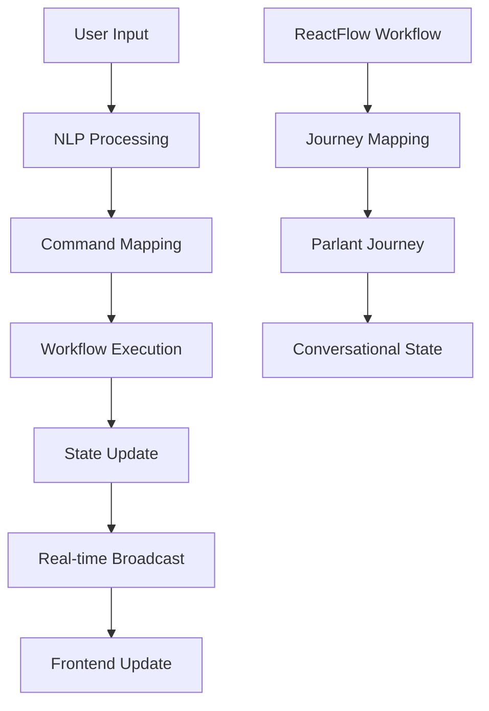

# Conversational Workflow System

## Overview

The Conversational Workflow System bridges Sim's existing ReactFlow workflows with Parlant's conversational AI agents, enabling users to interact with workflows through natural language while maintaining full backward compatibility with the visual workflow editor.

## Architecture

### Core Components

1. **ConversationalWorkflowService** (`core.ts`)
   - Main orchestrator for conversational workflow sessions
   - Manages session lifecycle and state
   - Coordinates between NLP, mapping, and state management components

2. **WorkflowJourneyMapper** (`mapper.ts`)
   - Maps ReactFlow workflows to Parlant journey state machines
   - Converts workflow nodes to conversational states
   - Maintains bidirectional data flow between workflow and journey contexts

3. **NaturalLanguageProcessor** (`nlp.ts`)
   - Processes natural language input from users
   - Extracts intents, entities, and contextual references
   - Maps user commands to workflow actions

4. **RealtimeStateManager** (`state-manager.ts`)
   - Manages real-time state updates and communication
   - Handles Socket.io broadcasting for live updates
   - Provides session subscription and notification system

### Data Flow



## Key Features

### 🗣️ Natural Language Interface
- **Intent Recognition**: Automatically understands user commands like "start workflow", "show progress", "pause execution"
- **Entity Extraction**: Identifies specific values, parameters, and references from user input
- **Context Awareness**: Maintains conversation history and workflow context for intelligent responses

### 🔄 Real-time Communication
- **Live Updates**: Socket.io integration for instant state synchronization
- **Multi-participant**: Support for multiple users observing the same workflow session
- **Event Broadcasting**: Comprehensive event system for all workflow state changes

### 🧩 Seamless Integration
- **Backward Compatibility**: Existing ReactFlow workflows work without modification
- **Dual Interface**: Users can switch between visual editor and conversational interface
- **State Synchronization**: Changes in one interface immediately reflect in the other

### 🚀 Enterprise Ready
- **Error Handling**: Comprehensive error handling with user-friendly messages
- **Performance**: Optimized for large workflows and concurrent sessions
- **Scalability**: Designed to handle multiple concurrent conversational sessions
- **Security**: Workspace isolation and user authentication integration

## API Reference

### Socket.io Events

#### Client → Server Events

##### `create-conversational-workflow`
Creates a new conversational workflow session.

**Request:**
```typescript
{
  workflowId: string
  conversationalConfig?: ConversationalConfig
  executionConfig?: WorkflowExecutionConfig
  initialInput?: Record<string, any>
  sessionMetadata?: Record<string, any>
}
```

**Response:**
```typescript
{
  success: boolean
  data: {
    sessionId: string
    journeyId: string
    initialState: ConversationalWorkflowState
    welcomeMessage: string
    availableCommands: string[]
  }
  executionTime: number
}
```

##### `process-nl-command`
Processes a natural language command for workflow interaction.

**Request:**
```typescript
{
  sessionId: string
  workflowId: string
  naturalLanguageInput: string
}
```

**Response:**
```typescript
{
  success: boolean
  data: {
    commandProcessed: boolean
    workflowAction: string | null
    agentResponse: string
    updatedState: ConversationalWorkflowState
    suggestedActions: AvailableAction[]
  }
  executionTime: number
}
```

##### `get-workflow-state`
Retrieves current workflow state and recent history.

**Request:**
```typescript
{
  sessionId: string
  workflowId: string
}
```

**Response:**
```typescript
{
  success: boolean
  data: {
    currentState: ConversationalWorkflowState
    recentHistory: ConversationTurn[]
    availableActions: AvailableAction[]
    progressSummary: string
  }
  executionTime: number
}
```

#### Server → Client Events

##### `conversational-workflow-update`
Broadcast when workflow state changes occur.

**Payload:**
```typescript
{
  updateId: string
  workflowId: string
  sessionId: string
  updateType: WorkflowUpdateType
  timestamp: Date
  data: Record<string, any>
  userMessage?: string
  agentMessage?: string
  showNotification?: boolean
}
```

##### `conversational-workflow-command-processed`
Broadcast when a command is successfully processed.

**Payload:**
```typescript
{
  sessionId: string
  userId: string
  naturalLanguageInput: string
  workflowAction: string
  agentResponse: string
  processedAt: string
}
```

### REST API Endpoints

The system also exposes REST endpoints through the API handlers:

- `POST /api/conversational-workflows` - Create workflow session
- `POST /api/conversational-workflows/{sessionId}/commands` - Process command
- `GET /api/conversational-workflows/{sessionId}/state` - Get state
- `DELETE /api/conversational-workflows/{sessionId}` - Terminate session
- `GET /api/conversational-workflows/{sessionId}/metrics` - Get metrics

## Configuration

### Conversational Configuration

```typescript
interface ConversationalConfig {
  personalityProfile: string // 'helpful-assistant' | 'professional' | 'casual'
  communicationStyle: 'formal' | 'casual' | 'technical' | 'friendly'
  verbosityLevel: 'minimal' | 'normal' | 'detailed' | 'verbose'
  showProgress: boolean
  explainSteps: boolean
  askForConfirmation: boolean
  provideSuggestions: boolean
  gracefulDegradation: boolean
  fallbackToVisual: boolean
}
```

### Execution Configuration

```typescript
interface WorkflowExecutionConfig {
  mode: 'step-by-step' | 'autonomous' | 'hybrid'
  pausePoints: string[] // Node IDs where execution should pause
  autoApproval: boolean
  timeoutMs: number
  retryPolicy: {
    maxAttempts: number
    backoffStrategy: 'linear' | 'exponential' | 'fixed'
    backoffMs: number
    retryableErrors: string[]
  }
}
```

## Usage Examples

### Basic Workflow Interaction

```typescript
import { io } from 'socket.io-client'

const socket = io('/api/socket')

// Create a conversational workflow session
socket.emit('create-conversational-workflow', {
  workflowId: 'my-workflow-123',
  conversationalConfig: {
    communicationStyle: 'friendly',
    explainSteps: true,
    askForConfirmation: true
  }
}, (response) => {
  if (response.success) {
    const { sessionId, welcomeMessage } = response.data
    console.log('Session created:', sessionId)
    console.log('Agent:', welcomeMessage)

    // Start the workflow
    socket.emit('process-nl-command', {
      sessionId,
      workflowId: 'my-workflow-123',
      naturalLanguageInput: 'start the workflow'
    }, (cmdResponse) => {
      console.log('Agent:', cmdResponse.data.agentResponse)
    })
  }
})

// Listen for real-time updates
socket.on('conversational-workflow-update', (update) => {
  console.log('Workflow update:', update.updateType)
  if (update.agentMessage) {
    console.log('Agent:', update.agentMessage)
  }
})
```

### Custom Command Processing

```typescript
// Process various types of commands
const commands = [
  'start the workflow with input data',
  'pause execution',
  'what is the current progress?',
  'explain what this step does',
  'skip to the next step',
  'set the timeout to 5 minutes'
]

for (const command of commands) {
  socket.emit('process-nl-command', {
    sessionId: 'your-session-id',
    workflowId: 'your-workflow-id',
    naturalLanguageInput: command
  }, (response) => {
    console.log(`Command: ${command}`)
    console.log(`Action: ${response.data.workflowAction}`)
    console.log(`Agent: ${response.data.agentResponse}`)
  })
}
```

### State Monitoring

```typescript
// Get detailed workflow state
socket.emit('get-workflow-state', {
  sessionId: 'your-session-id',
  workflowId: 'your-workflow-id'
}, (response) => {
  const { currentState, progressSummary, availableActions } = response.data

  console.log('Status:', currentState.executionStatus)
  console.log('Progress:', progressSummary)
  console.log('Available actions:')
  availableActions.forEach(action => {
    console.log(`- ${action.displayName}: ${action.description}`)
  })
})

// Monitor session metrics
socket.emit('get-session-metrics', {
  sessionId: 'your-session-id'
}, (response) => {
  const { metrics, performance } = response.data
  console.log(`Progress: ${metrics.progressPercentage}%`)
  console.log(`Commands processed: ${metrics.commandsProcessed}`)
  console.log(`Average response time: ${metrics.averageResponseTimeMs}ms`)
})
```

## Natural Language Commands

The system recognizes various natural language patterns:

### Workflow Control
- **Start**: "start the workflow", "begin execution", "let's get started", "go"
- **Pause**: "pause the workflow", "stop execution", "hold on", "wait"
- **Resume**: "resume the workflow", "continue execution", "keep going"
- **Cancel**: "cancel the workflow", "abort execution", "stop everything"

### Status and Information
- **Status**: "what's happening?", "show me the status", "where are we?"
- **Progress**: "show progress", "how much is complete?", "what percentage done?"
- **Explain**: "explain this step", "what are we doing?", "tell me about this"
- **Help**: "help", "what can I do?", "show me options"

### Step Control
- **Retry**: "try again", "retry this step", "run it again"
- **Skip**: "skip this step", "move to next step", "jump over this"
- **Input**: "change input", "update parameters", "modify values"

### Advanced Commands
- **Conditional**: "if status is success, continue to next step"
- **Batch**: "process all remaining steps automatically"
- **Schedule**: "run this workflow every hour"

## Error Handling

The system provides comprehensive error handling with user-friendly messages:

### Error Types

1. **ConversationalWorkflowError**: Base error for all workflow-related issues
2. **WorkflowMappingError**: Issues with mapping workflows to journeys
3. **NLPProcessingError**: Natural language processing failures
4. **CommandProcessingError**: Command execution failures
5. **SessionManagementError**: Session lifecycle issues
6. **RealtimeCommunicationError**: Socket.io communication problems

### Error Response Format

```typescript
{
  success: false
  error: {
    code: string
    message: string
    userMessage?: string // User-friendly explanation
    retryable: boolean
    context?: Record<string, any>
  }
}
```

### Common Error Scenarios

1. **Session Not Found**: When referencing an invalid or expired session
2. **Invalid Command**: When natural language input cannot be processed
3. **Workflow Mapping Failed**: When workflow cannot be converted to journey
4. **Authentication Required**: When user lacks proper permissions
5. **Rate Limiting**: When too many requests are made in short time

## Performance Considerations

### Optimization Strategies

1. **Caching**: Workflow mappings and NLP results are cached
2. **Connection Pooling**: Database and HTTP connections are pooled
3. **Lazy Loading**: Components are loaded on demand
4. **Batch Processing**: Multiple state updates are batched together

### Scalability Features

1. **Stateless Design**: Core services can be horizontally scaled
2. **Event-Driven Architecture**: Loose coupling enables independent scaling
3. **Resource Cleanup**: Automatic cleanup of inactive sessions
4. **Connection Management**: Efficient Socket.io connection handling

### Performance Metrics

- **Response Time**: Target <500ms for command processing
- **Throughput**: Support 100+ concurrent sessions per instance
- **Memory Usage**: <100MB per 50 active sessions
- **CPU Usage**: <20% under normal load

## Testing

### Running Tests

```bash
# Run integration tests
cd apps/sim/services/parlant/conversational-workflows
npm test

# Or run specific test file
npx ts-node test.ts
```

### Test Coverage

The test suite covers:

- ✅ NLP processing and intent recognition
- ✅ State management and subscriptions
- ✅ Workflow mapping creation
- ✅ Command processing pipeline
- ✅ Error handling scenarios
- ✅ Utility functions and constants

### Mock Data

The system provides development utilities for testing:

```typescript
import { ConversationalWorkflowDev } from '@/services/parlant/conversational-workflows'

// Create mock workflow state
const mockState = ConversationalWorkflowDev.createMockWorkflowState({
  executionStatus: 'running',
  completedNodes: ['node1', 'node2']
})

// Create mock NLP result
const mockNLP = ConversationalWorkflowDev.createMockNLPResult({
  detectedIntent: 'start-workflow',
  intentConfidence: 0.95
})
```

## Deployment

### Environment Variables

```bash
# Parlant server configuration
PARLANT_SERVER_URL=http://localhost:8001

# Database configuration
DATABASE_URL=postgresql://...

# Authentication
BETTER_AUTH_SECRET=your-secret-key

# Socket.io configuration
SOCKET_PORT=3002
```

### Docker Configuration

```dockerfile
# Add to your existing Dockerfile
COPY apps/sim/services/parlant/conversational-workflows ./apps/sim/services/parlant/conversational-workflows

# Install additional dependencies if needed
RUN npm install socket.io-client axios
```

### Production Checklist

- [ ] Parlant server is running and accessible
- [ ] Database schema includes Parlant tables
- [ ] Socket.io server has conversational workflow handlers
- [ ] Environment variables are properly configured
- [ ] Rate limiting is enabled
- [ ] Error monitoring is configured
- [ ] Session cleanup is scheduled

## Troubleshooting

### Common Issues

**Q: "Session not found" errors**
A: Check that sessions aren't being cleaned up too aggressively. Verify session ID format and ensure proper authentication.

**Q: NLP not recognizing commands**
A: Check intent patterns in `nlp.ts`. Add custom patterns if needed. Verify input length limits.

**Q: Socket.io not receiving updates**
A: Verify socket joins correct room. Check authentication middleware. Confirm subscription setup.

**Q: Workflow mapping fails**
A: Ensure workflow exists and is accessible. Check node types are supported. Verify workspace permissions.

### Debug Mode

Enable debug logging:

```typescript
process.env.DEBUG = 'ConversationalWorkflow*'
```

### Health Checks

The system provides health check endpoints:

```bash
curl http://localhost:3002/health
```

## Contributing

### Development Setup

1. Install dependencies
2. Start Parlant server
3. Run Socket.io server with conversational handlers
4. Run integration tests

### Code Style

- TypeScript strict mode
- ESLint + Prettier
- Comprehensive error handling
- Detailed logging
- JSDoc documentation

### Adding New Features

1. **New Command Types**: Add patterns to `nlp.ts` and handlers to `core.ts`
2. **New Node Types**: Update mapping in `mapper.ts` and templates
3. **New Events**: Add to Socket.io handlers and type definitions
4. **New Validations**: Add to API handlers and validation functions

## License

This system is part of the Sim platform and follows the same licensing terms.

---

For more information, see the main Sim documentation or contact the development team.