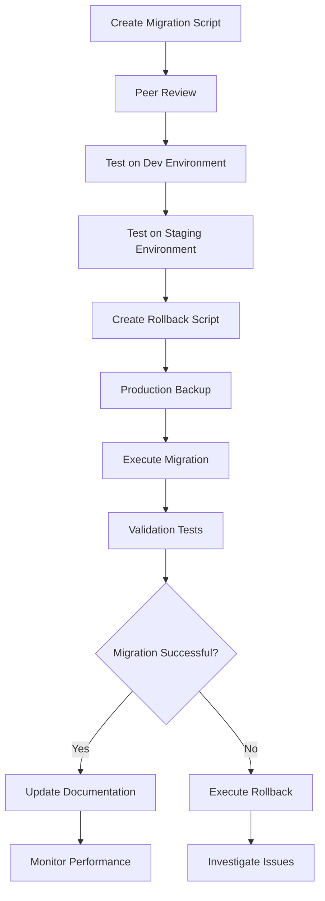

# Parlant Database Migration Procedures and Rollback Strategies

## Table of Contents
- [Overview](#overview)
- [Migration Strategy](#migration-strategy)
- [Pre-Migration Procedures](#pre-migration-procedures)
- [Migration Execution](#migration-execution)
- [Post-Migration Validation](#post-migration-validation)
- [Rollback Procedures](#rollback-procedures)
- [Zero-Downtime Migration Strategies](#zero-downtime-migration-strategies)
- [Emergency Procedures](#emergency-procedures)

## Overview

This document provides comprehensive procedures for safely migrating the Parlant database schema, including rollback strategies, validation procedures, and emergency protocols. All procedures are designed to maintain data integrity and minimize downtime in production environments.

### Migration Principles

1. **Safety First**: All migrations must be reversible and tested
2. **Data Integrity**: Maintain referential integrity throughout the process
3. **Minimal Downtime**: Use techniques to reduce service interruption
4. **Validation**: Comprehensive testing before and after migrations
5. **Documentation**: Complete audit trail of all changes

## Migration Strategy

### Migration Types

#### 1. Additive Migrations (Low Risk)
- Adding new tables
- Adding new columns with defaults
- Creating new indexes
- Adding new constraints (if data already complies)

#### 2. Transformative Migrations (Medium Risk)
- Modifying existing column types
- Renaming columns or tables
- Splitting or merging tables
- Modifying existing constraints

#### 3. Destructive Migrations (High Risk)
- Dropping tables or columns
- Removing constraints
- Data deletion or significant transformation

### Migration Workflow



## Pre-Migration Procedures

### 1. Environment Preparation

#### Development Environment Testing
```bash
# 1. Create a copy of production data structure
pg_dump -h prod-host -U username -s -d sim_db > schema_backup.sql

# 2. Create test database
createdb sim_test
psql -d sim_test -f schema_backup.sql

# 3. Test migration script
psql -d sim_test -f migration_0001_add_parlant_tables.sql

# 4. Validate schema changes
psql -d sim_test -c "\d+ parlant_agent"
```

#### Staging Environment Testing
```bash
# 1. Sync staging with production data
pg_dump -h prod-host -U username -d sim_db | psql -d sim_staging

# 2. Test migration with production-like data
psql -d sim_staging -f migration_0001_add_parlant_tables.sql

# 3. Run application tests
npm run test:integration
npm run test:e2e
```

### 2. Risk Assessment

#### Migration Risk Matrix

| Risk Factor | Low | Medium | High |
|-------------|-----|--------|------|
| **Data Volume** | < 1M rows | 1M-10M rows | > 10M rows |
| **Table Size** | < 1GB | 1GB-10GB | > 10GB |
| **Schema Changes** | Additive only | Some transforms | Destructive |
| **Downtime Window** | > 4 hours | 1-4 hours | < 1 hour |
| **Rollback Complexity** | Simple | Moderate | Complex |

#### Risk Mitigation Strategies

**High Risk Migrations**:
- Schedule during maintenance windows
- Implement zero-downtime strategies
- Create point-in-time backups
- Prepare detailed rollback procedures
- Have DBA standby for monitoring

**Medium Risk Migrations**:
- Test thoroughly on staging
- Create automated validation scripts
- Monitor performance impacts
- Prepare rollback scripts

**Low Risk Migrations**:
- Standard testing procedures
- Basic validation checks
- Simple rollback procedures

### 3. Backup Procedures

#### Full Database Backup
```bash
#!/bin/bash
# full_backup.sh

BACKUP_DATE=$(date +%Y%m%d_%H%M%S)
BACKUP_FILE="sim_db_backup_${BACKUP_DATE}.dump"

# Create full database backup
pg_dump -h $DB_HOST -U $DB_USER -d $DB_NAME \
  --format=custom \
  --verbose \
  --file=$BACKUP_FILE

# Compress backup
gzip $BACKUP_FILE

# Upload to secure storage
aws s3 cp ${BACKUP_FILE}.gz s3://sim-backups/migrations/

echo "Backup completed: ${BACKUP_FILE}.gz"
```

#### Point-in-Time Recovery Setup
```bash
# Enable WAL archiving for PITR
echo "wal_level = replica" >> postgresql.conf
echo "archive_mode = on" >> postgresql.conf
echo "archive_command = 'cp %p /path/to/archive/%f'" >> postgresql.conf

# Restart PostgreSQL to apply changes
sudo systemctl restart postgresql
```

#### Table-Specific Backup
```sql
-- Backup specific tables before migration
COPY parlant_agent TO '/tmp/parlant_agent_backup.csv' DELIMITER ',' CSV HEADER;
COPY parlant_session TO '/tmp/parlant_session_backup.csv' DELIMITER ',' CSV HEADER;
COPY parlant_event TO '/tmp/parlant_event_backup.csv' DELIMITER ',' CSV HEADER;
```

## Migration Execution

### 1. Pre-Execution Checklist

```bash
# Migration Readiness Checklist
echo "=== Pre-Migration Checklist ==="

# Check database connections
echo "✓ Database connectivity check"
psql -h $DB_HOST -U $DB_USER -d $DB_NAME -c "SELECT version();"

# Verify backup completion
echo "✓ Backup verification"
ls -la /backups/sim_db_backup_*.dump.gz

# Check disk space
echo "✓ Disk space check"
df -h /var/lib/postgresql/data

# Verify migration script syntax
echo "✓ Migration script validation"
psql -h $DB_HOST -U $DB_USER -d $DB_NAME --dry-run -f migration.sql

# Check application status
echo "✓ Application status check"
curl -f http://localhost:3000/health || echo "Application offline (expected for migration)"

echo "=== All checks passed. Ready for migration ==="
```

### 2. Migration Script Template

```sql
-- Migration: 0001_add_parlant_tables.sql
-- Description: Add Parlant AI agent tables to Sim database
-- Author: Database Team
-- Date: 2025-01-23
-- Rollback: 0001_rollback_add_parlant_tables.sql

-- Start transaction for atomicity
BEGIN;

-- Set migration metadata
INSERT INTO schema_migrations (version, description, applied_at)
VALUES ('0001', 'Add Parlant tables', NOW());

-- Enable timing for performance monitoring
\timing on

-- Create enums first (dependencies)
DO $$
BEGIN
    IF NOT EXISTS (SELECT 1 FROM pg_type WHERE typname = 'agent_status') THEN
        CREATE TYPE agent_status AS ENUM('active', 'inactive', 'archived');
    END IF;

    IF NOT EXISTS (SELECT 1 FROM pg_type WHERE typname = 'session_mode') THEN
        CREATE TYPE session_mode AS ENUM('auto', 'manual', 'paused');
    END IF;

    IF NOT EXISTS (SELECT 1 FROM pg_type WHERE typname = 'session_status') THEN
        CREATE TYPE session_status AS ENUM('active', 'completed', 'abandoned');
    END IF;
END $$;

-- Create tables
CREATE TABLE IF NOT EXISTS parlant_agent (
    id UUID PRIMARY KEY DEFAULT gen_random_uuid(),
    workspace_id TEXT NOT NULL REFERENCES workspace(id) ON DELETE CASCADE,
    created_by TEXT NOT NULL REFERENCES "user"(id) ON DELETE CASCADE,

    -- Agent configuration
    name TEXT NOT NULL,
    description TEXT,
    status agent_status NOT NULL DEFAULT 'active',

    -- Add all other columns as per schema...

    created_at TIMESTAMP NOT NULL DEFAULT NOW(),
    updated_at TIMESTAMP NOT NULL DEFAULT NOW(),
    deleted_at TIMESTAMP
);

-- Create indexes
CREATE INDEX CONCURRENTLY IF NOT EXISTS parlant_agent_workspace_id_idx
ON parlant_agent(workspace_id);

CREATE INDEX CONCURRENTLY IF NOT EXISTS parlant_agent_status_idx
ON parlant_agent(status);

-- Add table comments
COMMENT ON TABLE parlant_agent IS 'AI agents with behavior configurations, scoped to workspaces';

-- Validation queries
DO $$
DECLARE
    table_count INTEGER;
    index_count INTEGER;
BEGIN
    -- Verify table creation
    SELECT COUNT(*) INTO table_count
    FROM information_schema.tables
    WHERE table_name = 'parlant_agent';

    IF table_count = 0 THEN
        RAISE EXCEPTION 'parlant_agent table was not created';
    END IF;

    -- Verify index creation
    SELECT COUNT(*) INTO index_count
    FROM pg_indexes
    WHERE tablename = 'parlant_agent';

    IF index_count < 2 THEN
        RAISE EXCEPTION 'parlant_agent indexes were not created properly';
    END IF;

    RAISE NOTICE 'Migration validation completed successfully';
END $$;

-- Commit transaction
COMMIT;

-- Update migration log
INSERT INTO migration_log (migration_id, status, completed_at)
VALUES ('0001', 'completed', NOW());
```

### 3. Migration Execution Script

```bash
#!/bin/bash
# execute_migration.sh

set -e  # Exit on any error

MIGRATION_FILE=$1
ROLLBACK_FILE=$2
LOG_FILE="migration_$(date +%Y%m%d_%H%M%S).log"

if [ -z "$MIGRATION_FILE" ]; then
    echo "Usage: $0 <migration_file> <rollback_file>"
    exit 1
fi

echo "=== Starting Migration: $MIGRATION_FILE ===" | tee -a $LOG_FILE

# 1. Pre-migration validation
echo "Running pre-migration checks..." | tee -a $LOG_FILE
psql -h $DB_HOST -U $DB_USER -d $DB_NAME -c "SELECT 'Database connected successfully';" >> $LOG_FILE

# 2. Create migration lock to prevent concurrent migrations
echo "Acquiring migration lock..." | tee -a $LOG_FILE
psql -h $DB_HOST -U $DB_USER -d $DB_NAME -c "
    CREATE TABLE IF NOT EXISTS migration_lock (
        id INTEGER PRIMARY KEY DEFAULT 1,
        locked_at TIMESTAMP DEFAULT NOW(),
        locked_by TEXT,
        migration_name TEXT
    );

    INSERT INTO migration_lock (locked_by, migration_name)
    VALUES ('$(whoami)', '$MIGRATION_FILE')
    ON CONFLICT (id) DO UPDATE SET
        locked_at = NOW(),
        locked_by = EXCLUDED.locked_by,
        migration_name = EXCLUDED.migration_name;
" >> $LOG_FILE

# 3. Execute migration
echo "Executing migration..." | tee -a $LOG_FILE
if psql -h $DB_HOST -U $DB_USER -d $DB_NAME -f $MIGRATION_FILE >> $LOG_FILE 2>&1; then
    echo "Migration completed successfully" | tee -a $LOG_FILE
    MIGRATION_SUCCESS=true
else
    echo "Migration failed! Check log: $LOG_FILE" | tee -a $LOG_FILE
    MIGRATION_SUCCESS=false
fi

# 4. Release migration lock
echo "Releasing migration lock..." | tee -a $LOG_FILE
psql -h $DB_HOST -U $DB_USER -d $DB_NAME -c "DELETE FROM migration_lock;" >> $LOG_FILE

# 5. Handle migration result
if [ "$MIGRATION_SUCCESS" = true ]; then
    echo "=== Migration Completed Successfully ===" | tee -a $LOG_FILE
    exit 0
else
    echo "=== Migration Failed - Consider Rollback ===" | tee -a $LOG_FILE
    echo "Rollback file: $ROLLBACK_FILE" | tee -a $LOG_FILE
    exit 1
fi
```

## Post-Migration Validation

### 1. Schema Validation

```sql
-- schema_validation.sql
-- Validate that all expected Parlant tables exist with correct structure

DO $$
DECLARE
    missing_tables TEXT[] := ARRAY[]::TEXT[];
    missing_indexes TEXT[] := ARRAY[]::TEXT[];
    table_name TEXT;
    index_name TEXT;
BEGIN
    -- Check for required tables
    FOR table_name IN
        SELECT unnest(ARRAY[
            'parlant_agent',
            'parlant_session',
            'parlant_event',
            'parlant_guideline',
            'parlant_journey',
            'parlant_journey_state',
            'parlant_journey_transition',
            'parlant_variable',
            'parlant_tool',
            'parlant_term',
            'parlant_canned_response'
        ])
    LOOP
        IF NOT EXISTS (
            SELECT 1 FROM information_schema.tables
            WHERE table_name = table_name AND table_schema = 'public'
        ) THEN
            missing_tables := array_append(missing_tables, table_name);
        END IF;
    END LOOP;

    -- Check for required indexes
    FOR index_name IN
        SELECT unnest(ARRAY[
            'parlant_agent_workspace_id_idx',
            'parlant_session_agent_id_idx',
            'parlant_event_session_id_idx'
        ])
    LOOP
        IF NOT EXISTS (
            SELECT 1 FROM pg_indexes
            WHERE indexname = index_name
        ) THEN
            missing_indexes := array_append(missing_indexes, index_name);
        END IF;
    END LOOP;

    -- Report results
    IF array_length(missing_tables, 1) > 0 THEN
        RAISE WARNING 'Missing tables: %', array_to_string(missing_tables, ', ');
    END IF;

    IF array_length(missing_indexes, 1) > 0 THEN
        RAISE WARNING 'Missing indexes: %', array_to_string(missing_indexes, ', ');
    END IF;

    IF array_length(missing_tables, 1) = 0 AND array_length(missing_indexes, 1) = 0 THEN
        RAISE NOTICE 'All required tables and indexes are present';
    END IF;
END $$;
```

### 2. Data Integrity Validation

```sql
-- data_integrity_validation.sql
-- Validate foreign key relationships and data consistency

-- Check foreign key constraints
SELECT
    tc.table_name,
    tc.constraint_name,
    tc.constraint_type,
    kcu.column_name,
    ccu.table_name AS foreign_table_name,
    ccu.column_name AS foreign_column_name
FROM information_schema.table_constraints AS tc
JOIN information_schema.key_column_usage AS kcu
    ON tc.constraint_name = kcu.constraint_name
    AND tc.table_schema = kcu.table_schema
JOIN information_schema.constraint_column_usage AS ccu
    ON ccu.constraint_name = tc.constraint_name
    AND ccu.table_schema = tc.table_schema
WHERE tc.constraint_type = 'FOREIGN KEY'
    AND tc.table_name LIKE 'parlant_%';

-- Check for orphaned references (should return no rows)
WITH orphan_checks AS (
    SELECT 'parlant_session.agent_id' as check_name,
           COUNT(*) as orphan_count
    FROM parlant_session s
    LEFT JOIN parlant_agent a ON s.agent_id = a.id
    WHERE s.agent_id IS NOT NULL AND a.id IS NULL

    UNION ALL

    SELECT 'parlant_event.session_id' as check_name,
           COUNT(*) as orphan_count
    FROM parlant_event e
    LEFT JOIN parlant_session s ON e.session_id = s.id
    WHERE s.id IS NULL

    UNION ALL

    SELECT 'parlant_journey.agent_id' as check_name,
           COUNT(*) as orphan_count
    FROM parlant_journey j
    LEFT JOIN parlant_agent a ON j.agent_id = a.id
    WHERE a.id IS NULL
)
SELECT * FROM orphan_checks WHERE orphan_count > 0;
```

### 3. Performance Validation

```sql
-- performance_validation.sql
-- Check that indexes are being used effectively

EXPLAIN (ANALYZE, BUFFERS)
SELECT * FROM parlant_agent
WHERE workspace_id = 'test-workspace' AND status = 'active';

EXPLAIN (ANALYZE, BUFFERS)
SELECT * FROM parlant_session
WHERE agent_id = gen_random_uuid()
ORDER BY last_activity_at DESC;

EXPLAIN (ANALYZE, BUFFERS)
SELECT * FROM parlant_event
WHERE session_id = gen_random_uuid()
ORDER BY offset ASC;
```

## Rollback Procedures

### 1. Rollback Strategy Classification

#### Immediate Rollback (< 1 hour after migration)
- Simple transaction rollback
- Restore from backup if needed
- Minimal data loss risk

#### Short-term Rollback (1-24 hours after migration)
- Point-in-time recovery
- Application state considerations
- Some data loss possible

#### Long-term Rollback (> 24 hours after migration)
- Complex data migration required
- Significant planning needed
- Potential data loss

### 2. Automatic Rollback Script Template

```sql
-- 0001_rollback_add_parlant_tables.sql
-- Rollback for: 0001_add_parlant_tables.sql
-- Description: Remove Parlant tables and restore original schema
-- Author: Database Team
-- Date: 2025-01-23

BEGIN;

-- Log rollback attempt
INSERT INTO migration_log (migration_id, status, started_at)
VALUES ('0001_rollback', 'started', NOW());

-- Disable triggers temporarily to speed up deletion
SET session_replication_role = replica;

-- Drop tables in reverse dependency order
DROP TABLE IF EXISTS parlant_canned_response CASCADE;
DROP TABLE IF EXISTS parlant_term CASCADE;
DROP TABLE IF EXISTS parlant_tool CASCADE;
DROP TABLE IF EXISTS parlant_variable CASCADE;
DROP TABLE IF EXISTS parlant_journey_transition CASCADE;
DROP TABLE IF EXISTS parlant_journey_state CASCADE;
DROP TABLE IF EXISTS parlant_journey CASCADE;
DROP TABLE IF EXISTS parlant_guideline CASCADE;
DROP TABLE IF EXISTS parlant_event CASCADE;
DROP TABLE IF EXISTS parlant_session CASCADE;
DROP TABLE IF EXISTS parlant_agent CASCADE;

-- Drop junction tables
DROP TABLE IF EXISTS parlant_agent_tool CASCADE;
DROP TABLE IF EXISTS parlant_journey_guideline CASCADE;
DROP TABLE IF EXISTS parlant_agent_knowledge_base CASCADE;
DROP TABLE IF EXISTS parlant_tool_integration CASCADE;
DROP TABLE IF EXISTS parlant_agent_workflow CASCADE;
DROP TABLE IF EXISTS parlant_agent_api_key CASCADE;
DROP TABLE IF EXISTS parlant_session_workflow CASCADE;

-- Drop enums
DROP TYPE IF EXISTS composition_mode CASCADE;
DROP TYPE IF EXISTS journey_state_type CASCADE;
DROP TYPE IF EXISTS event_type CASCADE;
DROP TYPE IF EXISTS session_status CASCADE;
DROP TYPE IF EXISTS session_mode CASCADE;
DROP TYPE IF EXISTS agent_status CASCADE;

-- Re-enable triggers
SET session_replication_role = DEFAULT;

-- Remove migration record
DELETE FROM schema_migrations WHERE version = '0001';

-- Log rollback completion
UPDATE migration_log
SET status = 'completed', completed_at = NOW()
WHERE migration_id = '0001_rollback' AND completed_at IS NULL;

COMMIT;

-- Vacuum to reclaim space
VACUUM ANALYZE;
```

### 3. Rollback Execution Script

```bash
#!/bin/bash
# rollback_migration.sh

set -e

ROLLBACK_FILE=$1
BACKUP_FILE=$2
LOG_FILE="rollback_$(date +%Y%m%d_%H%M%S).log"

if [ -z "$ROLLBACK_FILE" ]; then
    echo "Usage: $0 <rollback_file> [backup_file]"
    exit 1
fi

echo "=== Starting Rollback: $ROLLBACK_FILE ===" | tee -a $LOG_FILE

# Option 1: Script-based rollback
if [ -n "$ROLLBACK_FILE" ]; then
    echo "Executing rollback script..." | tee -a $LOG_FILE
    psql -h $DB_HOST -U $DB_USER -d $DB_NAME -f $ROLLBACK_FILE >> $LOG_FILE 2>&1
fi

# Option 2: Backup restoration (if script rollback fails)
if [ -n "$BACKUP_FILE" ] && [ ! $? -eq 0 ]; then
    echo "Script rollback failed. Restoring from backup..." | tee -a $LOG_FILE

    # Stop application
    sudo systemctl stop sim-app

    # Drop database and restore
    dropdb sim_db
    createdb sim_db
    pg_restore -h $DB_HOST -U $DB_USER -d sim_db $BACKUP_FILE >> $LOG_FILE 2>&1

    # Start application
    sudo systemctl start sim-app
fi

echo "=== Rollback Completed ===" | tee -a $LOG_FILE
```

## Zero-Downtime Migration Strategies

### 1. Blue-Green Deployment Pattern

```bash
#!/bin/bash
# blue_green_migration.sh

# 1. Create green (new) database
createdb sim_db_green

# 2. Migrate green database
pg_dump sim_db | psql sim_db_green
psql sim_db_green -f migration.sql

# 3. Sync data during maintenance window
# Use logical replication or application-level sync

# 4. Switch application to green database
# Update connection strings and restart application

# 5. Keep blue database as rollback option
```

### 2. Online Schema Changes

```sql
-- online_migration.sql
-- Add columns with defaults (no lock required)
ALTER TABLE parlant_agent ADD COLUMN new_field TEXT DEFAULT 'default_value';

-- Create indexes concurrently (minimal locking)
CREATE INDEX CONCURRENTLY new_index_name ON parlant_agent(new_field);

-- Use shadow tables for complex transformations
CREATE TABLE parlant_agent_new AS SELECT * FROM parlant_agent;
-- Apply transformations to shadow table
-- Swap tables atomically
```

### 3. Gradual Migration Approach

```sql
-- Phase 1: Add new columns
ALTER TABLE parlant_agent ADD COLUMN status_new agent_status_new;

-- Phase 2: Populate new columns gradually
UPDATE parlant_agent SET status_new = status::text::agent_status_new
WHERE status_new IS NULL LIMIT 1000;

-- Phase 3: Switch application to use new columns
-- (Application deployment)

-- Phase 4: Remove old columns
ALTER TABLE parlant_agent DROP COLUMN status;
```

## Emergency Procedures

### 1. Emergency Rollback Triggers

#### Automatic Rollback Conditions
- Migration execution time > 2x expected duration
- Error rate > 5% in application logs
- CPU usage > 90% for > 5 minutes
- Database connection count > 80% of max

#### Emergency Rollback Script
```bash
#!/bin/bash
# emergency_rollback.sh

ALERT_MESSAGE="EMERGENCY: Database migration rollback initiated"

# 1. Alert team
curl -X POST -H 'Content-type: application/json' \
    --data "{\"text\":\"$ALERT_MESSAGE\"}" \
    $SLACK_WEBHOOK_URL

# 2. Stop application immediately
sudo systemctl stop sim-app

# 3. Terminate active connections
psql -h $DB_HOST -U $DB_USER -d postgres -c "
    SELECT pg_terminate_backend(pid)
    FROM pg_stat_activity
    WHERE datname = 'sim_db' AND pid <> pg_backend_pid();"

# 4. Restore from backup
dropdb sim_db
createdb sim_db
pg_restore -h $DB_HOST -U $DB_USER -d sim_db $EMERGENCY_BACKUP

# 5. Restart application
sudo systemctl start sim-app

# 6. Verify system health
curl -f http://localhost:3000/health
```

### 2. Incident Response Plan

#### Step 1: Immediate Assessment (0-5 minutes)
- [ ] Identify nature of issue
- [ ] Determine impact scope
- [ ] Alert incident commander
- [ ] Stop ongoing migration if safe

#### Step 2: Stabilization (5-15 minutes)
- [ ] Isolate affected systems
- [ ] Implement emergency rollback if needed
- [ ] Monitor system health
- [ ] Communicate status to stakeholders

#### Step 3: Resolution (15+ minutes)
- [ ] Identify root cause
- [ ] Implement permanent fix
- [ ] Validate system recovery
- [ ] Document incident for future prevention

### 3. Data Recovery Procedures

#### Point-in-Time Recovery
```bash
# Stop database
sudo systemctl stop postgresql

# Restore base backup
rm -rf /var/lib/postgresql/data/*
tar -xzf base_backup.tar.gz -C /var/lib/postgresql/data/

# Restore WAL files up to specific point
# Create recovery.conf with target time
echo "restore_command = 'cp /path/to/archive/%f %p'" > recovery.conf
echo "recovery_target_time = '2025-01-23 10:30:00 UTC'" >> recovery.conf

# Start recovery
sudo systemctl start postgresql
```

#### Partial Data Recovery
```sql
-- Recover specific tables from backup
CREATE TEMPORARY TABLE parlant_agent_backup AS
SELECT * FROM parlant_agent_restored_from_backup;

-- Merge with current data
INSERT INTO parlant_agent
SELECT * FROM parlant_agent_backup
WHERE id NOT IN (SELECT id FROM parlant_agent);
```

This comprehensive migration and rollback documentation ensures safe database schema changes while maintaining data integrity and system availability.