# Parlant Database Entity-Relationship Diagram

## Main Entity-Relationship Diagram

```mermaid
erDiagram
    %% Sim Core Tables (Referenced)
    WORKSPACE {
        text id PK
        text name
        timestamp created_at
    }

    USER {
        text id PK
        text name
        text email
        timestamp created_at
    }

    WORKFLOW {
        text id PK
        text workspace_id FK
        text name
        jsonb definition
    }

    KNOWLEDGE_BASE {
        text id PK
        text workspace_id FK
        text name
        text description
    }

    API_KEY {
        text id PK
        text workspace_id FK
        text name
        text service
    }

    %% Core Parlant Tables
    PARLANT_AGENT {
        uuid id PK
        text workspace_id FK
        text created_by FK
        text name
        text description
        agent_status status
        composition_mode composition_mode
        text system_prompt
        text model_provider
        text model_name
        int temperature
        int max_tokens
        int total_sessions
        int total_messages
        int total_tokens_used
        int total_cost
        timestamp last_active_at
        timestamp created_at
        timestamp updated_at
        timestamp deleted_at
    }

    PARLANT_SESSION {
        uuid id PK
        uuid agent_id FK
        text workspace_id FK
        text user_id FK
        text customer_id
        session_mode mode
        session_status status
        text title
        jsonb metadata
        uuid current_journey_id FK
        uuid current_state_id FK
        jsonb variables
        int event_count
        int message_count
        int tokens_used
        int cost
        timestamp started_at
        timestamp last_activity_at
        timestamp ended_at
        timestamp created_at
        timestamp updated_at
    }

    PARLANT_EVENT {
        uuid id PK
        uuid session_id FK
        int offset
        event_type event_type
        jsonb content
        jsonb metadata
        text tool_call_id
        uuid journey_id FK
        uuid state_id FK
        timestamp created_at
    }

    PARLANT_GUIDELINE {
        uuid id PK
        uuid agent_id FK
        text condition
        text action
        int priority
        bool enabled
        jsonb tool_ids
        int match_count
        timestamp last_matched_at
        timestamp created_at
        timestamp updated_at
    }

    PARLANT_JOURNEY {
        uuid id PK
        uuid agent_id FK
        text title
        text description
        jsonb conditions
        bool enabled
        bool allow_skipping
        bool allow_revisiting
        int total_sessions
        int completion_rate
        timestamp last_used_at
        timestamp created_at
        timestamp updated_at
    }

    PARLANT_JOURNEY_STATE {
        uuid id PK
        uuid journey_id FK
        text name
        journey_state_type state_type
        text chat_prompt
        text tool_id
        jsonb tool_config
        text condition
        bool is_initial
        bool is_final
        bool allow_skip
        jsonb metadata
        timestamp created_at
        timestamp updated_at
    }

    PARLANT_JOURNEY_TRANSITION {
        uuid id PK
        uuid journey_id FK
        uuid from_state_id FK
        uuid to_state_id FK
        text condition
        int priority
        int use_count
        timestamp last_used_at
        timestamp created_at
    }

    PARLANT_VARIABLE {
        uuid id PK
        uuid agent_id FK
        uuid session_id FK
        text key
        text scope
        jsonb value
        text value_type
        bool is_private
        text description
        timestamp created_at
        timestamp updated_at
    }

    PARLANT_TOOL {
        uuid id PK
        text workspace_id FK
        text name
        text display_name
        text description
        text sim_tool_id
        text tool_type
        jsonb parameters
        jsonb return_schema
        text usage_guidelines
        jsonb error_handling
        bool enabled
        bool is_public
        int use_count
        int success_rate
        timestamp last_used_at
        timestamp created_at
        timestamp updated_at
    }

    PARLANT_TERM {
        uuid id PK
        uuid agent_id FK
        text name
        text description
        jsonb synonyms
        text category
        jsonb examples
        int importance
        timestamp created_at
        timestamp updated_at
    }

    PARLANT_CANNED_RESPONSE {
        uuid id PK
        uuid agent_id FK
        text template
        text category
        jsonb tags
        jsonb conditions
        int priority
        bool enabled
        bool requires_exact_match
        int use_count
        timestamp last_used_at
        timestamp created_at
        timestamp updated_at
    }

    %% Junction Tables
    PARLANT_AGENT_TOOL {
        uuid id PK
        uuid agent_id FK
        uuid tool_id FK
        jsonb configuration
        bool enabled
        int priority
        int use_count
        timestamp last_used_at
        timestamp created_at
        timestamp updated_at
    }

    PARLANT_JOURNEY_GUIDELINE {
        uuid id PK
        uuid journey_id FK
        uuid guideline_id FK
        int priority_override
        bool enabled
        text journey_specific_condition
        int match_count
        timestamp last_matched_at
        timestamp created_at
        timestamp updated_at
    }

    PARLANT_AGENT_KNOWLEDGE_BASE {
        uuid id PK
        uuid agent_id FK
        text knowledge_base_id FK
        bool enabled
        int search_threshold
        int max_results
        int priority
        int search_count
        timestamp last_searched_at
        timestamp created_at
        timestamp updated_at
    }

    PARLANT_TOOL_INTEGRATION {
        uuid id PK
        uuid parlant_tool_id FK
        text integration_type
        text target_id
        jsonb configuration
        bool enabled
        jsonb parameter_mapping
        jsonb response_mapping
        timestamp last_health_check
        text health_status
        int error_count
        text last_error
        timestamp created_at
        timestamp updated_at
    }

    PARLANT_AGENT_WORKFLOW {
        uuid id PK
        uuid agent_id FK
        text workflow_id FK
        text workspace_id FK
        text integration_type
        bool enabled
        jsonb trigger_conditions
        jsonb input_mapping
        jsonb monitor_events
        jsonb output_mapping
        int trigger_count
        timestamp last_triggered_at
        timestamp created_at
        timestamp updated_at
    }

    PARLANT_AGENT_API_KEY {
        uuid id PK
        uuid agent_id FK
        text api_key_id FK
        text workspace_id FK
        text purpose
        bool enabled
        int priority
        int use_count
        timestamp last_used_at
        timestamp created_at
        timestamp updated_at
    }

    PARLANT_SESSION_WORKFLOW {
        uuid id PK
        uuid session_id FK
        text workflow_id FK
        text execution_id
        text trigger_reason
        jsonb input_data
        jsonb output_data
        text status
        timestamp started_at
        timestamp completed_at
        text error_message
        timestamp created_at
        timestamp updated_at
    }

    %% Core Relationships
    WORKSPACE ||--o{ PARLANT_AGENT : contains
    USER ||--o{ PARLANT_AGENT : creates
    WORKSPACE ||--o{ PARLANT_SESSION : hosts
    USER ||--o{ PARLANT_SESSION : participates

    PARLANT_AGENT ||--o{ PARLANT_SESSION : manages
    PARLANT_AGENT ||--o{ PARLANT_GUIDELINE : follows
    PARLANT_AGENT ||--o{ PARLANT_JOURNEY : provides
    PARLANT_AGENT ||--o{ PARLANT_VARIABLE : owns
    PARLANT_AGENT ||--o{ PARLANT_TERM : defines
    PARLANT_AGENT ||--o{ PARLANT_CANNED_RESPONSE : uses

    PARLANT_SESSION ||--o{ PARLANT_EVENT : generates
    PARLANT_SESSION ||--o{ PARLANT_VARIABLE : stores
    PARLANT_SESSION }o--o| PARLANT_JOURNEY : follows
    PARLANT_SESSION }o--o| PARLANT_JOURNEY_STATE : "current state"

    PARLANT_JOURNEY ||--o{ PARLANT_JOURNEY_STATE : contains
    PARLANT_JOURNEY ||--o{ PARLANT_JOURNEY_TRANSITION : defines
    PARLANT_JOURNEY_STATE ||--o{ PARLANT_JOURNEY_TRANSITION : "from state"
    PARLANT_JOURNEY_STATE ||--o{ PARLANT_JOURNEY_TRANSITION : "to state"

    WORKSPACE ||--o{ PARLANT_TOOL : provides

    %% Junction Relationships
    PARLANT_AGENT ||--o{ PARLANT_AGENT_TOOL : "can use"
    PARLANT_TOOL ||--o{ PARLANT_AGENT_TOOL : "available to"

    PARLANT_JOURNEY ||--o{ PARLANT_JOURNEY_GUIDELINE : applies
    PARLANT_GUIDELINE ||--o{ PARLANT_JOURNEY_GUIDELINE : "used in"

    PARLANT_AGENT ||--o{ PARLANT_AGENT_KNOWLEDGE_BASE : accesses
    KNOWLEDGE_BASE ||--o{ PARLANT_AGENT_KNOWLEDGE_BASE : "accessible by"

    PARLANT_TOOL ||--o{ PARLANT_TOOL_INTEGRATION : integrates

    %% Workspace Integration Relationships
    PARLANT_AGENT ||--o{ PARLANT_AGENT_WORKFLOW : triggers
    WORKFLOW ||--o{ PARLANT_AGENT_WORKFLOW : "triggered by"
    WORKSPACE ||--o{ PARLANT_AGENT_WORKFLOW : orchestrates

    PARLANT_AGENT ||--o{ PARLANT_AGENT_API_KEY : uses
    API_KEY ||--o{ PARLANT_AGENT_API_KEY : "used by"

    PARLANT_SESSION ||--o{ PARLANT_SESSION_WORKFLOW : executes
    WORKFLOW ||--o{ PARLANT_SESSION_WORKFLOW : "executed in"

    %% Event Relationships
    PARLANT_EVENT }o--o| PARLANT_JOURNEY : references
    PARLANT_EVENT }o--o| PARLANT_JOURNEY_STATE : references
```



## Relationship Types Legend

- `||--o{` : One-to-Many (required parent, optional children)
- `}o--o|` : Many-to-One (optional parent, required child)
- `||--||` : One-to-One (required on both sides)
- `}o--o{` : Many-to-Many (through junction table)

## Core Entity Hierarchies

### 1. Workspace Hierarchy
```
WORKSPACE
├── PARLANT_AGENT (many agents per workspace)
│   ├── PARLANT_SESSION (many sessions per agent)
│   │   ├── PARLANT_EVENT (many events per session)
│   │   └── PARLANT_VARIABLE (session variables)
│   ├── PARLANT_GUIDELINE (agent behavior rules)
│   ├── PARLANT_JOURNEY (agent conversation flows)
│   │   ├── PARLANT_JOURNEY_STATE (states in journey)
│   │   └── PARLANT_JOURNEY_TRANSITION (state transitions)
│   ├── PARLANT_TERM (agent glossary)
│   └── PARLANT_CANNED_RESPONSE (predefined responses)
└── PARLANT_TOOL (workspace tools available to agents)
```

### 2. Session Hierarchy
```
PARLANT_SESSION
├── PARLANT_EVENT (chronological session events)
├── PARLANT_VARIABLE (session-scoped variables)
├── Current Journey Reference → PARLANT_JOURNEY
├── Current State Reference → PARLANT_JOURNEY_STATE
└── PARLANT_SESSION_WORKFLOW (triggered workflows)
```

### 3. Journey Flow Hierarchy
```
PARLANT_JOURNEY
├── PARLANT_JOURNEY_STATE (conversation states)
│   ├── Initial State (journey entry point)
│   ├── Intermediate States (conversation steps)
│   └── Final State (journey completion)
└── PARLANT_JOURNEY_TRANSITION (state connections)
    ├── From State → To State relationships
    ├── Transition conditions
    └── Priority ordering
```

## Junction Table Relationships

### Agent-Tool Relationships
- **PARLANT_AGENT_TOOL**: Configures which tools each agent can use
- **PARLANT_TOOL_INTEGRATION**: Maps Parlant tools to Sim system tools

### Journey-Guideline Integration
- **PARLANT_JOURNEY_GUIDELINE**: Applies agent guidelines within journey contexts
- Allows journey-specific priority overrides and conditions

### Workspace Resource Integration
- **PARLANT_AGENT_WORKFLOW**: Connects agents to Sim workflows
- **PARLANT_AGENT_API_KEY**: Grants agents access to workspace API keys
- **PARLANT_AGENT_KNOWLEDGE_BASE**: Enables agent access to knowledge bases

## Data Flow Patterns

### 1. Session Creation Flow
```
User Request → PARLANT_SESSION → PARLANT_AGENT → Workspace Validation
```

### 2. Event Processing Flow
```
User Message → PARLANT_EVENT → Session Processing → Agent Response → PARLANT_EVENT
```

### 3. Journey Execution Flow
```
PARLANT_SESSION → PARLANT_JOURNEY → PARLANT_JOURNEY_STATE → PARLANT_JOURNEY_TRANSITION → Next State
```

### 4. Tool Execution Flow
```
Agent Decision → PARLANT_AGENT_TOOL → PARLANT_TOOL → PARLANT_TOOL_INTEGRATION → Sim Tool → Result
```

## Referential Integrity Rules

### CASCADE Deletes (Parent deletion removes children)
- Workspace deletion → All workspace agents and tools
- Agent deletion → All agent sessions, guidelines, journeys
- Session deletion → All session events and variables
- Journey deletion → All journey states and transitions

### SET NULL Deletes (Parent deletion preserves children)
- User deletion → Sessions become anonymous (user_id = NULL)
- Journey deletion → Sessions lose journey context but continue
- State deletion → Sessions reset to initial state

### RESTRICT Deletes (Prevent deletion if children exist)
- None implemented (allows complete data cleanup)

This entity-relationship diagram provides a comprehensive view of the Parlant database schema, showing all table relationships, data flow patterns, and referential integrity rules that ensure data consistency and workspace isolation.