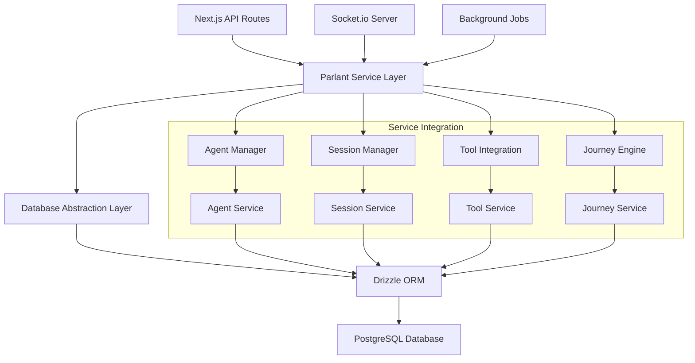

# Developer Integration Guide for Parlant Database Operations

## Overview

This guide provides comprehensive documentation for developers working with the Parlant database schema extension. It covers service patterns, query helpers, type safety, and integration with Sim's existing infrastructure.

## Architecture Overview



## Service Layer Architecture

### Core Service Structure

```typescript
// apps/sim/services/parlant/index.ts
export class ParlantService {
  private db: DrizzleDB;
  private agentManager: AgentManager;
  private sessionManager: SessionManager;
  private toolManager: ToolManager;
  private journeyManager: JourneyManager;

  constructor(db: DrizzleDB) {
    this.db = db;
    this.agentManager = new AgentManager(db);
    this.sessionManager = new SessionManager(db);
    this.toolManager = new ToolManager(db);
    this.journeyManager = new JourneyManager(db);
  }

  // Service delegation methods
  async createAgent(params: CreateAgentParams): Promise<ParlantAgent> {
    return this.agentManager.create(params);
  }

  async createSession(params: CreateSessionParams): Promise<ParlantSession> {
    return this.sessionManager.create(params);
  }
}
```

### Agent Management Service

```typescript
// apps/sim/services/parlant/agent-service.ts
import { db } from '@/lib/db';
import { parlantAgent, parlantAgentTool, parlantTool } from '@repo/db/schema';
import { eq, and, sql, desc } from 'drizzle-orm';

export class AgentManager {
  constructor(private db: typeof db) {}

  /**
   * Create a new Parlant agent within a workspace
   * Ensures workspace isolation and validates permissions
   */
  async create(params: CreateAgentParams): Promise<ParlantAgent> {
    // Validate workspace access
    await this.validateWorkspaceAccess(params.workspaceId, params.createdBy);

    // Create agent with workspace isolation
    const [agent] = await this.db
      .insert(parlantAgent)
      .values({
        workspaceId: params.workspaceId,
        createdBy: params.createdBy,
        name: params.name,
        description: params.description,
        modelProvider: params.modelProvider ?? 'openai',
        modelName: params.modelName ?? 'gpt-4',
        temperature: params.temperature ?? 70,
        maxTokens: params.maxTokens ?? 2000,
        systemPrompt: params.systemPrompt,
        conversationStyle: params.conversationStyle ?? 'professional',
      })
      .returning();

    // Initialize default tools if specified
    if (params.defaultTools?.length) {
      await this.assignTools(agent.id, params.defaultTools);
    }

    return agent;
  }

  /**
   * Get agent by ID with workspace validation
   * Ensures cross-workspace access is prevented
   */
  async getById(agentId: string, workspaceId: string): Promise<ParlantAgent | null> {
    const [agent] = await this.db
      .select()
      .from(parlantAgent)
      .where(
        and(
          eq(parlantAgent.id, agentId),
          eq(parlantAgent.workspaceId, workspaceId),
          sql`deleted_at IS NULL`
        )
      );

    return agent ?? null;
  }

  /**
   * List agents for a workspace with filtering and pagination
   * Optimized query with proper indexing
   */
  async list(params: ListAgentsParams): Promise<ListAgentsResponse> {
    const conditions = [
      eq(parlantAgent.workspaceId, params.workspaceId),
      sql`deleted_at IS NULL`,
    ];

    // Add status filter
    if (params.status) {
      conditions.push(eq(parlantAgent.status, params.status));
    }

    // Add search filter
    if (params.search) {
      conditions.push(
        sql`(name ILIKE ${'%' + params.search + '%'} OR description ILIKE ${'%' + params.search + '%'})`
      );
    }

    // Execute query with pagination
    const agents = await this.db
      .select({
        id: parlantAgent.id,
        name: parlantAgent.name,
        description: parlantAgent.description,
        status: parlantAgent.status,
        totalSessions: parlantAgent.totalSessions,
        totalMessages: parlantAgent.totalMessages,
        lastActiveAt: parlantAgent.lastActiveAt,
        createdAt: parlantAgent.createdAt,
      })
      .from(parlantAgent)
      .where(and(...conditions))
      .orderBy(desc(parlantAgent.lastActiveAt))
      .limit(params.limit ?? 20)
      .offset(params.offset ?? 0);

    // Get total count for pagination
    const [{ count }] = await this.db
      .select({ count: sql<number>`count(*)` })
      .from(parlantAgent)
      .where(and(...conditions));

    return {
      agents,
      totalCount: count,
      hasMore: (params.offset ?? 0) + agents.length < count,
    };
  }

  /**
   * Update agent configuration with optimistic locking
   * Prevents concurrent modification issues
   */
  async update(agentId: string, params: UpdateAgentParams): Promise<ParlantAgent> {
    const [updatedAgent] = await this.db
      .update(parlantAgent)
      .set({
        ...params,
        updatedAt: new Date(),
      })
      .where(
        and(
          eq(parlantAgent.id, agentId),
          eq(parlantAgent.workspaceId, params.workspaceId),
          sql`deleted_at IS NULL`
        )
      )
      .returning();

    if (!updatedAgent) {
      throw new Error('Agent not found or access denied');
    }

    return updatedAgent;
  }

  /**
   * Soft delete agent with cascade handling
   * Preserves historical data while preventing new usage
   */
  async delete(agentId: string, workspaceId: string): Promise<void> {
    const result = await this.db
      .update(parlantAgent)
      .set({
        deletedAt: new Date(),
        status: 'archived',
      })
      .where(
        and(
          eq(parlantAgent.id, agentId),
          eq(parlantAgent.workspaceId, workspaceId)
        )
      );

    if (result.rowCount === 0) {
      throw new Error('Agent not found or access denied');
    }
  }

  /**
   * Assign tools to agent with configuration
   * Manages many-to-many relationship with validation
   */
  async assignTools(agentId: string, toolIds: string[], configuration?: Record<string, any>): Promise<void> {
    // Validate tools belong to same workspace as agent
    const agent = await this.db
      .select({ workspaceId: parlantAgent.workspaceId })
      .from(parlantAgent)
      .where(eq(parlantAgent.id, agentId));

    if (!agent.length) {
      throw new Error('Agent not found');
    }

    const tools = await this.db
      .select({ id: parlantTool.id })
      .from(parlantTool)
      .where(
        and(
          sql`id = ANY(${toolIds})`,
          eq(parlantTool.workspaceId, agent[0].workspaceId)
        )
      );

    if (tools.length !== toolIds.length) {
      throw new Error('Some tools not found or not accessible');
    }

    // Insert agent-tool relationships
    await this.db
      .insert(parlantAgentTool)
      .values(
        toolIds.map((toolId) => ({
          agentId,
          toolId,
          configuration: configuration ?? {},
        }))
      )
      .onConflictDoNothing(); // Prevent duplicate assignments
  }

  /**
   * Get agent analytics and usage statistics
   * Optimized query for dashboard display
   */
  async getAnalytics(agentId: string, workspaceId: string): Promise<AgentAnalytics> {
    // Validate agent access
    const agent = await this.getById(agentId, workspaceId);
    if (!agent) {
      throw new Error('Agent not found or access denied');
    }

    // Get session analytics
    const sessionStats = await this.db
      .select({
        totalSessions: sql<number>`count(*)`,
        activeSessions: sql<number>`count(*) filter (where status = 'active')`,
        avgMessageCount: sql<number>`avg(message_count)`,
        avgTokensUsed: sql<number>`avg(tokens_used)`,
        avgCost: sql<number>`avg(cost)`,
        avgSatisfaction: sql<number>`avg(satisfaction_score) filter (where satisfaction_score is not null)`,
      })
      .from(parlantSession)
      .where(eq(parlantSession.agentId, agentId));

    // Get tool usage statistics
    const toolStats = await this.db
      .select({
        toolName: parlantTool.name,
        useCount: parlantAgentTool.useCount,
        lastUsedAt: parlantAgentTool.lastUsedAt,
      })
      .from(parlantAgentTool)
      .innerJoin(parlantTool, eq(parlantAgentTool.toolId, parlantTool.id))
      .where(eq(parlantAgentTool.agentId, agentId))
      .orderBy(desc(parlantAgentTool.useCount));

    return {
      agent,
      sessionStats: sessionStats[0],
      toolStats,
      lastUpdated: new Date(),
    };
  }

  /**
   * Validate workspace access for security
   * Integrates with Sim's permission system
   */
  private async validateWorkspaceAccess(workspaceId: string, userId: string): Promise<void> {
    const hasAccess = await this.db
      .select({ id: sql<string>`1` })
      .from(permissions)
      .where(
        and(
          eq(permissions.userId, userId),
          eq(permissions.entityType, 'workspace'),
          eq(permissions.entityId, workspaceId),
          sql`permission_type IN ('admin', 'write')`
        )
      );

    if (!hasAccess.length) {
      throw new Error('Insufficient permissions for workspace');
    }
  }
}

// Type definitions for service methods
interface CreateAgentParams {
  workspaceId: string;
  createdBy: string;
  name: string;
  description?: string;
  modelProvider?: string;
  modelName?: string;
  temperature?: number;
  maxTokens?: number;
  systemPrompt?: string;
  conversationStyle?: string;
  defaultTools?: string[];
}

interface ListAgentsParams {
  workspaceId: string;
  status?: 'active' | 'inactive' | 'archived';
  search?: string;
  limit?: number;
  offset?: number;
}

interface ListAgentsResponse {
  agents: Array<{
    id: string;
    name: string;
    description: string | null;
    status: 'active' | 'inactive' | 'archived';
    totalSessions: number;
    totalMessages: number;
    lastActiveAt: Date | null;
    createdAt: Date;
  }>;
  totalCount: number;
  hasMore: boolean;
}

interface UpdateAgentParams {
  workspaceId: string;
  name?: string;
  description?: string;
  temperature?: number;
  maxTokens?: number;
  systemPrompt?: string;
  conversationStyle?: string;
  status?: 'active' | 'inactive' | 'archived';
}

interface AgentAnalytics {
  agent: ParlantAgent;
  sessionStats: {
    totalSessions: number;
    activeSessions: number;
    avgMessageCount: number;
    avgTokensUsed: number;
    avgCost: number;
    avgSatisfaction: number;
  };
  toolStats: Array<{
    toolName: string;
    useCount: number;
    lastUsedAt: Date | null;
  }>;
  lastUpdated: Date;
}
```

### Session Management Service

```typescript
// apps/sim/services/parlant/session-service.ts
export class SessionManager {
  constructor(private db: typeof db) {}

  /**
   * Create new session with proper initialization
   * Handles both authenticated and anonymous users
   */
  async create(params: CreateSessionParams): Promise<ParlantSession> {
    // Validate agent exists and is accessible
    const agent = await this.db
      .select()
      .from(parlantAgent)
      .where(
        and(
          eq(parlantAgent.id, params.agentId),
          eq(parlantAgent.workspaceId, params.workspaceId),
          eq(parlantAgent.status, 'active'),
          sql`deleted_at IS NULL`
        )
      );

    if (!agent.length) {
      throw new Error('Agent not found or inactive');
    }

    // Create session with proper defaults
    const [session] = await this.db
      .insert(parlantSession)
      .values({
        agentId: params.agentId,
        workspaceId: params.workspaceId,
        userId: params.userId, // Can be null for anonymous
        customerId: params.customerId,
        mode: params.mode ?? 'auto',
        title: params.title,
        metadata: params.metadata ?? {},
        variables: params.variables ?? {},
        sessionType: params.sessionType ?? 'conversation',
        locale: params.locale ?? 'en',
        timezone: params.timezone ?? 'UTC',
        userAgent: params.userAgent,
        ipAddress: params.ipAddress,
        referrer: params.referrer,
      })
      .returning();

    // Update agent session count
    await this.db
      .update(parlantAgent)
      .set({
        totalSessions: sql`total_sessions + 1`,
        lastActiveAt: new Date(),
      })
      .where(eq(parlantAgent.id, params.agentId));

    return session;
  }

  /**
   * Add event to session with ordering validation
   * Ensures events are properly sequenced
   */
  async addEvent(sessionId: string, eventData: CreateEventParams): Promise<ParlantEvent> {
    // Get next offset for session
    const [{ nextOffset }] = await this.db
      .select({
        nextOffset: sql<number>`COALESCE(MAX(offset), -1) + 1`,
      })
      .from(parlantEvent)
      .where(eq(parlantEvent.sessionId, sessionId));

    // Insert event with proper offset
    const [event] = await this.db
      .insert(parlantEvent)
      .values({
        sessionId,
        offset: nextOffset,
        eventType: eventData.eventType,
        content: eventData.content,
        metadata: eventData.metadata ?? {},
        toolCallId: eventData.toolCallId,
        journeyId: eventData.journeyId,
        stateId: eventData.stateId,
      })
      .returning();

    // Update session counters
    await this.updateSessionCounters(sessionId, eventData.eventType);

    return event;
  }

  /**
   * Get session events with pagination and filtering
   * Optimized for real-time chat interfaces
   */
  async getEvents(
    sessionId: string,
    params: GetEventsParams = {}
  ): Promise<ParlantEvent[]> {
    const conditions = [eq(parlantEvent.sessionId, sessionId)];

    // Add event type filter
    if (params.eventTypes?.length) {
      conditions.push(sql`event_type = ANY(${params.eventTypes})`);
    }

    // Add offset range for pagination
    if (params.fromOffset !== undefined) {
      conditions.push(sql`offset >= ${params.fromOffset}`);
    }

    if (params.toOffset !== undefined) {
      conditions.push(sql`offset <= ${params.toOffset}`);
    }

    return await this.db
      .select()
      .from(parlantEvent)
      .where(and(...conditions))
      .orderBy(parlantEvent.offset)
      .limit(params.limit ?? 100);
  }

  /**
   * Update session with analytics tracking
   * Handles cost calculation and performance metrics
   */
  async update(sessionId: string, updates: UpdateSessionParams): Promise<ParlantSession> {
    const updateData: any = { ...updates, updatedAt: new Date() };

    // Calculate derived metrics
    if (updates.tokensUsed !== undefined) {
      // Update cost based on model pricing
      const session = await this.getById(sessionId);
      if (session) {
        const agent = await this.db
          .select()
          .from(parlantAgent)
          .where(eq(parlantAgent.id, session.agentId));

        if (agent.length) {
          updateData.cost = this.calculateCost(updates.tokensUsed, agent[0].modelName);
        }
      }
    }

    const [updatedSession] = await this.db
      .update(parlantSession)
      .set(updateData)
      .where(eq(parlantSession.id, sessionId))
      .returning();

    return updatedSession;
  }

  /**
   * End session with proper cleanup
   * Handles journey completion and analytics
   */
  async endSession(sessionId: string, reason?: string): Promise<void> {
    const endTime = new Date();

    // Update session status
    const [session] = await this.db
      .update(parlantSession)
      .set({
        status: 'completed',
        endedAt: endTime,
        lastActivityAt: endTime,
        metadata: sql`metadata || ${{ endReason: reason }}`,
      })
      .where(eq(parlantSession.id, sessionId))
      .returning();

    if (!session) {
      throw new Error('Session not found');
    }

    // Calculate session duration
    const duration = Math.floor(
      (endTime.getTime() - session.startedAt.getTime()) / 1000
    );

    // Update agent analytics
    await this.db
      .update(parlantAgent)
      .set({
        averageSessionDuration: sql`
          CASE
            WHEN total_sessions = 1 THEN ${duration}
            ELSE (COALESCE(average_session_duration, 0) * (total_sessions - 1) + ${duration}) / total_sessions
          END
        `,
      })
      .where(eq(parlantAgent.id, session.agentId));
  }

  /**
   * Get session with related data for display
   * Optimized query with joins
   */
  async getWithDetails(sessionId: string): Promise<SessionWithDetails | null> {
    const result = await this.db
      .select({
        session: parlantSession,
        agent: {
          id: parlantAgent.id,
          name: parlantAgent.name,
          modelProvider: parlantAgent.modelProvider,
          modelName: parlantAgent.modelName,
        },
        eventCount: sql<number>`(
          SELECT COUNT(*) FROM parlant_event
          WHERE session_id = ${sessionId}
        )`,
      })
      .from(parlantSession)
      .innerJoin(parlantAgent, eq(parlantSession.agentId, parlantAgent.id))
      .where(eq(parlantSession.id, sessionId));

    return result[0] ?? null;
  }

  /**
   * Private helper methods
   */
  private async getById(sessionId: string): Promise<ParlantSession | null> {
    const [session] = await this.db
      .select()
      .from(parlantSession)
      .where(eq(parlantSession.id, sessionId));

    return session ?? null;
  }

  private async updateSessionCounters(sessionId: string, eventType: string): Promise<void> {
    const updates: any = {
      eventCount: sql`event_count + 1`,
      lastActivityAt: new Date(),
    };

    if (eventType === 'customer_message' || eventType === 'agent_message') {
      updates.messageCount = sql`message_count + 1`;
    }

    await this.db
      .update(parlantSession)
      .set(updates)
      .where(eq(parlantSession.id, sessionId));
  }

  private calculateCost(tokensUsed: number, modelName: string): number {
    // Model pricing in cents per 1K tokens (simplified)
    const pricing: Record<string, { input: number; output: number }> = {
      'gpt-4': { input: 3, output: 6 },
      'gpt-3.5-turbo': { input: 0.1, output: 0.2 },
      'claude-3-sonnet': { input: 0.3, output: 1.5 },
    };

    const model = pricing[modelName] || pricing['gpt-3.5-turbo'];
    return Math.ceil((tokensUsed / 1000) * model.output); // Simplified calculation
  }
}
```

## Database Query Patterns

### Common Query Patterns

```typescript
// Get workspace agents with session counts
async function getWorkspaceAgentsWithStats(workspaceId: string) {
  return await db
    .select({
      id: parlantAgent.id,
      name: parlantAgent.name,
      status: parlantAgent.status,
      activeSessions: sql<number>`(
        SELECT COUNT(*)
        FROM parlant_session ps
        WHERE ps.agent_id = parlant_agent.id
        AND ps.status = 'active'
      )`,
      totalSessions: parlantAgent.totalSessions,
      lastActiveAt: parlantAgent.lastActiveAt,
    })
    .from(parlantAgent)
    .where(
      and(
        eq(parlantAgent.workspaceId, workspaceId),
        sql`deleted_at IS NULL`
      )
    )
    .orderBy(desc(parlantAgent.lastActiveAt));
}

// Get session events for real-time chat
async function getRecentSessionEvents(sessionId: string, limit: number = 50) {
  return await db
    .select()
    .from(parlantEvent)
    .where(eq(parlantEvent.sessionId, sessionId))
    .orderBy(desc(parlantEvent.offset))
    .limit(limit);
}

// Complex analytics query with time windows
async function getAgentPerformanceMetrics(
  agentId: string,
  startDate: Date,
  endDate: Date
) {
  return await db
    .select({
      period: sql<string>`DATE_TRUNC('day', started_at)`,
      sessionCount: sql<number>`COUNT(*)`,
      avgMessageCount: sql<number>`AVG(message_count)`,
      avgSatisfaction: sql<number>`AVG(satisfaction_score) FILTER (WHERE satisfaction_score IS NOT NULL)`,
      totalCost: sql<number>`SUM(cost)`,
      completionRate: sql<number>`
        COUNT(*) FILTER (WHERE status = 'completed') * 100.0 / COUNT(*)
      `,
    })
    .from(parlantSession)
    .where(
      and(
        eq(parlantSession.agentId, agentId),
        sql`started_at >= ${startDate}`,
        sql`started_at <= ${endDate}`
      )
    )
    .groupBy(sql`DATE_TRUNC('day', started_at)`)
    .orderBy(sql`DATE_TRUNC('day', started_at)`);
}
```

### Transaction Management

```typescript
// Multi-table operations with transactions
async function createAgentWithTools(params: CreateAgentWithToolsParams): Promise<ParlantAgent> {
  return await db.transaction(async (tx) => {
    // Create agent
    const [agent] = await tx
      .insert(parlantAgent)
      .values(params.agentData)
      .returning();

    // Assign tools
    if (params.toolIds.length > 0) {
      await tx
        .insert(parlantAgentTool)
        .values(
          params.toolIds.map((toolId) => ({
            agentId: agent.id,
            toolId,
          }))
        );
    }

    // Create default journey if specified
    if (params.createDefaultJourney) {
      const [journey] = await tx
        .insert(parlantJourney)
        .values({
          agentId: agent.id,
          title: 'Default Conversation Flow',
          description: 'Auto-generated default journey',
          conditions: ['true'], // Always active
        })
        .returning();

      // Create initial state
      await tx
        .insert(parlantJourneyState)
        .values({
          journeyId: journey.id,
          name: 'Welcome',
          stateType: 'chat',
          chatPrompt: 'Hello! How can I help you today?',
          isInitial: true,
        });
    }

    return agent;
  });
}

// Session event handling with consistency checks
async function addEventWithValidation(params: AddEventParams): Promise<ParlantEvent> {
  return await db.transaction(async (tx) => {
    // Verify session is active
    const [session] = await tx
      .select()
      .from(parlantSession)
      .where(
        and(
          eq(parlantSession.id, params.sessionId),
          eq(parlantSession.status, 'active')
        )
      );

    if (!session) {
      throw new Error('Session not found or inactive');
    }

    // Add event with proper offset
    const [{ nextOffset }] = await tx
      .select({
        nextOffset: sql<number>`COALESCE(MAX(offset), -1) + 1`,
      })
      .from(parlantEvent)
      .where(eq(parlantEvent.sessionId, params.sessionId));

    const [event] = await tx
      .insert(parlantEvent)
      .values({
        ...params.eventData,
        sessionId: params.sessionId,
        offset: nextOffset,
      })
      .returning();

    // Update session counters atomically
    await tx
      .update(parlantSession)
      .set({
        eventCount: sql`event_count + 1`,
        lastActivityAt: new Date(),
      })
      .where(eq(parlantSession.id, params.sessionId));

    return event;
  });
}
```

## API Integration Patterns

### Next.js API Routes

```typescript
// app/api/parlant/agents/route.ts
import { NextRequest } from 'next/server';
import { getSession } from '@/lib/auth';
import { parlantService } from '@/services/parlant';
import { z } from 'zod';

const createAgentSchema = z.object({
  name: z.string().min(1).max(100),
  description: z.string().optional(),
  modelProvider: z.enum(['openai', 'anthropic', 'ollama']).default('openai'),
  modelName: z.string().default('gpt-4'),
  temperature: z.number().min(0).max(100).default(70),
  systemPrompt: z.string().optional(),
});

export async function POST(request: NextRequest) {
  try {
    // Authenticate and get session
    const session = await getSession();
    if (!session?.user?.id) {
      return Response.json({ error: 'Unauthorized' }, { status: 401 });
    }

    // Get workspace from request context
    const workspaceId = request.headers.get('x-workspace-id');
    if (!workspaceId) {
      return Response.json({ error: 'Workspace required' }, { status: 400 });
    }

    // Parse and validate request body
    const body = await request.json();
    const validatedData = createAgentSchema.parse(body);

    // Create agent through service layer
    const agent = await parlantService.createAgent({
      ...validatedData,
      workspaceId,
      createdBy: session.user.id,
    });

    return Response.json({ agent }, { status: 201 });
  } catch (error) {
    if (error instanceof z.ZodError) {
      return Response.json(
        { error: 'Validation error', details: error.errors },
        { status: 400 }
      );
    }

    console.error('Agent creation error:', error);
    return Response.json(
      { error: 'Internal server error' },
      { status: 500 }
    );
  }
}

export async function GET(request: NextRequest) {
  try {
    const session = await getSession();
    const workspaceId = request.headers.get('x-workspace-id');

    if (!session?.user?.id || !workspaceId) {
      return Response.json({ error: 'Unauthorized' }, { status: 401 });
    }

    // Parse query parameters
    const url = new URL(request.url);
    const params = {
      workspaceId,
      status: url.searchParams.get('status') as any,
      search: url.searchParams.get('search') || undefined,
      limit: parseInt(url.searchParams.get('limit') || '20'),
      offset: parseInt(url.searchParams.get('offset') || '0'),
    };

    // Get agents through service layer
    const result = await parlantService.listAgents(params);

    return Response.json(result);
  } catch (error) {
    console.error('Agent list error:', error);
    return Response.json(
      { error: 'Internal server error' },
      { status: 500 }
    );
  }
}
```

### Socket.io Integration

```typescript
// socket-server/parlant-handlers.ts
import { Server } from 'socket.io';
import { ParlantSession } from '@repo/db/schema';

export function setupParlantHandlers(io: Server) {
  io.of('/parlant').on('connection', (socket) => {
    console.log('Parlant client connected:', socket.id);

    // Join session room
    socket.on('join-session', async ({ sessionId }) => {
      try {
        // Validate session access
        const session = await parlantService.getSession(sessionId);
        if (!session) {
          socket.emit('error', { message: 'Session not found' });
          return;
        }

        // Join room for real-time updates
        socket.join(`session:${sessionId}`);
        socket.emit('session-joined', { sessionId });

        // Send recent events
        const events = await parlantService.getSessionEvents(sessionId, { limit: 50 });
        socket.emit('events', { events });
      } catch (error) {
        socket.emit('error', { message: 'Failed to join session' });
      }
    });

    // Handle new messages
    socket.on('send-message', async ({ sessionId, content, metadata }) => {
      try {
        // Add user message event
        const event = await parlantService.addSessionEvent(sessionId, {
          eventType: 'customer_message',
          content: { text: content },
          metadata,
        });

        // Broadcast to session room
        io.to(`session:${sessionId}`).emit('event', { event });

        // Process with agent (async)
        processAgentResponse(sessionId, content, metadata)
          .catch(error => console.error('Agent processing error:', error));
      } catch (error) {
        socket.emit('error', { message: 'Failed to send message' });
      }
    });

    // Handle typing indicators
    socket.on('typing-start', ({ sessionId }) => {
      socket.to(`session:${sessionId}`).emit('user-typing', {
        userId: socket.userId,
        sessionId,
      });
    });

    socket.on('typing-stop', ({ sessionId }) => {
      socket.to(`session:${sessionId}`).emit('user-stopped-typing', {
        userId: socket.userId,
        sessionId,
      });
    });

    socket.on('disconnect', () => {
      console.log('Parlant client disconnected:', socket.id);
    });
  });
}

// Process agent responses asynchronously
async function processAgentResponse(
  sessionId: string,
  userMessage: string,
  metadata: any
) {
  try {
    // Get session and agent configuration
    const session = await parlantService.getSessionWithAgent(sessionId);
    if (!session || session.status !== 'active') {
      return;
    }

    // Send typing indicator
    io.to(`session:${sessionId}`).emit('agent-typing', {
      agentId: session.agentId,
      sessionId,
    });

    // Process with agent (integrate with actual Parlant server)
    const response = await parlantServerClient.processMessage({
      sessionId,
      message: userMessage,
      context: session.variables,
      metadata,
    });

    // Stop typing indicator
    io.to(`session:${sessionId}`).emit('agent-stopped-typing', {
      agentId: session.agentId,
      sessionId,
    });

    // Add agent response event
    const responseEvent = await parlantService.addSessionEvent(sessionId, {
      eventType: 'agent_message',
      content: response.content,
      metadata: response.metadata,
    });

    // Broadcast response
    io.to(`session:${sessionId}`).emit('event', { event: responseEvent });

    // Update session analytics
    await parlantService.updateSession(sessionId, {
      tokensUsed: response.tokensUsed,
      lastActivityAt: new Date(),
    });
  } catch (error) {
    console.error('Agent response error:', error);
    io.to(`session:${sessionId}`).emit('agent-error', {
      message: 'Agent temporarily unavailable',
    });
  }
}
```

## Type Safety and Validation

### Zod Schemas for API Validation

```typescript
// types/parlant-api.ts
import { z } from 'zod';

export const AgentStatusEnum = z.enum(['active', 'inactive', 'archived']);
export const SessionModeEnum = z.enum(['auto', 'manual', 'paused']);
export const SessionStatusEnum = z.enum(['active', 'completed', 'abandoned']);
export const EventTypeEnum = z.enum([
  'customer_message',
  'agent_message',
  'tool_call',
  'tool_result',
  'status_update',
  'journey_transition',
  'variable_update',
]);

export const CreateAgentRequestSchema = z.object({
  name: z.string().min(1, 'Name is required').max(100, 'Name too long'),
  description: z.string().max(500, 'Description too long').optional(),
  modelProvider: z.enum(['openai', 'anthropic', 'ollama']).default('openai'),
  modelName: z.string().min(1, 'Model name required'),
  temperature: z.number().min(0).max(100).default(70),
  maxTokens: z.number().min(1).max(100000).default(2000),
  systemPrompt: z.string().max(5000, 'System prompt too long').optional(),
  conversationStyle: z.enum(['casual', 'professional', 'technical', 'friendly']).default('professional'),
  allowInterruption: z.boolean().default(true),
  allowProactiveMessages: z.boolean().default(false),
  dataRetentionDays: z.number().min(1).max(365).default(30),
});

export const CreateSessionRequestSchema = z.object({
  agentId: z.string().uuid('Invalid agent ID'),
  userId: z.string().optional(), // Nullable for anonymous sessions
  customerId: z.string().max(100).optional(),
  title: z.string().max(200).optional(),
  sessionType: z.enum(['conversation', 'support', 'onboarding', 'survey']).default('conversation'),
  locale: z.string().length(2).default('en'),
  timezone: z.string().max(50).default('UTC'),
  metadata: z.record(z.unknown()).default({}),
  variables: z.record(z.unknown()).default({}),
});

export const AddEventRequestSchema = z.object({
  eventType: EventTypeEnum,
  content: z.record(z.unknown()),
  metadata: z.record(z.unknown()).default({}),
  toolCallId: z.string().optional(),
  journeyId: z.string().uuid().optional(),
  stateId: z.string().uuid().optional(),
});

// Type inference from schemas
export type CreateAgentRequest = z.infer<typeof CreateAgentRequestSchema>;
export type CreateSessionRequest = z.infer<typeof CreateSessionRequestSchema>;
export type AddEventRequest = z.infer<typeof AddEventRequestSchema>;
```

### TypeScript Integration with Drizzle

```typescript
// types/database.ts
import type {
  ParlantAgent,
  ParlantSession,
  ParlantEvent,
  ParlantTool,
} from '@repo/db/schema';

// Enhanced types with computed fields
export interface AgentWithStats extends ParlantAgent {
  activeSessions: number;
  recentActivity: Date | null;
  toolCount: number;
}

export interface SessionWithAgent extends ParlantSession {
  agent: {
    id: string;
    name: string;
    modelProvider: string;
    modelName: string;
  };
}

export interface EventWithMetadata extends ParlantEvent {
  formattedContent: string;
  isUserMessage: boolean;
  isAgentMessage: boolean;
  toolCallData?: {
    toolName: string;
    parameters: Record<string, any>;
    result?: any;
  };
}

// Service response types
export interface ListResponse<T> {
  items: T[];
  totalCount: number;
  hasMore: boolean;
  nextOffset?: number;
}

export interface AnalyticsResponse {
  period: string;
  metrics: {
    sessionCount: number;
    messageCount: number;
    averageResponseTime: number;
    satisfactionScore: number | null;
    cost: number;
  };
}

// Error types for proper error handling
export class ParlantError extends Error {
  constructor(
    message: string,
    public code: string,
    public statusCode: number = 500
  ) {
    super(message);
    this.name = 'ParlantError';
  }
}

export class ValidationError extends ParlantError {
  constructor(message: string, public details?: any) {
    super(message, 'VALIDATION_ERROR', 400);
  }
}

export class NotFoundError extends ParlantError {
  constructor(resource: string) {
    super(`${resource} not found`, 'NOT_FOUND', 404);
  }
}

export class AccessDeniedError extends ParlantError {
  constructor(resource: string) {
    super(`Access denied to ${resource}`, 'ACCESS_DENIED', 403);
  }
}
```

## Testing Integration

### Service Layer Testing

```typescript
// __tests__/services/parlant/agent-service.test.ts
import { describe, it, expect, beforeEach, vi } from 'vitest';
import { AgentManager } from '@/services/parlant/agent-service';
import { createTestDatabase, cleanupTestDatabase } from '@/test-utils/database';

describe('AgentManager', () => {
  let agentManager: AgentManager;
  let testDb: any;

  beforeEach(async () => {
    testDb = await createTestDatabase();
    agentManager = new AgentManager(testDb);
  });

  afterEach(async () => {
    await cleanupTestDatabase(testDb);
  });

  describe('create', () => {
    it('should create agent with valid parameters', async () => {
      const params = {
        workspaceId: 'workspace-123',
        createdBy: 'user-123',
        name: 'Test Agent',
        description: 'A test agent',
        modelProvider: 'openai',
        modelName: 'gpt-4',
      };

      const agent = await agentManager.create(params);

      expect(agent.id).toBeDefined();
      expect(agent.name).toBe(params.name);
      expect(agent.workspaceId).toBe(params.workspaceId);
      expect(agent.status).toBe('active');
    });

    it('should validate workspace access', async () => {
      const params = {
        workspaceId: 'invalid-workspace',
        createdBy: 'user-123',
        name: 'Test Agent',
      };

      await expect(agentManager.create(params)).rejects.toThrow(
        'Insufficient permissions for workspace'
      );
    });

    it('should assign default tools if provided', async () => {
      const params = {
        workspaceId: 'workspace-123',
        createdBy: 'user-123',
        name: 'Test Agent',
        defaultTools: ['tool-1', 'tool-2'],
      };

      const agent = await agentManager.create(params);

      const assignedTools = await testDb
        .select()
        .from(parlantAgentTool)
        .where(eq(parlantAgentTool.agentId, agent.id));

      expect(assignedTools).toHaveLength(2);
    });
  });

  describe('list', () => {
    it('should return paginated results', async () => {
      // Create test agents
      const agents = await Promise.all(
        Array.from({ length: 5 }, (_, i) =>
          agentManager.create({
            workspaceId: 'workspace-123',
            createdBy: 'user-123',
            name: `Agent ${i}`,
          })
        )
      );

      const result = await agentManager.list({
        workspaceId: 'workspace-123',
        limit: 3,
        offset: 0,
      });

      expect(result.agents).toHaveLength(3);
      expect(result.totalCount).toBe(5);
      expect(result.hasMore).toBe(true);
    });

    it('should filter by status', async () => {
      await agentManager.create({
        workspaceId: 'workspace-123',
        createdBy: 'user-123',
        name: 'Active Agent',
        status: 'active',
      });

      await agentManager.create({
        workspaceId: 'workspace-123',
        createdBy: 'user-123',
        name: 'Inactive Agent',
        status: 'inactive',
      });

      const result = await agentManager.list({
        workspaceId: 'workspace-123',
        status: 'active',
      });

      expect(result.agents).toHaveLength(1);
      expect(result.agents[0].name).toBe('Active Agent');
    });
  });
});
```

This comprehensive integration guide provides developers with everything needed to work effectively with the Parlant database schema, including service patterns, query optimization, type safety, and testing approaches.