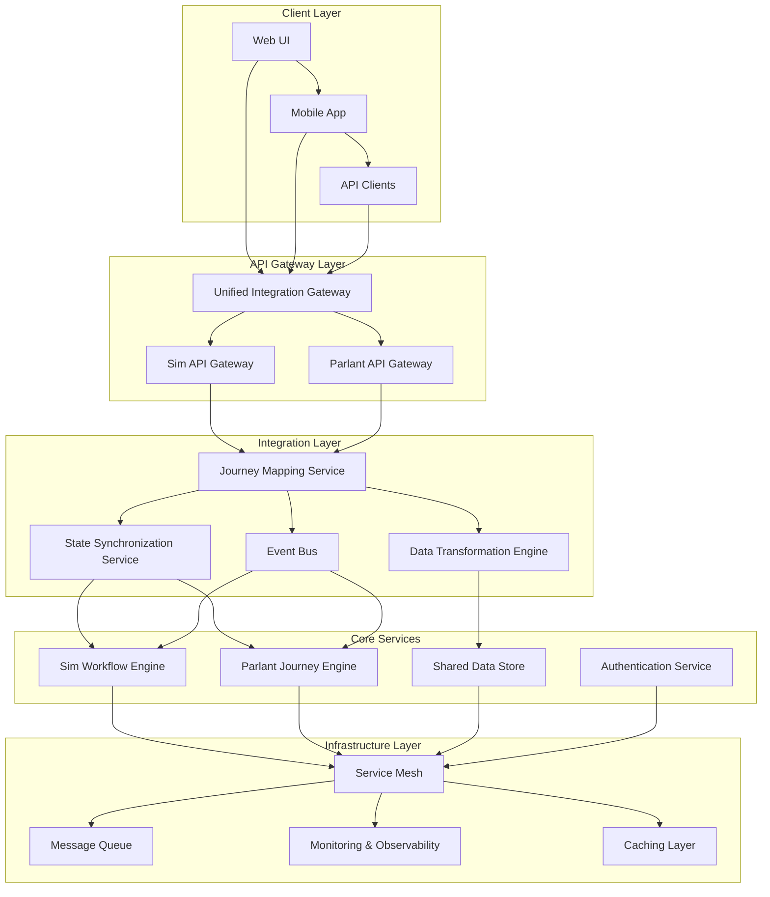

# Integration Architecture Blueprints
## Comprehensive System Integration Design for Sim-Parlant Journey Mapping

### Executive Summary

This document provides detailed integration architecture blueprints for seamlessly connecting Sim's ReactFlow workflow system with Parlant's conversational journey framework. The architecture ensures robust data integration, real-time synchronization, API compatibility, and scalable deployment patterns while maintaining system independence and performance.

**Integration Architecture Pillars:**
- **Layered Integration Design** - Modular, loosely-coupled integration layers
- **Real-time Data Synchronization** - Bidirectional state and context synchronization
- **API Gateway Pattern** - Unified API access with intelligent routing
- **Event-Driven Architecture** - Asynchronous communication and event processing
- **Service Mesh Integration** - Distributed system communication and observability

---

## 1. Overall Integration Architecture

### 1.1 System Architecture Overview



### 1.2 Integration Layer Architecture

```typescript
interface IntegrationArchitecture {
  // Core integration services
  journeyMappingService: JourneyMappingServiceInterface
  stateSynchronizationService: StateSynchronizationServiceInterface
  eventBusService: EventBusServiceInterface
  dataTransformationEngine: DataTransformationEngineInterface

  // API integration
  apiGateway: UnifiedAPIGatewayInterface
  routingEngine: APIRoutingEngineInterface
  authenticationBridge: AuthenticationBridgeInterface

  // Real-time capabilities
  websocketManager: WebSocketManagerInterface
  realtimeSynchronizer: RealtimeSynchronizerInterface
  eventStreamProcessor: EventStreamProcessorInterface

  // Data integration
  dataIntegrationLayer: DataIntegrationLayerInterface
  cachingStrategy: CachingStrategyInterface
  persistenceManager: PersistenceManagerInterface

  // Monitoring and observability
  metricsCollector: MetricsCollectorInterface
  healthMonitor: HealthMonitorInterface
  alertingSystem: AlertingSystemInterface
}

/**
 * Core Integration Service Orchestrator
 */
class IntegrationServiceOrchestrator {
  private readonly services: Map<string, IntegrationService>
  private readonly healthChecker: ServiceHealthChecker
  private readonly configManager: IntegrationConfigManager

  constructor(config: IntegrationConfig) {
    this.initializeServices(config)
    this.setupHealthMonitoring()
    this.configureServiceDiscovery()
  }

  /**
   * Initialize all integration services
   */
  private async initializeServices(config: IntegrationConfig): Promise<void> {
    // Journey Mapping Service
    this.services.set('journey_mapping', new JourneyMappingService({
      workflowEndpoint: config.sim.workflowEndpoint,
      journeyEndpoint: config.parlant.journeyEndpoint,
      cachingEnabled: config.caching.enabled,
      realtimeEnabled: config.realtime.enabled
    }))

    // State Synchronization Service
    this.services.set('state_sync', new StateSynchronizationService({
      syncMode: config.synchronization.mode,
      conflictResolution: config.synchronization.conflictResolution,
      syncInterval: config.synchronization.intervalMs,
      batchSize: config.synchronization.batchSize
    }))

    // Event Bus Service
    this.services.set('event_bus', new EventBusService({
      brokerConfig: config.messaging.broker,
      topicConfig: config.messaging.topics,
      durability: config.messaging.durability,
      partitioning: config.messaging.partitioning
    }))

    // Data Transformation Engine
    this.services.set('data_transform', new DataTransformationEngine({
      transformationRules: config.dataTransformation.rules,
      validationEnabled: config.dataTransformation.validation,
      performanceOptimized: config.dataTransformation.optimized
    }))

    // Start all services
    await this.startServices()
  }

  /**
   * Start all integration services in dependency order
   */
  private async startServices(): Promise<void> {
    const startupOrder = [
      'event_bus',         // Foundation messaging
      'data_transform',    // Data processing
      'state_sync',        // State management
      'journey_mapping'    // Core functionality
    ]

    for (const serviceName of startupOrder) {
      const service = this.services.get(serviceName)
      if (service) {
        await service.start()
        logger.info(`Integration service started: ${serviceName}`)
      }
    }
  }

  /**
   * Handle service discovery and registration
   */
  private configureServiceDiscovery(): void {
    // Register with service discovery
    const serviceRegistry = new ServiceRegistry()

    this.services.forEach((service, name) => {
      serviceRegistry.register({
        name: `integration-${name}`,
        version: service.getVersion(),
        endpoints: service.getEndpoints(),
        healthCheck: service.getHealthCheckEndpoint(),
        metadata: service.getMetadata()
      })
    })
  }
}
```

---

## 2. API Integration Layer

### 2.1 Unified API Gateway

```typescript
interface UnifiedAPIGateway {
  // Request routing
  routeRequest(request: APIRequest): Promise<APIResponse>

  // Authentication
  authenticateRequest(request: APIRequest): Promise<AuthenticationResult>

  // Rate limiting
  applyRateLimit(request: APIRequest): Promise<RateLimitResult>

  // Response aggregation
  aggregateResponses(responses: APIResponse[]): Promise<APIResponse>
}

class UnifiedAPIGateway {
  private readonly routingEngine: APIRoutingEngine
  private readonly authBridge: AuthenticationBridge
  private readonly rateLimiter: RateLimiter
  private readonly responseAggregator: ResponseAggregator

  /**
   * Process unified API request
   */
  async processRequest(
    request: UnifiedAPIRequest,
    context: RequestContext
  ): Promise<UnifiedAPIResponse> {

    const requestId = this.generateRequestId()

    logger.info('Processing unified API request', {
      requestId,
      method: request.method,
      path: request.path,
      userId: context.userId
    })

    try {
      // Authentication
      const authResult = await this.authenticateRequest(request, context)
      if (!authResult.authenticated) {
        return this.createErrorResponse(401, 'Unauthorized', requestId)
      }

      // Rate limiting
      const rateLimitResult = await this.applyRateLimit(request, context)
      if (!rateLimitResult.allowed) {
        return this.createErrorResponse(429, 'Rate limit exceeded', requestId)
      }

      // Route determination
      const routingDecision = await this.routingEngine.determineRoute(
        request,
        context,
        authResult
      )

      // Execute request based on routing decision
      let response: UnifiedAPIResponse

      switch (routingDecision.targetSystem) {
        case 'sim_only':
          response = await this.executeSimRequest(request, context, routingDecision)
          break

        case 'parlant_only':
          response = await this.executeParlantRequest(request, context, routingDecision)
          break

        case 'unified':
          response = await this.executeUnifiedRequest(request, context, routingDecision)
          break

        case 'aggregated':
          response = await this.executeAggregatedRequest(request, context, routingDecision)
          break

        default:
          throw new Error(`Unknown routing target: ${routingDecision.targetSystem}`)
      }

      // Response post-processing
      response = await this.postProcessResponse(response, request, context)

      logger.info('Unified API request completed', {
        requestId,
        statusCode: response.statusCode,
        executionTime: response.executionTime
      })

      return response

    } catch (error) {
      logger.error('Unified API request failed', {
        requestId,
        error: error.message,
        stack: error.stack
      })

      return this.createErrorResponse(500, 'Internal server error', requestId, error)
    }
  }

  /**
   * Execute unified request that requires both systems
   */
  private async executeUnifiedRequest(
    request: UnifiedAPIRequest,
    context: RequestContext,
    routingDecision: RoutingDecision
  ): Promise<UnifiedAPIResponse> {

    const operations = routingDecision.operations

    // Execute operations based on execution strategy
    switch (routingDecision.executionStrategy) {
      case 'sequential':
        return await this.executeSequentialOperations(request, context, operations)

      case 'parallel':
        return await this.executeParallelOperations(request, context, operations)

      case 'conditional':
        return await this.executeConditionalOperations(request, context, operations)

      default:
        throw new Error(`Unknown execution strategy: ${routingDecision.executionStrategy}`)
    }
  }

  /**
   * Execute operations sequentially with dependency management
   */
  private async executeSequentialOperations(
    request: UnifiedAPIRequest,
    context: RequestContext,
    operations: APIOperation[]
  ): Promise<UnifiedAPIResponse> {

    const executionResults: OperationResult[] = []
    let aggregatedResponse: any = {}
    let executionContext = { ...context }

    for (const operation of operations) {
      try {
        // Prepare operation request with context from previous operations
        const operationRequest = await this.prepareOperationRequest(
          request,
          operation,
          executionContext,
          aggregatedResponse
        )

        // Execute operation
        const operationResult = await this.executeOperation(
          operationRequest,
          executionContext,
          operation
        )

        executionResults.push(operationResult)

        // Update execution context with operation results
        executionContext = await this.updateExecutionContext(
          executionContext,
          operationResult,
          operation
        )

        // Aggregate response data
        aggregatedResponse = await this.aggregateOperationResponse(
          aggregatedResponse,
          operationResult,
          operation
        )

        // Check if operation failed and should stop execution
        if (!operationResult.success && operation.required) {
          return this.createErrorResponse(
            operationResult.statusCode || 500,
            `Required operation failed: ${operation.name}`,
            executionContext.requestId,
            operationResult.error
          )
        }

      } catch (error) {
        // Handle operation execution error
        const operationError: OperationResult = {
          operationId: operation.id,
          success: false,
          error: error.message,
          statusCode: 500,
          executionTime: 0
        }

        executionResults.push(operationError)

        if (operation.required) {
          return this.createErrorResponse(
            500,
            `Operation execution failed: ${operation.name}`,
            executionContext.requestId,
            error
          )
        }
      }
    }

    return {
      statusCode: 200,
      data: aggregatedResponse,
      metadata: {
        requestId: executionContext.requestId,
        executionResults,
        totalExecutionTime: executionResults.reduce((sum, r) => sum + r.executionTime, 0),
        operationsExecuted: executionResults.length,
        operationsSucceeded: executionResults.filter(r => r.success).length
      }
    }
  }

  /**
   * Execute operations in parallel with result coordination
   */
  private async executeParallelOperations(
    request: UnifiedAPIRequest,
    context: RequestContext,
    operations: APIOperation[]
  ): Promise<UnifiedAPIResponse> {

    const startTime = Date.now()

    // Execute all operations in parallel
    const operationPromises = operations.map(operation =>
      this.executeOperationWithErrorHandling(request, context, operation)
    )

    const operationResults = await Promise.allSettled(operationPromises)

    // Process results
    const executionResults: OperationResult[] = []
    const aggregatedResponse: any = {}

    for (let i = 0; i < operationResults.length; i++) {
      const promiseResult = operationResults[i]
      const operation = operations[i]

      if (promiseResult.status === 'fulfilled') {
        const operationResult = promiseResult.value
        executionResults.push(operationResult)

        if (operationResult.success) {
          // Aggregate successful operation responses
          await this.aggregateOperationResponse(
            aggregatedResponse,
            operationResult,
            operation
          )
        }
      } else {
        // Operation promise was rejected
        const operationError: OperationResult = {
          operationId: operation.id,
          success: false,
          error: promiseResult.reason?.message || 'Operation failed',
          statusCode: 500,
          executionTime: Date.now() - startTime
        }

        executionResults.push(operationError)
      }
    }

    // Check if any required operations failed
    const failedRequiredOperations = executionResults.filter(
      (result, index) => !result.success && operations[index].required
    )

    if (failedRequiredOperations.length > 0) {
      return this.createErrorResponse(
        500,
        'Required operations failed',
        context.requestId,
        { failedOperations: failedRequiredOperations }
      )
    }

    return {
      statusCode: 200,
      data: aggregatedResponse,
      metadata: {
        requestId: context.requestId,
        executionResults,
        totalExecutionTime: Date.now() - startTime,
        operationsExecuted: executionResults.length,
        operationsSucceeded: executionResults.filter(r => r.success).length,
        parallelExecution: true
      }
    }
  }
}
```

### 2.2 API Routing Engine

```typescript
interface APIRoutingEngine {
  // Route determination
  determineRoute(
    request: APIRequest,
    context: RequestContext,
    authResult: AuthenticationResult
  ): Promise<RoutingDecision>

  // Route configuration
  configureRoutes(routes: RouteConfiguration[]): Promise<void>

  // Dynamic routing
  updateRouting(routingRules: RoutingRule[]): Promise<void>
}

class APIRoutingEngine {
  private readonly routingRules: Map<string, RoutingRule[]>
  private readonly routeCache: Map<string, RoutingDecision>
  private readonly performanceTracker: RoutePerformanceTracker

  /**
   * Determine optimal routing for API request
   */
  async determineRoute(
    request: APIRequest,
    context: RequestContext,
    authResult: AuthenticationResult
  ): Promise<RoutingDecision> {

    const routeKey = this.generateRouteKey(request, context)

    // Check cache first
    const cachedDecision = this.routeCache.get(routeKey)
    if (cachedDecision && this.isCacheValid(cachedDecision)) {
      return cachedDecision
    }

    // Analyze request characteristics
    const requestAnalysis = await this.analyzeRequest(request, context, authResult)

    // Apply routing rules
    const routingDecision = await this.applyRoutingRules(
      request,
      context,
      requestAnalysis
    )

    // Optimize routing based on performance data
    const optimizedDecision = await this.optimizeRouting(
      routingDecision,
      requestAnalysis
    )

    // Cache the decision
    this.routeCache.set(routeKey, optimizedDecision)

    return optimizedDecision
  }

  /**
   * Analyze request to determine optimal routing strategy
   */
  private async analyzeRequest(
    request: APIRequest,
    context: RequestContext,
    authResult: AuthenticationResult
  ): Promise<RequestAnalysis> {

    const analysis: RequestAnalysis = {
      requestType: this.classifyRequestType(request),
      dataRequirements: await this.analyzeDataRequirements(request),
      performanceRequirements: this.analyzePerformanceRequirements(request),
      securityRequirements: this.analyzeSecurityRequirements(request, authResult),
      integrationScope: await this.analyzeIntegrationScope(request),
      resourceUsage: await this.estimateResourceUsage(request)
    }

    return analysis
  }

  /**
   * Apply routing rules to determine target system and execution strategy
   */
  private async applyRoutingRules(
    request: APIRequest,
    context: RequestContext,
    analysis: RequestAnalysis
  ): Promise<RoutingDecision> {

    // Default routing decision
    const decision: RoutingDecision = {
      targetSystem: 'unified',
      executionStrategy: 'sequential',
      operations: [],
      confidence: 0.0,
      reasoning: []
    }

    // Rule-based routing logic
    const applicableRules = this.getApplicableRules(request, analysis)

    for (const rule of applicableRules) {
      const ruleResult = await rule.evaluate(request, context, analysis)

      if (ruleResult.applies) {
        // Apply rule modifications to decision
        this.applyRuleToDecision(decision, rule, ruleResult)

        decision.reasoning.push({
          rule: rule.name,
          score: ruleResult.confidence,
          explanation: ruleResult.explanation
        })
      }
    }

    // Calculate overall confidence
    decision.confidence = this.calculateDecisionConfidence(decision)

    return decision
  }

  /**
   * Create routing rules for different scenarios
   */
  private createDefaultRoutingRules(): RoutingRule[] {
    return [
      // Workflow-only operations
      {
        name: 'workflow_only_operations',
        priority: 100,
        evaluate: async (request, context, analysis) => {
          const workflowOnlyPaths = [
            '/workflows/create',
            '/workflows/update',
            '/workflows/delete',
            '/workflows/{id}/blocks',
            '/workflows/{id}/edges'
          ]

          const applies = workflowOnlyPaths.some(path =>
            this.matchesPath(request.path, path)
          )

          return {
            applies,
            confidence: applies ? 0.95 : 0.0,
            targetSystem: 'sim_only',
            executionStrategy: 'direct',
            explanation: 'Direct workflow management operations'
          }
        }
      },

      // Journey-only operations
      {
        name: 'journey_only_operations',
        priority: 100,
        evaluate: async (request, context, analysis) => {
          const journeyOnlyPaths = [
            '/journeys/create',
            '/journeys/update',
            '/journeys/{id}/states',
            '/journeys/{id}/transitions',
            '/agents/{id}/journeys'
          ]

          const applies = journeyOnlyPaths.some(path =>
            this.matchesPath(request.path, path)
          )

          return {
            applies,
            confidence: applies ? 0.95 : 0.0,
            targetSystem: 'parlant_only',
            executionStrategy: 'direct',
            explanation: 'Direct journey management operations'
          }
        }
      },

      // Workflow-to-journey conversion
      {
        name: 'workflow_journey_conversion',
        priority: 90,
        evaluate: async (request, context, analysis) => {
          const conversionPaths = [
            '/workflows/{id}/convert-to-journey',
            '/journeys/create-from-workflow'
          ]

          const applies = conversionPaths.some(path =>
            this.matchesPath(request.path, path)
          )

          return {
            applies,
            confidence: applies ? 0.90 : 0.0,
            targetSystem: 'unified',
            executionStrategy: 'sequential',
            operations: [
              {
                id: 'analyze_workflow',
                name: 'Analyze Workflow',
                system: 'sim',
                endpoint: '/workflows/{id}/analyze',
                required: true
              },
              {
                id: 'create_journey_mapping',
                name: 'Create Journey Mapping',
                system: 'integration',
                endpoint: '/mappings/create',
                required: true
              },
              {
                id: 'generate_journey',
                name: 'Generate Journey',
                system: 'parlant',
                endpoint: '/journeys/generate',
                required: true
              }
            ],
            explanation: 'Multi-step workflow to journey conversion process'
          }
        }
      },

      // Execution operations
      {
        name: 'execution_operations',
        priority: 80,
        evaluate: async (request, context, analysis) => {
          const executionPaths = [
            '/workflows/{id}/execute',
            '/journeys/{id}/execute',
            '/execute'
          ]

          const applies = executionPaths.some(path =>
            this.matchesPath(request.path, path)
          )

          if (!applies) {
            return { applies: false, confidence: 0.0 }
          }

          // Determine execution mode from request
          const executionMode = request.body?.executionMode || 'workflow'

          return {
            applies: true,
            confidence: 0.85,
            targetSystem: executionMode === 'journey' ? 'parlant_only' : 'sim_only',
            executionStrategy: 'direct',
            explanation: `Execute in ${executionMode} mode`
          }
        }
      },

      // Status and monitoring
      {
        name: 'status_monitoring',
        priority: 70,
        evaluate: async (request, context, analysis) => {
          const statusPaths = [
            '/status',
            '/health',
            '/metrics',
            '/workflows/{id}/status',
            '/journeys/{id}/status',
            '/executions/{id}/status'
          ]

          const applies = statusPaths.some(path =>
            this.matchesPath(request.path, path)
          )

          return {
            applies,
            confidence: applies ? 0.80 : 0.0,
            targetSystem: 'aggregated',
            executionStrategy: 'parallel',
            operations: [
              {
                id: 'sim_status',
                name: 'Get Sim Status',
                system: 'sim',
                endpoint: '/status',
                required: false
              },
              {
                id: 'parlant_status',
                name: 'Get Parlant Status',
                system: 'parlant',
                endpoint: '/status',
                required: false
              },
              {
                id: 'integration_status',
                name: 'Get Integration Status',
                system: 'integration',
                endpoint: '/status',
                required: true
              }
            ],
            explanation: 'Aggregate status from all systems'
          }
        }
      }
    ]
  }
}
```

---

## 3. Real-time Integration Architecture

### 3.1 WebSocket Management System

```typescript
interface WebSocketManager {
  // Connection management
  handleConnection(socket: WebSocket, context: ConnectionContext): Promise<void>
  handleDisconnection(socketId: string): Promise<void>

  // Message routing
  routeMessage(message: WebSocketMessage, socketId: string): Promise<void>

  // Broadcasting
  broadcast(message: BroadcastMessage, criteria: BroadcastCriteria): Promise<void>

  // Subscription management
  subscribe(socketId: string, topics: string[]): Promise<void>
  unsubscribe(socketId: string, topics: string[]): Promise<void>
}

class WebSocketManager {
  private readonly connections: Map<string, WebSocketConnection>
  private readonly subscriptions: Map<string, Set<string>> // topic -> socketIds
  private readonly messageRouter: WebSocketMessageRouter
  private readonly authValidator: WebSocketAuthValidator

  /**
   * Handle new WebSocket connection
   */
  async handleConnection(
    socket: WebSocket,
    context: ConnectionContext
  ): Promise<void> {

    const connectionId = this.generateConnectionId()

    logger.info('New WebSocket connection', {
      connectionId,
      userId: context.userId,
      workspaceId: context.workspaceId
    })

    try {
      // Authenticate connection
      const authResult = await this.authValidator.validateConnection(context)
      if (!authResult.valid) {
        socket.close(1008, 'Authentication failed')
        return
      }

      // Create connection object
      const connection: WebSocketConnection = {
        id: connectionId,
        socket,
        context,
        connectedAt: new Date(),
        lastActivity: new Date(),
        subscriptions: new Set(),
        metadata: {
          userAgent: context.userAgent,
          ipAddress: context.ipAddress,
          authLevel: authResult.authLevel
        }
      }

      // Store connection
      this.connections.set(connectionId, connection)

      // Set up event handlers
      this.setupSocketEventHandlers(socket, connection)

      // Send connection acknowledgment
      await this.sendConnectionAck(connection)

      // Auto-subscribe to relevant topics
      await this.autoSubscribe(connection)

    } catch (error) {
      logger.error('Failed to handle WebSocket connection', {
        connectionId,
        error: error.message
      })

      socket.close(1011, 'Connection setup failed')
    }
  }

  /**
   * Set up socket event handlers
   */
  private setupSocketEventHandlers(
    socket: WebSocket,
    connection: WebSocketConnection
  ): void {

    socket.on('message', async (data) => {
      try {
        const message = JSON.parse(data.toString())
        await this.handleMessage(message, connection)
      } catch (error) {
        logger.error('Failed to handle WebSocket message', {
          connectionId: connection.id,
          error: error.message
        })

        socket.send(JSON.stringify({
          type: 'error',
          error: 'Invalid message format'
        }))
      }
    })

    socket.on('close', async (code, reason) => {
      logger.info('WebSocket connection closed', {
        connectionId: connection.id,
        code,
        reason: reason.toString()
      })

      await this.handleDisconnection(connection.id)
    })

    socket.on('error', (error) => {
      logger.error('WebSocket connection error', {
        connectionId: connection.id,
        error: error.message
      })
    })

    // Set up ping/pong for connection health
    socket.on('ping', () => {
      connection.lastActivity = new Date()
      socket.pong()
    })

    socket.on('pong', () => {
      connection.lastActivity = new Date()
    })
  }

  /**
   * Handle incoming WebSocket message
   */
  private async handleMessage(
    message: any,
    connection: WebSocketConnection
  ): Promise<void> {

    connection.lastActivity = new Date()

    const messageType = message.type

    switch (messageType) {
      case 'subscribe':
        await this.handleSubscribeMessage(message, connection)
        break

      case 'unsubscribe':
        await this.handleUnsubscribeMessage(message, connection)
        break

      case 'workflow_command':
        await this.handleWorkflowCommand(message, connection)
        break

      case 'journey_input':
        await this.handleJourneyInput(message, connection)
        break

      case 'status_request':
        await this.handleStatusRequest(message, connection)
        break

      case 'ping':
        await this.sendPong(connection)
        break

      default:
        logger.warn('Unknown WebSocket message type', {
          connectionId: connection.id,
          messageType
        })

        connection.socket.send(JSON.stringify({
          type: 'error',
          error: `Unknown message type: ${messageType}`,
          timestamp: new Date().toISOString()
        }))
    }
  }

  /**
   * Handle workflow command from WebSocket
   */
  private async handleWorkflowCommand(
    message: any,
    connection: WebSocketConnection
  ): Promise<void> {

    try {
      // Validate command
      const validation = await this.validateWorkflowCommand(message, connection)
      if (!validation.valid) {
        connection.socket.send(JSON.stringify({
          type: 'command_error',
          error: validation.error,
          commandId: message.commandId
        }))
        return
      }

      // Process command through integration layer
      const result = await this.processWorkflowCommand(message, connection)

      // Send response
      connection.socket.send(JSON.stringify({
        type: 'command_response',
        commandId: message.commandId,
        result,
        timestamp: new Date().toISOString()
      }))

      // Broadcast to subscribers if needed
      if (result.broadcastUpdate) {
        await this.broadcastWorkflowUpdate(result.update, connection.context)
      }

    } catch (error) {
      connection.socket.send(JSON.stringify({
        type: 'command_error',
        commandId: message.commandId,
        error: error.message,
        timestamp: new Date().toISOString()
      }))
    }
  }

  /**
   * Broadcast message to subscribers
   */
  async broadcast(
    message: BroadcastMessage,
    criteria: BroadcastCriteria
  ): Promise<BroadcastResult> {

    const startTime = Date.now()
    const targetConnections = this.getTargetConnections(criteria)

    logger.info('Broadcasting message', {
      messageType: message.type,
      targetCount: targetConnections.length,
      criteria
    })

    const results: ConnectionBroadcastResult[] = []

    // Broadcast to all target connections
    for (const connection of targetConnections) {
      try {
        const connectionResult = await this.sendMessageToConnection(
          message,
          connection
        )
        results.push(connectionResult)

      } catch (error) {
        results.push({
          connectionId: connection.id,
          success: false,
          error: error.message,
          sentAt: new Date()
        })
      }
    }

    const successCount = results.filter(r => r.success).length
    const executionTime = Date.now() - startTime

    logger.info('Broadcast completed', {
      messageType: message.type,
      totalTargets: targetConnections.length,
      successfulSends: successCount,
      failedSends: targetConnections.length - successCount,
      executionTimeMs: executionTime
    })

    return {
      messageId: message.messageId,
      totalTargets: targetConnections.length,
      successfulSends: successCount,
      failedSends: targetConnections.length - successCount,
      executionTime,
      results
    }
  }
}
```

### 3.2 Real-time State Synchronization

```typescript
interface RealtimeStateSynchronizer {
  // State synchronization
  synchronizeState(
    workflowState: WorkflowState,
    journeyState: JourneyState
  ): Promise<SynchronizationResult>

  // Event-driven synchronization
  handleWorkflowStateChange(event: WorkflowStateChangeEvent): Promise<void>
  handleJourneyStateChange(event: JourneyStateChangeEvent): Promise<void>

  // Conflict resolution
  resolveStateConflict(conflict: StateConflict): Promise<ConflictResolution>
}

class RealtimeStateSynchronizer {
  private readonly eventBus: EventBus
  private readonly conflictResolver: ConflictResolver
  private readonly stateStore: DistributedStateStore

  /**
   * Initialize real-time state synchronization
   */
  async initialize(): Promise<void> {
    // Set up event subscriptions
    await this.setupEventSubscriptions()

    // Initialize state store
    await this.stateStore.initialize()

    // Start synchronization loops
    this.startSynchronizationLoops()

    logger.info('Real-time state synchronizer initialized')
  }

  /**
   * Set up event bus subscriptions
   */
  private async setupEventSubscriptions(): Promise<void> {
    // Workflow state changes
    await this.eventBus.subscribe('workflow.state.changed', (event) => {
      this.handleWorkflowStateChange(event)
    })

    // Journey state changes
    await this.eventBus.subscribe('journey.state.changed', (event) => {
      this.handleJourneyStateChange(event)
    })

    // Execution progress updates
    await this.eventBus.subscribe('execution.progress.updated', (event) => {
      this.handleExecutionProgressUpdate(event)
    })

    // Error state changes
    await this.eventBus.subscribe('execution.error.occurred', (event) => {
      this.handleExecutionError(event)
    })
  }

  /**
   * Handle workflow state change event
   */
  async handleWorkflowStateChange(
    event: WorkflowStateChangeEvent
  ): Promise<void> {

    logger.info('Handling workflow state change', {
      workflowId: event.workflowId,
      executionId: event.executionId,
      previousState: event.previousState,
      newState: event.newState
    })

    try {
      // Get corresponding journey state
      const journeyMapping = await this.getJourneyMapping(event.workflowId)
      if (!journeyMapping) {
        logger.debug('No journey mapping found for workflow', {
          workflowId: event.workflowId
        })
        return
      }

      // Map workflow state to journey state
      const mappedJourneyState = await this.mapWorkflowStateToJourney(
        event.newState,
        journeyMapping
      )

      // Get current journey state
      const currentJourneyState = await this.getJourneyState(
        journeyMapping.journeyId,
        event.executionId
      )

      // Check for conflicts
      const conflict = await this.detectStateConflict(
        mappedJourneyState,
        currentJourneyState
      )

      if (conflict) {
        // Resolve conflict
        const resolution = await this.conflictResolver.resolve(conflict)
        await this.applyConflictResolution(resolution)
      } else {
        // Apply state synchronization
        await this.synchronizeJourneyState(
          journeyMapping.journeyId,
          event.executionId,
          mappedJourneyState
        )
      }

      // Broadcast state change to subscribers
      await this.broadcastStateChange({
        type: 'workflow_to_journey_sync',
        workflowId: event.workflowId,
        journeyId: journeyMapping.journeyId,
        executionId: event.executionId,
        synchronizedState: mappedJourneyState,
        timestamp: new Date()
      })

    } catch (error) {
      logger.error('Failed to handle workflow state change', {
        workflowId: event.workflowId,
        executionId: event.executionId,
        error: error.message
      })

      // Emit error event for monitoring
      await this.eventBus.publish('synchronization.error.occurred', {
        type: 'workflow_state_sync_error',
        workflowId: event.workflowId,
        executionId: event.executionId,
        error: error.message,
        timestamp: new Date()
      })
    }
  }

  /**
   * Start periodic synchronization loops
   */
  private startSynchronizationLoops(): void {
    // Full state reconciliation (runs every 30 seconds)
    setInterval(async () => {
      await this.performFullStateReconciliation()
    }, 30000)

    // Lightweight consistency check (runs every 5 seconds)
    setInterval(async () => {
      await this.performConsistencyCheck()
    }, 5000)

    // Cleanup stale state (runs every 5 minutes)
    setInterval(async () => {
      await this.cleanupStaleState()
    }, 300000)
  }

  /**
   * Perform full state reconciliation between systems
   */
  private async performFullStateReconciliation(): Promise<void> {
    try {
      // Get all active executions
      const activeExecutions = await this.getActiveExecutions()

      for (const execution of activeExecutions) {
        // Get states from both systems
        const workflowState = await this.getWorkflowState(
          execution.workflowId,
          execution.executionId
        )

        const journeyState = await this.getJourneyState(
          execution.journeyId,
          execution.executionId
        )

        // Compare and synchronize if needed
        const comparison = await this.compareStates(workflowState, journeyState)

        if (!comparison.synchronized) {
          await this.performStateSynchronization(
            execution,
            workflowState,
            journeyState,
            comparison
          )
        }
      }

    } catch (error) {
      logger.error('Full state reconciliation failed', {
        error: error.message
      })
    }
  }

  /**
   * Perform state synchronization with conflict resolution
   */
  private async performStateSynchronization(
    execution: ExecutionInfo,
    workflowState: WorkflowState,
    journeyState: JourneyState,
    comparison: StateComparison
  ): Promise<void> {

    logger.info('Performing state synchronization', {
      executionId: execution.executionId,
      workflowId: execution.workflowId,
      journeyId: execution.journeyId,
      differences: comparison.differences.length
    })

    // Resolve conflicts
    for (const difference of comparison.differences) {
      const resolution = await this.resolveStateDifference(
        difference,
        workflowState,
        journeyState
      )

      await this.applyStateResolution(execution, resolution)
    }

    // Verify synchronization
    const postSyncComparison = await this.compareStates(
      await this.getWorkflowState(execution.workflowId, execution.executionId),
      await this.getJourneyState(execution.journeyId, execution.executionId)
    )

    if (postSyncComparison.synchronized) {
      logger.info('State synchronization completed successfully', {
        executionId: execution.executionId
      })
    } else {
      logger.warn('State synchronization incomplete', {
        executionId: execution.executionId,
        remainingDifferences: postSyncComparison.differences.length
      })
    }
  }
}
```

---

## 4. Data Integration Architecture

### 4.1 Data Integration Layer

```typescript
interface DataIntegrationLayer {
  // Data synchronization
  synchronizeData(
    source: DataSource,
    target: DataSource,
    syncConfig: DataSyncConfig
  ): Promise<DataSyncResult>

  // Data transformation
  transformData(
    data: any,
    transformation: DataTransformation
  ): Promise<any>

  // Data validation
  validateData(
    data: any,
    schema: DataSchema
  ): Promise<DataValidationResult>

  // Data migration
  migrateData(
    migration: DataMigration
  ): Promise<DataMigrationResult>
}

class DataIntegrationLayer {
  private readonly dataSources: Map<string, DataSource>
  private readonly transformationEngine: DataTransformationEngine
  private readonly validationEngine: DataValidationEngine
  private readonly migrationEngine: DataMigrationEngine

  /**
   * Initialize data integration layer
   */
  async initialize(config: DataIntegrationConfig): Promise<void> {
    // Register data sources
    await this.registerDataSources(config.dataSources)

    // Initialize transformation rules
    await this.setupTransformationRules(config.transformations)

    // Initialize validation schemas
    await this.setupValidationSchemas(config.validationSchemas)

    // Start data synchronization processes
    await this.startDataSyncProcesses(config.syncProcesses)

    logger.info('Data integration layer initialized')
  }

  /**
   * Synchronize data between Sim and Parlant systems
   */
  async synchronizeData(
    source: DataSource,
    target: DataSource,
    syncConfig: DataSyncConfig
  ): Promise<DataSyncResult> {

    const syncId = this.generateSyncId()
    const startTime = Date.now()

    logger.info('Starting data synchronization', {
      syncId,
      sourceType: source.type,
      targetType: target.type,
      syncMode: syncConfig.mode
    })

    try {
      // Extract data from source
      const sourceData = await this.extractData(source, syncConfig.extractConfig)

      // Transform data for target system
      const transformedData = await this.transformationEngine.transform(
        sourceData,
        syncConfig.transformation
      )

      // Validate transformed data
      const validationResult = await this.validationEngine.validate(
        transformedData,
        syncConfig.validationSchema
      )

      if (!validationResult.valid) {
        throw new DataValidationError(
          'Data validation failed',
          validationResult.errors
        )
      }

      // Load data to target
      const loadResult = await this.loadData(target, transformedData, syncConfig.loadConfig)

      // Update synchronization metadata
      await this.updateSyncMetadata(syncId, {
        sourceRecords: sourceData.recordCount,
        transformedRecords: transformedData.recordCount,
        loadedRecords: loadResult.recordCount,
        errors: loadResult.errors
      })

      const executionTime = Date.now() - startTime

      logger.info('Data synchronization completed', {
        syncId,
        recordsProcessed: sourceData.recordCount,
        recordsLoaded: loadResult.recordCount,
        executionTimeMs: executionTime
      })

      return {
        syncId,
        success: true,
        recordsProcessed: sourceData.recordCount,
        recordsLoaded: loadResult.recordCount,
        executionTime,
        errors: loadResult.errors
      }

    } catch (error) {
      const executionTime = Date.now() - startTime

      logger.error('Data synchronization failed', {
        syncId,
        error: error.message,
        executionTimeMs: executionTime
      })

      return {
        syncId,
        success: false,
        recordsProcessed: 0,
        recordsLoaded: 0,
        executionTime,
        errors: [error.message]
      }
    }
  }

  /**
   * Set up bidirectional data synchronization
   */
  async setupBidirectionalSync(
    system1: DataSource,
    system2: DataSource,
    syncConfig: BidirectionalSyncConfig
  ): Promise<BidirectionalSyncProcess> {

    const processId = this.generateProcessId()

    // Create sync processes for both directions
    const process1to2 = await this.createSyncProcess({
      id: `${processId}_1to2`,
      source: system1,
      target: system2,
      direction: 'system1_to_system2',
      config: syncConfig.system1ToSystem2,
      schedule: syncConfig.schedule1to2
    })

    const process2to1 = await this.createSyncProcess({
      id: `${processId}_2to1`,
      source: system2,
      target: system1,
      direction: 'system2_to_system1',
      config: syncConfig.system2ToSystem1,
      schedule: syncConfig.schedule2to1
    })

    // Set up conflict resolution
    const conflictResolver = new BidirectionalConflictResolver({
      resolutionStrategy: syncConfig.conflictResolution.strategy,
      customRules: syncConfig.conflictResolution.rules
    })

    // Create bidirectional sync process
    const bidirectionalProcess: BidirectionalSyncProcess = {
      id: processId,
      process1to2,
      process2to1,
      conflictResolver,

      // Coordination
      coordinationMode: syncConfig.coordinationMode || 'sequential',
      conflictDetection: syncConfig.conflictDetection || 'automatic',

      // Monitoring
      monitoring: {
        enabled: true,
        metricsCollection: true,
        alerting: syncConfig.alerting || {}
      },

      // State
      status: 'initialized',
      lastSync: null,
      nextSync: this.calculateNextSync(syncConfig.schedule1to2),

      // Methods
      start: () => this.startBidirectionalProcess(bidirectionalProcess),
      stop: () => this.stopBidirectionalProcess(bidirectionalProcess),
      getStatus: () => this.getBidirectionalProcessStatus(bidirectionalProcess)
    }

    // Register process
    this.registerBidirectionalProcess(bidirectionalProcess)

    return bidirectionalProcess
  }
}
```

### 4.2 Caching Strategy Implementation

```typescript
interface CachingStrategy {
  // Cache operations
  get(key: string): Promise<any>
  set(key: string, value: any, ttl?: number): Promise<void>
  delete(key: string): Promise<void>
  clear(): Promise<void>

  // Cache warming
  warmCache(keys: string[]): Promise<void>

  // Cache invalidation
  invalidate(pattern: string): Promise<void>

  // Cache statistics
  getStats(): Promise<CacheStats>
}

class MultiLevelCachingStrategy {
  private readonly l1Cache: MemoryCache      // In-memory cache
  private readonly l2Cache: RedisCache       // Distributed cache
  private readonly l3Cache: DatabaseCache    // Persistent cache

  constructor(config: CachingConfig) {
    this.initializeCacheLayers(config)
  }

  /**
   * Get value with multi-level cache checking
   */
  async get(key: string): Promise<any> {
    const cacheKey = this.normalizeCacheKey(key)

    // Check L1 cache (memory)
    let value = await this.l1Cache.get(cacheKey)
    if (value !== undefined) {
      this.recordCacheHit('l1', cacheKey)
      return value
    }

    // Check L2 cache (Redis)
    value = await this.l2Cache.get(cacheKey)
    if (value !== undefined) {
      this.recordCacheHit('l2', cacheKey)

      // Promote to L1 cache
      await this.l1Cache.set(cacheKey, value, this.getL1TTL(cacheKey))

      return value
    }

    // Check L3 cache (Database)
    value = await this.l3Cache.get(cacheKey)
    if (value !== undefined) {
      this.recordCacheHit('l3', cacheKey)

      // Promote to higher cache levels
      await this.l2Cache.set(cacheKey, value, this.getL2TTL(cacheKey))
      await this.l1Cache.set(cacheKey, value, this.getL1TTL(cacheKey))

      return value
    }

    this.recordCacheMiss(cacheKey)
    return undefined
  }

  /**
   * Set value in all cache levels
   */
  async set(key: string, value: any, ttl?: number): Promise<void> {
    const cacheKey = this.normalizeCacheKey(key)

    // Set in all cache levels with appropriate TTL
    const promises = [
      this.l1Cache.set(cacheKey, value, ttl || this.getL1TTL(cacheKey)),
      this.l2Cache.set(cacheKey, value, ttl || this.getL2TTL(cacheKey)),
      this.l3Cache.set(cacheKey, value, ttl || this.getL3TTL(cacheKey))
    ]

    await Promise.all(promises)

    this.recordCacheWrite(cacheKey, value)
  }

  /**
   * Implement intelligent cache warming for workflow/journey data
   */
  async warmCache(keys: string[]): Promise<CacheWarmingResult> {
    const warmingId = this.generateWarmingId()
    const startTime = Date.now()

    logger.info('Starting cache warming', {
      warmingId,
      keyCount: keys.length
    })

    const results: CacheWarmingItemResult[] = []

    // Group keys by data type for optimized loading
    const keyGroups = this.groupKeysByType(keys)

    for (const [dataType, typeKeys] of keyGroups.entries()) {
      try {
        const warmingResult = await this.warmCacheForDataType(
          dataType,
          typeKeys,
          warmingId
        )
        results.push(...warmingResult.items)

      } catch (error) {
        logger.error('Cache warming failed for data type', {
          warmingId,
          dataType,
          error: error.message
        })

        // Mark all keys in this group as failed
        typeKeys.forEach(key => {
          results.push({
            key,
            success: false,
            error: error.message,
            loadTime: 0
          })
        })
      }
    }

    const executionTime = Date.now() - startTime
    const successCount = results.filter(r => r.success).length

    logger.info('Cache warming completed', {
      warmingId,
      totalKeys: keys.length,
      successfulKeys: successCount,
      failedKeys: keys.length - successCount,
      executionTimeMs: executionTime
    })

    return {
      warmingId,
      totalKeys: keys.length,
      successfulKeys: successCount,
      failedKeys: keys.length - successCount,
      executionTime,
      items: results
    }
  }

  /**
   * Warm cache for specific data type (workflows, journeys, etc.)
   */
  private async warmCacheForDataType(
    dataType: string,
    keys: string[],
    warmingId: string
  ): Promise<CacheWarmingResult> {

    const results: CacheWarmingItemResult[] = []

    switch (dataType) {
      case 'workflow_definitions':
        return await this.warmWorkflowDefinitions(keys, warmingId)

      case 'journey_definitions':
        return await this.warmJourneyDefinitions(keys, warmingId)

      case 'workflow_to_journey_mappings':
        return await this.warmWorkflowJourneyMappings(keys, warmingId)

      case 'execution_states':
        return await this.warmExecutionStates(keys, warmingId)

      case 'user_sessions':
        return await this.warmUserSessions(keys, warmingId)

      default:
        return await this.warmGenericKeys(keys, warmingId)
    }
  }

  /**
   * Warm workflow definitions cache
   */
  private async warmWorkflowDefinitions(
    keys: string[],
    warmingId: string
  ): Promise<CacheWarmingResult> {

    const workflowIds = keys.map(key => this.extractWorkflowId(key))

    // Batch load workflow definitions
    const workflows = await this.batchLoadWorkflows(workflowIds)

    const results: CacheWarmingItemResult[] = []

    for (const workflowId of workflowIds) {
      const workflow = workflows.find(w => w.id === workflowId)
      const cacheKey = this.generateWorkflowCacheKey(workflowId)

      if (workflow) {
        await this.set(cacheKey, workflow, this.getWorkflowCacheTTL())

        results.push({
          key: cacheKey,
          success: true,
          loadTime: 0, // Would track actual load time
          dataSize: JSON.stringify(workflow).length
        })

        // Also warm related journey mappings
        const journeyMapping = await this.loadJourneyMapping(workflowId)
        if (journeyMapping) {
          const mappingKey = this.generateMappingCacheKey(workflowId)
          await this.set(mappingKey, journeyMapping, this.getMappingCacheTTL())
        }

      } else {
        results.push({
          key: cacheKey,
          success: false,
          error: 'Workflow not found',
          loadTime: 0
        })
      }
    }

    return {
      warmingId,
      totalKeys: keys.length,
      successfulKeys: results.filter(r => r.success).length,
      failedKeys: results.filter(r => !r.success).length,
      executionTime: 0, // Would track execution time
      items: results
    }
  }
}
```

---

This comprehensive Integration Architecture provides:

**Core Integration Capabilities:**
- **Unified API Gateway** - Single entry point with intelligent routing
- **Real-time WebSocket Management** - Bidirectional communication and broadcasting
- **State Synchronization** - Automatic state consistency between systems
- **Data Integration Layer** - ETL processes and data transformation
- **Multi-level Caching** - Performance optimization with intelligent cache warming

**Key Features:**
- **Service Discovery** - Automatic service registration and health monitoring
- **Event-Driven Architecture** - Asynchronous communication and loose coupling
- **Conflict Resolution** - Automatic detection and resolution of data conflicts
- **Performance Monitoring** - Comprehensive metrics and alerting
- **Scalable Design** - Horizontal scaling and load balancing support

The architecture ensures seamless integration between Sim's ReactFlow workflows and Parlant's conversational journeys while maintaining system independence and optimal performance.