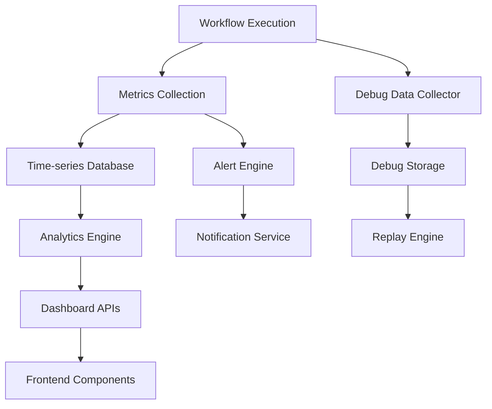

# Research Report: Comprehensive Monitoring and Analytics for Sim Workflows

**Task ID:** task_1756933806808_vm2axlydb  
**Research Date:** 2025-09-03  
**Implementation Target:** task_1756933806807_i5ridsdiq

## Executive Summary

This research analyzes the current state of workflow monitoring in Sim and provides a comprehensive implementation plan for enhancing monitoring, analytics, alerting, and debugging capabilities. The investigation reveals a solid foundation with existing logging infrastructure that can be significantly enhanced to provide enterprise-grade observability.

## Current State Analysis

### Existing Infrastructure Strengths

1. **Comprehensive Logging System**
   - `WorkflowExecutionLogs` table with execution tracking
   - `LoggingSession` class for execution lifecycle management
   - Trace spans with detailed block execution data
   - Cost tracking and billing integration
   - File handling and metadata storage

2. **Database Schema**
   - Well-indexed execution logs table
   - Snapshot system for workflow state management
   - User statistics tracking
   - Telemetry infrastructure already in place

3. **API Infrastructure**
   - Existing `/api/logs` endpoint with filtering capabilities
   - `/api/telemetry` for collecting metrics
   - `/api/workflows/[id]/stats` for basic run counting
   - Permission-based access control

4. **Execution Tracking**
   - Real-time execution state management via `ExecutionStore`
   - Block-level execution monitoring
   - Error handling and trace collection
   - Performance timing data

### Current Limitations

1. **Limited Real-time Monitoring**
   - No live dashboard for ongoing executions
   - No real-time alerting system
   - Missing performance trend analysis

2. **Basic Analytics**
   - No aggregate performance metrics
   - Limited business intelligence capabilities
   - No resource utilization monitoring

3. **Alert System Gaps**
   - No configurable alert rules
   - No notification channels beyond basic logging
   - No escalation policies

4. **Debugging Tools**
   - Limited execution replay capabilities
   - No variable state inspection tools
   - Basic error categorization

## Implementation Strategy

### Phase 1: Enhanced Monitoring Infrastructure (Foundation)

**Components to Build:**
1. **Real-time Monitoring Service** 
   - WebSocket-based live execution tracking
   - Performance metrics collection
   - Resource usage monitoring

2. **Enhanced Database Schema**
   ```sql
   -- New monitoring tables
   CREATE TABLE workflow_metrics (
     id uuid PRIMARY KEY,
     workflow_id text NOT NULL,
     metric_type text NOT NULL, -- 'performance', 'usage', 'error_rate'
     metric_value jsonb NOT NULL,
     timestamp timestamp NOT NULL,
     aggregation_period text -- '1min', '5min', '1hour', '1day'
   );

   CREATE TABLE alert_rules (
     id uuid PRIMARY KEY,
     workspace_id text NOT NULL,
     name text NOT NULL,
     conditions jsonb NOT NULL,
     notification_channels jsonb NOT NULL,
     enabled boolean DEFAULT true,
     created_at timestamp DEFAULT now()
   );

   CREATE TABLE alert_incidents (
     id uuid PRIMARY KEY,
     alert_rule_id uuid REFERENCES alert_rules(id),
     workflow_id text,
     status text, -- 'open', 'resolved', 'acknowledged'
     triggered_at timestamp NOT NULL,
     resolved_at timestamp,
     severity text NOT NULL
   );
   ```

3. **Metrics Collection Pipeline**
   - Background job for metrics aggregation
   - Time-series data processing
   - Anomaly detection algorithms

### Phase 2: Analytics and Reporting Engine

**Components to Build:**
1. **Analytics API Endpoints**
   - `/api/analytics/performance` - Performance trends
   - `/api/analytics/usage` - Resource utilization
   - `/api/analytics/errors` - Error analysis
   - `/api/analytics/business` - Business metrics

2. **Report Generation Service**
   - Scheduled report generation
   - Custom report builder
   - Export capabilities (PDF, CSV, JSON)

3. **Dashboard Components**
   - Real-time execution monitoring
   - Performance trend visualization
   - Resource usage charts
   - Error rate monitoring

### Phase 3: Advanced Alerting System

**Components to Build:**
1. **Alert Engine**
   - Rule evaluation engine
   - Threshold monitoring
   - Pattern recognition
   - Escalation logic

2. **Notification Channels**
   - Email notifications
   - Slack integration
   - Webhook endpoints
   - SMS alerts (via Twilio)

3. **Alert Management Interface**
   - Rule configuration UI
   - Incident management
   - Alert history and analytics

### Phase 4: Enhanced Debugging Tools

**Components to Build:**
1. **Execution Replay System**
   - State snapshot management
   - Step-by-step execution replay
   - Variable inspection tools
   - Breakpoint functionality

2. **Advanced Error Analysis**
   - Error categorization and tagging
   - Root cause analysis tools
   - Error pattern recognition
   - Performance bottleneck identification

3. **Debugging Dashboard**
   - Interactive execution timeline
   - Variable state inspector
   - Error drill-down interface
   - Performance profiling tools

## Technical Architecture

### Data Flow Architecture



### Key Components

1. **MonitoringService** - Core monitoring orchestrator
2. **MetricsCollector** - Real-time metrics gathering
3. **AlertEngine** - Rule evaluation and incident management
4. **AnalyticsProcessor** - Data aggregation and analysis
5. **DebugManager** - Debugging tools coordinator

## Technology Stack Recommendations

### Backend Services
- **Database**: PostgreSQL with TimescaleDB for time-series data
- **Real-time**: WebSocket connections via Socket.io
- **Queue System**: Existing Trigger.dev for background processing
- **Caching**: Redis for real-time metrics and alerts

### Frontend Components
- **Visualization**: Chart.js/D3.js for interactive charts
- **Real-time Updates**: WebSocket integration
- **State Management**: Zustand stores for monitoring data
- **UI Components**: Existing shadcn/ui component system

### Monitoring Tools Integration
- **Telemetry**: Enhanced OpenTelemetry integration
- **Logging**: Structured logging with correlation IDs
- **Metrics**: Custom metrics collection pipeline

## Implementation Priority

### High Priority (Phase 1)
1. Real-time execution monitoring dashboard
2. Basic performance metrics collection  
3. Simple alerting for critical failures
4. Enhanced error tracking

### Medium Priority (Phase 2)
1. Advanced analytics and reporting
2. Custom alert rules configuration
3. Performance trend analysis
4. Resource usage monitoring

### Lower Priority (Phase 3-4)
1. Advanced debugging tools
2. Execution replay capabilities
3. Business intelligence dashboards
4. Advanced anomaly detection

## Risk Assessment and Mitigation

### Technical Risks
1. **Performance Impact**: Metrics collection could slow execution
   - *Mitigation*: Asynchronous collection, sampling strategies
2. **Storage Costs**: Time-series data can grow rapidly
   - *Mitigation*: Data retention policies, aggregation strategies
3. **Complexity**: Advanced features may increase system complexity
   - *Mitigation*: Phased implementation, comprehensive testing

### Business Risks
1. **Feature Scope Creep**: Monitoring can become overly complex
   - *Mitigation*: Clear requirements and MVP approach
2. **User Experience**: Too many alerts can cause fatigue
   - *Mitigation*: Smart alert grouping and filtering
3. **Resource Allocation**: Significant development investment
   - *Mitigation*: Incremental delivery with immediate value

## Success Metrics

### Technical KPIs
- Execution monitoring latency < 100ms
- Alert false positive rate < 5%
- Dashboard load time < 2 seconds
- 99.9% monitoring system uptime

### Business KPIs  
- 25% reduction in workflow debugging time
- 50% faster incident response
- 90% workflow reliability visibility
- Improved user satisfaction scores

## Next Steps

1. **Immediate Actions**
   - Create monitoring database schema
   - Implement basic real-time execution tracking
   - Build foundational monitoring service

2. **Short-term Deliverables (2-3 weeks)**
   - Live execution dashboard
   - Basic performance metrics
   - Email alerting system

3. **Medium-term Goals (1-2 months)**
   - Advanced analytics capabilities
   - Custom alert configuration
   - Enhanced debugging tools

## Conclusion

The Sim platform has a solid foundation for implementing comprehensive monitoring and analytics. The existing logging infrastructure, database schema, and API design provide excellent building blocks. The proposed phased approach will deliver immediate value while building toward advanced enterprise-grade observability capabilities.

The implementation should focus on real-time monitoring first, followed by analytics and alerting, with debugging tools as the final phase. This approach ensures rapid user value delivery while maintaining system stability and performance.