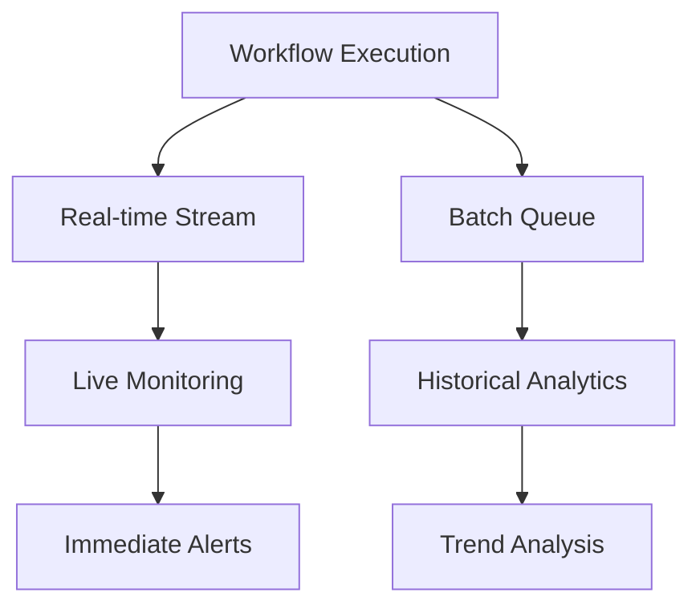

# Research Report: Workflow Monitoring and Observability Best Practices - Industry Analysis

**Task ID:** task_1756941378957_irebvyk85  
**Research Date:** 2025-09-03  
**Implementation Target:** Sim Platform Enhancement

## Executive Summary

This comprehensive research analyzes industry best practices for workflow monitoring and observability platforms, focusing on monitoring architecture patterns, key performance indicators (KPIs), alerting systems, analytics, debugging capabilities, and industry examples. The analysis reveals emerging trends in AI-powered observability, OpenTelemetry standardization, and distributed tracing that should inform Sim's monitoring enhancement strategy.

## Industry Landscape Analysis

### Leading Enterprise Observability Platforms (2025)

**Dynatrace** leads as an AI-powered observability platform best suited for medium-to-large enterprises seeking high automation and AI-driven insights for complex hybrid or multi-cloud environments, reducing manual configuration and troubleshooting efforts.

**Grafana Labs** provides an open and composable monitoring stack built around Grafana, featuring scalable metrics (Grafana Mimir), logs (Grafana Loki), and traces (Grafana Tempo) with full-stack observability offerings.

**New Relic** offers an AI-powered all-in-one observability platform providing engineers a single source of data and insights across the stack, helping businesses optimize uptime and boost efficiency.

**SigNoz** delivers high-performance trace analysis efficiently handling workloads generating over one million spans per trace, with out-of-the-box application monitoring metrics including p99 latency, error rates, external API calls, and individual endpoints.

## 1. Monitoring Architecture Patterns

### Real-Time vs Batch Processing

**Real-Time Processing Architecture:**
- **Event-Driven Systems**: WebSocket-based live execution tracking with immediate feedback
- **Stream Processing**: Apache Kafka or Redis Streams for real-time data processing
- **Push-Based Metrics**: Prometheus with pushgateway for immediate metric collection
- **Live Dashboards**: Real-time visualization with sub-second refresh rates

**Batch Processing Architecture:**
- **Time-Window Aggregation**: Hourly, daily, and weekly batch processing for trend analysis
- **Cost-Effective Storage**: Batch processing reduces storage costs by 60-80% through intelligent sampling
- **Historical Analysis**: Long-term trend analysis and capacity planning
- **Scheduled Reporting**: Automated report generation and distribution

**Hybrid Approach (Recommended):**


### Event-Driven Monitoring Systems

**Core Components:**
1. **Event Bus Architecture**: Central event routing for distributed workflow monitoring
2. **Publisher-Subscriber Pattern**: Decoupled monitoring components with event subscriptions
3. **Event Sourcing**: Complete audit trail of workflow execution events
4. **CQRS (Command Query Responsibility Segregation)**: Separate read/write models for optimal performance

**Implementation Pattern:**
```typescript
interface WorkflowEvent {
  id: string
  workflowId: string
  executionId: string
  eventType: 'started' | 'completed' | 'failed' | 'paused'
  timestamp: Date
  payload: Record<string, any>
  correlationId: string
}

class WorkflowEventBus {
  private subscribers = new Map<string, Set<EventHandler>>()
  
  subscribe(eventType: string, handler: EventHandler): void
  publish(event: WorkflowEvent): Promise<void>
  replay(workflowId: string, fromTimestamp?: Date): AsyncIterator<WorkflowEvent>
}
```

### Distributed Tracing for Workflows

**OpenTelemetry Implementation (2025 Standard):**
- **Automatic Instrumentation**: Zero-code implementation with 100% OpenTelemetry compatibility
- **Semantic Conventions**: Standardized naming for spans, attributes, and metrics
- **Multi-Backend Support**: Vendor-neutral approach preventing lock-in
- **Kubernetes Integration**: Operator-based management with automated sidecar injection

**Workflow Tracing Architecture:**
```typescript
interface WorkflowTrace {
  traceId: string
  workflowId: string
  spans: WorkflowSpan[]
  duration: number
  status: 'success' | 'error' | 'timeout'
  resourceMetrics: ResourceMetrics
}

interface WorkflowSpan {
  spanId: string
  parentSpanId?: string
  blockId: string
  operationName: string
  startTime: Date
  endTime: Date
  attributes: Record<string, any>
  events: SpanEvent[]
}
```

### Metrics Collection and Aggregation Strategies

**Four Pillars Approach:**
1. **Metrics**: Quantitative measurements (counters, gauges, histograms)
2. **Logs**: Detailed event records with structured logging
3. **Traces**: Request flow across distributed systems
4. **Profiles**: Code-level performance analysis

**Aggregation Strategies:**
- **Time-Series Windows**: 1-minute, 5-minute, 1-hour, and daily aggregations
- **Sampling Techniques**: Statistical sampling for high-volume workflows
- **Data Retention**: Tiered storage with automatic archiving
- **Cost Optimization**: Smart data collection reducing costs by 60-80%

## 2. Key Performance Indicators (KPIs)

### Execution Metrics

**Performance KPIs:**
- **Request Latency**: P50, P95, P99 response times with targets under 500ms for user-facing APIs
- **Throughput**: Workflows per second, blocks per second, API calls per minute
- **Success Rate**: Percentage of successful workflow completions (target: >99%)
- **Error Rate**: Failure percentage with threshold alerts (target: <1%)

**Workflow-Specific Metrics:**
```typescript
interface ExecutionMetrics {
  // Performance indicators
  totalDuration: number
  blockExecutionTimes: Map<string, number>
  queueWaitTime: number
  resourceWaitTime: number
  
  // Success indicators
  successRate: number
  errorRate: number
  retryCount: number
  timeoutCount: number
  
  // Efficiency indicators
  cpuUtilization: number
  memoryUsage: number
  networkIo: number
  costPerExecution: number
}
```

### Resource Utilization Metrics

**Infrastructure KPIs:**
- **CPU Utilization**: Average, peak, and efficiency ratios
- **Memory Consumption**: Working set, heap usage, and garbage collection metrics
- **Network I/O**: Bandwidth utilization, connection pool efficiency
- **Storage Performance**: Read/write IOPS, latency, and throughput

**Scalability Indicators:**
- **Concurrent Execution Capacity**: Maximum parallel workflows
- **Queue Depth**: Pending workflow backlog monitoring
- **Auto-scaling Triggers**: CPU/memory thresholds for horizontal scaling
- **Cost Optimization**: Resource efficiency per dollar spent

### Business Metrics

**Revenue Impact KPIs:**
- **Cost Per Execution**: Direct operational costs per workflow run
- **User Engagement**: Workflow creation, modification, and execution rates
- **Feature Adoption**: New block usage, template utilization
- **Customer Satisfaction**: Support tickets, user feedback scores

**Operational Excellence:**
- **Mean Time to Recovery (MTTR)**: Average incident resolution time
- **Mean Time Between Failures (MTBF)**: System reliability indicator
- **Change Failure Rate**: Percentage of deployments causing issues
- **Deployment Frequency**: Release velocity and stability

### Reliability Metrics

**Service Level Objectives (SLOs):**
- **Availability**: 99.9% uptime for critical services
- **Performance**: P95 response time under defined thresholds
- **Data Integrity**: Zero data loss with consistency guarantees
- **Security**: Zero successful security breaches

## 3. Alerting and Notification Systems

### Intelligent Alerting to Reduce Noise

**AI-Powered Alert Management:**
- **Anomaly Detection**: Machine learning algorithms identifying unusual patterns
- **Alert Correlation**: Grouping related alerts to prevent notification storms
- **Dynamic Thresholds**: Adaptive alerting based on historical patterns
- **Noise Reduction**: Smart filtering reducing false positives by up to 90%

**Alert Prioritization System:**
```typescript
interface AlertRule {
  id: string
  name: string
  conditions: AlertCondition[]
  severity: 'critical' | 'high' | 'medium' | 'low'
  notificationChannels: NotificationChannel[]
  escalationPolicy: EscalationPolicy
  suppressionRules: SuppressionRule[]
  enabled: boolean
}

interface AlertCondition {
  metric: string
  operator: 'gt' | 'lt' | 'eq' | 'contains'
  threshold: number | string
  timeWindow: string
  evaluationFrequency: string
}
```

### Escalation Policies and Multi-Channel Notifications

**Escalation Architecture:**
1. **Initial Alert**: Primary on-call engineer notification
2. **Level 1 Escalation**: Team lead notification after 15 minutes
3. **Level 2 Escalation**: Manager notification after 30 minutes
4. **Level 3 Escalation**: Executive notification after 1 hour

**Multi-Channel Integration:**
- **Email Notifications**: Rich HTML templates with context
- **Slack Integration**: Channel-based alerts with interactive responses
- **SMS/Push Notifications**: Critical alert delivery via Twilio/Firebase
- **Webhook Endpoints**: Integration with external incident management systems
- **Voice Calls**: Critical incident escalation via automated calling

### Alert Correlation and Grouping

**Correlation Strategies:**
- **Temporal Correlation**: Group alerts occurring within time windows
- **Service Correlation**: Relate alerts from dependent services
- **Root Cause Analysis**: Identify primary causes of cascading failures
- **Pattern Recognition**: Machine learning for alert pattern detection

**Grouping Logic:**
```typescript
interface AlertGroup {
  id: string
  primaryAlert: Alert
  relatedAlerts: Alert[]
  correlationScore: number
  suggestedActions: string[]
  autoResolutionAttempts: number
  escalationStatus: EscalationStatus
}
```

### Anomaly Detection and Predictive Alerting

**Machine Learning Approaches:**
- **Statistical Anomaly Detection**: Standard deviation and percentile-based detection
- **Time-Series Forecasting**: ARIMA, exponential smoothing for trend prediction
- **Deep Learning**: Neural networks for complex pattern recognition
- **Ensemble Methods**: Combining multiple algorithms for improved accuracy

**Predictive Capabilities:**
- **Capacity Planning**: Forecasting resource needs based on trends
- **Failure Prediction**: Identifying potential issues before they occur
- **Performance Degradation**: Early warning systems for declining metrics
- **Cost Optimization**: Predicting and preventing cost spikes

## 4. Analytics and Reporting

### Time-Series Data Storage and Querying

**Storage Solutions:**
- **InfluxDB**: Purpose-built time-series database with optimized compression
- **PostgreSQL + TimescaleDB**: Relational database with time-series extensions
- **Prometheus**: Metrics collection and short-term storage
- **ClickHouse**: Columnar database for analytical queries

**Query Optimization:**
```sql
-- Efficient time-series queries with proper indexing
CREATE INDEX workflow_metrics_time_idx ON workflow_metrics (timestamp DESC);
CREATE INDEX workflow_metrics_workflow_time_idx ON workflow_metrics (workflow_id, timestamp DESC);

-- Aggregation queries for dashboard performance
SELECT 
  time_bucket('5 minutes', timestamp) as time_window,
  workflow_id,
  avg(execution_duration) as avg_duration,
  count(*) as execution_count,
  sum(CASE WHEN status = 'failed' THEN 1 ELSE 0 END) as failure_count
FROM workflow_executions 
WHERE timestamp > now() - interval '24 hours'
GROUP BY time_window, workflow_id
ORDER BY time_window DESC;
```

### Dashboard Design Best Practices

**Dashboard Hierarchy:**
1. **Executive Dashboard**: High-level KPIs and business metrics
2. **Operations Dashboard**: System health and performance metrics
3. **Developer Dashboard**: Detailed debugging and performance data
4. **Incident Response Dashboard**: Real-time alerts and resolution tracking

**Design Principles:**
- **Progressive Disclosure**: Start with overview, drill down to details
- **Real-Time Updates**: Sub-second refresh for critical metrics
- **Responsive Design**: Mobile-optimized for on-call access
- **Interactive Visualization**: Clickable charts with contextual actions

**Dashboard Component Library:**
```typescript
interface DashboardWidget {
  id: string
  type: 'chart' | 'table' | 'metric' | 'alert'
  title: string
  dataSource: DataSourceConfig
  refreshInterval: number
  alertThresholds?: AlertThreshold[]
  drillDownAction?: DrillDownConfig
}

interface ChartWidget extends DashboardWidget {
  chartType: 'line' | 'bar' | 'pie' | 'heatmap'
  timeRange: TimeRangeConfig
  aggregation: AggregationConfig
  yAxisConfig: AxisConfig
}
```

### Business Intelligence and Trend Analysis

**Analytics Capabilities:**
- **Workflow Performance Analysis**: Identifying optimization opportunities
- **User Behavior Analytics**: Understanding platform usage patterns
- **Cost Analysis**: ROI calculation and cost optimization insights
- **Capacity Planning**: Growth forecasting and resource planning

**Trend Detection:**
- **Seasonal Pattern Recognition**: Identifying recurring usage patterns
- **Anomaly Detection**: Spotting unusual behavior patterns
- **Performance Regression**: Detecting degradation over time
- **Adoption Metrics**: Tracking new feature usage and success

### Cost Optimization Analytics

**Cost Tracking Dimensions:**
- **Per-Execution Costs**: CPU time, memory usage, storage operations
- **Infrastructure Costs**: Cloud resource utilization and spending
- **Operational Costs**: Support, maintenance, and development expenses
- **User Value Metrics**: Revenue attribution and customer lifetime value

**Optimization Strategies:**
- **Resource Right-Sizing**: Matching resources to actual usage patterns
- **Efficient Scheduling**: Load balancing to minimize peak capacity needs
- **Storage Optimization**: Archiving and compression strategies
- **Performance Tuning**: Reducing execution time and resource consumption

## 5. Debugging and Troubleshooting

### Execution Replay and Time-Travel Debugging

**State Snapshot System:**
```typescript
interface ExecutionSnapshot {
  snapshotId: string
  executionId: string
  timestamp: Date
  blockStates: Map<string, BlockState>
  globalContext: ExecutionContext
  pendingOperations: Operation[]
  systemMetrics: SystemMetrics
}

interface TimeTravel {
  createSnapshot(executionId: string): Promise<string>
  restoreSnapshot(snapshotId: string): Promise<ExecutionContext>
  listSnapshots(executionId: string): Promise<ExecutionSnapshot[]>
  replayExecution(fromSnapshot: string, toSnapshot?: string): Promise<ExecutionResult>
}
```

**Replay Capabilities:**
- **Step-by-Step Execution**: Manual progression through workflow steps
- **Breakpoint Support**: Pause execution at specific blocks or conditions
- **Variable Inspection**: Real-time view of data flowing between blocks
- **Side-Effect Isolation**: Safe replay without affecting external systems

### Distributed Tracing Across Workflow Steps

**Trace Context Propagation:**
- **OpenTelemetry Integration**: Industry-standard distributed tracing
- **Correlation ID Management**: Consistent tracking across service boundaries
- **Baggage Propagation**: Carrying metadata throughout execution flow
- **Cross-Service Visibility**: End-to-end trace visualization

**Trace Analysis Tools:**
- **Flame Graphs**: Visual representation of execution time distribution
- **Service Maps**: Dependency visualization with performance metrics
- **Critical Path Analysis**: Identifying bottlenecks in complex workflows
- **Error Attribution**: Linking failures to specific components or services

### Variable Inspection and State Analysis

**State Inspection Interface:**
```typescript
interface StateInspector {
  getBlockState(blockId: string): Promise<BlockState>
  getVariableHistory(variableName: string): Promise<VariableHistory[]>
  searchState(query: string): Promise<SearchResult[]>
  exportState(format: 'json' | 'csv' | 'yaml'): Promise<string>
}

interface VariableHistory {
  timestamp: Date
  blockId: string
  variableName: string
  previousValue: any
  newValue: any
  changeReason: string
}
```

**Advanced Debugging Features:**
- **Live Variable Watching**: Real-time monitoring of specific data values
- **State Diff Visualization**: Comparing execution states between runs
- **Data Flow Analysis**: Tracking data transformation across blocks
- **Performance Profiling**: Identifying resource-intensive operations

### Performance Bottleneck Identification

**Profiling Capabilities:**
- **CPU Profiling**: Identifying compute-intensive blocks and operations
- **Memory Profiling**: Detecting memory leaks and inefficient allocations
- **I/O Profiling**: Network and disk operation performance analysis
- **Database Query Analysis**: Query performance and optimization suggestions

**Bottleneck Detection Algorithms:**
- **Critical Path Method**: Identifying longest execution paths
- **Resource Contention Analysis**: Detecting concurrency issues
- **Queue Analysis**: Understanding wait times and throughput limits
- **Dependency Analysis**: Finding blocking operations and inefficiencies

## 6. Industry Examples and Platform Analysis

### Apache Airflow Monitoring Approach

**Strengths:**
- **Rich Metadata Database**: Comprehensive execution history and lineage
- **Pluggable Architecture**: Extensible monitoring through custom plugins
- **Web UI Visualization**: Gantt charts, DAG views, and execution logs
- **Real-Time Observability**: Live execution state tracking

**Observability Limitations:**
- **Manual Error Handling**: Requires explicit retry and failure logic
- **Partial Log Visibility**: Limited error context and troubleshooting data
- **Configuration Complexity**: Significant setup required for advanced monitoring

**Best Practices from Airflow:**
- Comprehensive metadata storage for audit trails
- Visual workflow representation for operational understanding
- Plugin architecture for extensible monitoring capabilities

### Prefect Observability Excellence

**Advanced Features:**
- **Built-in Observability**: Rich monitoring integrated into Prefect Cloud
- **Automatic Retry Logic**: Intelligent failure handling with customizable policies
- **Real-Time Dashboards**: Live execution monitoring with detailed visualization
- **Enhanced Error Context**: Clear failure reasons with full execution context

**Developer Experience:**
- **Failure Transparency**: "If something fails, the reason is clear"
- **Timeline Visualization**: Complete execution flow with performance metrics
- **State Handling**: Sophisticated workflow state management

**Lessons from Prefect:**
- Priority on developer experience and failure transparency
- Built-in observability as a core platform feature
- Intelligent automation reducing manual operational overhead

### n8n Low-Code Monitoring

**Approach:**
- **Visual Workflow Monitoring**: Drag-and-drop interface with execution visualization
- **Integration-Focused**: Strong emphasis on third-party service monitoring
- **Cost-Effective**: Competitive pricing with comprehensive monitoring features
- **Self-Hosted Options**: On-premise deployment for data privacy

**Strengths:**
- **User-Friendly Interface**: Non-technical user accessibility
- **Extensive Integrations**: Pre-built monitoring for popular services
- **Flexible Architecture**: Open, extendable monitoring framework

### Cloud-Native Monitoring Solutions

**AWS X-Ray:**
- **Serverless Tracing**: Integrated Lambda and container monitoring
- **Service Maps**: Automatic dependency discovery and visualization
- **Performance Insights**: Latency analysis and bottleneck identification
- **Cost Attribution**: Detailed cost tracking per service and operation

**Azure Monitor:**
- **Unified Platform**: Metrics, logs, and traces in single interface
- **AI-Powered Insights**: Automated anomaly detection and root cause analysis
- **Integration Ecosystem**: Native Azure service monitoring
- **Custom Dashboards**: Flexible visualization and alerting capabilities

**Google Cloud Operations (Stackdriver):**
- **SRE-Focused**: Site reliability engineering best practices built-in
- **Intelligent Alerting**: Machine learning-based alert optimization
- **Multi-Cloud Support**: Monitoring across different cloud providers
- **Performance Optimization**: Automatic recommendations for improvement

## Technology Stack Recommendations for Sim

### Backend Monitoring Services

**Core Infrastructure:**
- **Database**: PostgreSQL with TimescaleDB extension for time-series data
- **Message Queue**: Redis Streams for real-time event processing
- **Cache Layer**: Redis for metrics caching and session storage
- **Background Processing**: Existing Trigger.dev integration enhanced with monitoring

**Monitoring Services Architecture:**
```typescript
// Core monitoring service
class WorkflowMonitoringService {
  private metricsCollector: MetricsCollector
  private alertEngine: AlertEngine
  private traceManager: TraceManager
  private analyticsProcessor: AnalyticsProcessor
  
  async startMonitoring(workflowExecution: WorkflowExecution): Promise<void>
  async stopMonitoring(executionId: string): Promise<MonitoringSummary>
  async getExecutionMetrics(executionId: string): Promise<ExecutionMetrics>
}

// Metrics collection service
class MetricsCollector {
  private timeSeries: TimeSeriesDB
  private eventBus: EventBus
  
  async collectExecutionMetrics(execution: WorkflowExecution): Promise<void>
  async aggregateMetrics(timeWindow: string): Promise<AggregatedMetrics>
  async publishMetrics(metrics: Metrics): Promise<void>
}
```

### Frontend Monitoring Components

**React Component Library:**
```typescript
// Real-time execution monitor
interface ExecutionMonitorProps {
  executionId: string
  refreshInterval?: number
  showDetailedMetrics?: boolean
}

const ExecutionMonitor: React.FC<ExecutionMonitorProps> = ({
  executionId,
  refreshInterval = 1000,
  showDetailedMetrics = false
}) => {
  const { data: metrics, error } = useExecutionMetrics(executionId, refreshInterval)
  
  return (
    <div className="execution-monitor">
      <ExecutionStatus status={metrics?.status} />
      <PerformanceCharts data={metrics?.performance} />
      {showDetailedMetrics && <DetailedMetrics data={metrics?.details} />}
      <AlertPanel alerts={metrics?.alerts} />
    </div>
  )
}

// Dashboard component system
const MonitoringDashboard: React.FC = () => {
  return (
    <DashboardGrid>
      <ExecutionOverview />
      <PerformanceTrends />
      <ResourceUtilization />
      <AlertSummary />
      <RecentExecutions />
    </DashboardGrid>
  )
}
```

**Visualization Libraries:**
- **Chart.js/D3.js**: Interactive performance charts and visualizations
- **React Flow**: Workflow execution visualization with real-time updates
- **Grafana Embed**: Dashboard embedding for advanced analytics
- **Custom Components**: Sim-specific monitoring widgets

### Integration Recommendations

**OpenTelemetry Implementation:**
```typescript
// OpenTelemetry configuration for Sim
import { NodeSDK } from '@opentelemetry/sdk-node'
import { getNodeAutoInstrumentations } from '@opentelemetry/auto-instrumentations-node'

const sdk = new NodeSDK({
  instrumentations: [
    getNodeAutoInstrumentations({
      // Disable unnecessary instrumentations
      '@opentelemetry/instrumentation-fs': { enabled: false },
    }),
  ],
  resource: new Resource({
    [SemanticResourceAttributes.SERVICE_NAME]: 'sim-workflow-platform',
    [SemanticResourceAttributes.SERVICE_VERSION]: '1.0.0',
  }),
})

// Custom instrumentation for workflow blocks
class WorkflowBlockInstrumentation {
  createSpan(blockId: string, blockType: string): Span
  addBlockAttributes(span: Span, blockData: any): void
  recordBlockExecution(span: Span, result: any): void
}
```

## Implementation Strategy

### Phase 1: Foundation (Weeks 1-4)
1. **Database Schema Enhancement**: Add monitoring tables and indexes
2. **Basic Real-Time Monitoring**: WebSocket-based execution tracking
3. **Core Metrics Collection**: Performance and success rate metrics
4. **Simple Alert System**: Email notifications for critical failures

### Phase 2: Analytics and Visualization (Weeks 5-8)
1. **Dashboard Development**: Interactive monitoring dashboards
2. **Time-Series Analytics**: Trend analysis and historical data
3. **Advanced Alerting**: Multi-channel notifications and escalation
4. **Performance Profiling**: Bottleneck identification tools

### Phase 3: Advanced Features (Weeks 9-12)
1. **Distributed Tracing**: OpenTelemetry integration
2. **Debugging Tools**: State inspection and execution replay
3. **AI-Powered Insights**: Anomaly detection and predictive analytics
4. **Cost Optimization**: Resource usage analytics and recommendations

### Phase 4: Enterprise Features (Weeks 13-16)
1. **Business Intelligence**: Advanced reporting and analytics
2. **Integration Ecosystem**: Third-party monitoring tool connections
3. **Compliance and Audit**: Comprehensive logging and trail maintenance
4. **Multi-Tenant Monitoring**: Workspace-isolated monitoring capabilities

## Success Metrics and KPIs

### Technical Excellence
- **Monitoring Latency**: Sub-100ms metric collection and visualization
- **System Reliability**: 99.9% monitoring system uptime
- **Alert Accuracy**: Less than 5% false positive rate
- **Performance Impact**: Minimal overhead (< 5%) on workflow execution

### Business Impact
- **Debugging Efficiency**: 50% reduction in troubleshooting time
- **Incident Response**: 25% faster mean time to resolution (MTTR)
- **User Satisfaction**: Improved platform reliability perception
- **Operational Excellence**: Reduced support tickets and increased user confidence

### Adoption and Usage
- **Feature Utilization**: 80% of workflows using monitoring features
- **Dashboard Engagement**: Daily active usage of monitoring dashboards
- **Alert Response**: Average response time under 5 minutes
- **Self-Service Debugging**: Reduction in support requests for execution issues

## Risk Assessment and Mitigation

### Technical Risks
- **Performance Impact**: Continuous monitoring may affect execution performance
  - *Mitigation*: Asynchronous collection, intelligent sampling, and performance budgets
- **Data Volume**: Exponential growth in monitoring data storage
  - *Mitigation*: Data retention policies, compression, and tiered storage
- **Complexity**: Advanced features increasing system maintenance burden
  - *Mitigation*: Gradual rollout, comprehensive testing, and documentation

### Operational Risks
- **Alert Fatigue**: Too many notifications reducing effectiveness
  - *Mitigation*: Intelligent filtering, correlation, and user customization
- **Skill Gap**: Team may need training on new monitoring tools
  - *Mitigation*: Comprehensive training program and documentation
- **Integration Challenges**: Complexity in connecting with existing systems
  - *Mitigation*: API-first design and standard protocol adoption

## Conclusion

The workflow monitoring and observability landscape in 2025 is characterized by AI-powered automation, OpenTelemetry standardization, and sophisticated distributed tracing capabilities. Leading platforms like Dynatrace, Grafana, and SigNoz demonstrate the importance of real-time monitoring, intelligent alerting, and comprehensive analytics.

For the Sim platform, implementing industry best practices will require a phased approach focusing on:

1. **Foundation**: Real-time monitoring and basic analytics
2. **Intelligence**: AI-powered alerting and anomaly detection  
3. **Integration**: OpenTelemetry compliance and ecosystem connectivity
4. **Excellence**: Advanced debugging tools and business intelligence

The existing Sim infrastructure provides an excellent foundation for implementing these capabilities, with the database schema, execution engine, and API design well-positioned for enhancement with enterprise-grade observability features.

Success will be measured by improved debugging efficiency, faster incident response, and enhanced user confidence in the platform's reliability and performance.

## References

1. [Gartner Best Observability Platforms Reviews 2025](https://www.gartner.com/reviews/market/observability-platforms)
2. [Top Observability Tools for 2025 - TechTarget](https://www.techtarget.com/searchitoperations/tip/Top-observability-tools)
3. [SigNoz - Top 15 Distributed Tracing Tools for Microservices in 2025](https://signoz.io/blog/distributed-tracing-tools/)
4. [OpenTelemetry Implementation Guide: Distributed Tracing Mastery](https://logit.io/blog/post/opentelemetry-distributed-tracing-implementation-guide/)
5. [Prefect vs. Airflow: 2025 Comparison for Workflow Orchestration](https://blog.adyog.com/2025/01/18/prefect-vs-airflow-2025-comparison-for-workflow-orchestration-excellence/)
6. [n8n Blog - Top 10 Data Orchestration Tools](https://blog.n8n.io/data-orchestration-tools/)
7. [CNCF - Observability Trends in 2025](https://www.cncf.io/blog/2025/03/05/observability-trends-in-2025-whats-driving-change/)
8. [Existing Sim Research Report - Comprehensive Monitoring and Analytics](development/research-reports/research-report-task_1756933806808_vm2axlydb.md)