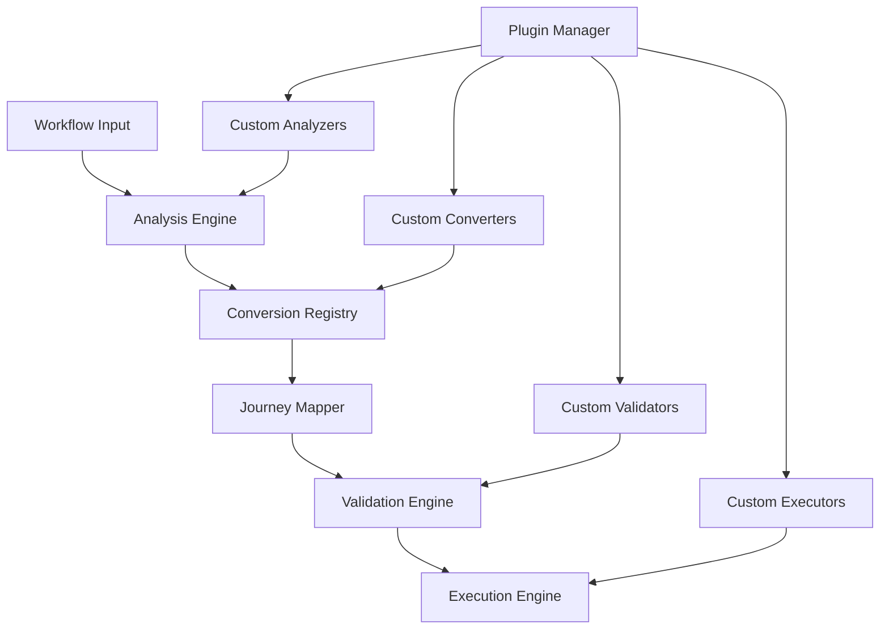

# Workflow to Journey Mapping Developer Resources
## Complete Guide for System Extension and Customization

### Table of Contents
1. [Extension Points](#extension-points)
2. [Custom Tool Adapter Development](#custom-tool-adapter-development)
3. [Journey State Machine Extensions](#journey-state-machine-extensions)
4. [Plugin Architecture](#plugin-architecture)
5. [Custom Conversion Patterns](#custom-conversion-patterns)
6. [Performance Extensions](#performance-extensions)
7. [UI/UX Extension Points](#uiux-extension-points)
8. [Testing and Validation Extensions](#testing-and-validation-extensions)
9. [Deployment and DevOps Resources](#deployment-and-devops-resources)

---

## Extension Points

The Workflow to Journey Mapping system is designed with extensibility as a core principle. Here are the primary extension points available for developers:

### System Architecture Overview



### Core Extension Interfaces

```typescript
// interfaces/extensions.ts
export interface SystemExtension {
  readonly id: string
  readonly name: string
  readonly version: string
  readonly dependencies: string[]

  initialize(context: ExtensionContext): Promise<void>
  shutdown(): Promise<void>
  getMetadata(): ExtensionMetadata
}

export interface ExtensionContext {
  readonly config: SystemConfiguration
  readonly logger: Logger
  readonly eventBus: EventBus
  readonly serviceRegistry: ServiceRegistry
}

export interface ExtensionMetadata {
  author: string
  description: string
  keywords: string[]
  homepage?: string
  repository?: string
  license: string
}
```

### Extension Registration

```typescript
// extension-manager.ts
export class ExtensionManager {
  private extensions = new Map<string, SystemExtension>()
  private registry: ExtensionRegistry

  async registerExtension(extension: SystemExtension): Promise<void> {
    // Validate extension
    await this.validateExtension(extension)

    // Check dependencies
    await this.resolveDependencies(extension.dependencies)

    // Initialize extension
    const context = await this.createExtensionContext(extension)
    await extension.initialize(context)

    // Register in system
    this.extensions.set(extension.id, extension)
    await this.registry.register(extension)

    this.logger.info(`Extension registered: ${extension.id}@${extension.version}`)
  }

  async loadExtensionsFromDirectory(directory: string): Promise<void> {
    const extensionFiles = await glob(`${directory}/**/*.extension.{js,ts}`)

    for (const file of extensionFiles) {
      try {
        const extensionModule = await import(file)
        const extension = extensionModule.default || extensionModule.extension

        if (extension && this.isValidExtension(extension)) {
          await this.registerExtension(extension)
        }
      } catch (error) {
        this.logger.error(`Failed to load extension from ${file}:`, error)
      }
    }
  }

  getExtension<T extends SystemExtension>(id: string): T | null {
    return this.extensions.get(id) as T || null
  }

  getExtensionsByType<T extends SystemExtension>(type: string): T[] {
    return Array.from(this.extensions.values())
      .filter(ext => ext.constructor.name === type) as T[]
  }
}
```

---

## Custom Tool Adapter Development

### Tool Adapter Interface

```typescript
// interfaces/tool-adapter.ts
export interface CustomToolAdapter extends SystemExtension {
  readonly supportedBlocks: string[]
  readonly capabilities: AdapterCapabilities

  canHandle(blockType: string, config: BlockConfig): boolean
  createParlantTool(simBlock: SimBlock, context: ConversionContext): Promise<ParlantTool>
  validateConfiguration(config: any): Promise<ValidationResult>
  estimatePerformance(config: any): Promise<PerformanceEstimate>
}

export interface AdapterCapabilities {
  asyncExecution: boolean
  batchOperations: boolean
  streamingData: boolean
  caching: boolean
  retryLogic: boolean
  authentication: AuthenticationType[]
  rateLimit?: RateLimitConfig
}

export interface ConversionContext {
  workflowId: string
  workspaceId: string
  userId: string
  conversionOptions: ConversionOptions
  existingTools: Map<string, ParlantTool>
}
```

### Creating a Custom Tool Adapter

```typescript
// examples/custom-slack-advanced-adapter.ts
export class AdvancedSlackToolAdapter implements CustomToolAdapter {
  readonly id = 'advanced-slack-adapter'
  readonly name = 'Advanced Slack Integration Adapter'
  readonly version = '1.0.0'
  readonly dependencies = ['slack-api@^2.0.0']
  readonly supportedBlocks = ['slack_message', 'slack_canvas', 'slack_workflow']

  readonly capabilities: AdapterCapabilities = {
    asyncExecution: true,
    batchOperations: true,
    streamingData: false,
    caching: true,
    retryLogic: true,
    authentication: ['oauth2', 'bot_token'],
    rateLimit: {
      requests: 100,
      period: 60000,
      strategy: 'sliding_window'
    }
  }

  async initialize(context: ExtensionContext): Promise<void> {
    this.logger = context.logger.child({ adapter: this.id })
    this.config = context.config.getSection('slack_adapter')
    this.eventBus = context.eventBus

    // Initialize Slack client
    this.slackClient = new SlackClient({
      clientId: this.config.clientId,
      clientSecret: this.config.clientSecret,
      scopes: ['chat:write', 'channels:read', 'users:read']
    })

    // Register event listeners
    this.eventBus.on('workspace.credentials.updated', this.handleCredentialsUpdate.bind(this))

    this.logger.info('Advanced Slack adapter initialized')
  }

  canHandle(blockType: string, config: BlockConfig): boolean {
    return this.supportedBlocks.includes(blockType) &&
           this.validateRequiredFields(config)
  }

  async createParlantTool(
    simBlock: SimBlock,
    context: ConversionContext
  ): Promise<ParlantTool> {
    const toolConfig = await this.mapSimConfigToParlant(simBlock.config)

    return {
      id: `slack_${simBlock.id}`,
      name: this.generateToolName(simBlock),
      description: this.generateToolDescription(simBlock),
      input_schema: this.generateInputSchema(simBlock.config),
      handler: this.createToolHandler(toolConfig, context),
      metadata: {
        originalBlock: simBlock.id,
        adapterVersion: this.version,
        capabilities: this.capabilities,
        estimatedDuration: await this.estimateExecutionTime(simBlock.config)
      }
    }
  }

  private createToolHandler(
    config: SlackToolConfig,
    context: ConversionContext
  ): ToolHandler {
    return async (parameters: any) => {
      const startTime = Date.now()
      const executionId = generateId()

      try {
        // Get workspace credentials
        const credentials = await this.getWorkspaceCredentials(context.workspaceId)
        if (!credentials) {
          throw new Error('Slack credentials not configured for workspace')
        }

        // Initialize client for this execution
        const client = this.slackClient.forWorkspace(credentials)

        // Execute based on block type
        let result
        switch (config.blockType) {
          case 'slack_message':
            result = await this.executeMessageSend(client, parameters, config)
            break
          case 'slack_canvas':
            result = await this.executeCanvasUpdate(client, parameters, config)
            break
          case 'slack_workflow':
            result = await this.executeWorkflowTrigger(client, parameters, config)
            break
          default:
            throw new Error(`Unsupported Slack block type: ${config.blockType}`)
        }

        // Log success metrics
        this.logger.info('Slack tool executed successfully', {
          executionId,
          blockType: config.blockType,
          duration: Date.now() - startTime,
          workspace: context.workspaceId
        })

        return {
          success: true,
          data: result,
          metadata: {
            executionId,
            duration: Date.now() - startTime,
            provider: 'slack'
          }
        }

      } catch (error: any) {
        this.logger.error('Slack tool execution failed', {
          executionId,
          error: error.message,
          duration: Date.now() - startTime,
          workspace: context.workspaceId
        })

        throw new ToolExecutionError(error.message, {
          executionId,
          originalError: error,
          retryable: this.isRetryableError(error)
        })
      }
    }
  }

  private async executeMessageSend(
    client: SlackWorkspaceClient,
    parameters: any,
    config: SlackToolConfig
  ): Promise<SlackMessageResult> {
    // Advanced message handling with rich formatting
    const message = await this.buildMessage(parameters, config)

    // Handle different message types
    if (config.messageType === 'blocks') {
      return await client.chat.postMessage({
        channel: parameters.channel,
        blocks: message.blocks,
        thread_ts: parameters.thread_ts
      })
    } else {
      return await client.chat.postMessage({
        channel: parameters.channel,
        text: message.text,
        attachments: message.attachments,
        thread_ts: parameters.thread_ts
      })
    }
  }

  async validateConfiguration(config: any): Promise<ValidationResult> {
    const errors: string[] = []
    const warnings: string[] = []

    // Required field validation
    if (!config.channel && !config.user) {
      errors.push('Either channel or user must be specified')
    }

    // Channel format validation
    if (config.channel && !this.isValidChannelFormat(config.channel)) {
      errors.push('Invalid channel format. Use #channel-name or C1234567890')
    }

    // Message content validation
    if (!config.message && !config.blocks && !config.attachments) {
      errors.push('Message content is required (text, blocks, or attachments)')
    }

    // Rate limit validation
    if (config.bulkSend && config.recipients?.length > 100) {
      warnings.push('Bulk sending to >100 recipients may trigger rate limits')
    }

    // Advanced features validation
    if (config.useCanvas && !config.canvasId) {
      errors.push('Canvas ID required when using canvas features')
    }

    return {
      valid: errors.length === 0,
      errors,
      warnings,
      suggestions: this.generateConfigSuggestions(config)
    }
  }

  async estimatePerformance(config: any): Promise<PerformanceEstimate> {
    let estimatedMs = 500 // Base Slack API call

    // Factor in message complexity
    if (config.blocks?.length > 10) {
      estimatedMs += 200
    }

    // Factor in attachment uploads
    if (config.attachments?.length > 0) {
      estimatedMs += config.attachments.length * 300
    }

    // Factor in bulk operations
    if (config.bulkSend) {
      estimatedMs += (config.recipients?.length || 1) * 100
    }

    // Factor in canvas operations
    if (config.useCanvas) {
      estimatedMs += 800
    }

    return {
      estimatedDurationMs: estimatedMs,
      variabilityMs: estimatedMs * 0.3,
      factors: [
        'Network latency to Slack API',
        'Message complexity',
        'Channel member count',
        'Workspace rate limits'
      ],
      recommendations: this.generatePerformanceRecommendations(config, estimatedMs)
    }
  }
}

// Register the adapter
export default new AdvancedSlackToolAdapter()
```

### Tool Adapter Registration

```typescript
// adapters/registry.ts
export class ToolAdapterRegistry extends ExtensionManager {
  private adapters = new Map<string, CustomToolAdapter>()

  async registerAdapter(adapter: CustomToolAdapter): Promise<void> {
    // Validate adapter implementation
    this.validateAdapterInterface(adapter)

    // Initialize adapter
    await this.registerExtension(adapter)

    // Register supported block types
    adapter.supportedBlocks.forEach(blockType => {
      this.registerBlockSupport(blockType, adapter)
    })

    this.adapters.set(adapter.id, adapter)
    this.logger.info(`Tool adapter registered: ${adapter.id}`)
  }

  findAdapter(blockType: string, config: BlockConfig): CustomToolAdapter | null {
    for (const adapter of this.adapters.values()) {
      if (adapter.canHandle(blockType, config)) {
        return adapter
      }
    }
    return null
  }

  getAdapterCapabilities(adapterId: string): AdapterCapabilities | null {
    const adapter = this.adapters.get(adapterId)
    return adapter ? adapter.capabilities : null
  }

  async validateAllAdapters(): Promise<AdapterValidationReport> {
    const results = []

    for (const [id, adapter] of this.adapters) {
      try {
        const sampleConfig = this.generateSampleConfig(adapter)
        const validation = await adapter.validateConfiguration(sampleConfig)
        const performance = await adapter.estimatePerformance(sampleConfig)

        results.push({
          adapterId: id,
          valid: validation.valid,
          errors: validation.errors,
          warnings: validation.warnings,
          performance
        })
      } catch (error) {
        results.push({
          adapterId: id,
          valid: false,
          errors: [`Adapter validation failed: ${error.message}`],
          warnings: [],
          performance: null
        })
      }
    }

    return {
      totalAdapters: this.adapters.size,
      validAdapters: results.filter(r => r.valid).length,
      results
    }
  }
}
```

---

## Journey State Machine Extensions

### Custom State Types

```typescript
// interfaces/custom-states.ts
export interface CustomStateType extends SystemExtension {
  readonly stateType: string
  readonly displayName: string
  readonly category: StateCategory

  createState(config: StateConfig): JourneyState
  validateStateConfig(config: StateConfig): ValidationResult
  getTransitionOptions(state: JourneyState): TransitionOption[]
  executeState(state: JourneyState, context: ExecutionContext): Promise<StateExecutionResult>
}

export enum StateCategory {
  INPUT = 'input',
  PROCESSING = 'processing',
  DECISION = 'decision',
  OUTPUT = 'output',
  CONTROL = 'control',
  INTEGRATION = 'integration'
}

export interface StateConfig {
  name: string
  description: string
  timeout?: number
  retryConfig?: RetryConfig
  parameters: Record<string, any>
}
```

### Example: Custom AI Analysis State

```typescript
// states/ai-analysis-state.ts
export class AIAnalysisState implements CustomStateType {
  readonly id = 'ai-analysis-state'
  readonly name = 'AI Analysis State Extension'
  readonly version = '1.0.0'
  readonly dependencies = ['openai@^4.0.0']
  readonly stateType = 'ai_analysis'
  readonly displayName = 'AI Analysis'
  readonly category = StateCategory.PROCESSING

  private aiClient: OpenAIClient
  private logger: Logger

  async initialize(context: ExtensionContext): Promise<void> {
    this.logger = context.logger.child({ state: this.stateType })
    this.aiClient = new OpenAIClient({
      apiKey: context.config.get('openai.apiKey'),
      organization: context.config.get('openai.organization')
    })
  }

  createState(config: StateConfig): JourneyState {
    return {
      id: generateStateId(),
      type: this.stateType,
      name: config.name,
      description: config.description,
      configuration: {
        model: config.parameters.model || 'gpt-4',
        prompt: config.parameters.prompt,
        maxTokens: config.parameters.maxTokens || 1000,
        temperature: config.parameters.temperature || 0.7,
        analysisType: config.parameters.analysisType || 'general',
        outputFormat: config.parameters.outputFormat || 'structured'
      },
      timeoutSeconds: config.timeout || 30,
      retryConfig: config.retryConfig || {
        maxAttempts: 3,
        backoffMs: 1000
      }
    }
  }

  async executeState(
    state: JourneyState,
    context: ExecutionContext
  ): Promise<StateExecutionResult> {
    const startTime = Date.now()
    const config = state.configuration

    try {
      // Prepare analysis prompt
      const prompt = this.buildAnalysisPrompt(config, context)

      // Execute AI analysis
      const response = await this.aiClient.chat.completions.create({
        model: config.model,
        messages: [
          {
            role: 'system',
            content: this.getSystemPrompt(config.analysisType)
          },
          {
            role: 'user',
            content: prompt
          }
        ],
        max_tokens: config.maxTokens,
        temperature: config.temperature
      })

      // Process AI response
      const analysis = this.processAIResponse(
        response.choices[0].message.content,
        config.outputFormat
      )

      // Update execution context with analysis results
      const updatedContext = {
        ...context,
        variables: {
          ...context.variables,
          aiAnalysis: analysis,
          analysisMetadata: {
            model: config.model,
            tokensUsed: response.usage?.total_tokens,
            executionTime: Date.now() - startTime
          }
        }
      }

      this.logger.info('AI analysis completed', {
        stateId: state.id,
        model: config.model,
        tokensUsed: response.usage?.total_tokens,
        duration: Date.now() - startTime
      })

      return {
        success: true,
        nextStates: this.determineNextStates(analysis, state),
        updatedContext,
        output: {
          analysis,
          confidence: this.calculateConfidence(analysis),
          recommendations: this.generateRecommendations(analysis)
        }
      }

    } catch (error: any) {
      this.logger.error('AI analysis failed', {
        stateId: state.id,
        error: error.message,
        duration: Date.now() - startTime
      })

      return {
        success: false,
        error: {
          type: 'AI_ANALYSIS_ERROR',
          message: error.message,
          retryable: this.isRetryableError(error)
        },
        nextStates: state.onError || [],
        updatedContext: context
      }
    }
  }

  validateStateConfig(config: StateConfig): ValidationResult {
    const errors: string[] = []
    const warnings: string[] = []

    // Required parameters
    if (!config.parameters.prompt) {
      errors.push('Analysis prompt is required')
    }

    // Model validation
    const supportedModels = ['gpt-4', 'gpt-4-turbo', 'gpt-3.5-turbo']
    if (config.parameters.model && !supportedModels.includes(config.parameters.model)) {
      warnings.push(`Model ${config.parameters.model} may not be supported`)
    }

    // Token limits
    if (config.parameters.maxTokens > 4000) {
      warnings.push('High token limits may increase cost and latency')
    }

    // Temperature validation
    if (config.parameters.temperature > 2 || config.parameters.temperature < 0) {
      errors.push('Temperature must be between 0 and 2')
    }

    return {
      valid: errors.length === 0,
      errors,
      warnings,
      suggestions: [
        'Use structured output format for better parsing',
        'Consider caching results for similar analyses',
        'Set reasonable token limits to control costs'
      ]
    }
  }

  getTransitionOptions(state: JourneyState): TransitionOption[] {
    return [
      {
        id: 'analysis_complete',
        name: 'Analysis Complete',
        description: 'Continue with successful analysis results',
        condition: 'success',
        automatic: true
      },
      {
        id: 'analysis_failed',
        name: 'Analysis Failed',
        description: 'Handle analysis failure',
        condition: 'error',
        automatic: true
      },
      {
        id: 'analysis_inconclusive',
        name: 'Analysis Inconclusive',
        description: 'Results need human review',
        condition: 'confidence < 0.8',
        automatic: false
      }
    ]
  }

  private buildAnalysisPrompt(config: any, context: ExecutionContext): string {
    let prompt = config.prompt

    // Replace context variables in prompt
    Object.entries(context.variables).forEach(([key, value]) => {
      prompt = prompt.replace(new RegExp(`{{${key}}}`, 'g'), String(value))
    })

    return prompt
  }

  private getSystemPrompt(analysisType: string): string {
    const systemPrompts = {
      general: 'You are an expert analyst. Provide thorough, objective analysis.',
      sentiment: 'You are a sentiment analysis expert. Analyze emotional tone and sentiment.',
      content: 'You are a content analyst. Analyze structure, quality, and effectiveness.',
      risk: 'You are a risk assessment expert. Identify and evaluate potential risks.',
      opportunity: 'You are a business analyst. Identify opportunities and recommendations.'
    }

    return systemPrompts[analysisType] || systemPrompts.general
  }
}

// Register the state type
export default new AIAnalysisState()
```

---

## Plugin Architecture

### Plugin System Design

```typescript
// plugin-system/plugin-manager.ts
export class PluginManager {
  private plugins = new Map<string, Plugin>()
  private hooks = new Map<string, HookHandler[]>()
  private middleware: MiddlewareFunction[] = []

  async loadPlugin(pluginPath: string): Promise<void> {
    try {
      const pluginModule = await import(pluginPath)
      const plugin = pluginModule.default || pluginModule.plugin

      if (!this.isValidPlugin(plugin)) {
        throw new Error(`Invalid plugin structure in ${pluginPath}`)
      }

      // Initialize plugin
      await plugin.initialize(this.createPluginContext(plugin))

      // Register hooks
      if (plugin.hooks) {
        Object.entries(plugin.hooks).forEach(([hookName, handler]) => {
          this.registerHook(hookName, handler as HookHandler)
        })
      }

      // Register middleware
      if (plugin.middleware) {
        plugin.middleware.forEach(mw => this.registerMiddleware(mw))
      }

      this.plugins.set(plugin.id, plugin)
      this.logger.info(`Plugin loaded: ${plugin.id}@${plugin.version}`)

    } catch (error: any) {
      this.logger.error(`Failed to load plugin from ${pluginPath}:`, error)
      throw error
    }
  }

  async executeHook(hookName: string, context: any): Promise<any> {
    const handlers = this.hooks.get(hookName) || []
    let result = context

    for (const handler of handlers) {
      try {
        result = await handler(result) || result
      } catch (error) {
        this.logger.error(`Hook ${hookName} failed:`, error)
        // Continue with other handlers
      }
    }

    return result
  }

  async executeMiddleware(context: any, next: () => Promise<any>): Promise<any> {
    let index = 0

    const dispatch = async (i: number): Promise<any> => {
      if (i <= index) {
        throw new Error('next() called multiple times')
      }
      index = i

      if (i >= this.middleware.length) {
        return next()
      }

      const middleware = this.middleware[i]
      return middleware(context, () => dispatch(i + 1))
    }

    return dispatch(0)
  }

  getPlugin<T extends Plugin>(id: string): T | null {
    return this.plugins.get(id) as T || null
  }

  getPluginsByCategory(category: string): Plugin[] {
    return Array.from(this.plugins.values())
      .filter(plugin => plugin.category === category)
  }
}
```

### Example Plugin: Advanced Analytics

```typescript
// plugins/advanced-analytics-plugin.ts
export class AdvancedAnalyticsPlugin implements Plugin {
  readonly id = 'advanced-analytics'
  readonly name = 'Advanced Analytics Plugin'
  readonly version = '1.0.0'
  readonly category = 'analytics'
  readonly description = 'Provides advanced analytics and insights for workflow-to-journey conversions'

  private analytics: AnalyticsEngine
  private dashboardService: DashboardService

  readonly hooks = {
    'workflow.analyzed': this.onWorkflowAnalyzed.bind(this),
    'journey.created': this.onJourneyCreated.bind(this),
    'journey.executed': this.onJourneyExecuted.bind(this),
    'tool.executed': this.onToolExecuted.bind(this)
  }

  readonly middleware = [
    this.performanceTrackingMiddleware.bind(this),
    this.usageAnalyticsMiddleware.bind(this)
  ]

  async initialize(context: PluginContext): Promise<void> {
    this.logger = context.logger.child({ plugin: this.id })
    this.config = context.config.getSection('analytics')

    // Initialize analytics engine
    this.analytics = new AnalyticsEngine({
      dataStore: this.config.dataStore,
      aggregationInterval: this.config.aggregationInterval || 60000,
      retentionPeriod: this.config.retentionPeriod || '90d'
    })

    // Initialize dashboard service
    this.dashboardService = new DashboardService({
      port: this.config.dashboardPort || 3002,
      analytics: this.analytics
    })

    await this.analytics.initialize()
    await this.dashboardService.start()

    this.logger.info('Advanced analytics plugin initialized')
  }

  private async onWorkflowAnalyzed(context: WorkflowAnalysisContext): Promise<void> {
    // Track workflow analysis metrics
    await this.analytics.recordEvent('workflow_analyzed', {
      workflowId: context.workflowId,
      complexity: context.analysis.complexity,
      blocksCount: context.analysis.blocksCount,
      feasible: context.analysis.feasibility.canConvert,
      analysisDuration: context.duration
    })

    // Generate insights
    const insights = await this.generateWorkflowInsights(context.analysis)
    context.insights = insights
  }

  private async onJourneyCreated(context: JourneyCreationContext): Promise<void> {
    // Track journey creation metrics
    await this.analytics.recordEvent('journey_created', {
      journeyId: context.journeyId,
      sourceWorkflowId: context.sourceWorkflowId,
      statesCount: context.journey.states.length,
      conversionDuration: context.duration,
      conversionSuccess: context.success
    })

    // Analyze journey complexity
    const complexityAnalysis = await this.analyzeJourneyComplexity(context.journey)
    context.complexityAnalysis = complexityAnalysis
  }

  private async onJourneyExecuted(context: JourneyExecutionContext): Promise<void> {
    // Track execution metrics
    await this.analytics.recordEvent('journey_executed', {
      journeyId: context.journeyId,
      executionId: context.executionId,
      duration: context.duration,
      success: context.success,
      statesCompleted: context.statesCompleted,
      errors: context.errors?.length || 0
    })

    // Generate performance insights
    if (context.success) {
      const performanceInsights = await this.analyzeExecutionPerformance(context)
      context.performanceInsights = performanceInsights
    }
  }

  private async onToolExecuted(context: ToolExecutionContext): Promise<void> {
    // Track tool execution metrics
    await this.analytics.recordEvent('tool_executed', {
      toolId: context.toolId,
      journeyId: context.journeyId,
      duration: context.duration,
      success: context.success,
      retryCount: context.retryCount || 0
    })
  }

  private async performanceTrackingMiddleware(
    context: any,
    next: () => Promise<any>
  ): Promise<any> {
    const startTime = Date.now()
    const operation = context.operation || 'unknown'

    try {
      const result = await next()
      const duration = Date.now() - startTime

      await this.analytics.recordPerformanceMetric(operation, {
        duration,
        success: true,
        timestamp: new Date()
      })

      return result

    } catch (error) {
      const duration = Date.now() - startTime

      await this.analytics.recordPerformanceMetric(operation, {
        duration,
        success: false,
        error: error.message,
        timestamp: new Date()
      })

      throw error
    }
  }

  private async usageAnalyticsMiddleware(
    context: any,
    next: () => Promise<any>
  ): Promise<any> {
    // Track API usage
    await this.analytics.recordEvent('api_call', {
      endpoint: context.endpoint,
      method: context.method,
      userId: context.userId,
      workspaceId: context.workspaceId,
      userAgent: context.userAgent
    })

    return next()
  }

  async generateAnalyticsReport(timeRange: TimeRange): Promise<AnalyticsReport> {
    const [
      workflowMetrics,
      journeyMetrics,
      executionMetrics,
      performanceMetrics
    ] = await Promise.all([
      this.analytics.getWorkflowMetrics(timeRange),
      this.analytics.getJourneyMetrics(timeRange),
      this.analytics.getExecutionMetrics(timeRange),
      this.analytics.getPerformanceMetrics(timeRange)
    ])

    return {
      timeRange,
      summary: {
        totalWorkflowsAnalyzed: workflowMetrics.totalAnalyzed,
        totalJourneysCreated: journeyMetrics.totalCreated,
        totalExecutions: executionMetrics.totalExecutions,
        successRate: executionMetrics.successRate,
        avgExecutionTime: performanceMetrics.avgExecutionTime
      },
      trends: {
        workflowComplexity: this.calculateTrend(workflowMetrics.complexityOverTime),
        conversionSuccess: this.calculateTrend(journeyMetrics.successRateOverTime),
        executionPerformance: this.calculateTrend(performanceMetrics.performanceOverTime)
      },
      insights: {
        topPerformingJourneys: await this.identifyTopPerformingJourneys(),
        commonFailurePatterns: await this.identifyFailurePatterns(),
        optimizationOpportunities: await this.identifyOptimizationOpportunities()
      }
    }
  }
}

// Register the plugin
export default new AdvancedAnalyticsPlugin()
```

---

## Custom Conversion Patterns

### Conversion Pattern Interface

```typescript
// interfaces/conversion-patterns.ts
export interface ConversionPattern extends SystemExtension {
  readonly patternName: string
  readonly applicableWorkflowTypes: string[]
  readonly complexity: PatternComplexity

  canApply(workflow: WorkflowDefinition): Promise<boolean>
  convert(workflow: WorkflowDefinition, options: ConversionOptions): Promise<JourneyDefinition>
  optimize(journey: JourneyDefinition): Promise<JourneyDefinition>
  validate(journey: JourneyDefinition): Promise<ValidationResult>
}

export enum PatternComplexity {
  SIMPLE = 'simple',
  MODERATE = 'moderate',
  COMPLEX = 'complex',
  ADVANCED = 'advanced'
}

export interface ConversionOptions {
  optimizationLevel: 'none' | 'basic' | 'aggressive'
  preserveStructure: boolean
  generateComments: boolean
  enableParallel: boolean
  customMappings?: Record<string, any>
}
```

### Example: Event-Driven Workflow Pattern

```typescript
// patterns/event-driven-pattern.ts
export class EventDrivenConversionPattern implements ConversionPattern {
  readonly id = 'event-driven-pattern'
  readonly name = 'Event-Driven Workflow Pattern'
  readonly version = '1.0.0'
  readonly dependencies = ['event-emitter@^3.0.0']
  readonly patternName = 'event_driven'
  readonly applicableWorkflowTypes = ['webhook', 'event_triggered', 'real_time']
  readonly complexity = PatternComplexity.MODERATE

  private eventEmitter: EventEmitter
  private logger: Logger

  async initialize(context: ExtensionContext): Promise<void> {
    this.logger = context.logger.child({ pattern: this.patternName })
    this.eventEmitter = context.serviceRegistry.get('eventEmitter')
  }

  async canApply(workflow: WorkflowDefinition): Promise<boolean> {
    // Check if workflow has event-driven characteristics
    const hasEventTriggers = workflow.blocks.some(block =>
      block.type === 'webhook' || block.type === 'event_listener'
    )

    const hasEventEmitters = workflow.blocks.some(block =>
      block.type === 'webhook_response' || block.type === 'event_emitter'
    )

    const hasAsyncPatterns = workflow.edges.some(edge =>
      edge.type === 'event' || edge.condition?.includes('event')
    )

    return hasEventTriggers || hasEventEmitters || hasAsyncPatterns
  }

  async convert(
    workflow: WorkflowDefinition,
    options: ConversionOptions
  ): Promise<JourneyDefinition> {
    this.logger.info(`Converting event-driven workflow: ${workflow.id}`)

    // Analyze event flow
    const eventFlow = await this.analyzeEventFlow(workflow)

    // Create journey with event-driven states
    const journey: JourneyDefinition = {
      id: generateJourneyId(),
      name: `${workflow.name} (Event-Driven)`,
      description: `Event-driven journey converted from workflow ${workflow.name}`,
      version: '1.0.0',
      states: await this.createEventStates(eventFlow, options),
      transitions: await this.createEventTransitions(eventFlow, options),
      initialState: this.identifyInitialState(eventFlow),
      finalStates: this.identifyFinalStates(eventFlow),
      context: {
        variables: this.extractWorkflowVariables(workflow),
        settings: {
          eventTimeout: 30000,
          maxRetries: 3,
          enableEventReplay: true
        }
      },
      metadata: {
        sourceWorkflow: workflow.id,
        conversionPattern: this.patternName,
        conversionTimestamp: new Date().toISOString(),
        eventTypes: eventFlow.eventTypes
      }
    }

    if (options.optimizationLevel !== 'none') {
      return this.optimize(journey)
    }

    return journey
  }

  private async analyzeEventFlow(workflow: WorkflowDefinition): Promise<EventFlow> {
    const eventSources = []
    const eventTargets = []
    const eventTypes = new Set<string>()

    // Identify event sources and targets
    for (const block of workflow.blocks) {
      if (this.isEventSource(block)) {
        eventSources.push({
          blockId: block.id,
          eventType: this.extractEventType(block),
          configuration: block.config
        })
        eventTypes.add(this.extractEventType(block))
      }

      if (this.isEventTarget(block)) {
        eventTargets.push({
          blockId: block.id,
          eventType: this.extractEventType(block),
          configuration: block.config
        })
      }
    }

    // Analyze event dependencies
    const eventDependencies = this.analyzeEventDependencies(
      workflow.edges,
      eventSources,
      eventTargets
    )

    return {
      eventSources,
      eventTargets,
      eventTypes: Array.from(eventTypes),
      eventDependencies,
      asyncPaths: this.identifyAsyncPaths(workflow.edges)
    }
  }

  private async createEventStates(
    eventFlow: EventFlow,
    options: ConversionOptions
  ): Promise<JourneyState[]> {
    const states: JourneyState[] = []

    // Create event listener states
    for (const source of eventFlow.eventSources) {
      states.push({
        id: `event_listener_${source.blockId}`,
        type: 'event_listener',
        name: `Listen for ${source.eventType}`,
        description: `Wait for ${source.eventType} event`,
        configuration: {
          eventType: source.eventType,
          timeout: 300000, // 5 minutes
          filters: this.extractEventFilters(source.configuration)
        },
        onEntry: [
          {
            type: 'log',
            message: `Started listening for ${source.eventType} events`
          }
        ]
      })
    }

    // Create event processor states
    for (const target of eventFlow.eventTargets) {
      states.push({
        id: `event_processor_${target.blockId}`,
        type: 'event_processor',
        name: `Process ${target.eventType}`,
        description: `Process incoming ${target.eventType} event`,
        configuration: {
          eventType: target.eventType,
          processingLogic: this.convertBlockToEventProcessor(target),
          responseRequired: this.requiresResponse(target.configuration)
        },
        timeoutSeconds: 60
      })
    }

    // Create synchronization states for complex event patterns
    if (eventFlow.eventDependencies.length > 1) {
      states.push({
        id: 'event_synchronizer',
        type: 'event_synchronizer',
        name: 'Synchronize Events',
        description: 'Wait for multiple events to complete',
        configuration: {
          requiredEvents: eventFlow.eventTypes,
          synchronizationType: 'all', // or 'any'
          timeout: 600000 // 10 minutes
        }
      })
    }

    return states
  }

  private async createEventTransitions(
    eventFlow: EventFlow,
    options: ConversionOptions
  ): Promise<StateTransition[]> {
    const transitions: StateTransition[] = []

    // Create transitions based on event flow
    for (const dependency of eventFlow.eventDependencies) {
      transitions.push({
        from: `event_listener_${dependency.sourceId}`,
        to: `event_processor_${dependency.targetId}`,
        condition: `event.type === '${dependency.eventType}'`,
        trigger: 'event_received'
      })
    }

    // Add error handling transitions
    eventFlow.eventSources.forEach(source => {
      transitions.push({
        from: `event_listener_${source.blockId}`,
        to: 'error_handler',
        condition: 'event.timeout || event.error',
        trigger: 'error_occurred'
      })
    })

    return transitions
  }

  async optimize(journey: JourneyDefinition): Promise<JourneyDefinition> {
    this.logger.info(`Optimizing event-driven journey: ${journey.id}`)

    // Optimize event listeners
    const optimizedStates = journey.states.map(state => {
      if (state.type === 'event_listener') {
        return this.optimizeEventListener(state)
      }
      if (state.type === 'event_processor') {
        return this.optimizeEventProcessor(state)
      }
      return state
    })

    // Consolidate similar event handlers
    const consolidatedStates = this.consolidateEventHandlers(optimizedStates)

    // Optimize transitions
    const optimizedTransitions = this.optimizeEventTransitions(journey.transitions)

    return {
      ...journey,
      states: consolidatedStates,
      transitions: optimizedTransitions,
      metadata: {
        ...journey.metadata,
        optimized: true,
        optimizationTimestamp: new Date().toISOString()
      }
    }
  }

  async validate(journey: JourneyDefinition): Promise<ValidationResult> {
    const errors: string[] = []
    const warnings: string[] = []

    // Validate event listener states
    const eventListeners = journey.states.filter(s => s.type === 'event_listener')
    if (eventListeners.length === 0) {
      errors.push('Event-driven journey must have at least one event listener')
    }

    // Validate event types consistency
    const eventTypes = new Set<string>()
    journey.states.forEach(state => {
      if (state.configuration?.eventType) {
        eventTypes.add(state.configuration.eventType)
      }
    })

    // Check for unreachable states
    const reachableStates = this.findReachableStates(journey)
    const unreachableStates = journey.states.filter(s =>
      !reachableStates.includes(s.id)
    )

    if (unreachableStates.length > 0) {
      warnings.push(
        `Found ${unreachableStates.length} unreachable states: ${unreachableStates.map(s => s.id).join(', ')}`
      )
    }

    // Validate timeout configurations
    journey.states.forEach(state => {
      if (state.type === 'event_listener' && !state.configuration?.timeout) {
        warnings.push(`Event listener ${state.id} should have a timeout configured`)
      }
    })

    return {
      valid: errors.length === 0,
      errors,
      warnings,
      suggestions: [
        'Consider adding event replay capabilities for failed events',
        'Implement event deduplication to handle duplicate events',
        'Add monitoring and alerting for event processing failures'
      ]
    }
  }
}

// Register the pattern
export default new EventDrivenConversionPattern()
```

---

## Performance Extensions

### Performance Monitoring Extension

```typescript
// extensions/performance-monitor.ts
export class PerformanceMonitorExtension implements SystemExtension {
  readonly id = 'performance-monitor'
  readonly name = 'Performance Monitoring Extension'
  readonly version = '1.0.0'
  readonly dependencies = ['prometheus-client@^14.0.0']

  private metricsCollector: MetricsCollector
  private performanceProfiler: PerformanceProfiler
  private alertManager: AlertManager

  async initialize(context: ExtensionContext): Promise<void> {
    this.logger = context.logger.child({ extension: this.id })

    // Initialize metrics collection
    this.metricsCollector = new MetricsCollector({
      prometheusGateway: context.config.get('prometheus.gateway'),
      collectionInterval: context.config.get('monitoring.interval') || 30000
    })

    // Initialize performance profiler
    this.performanceProfiler = new PerformanceProfiler({
      samplingRate: 0.1, // Sample 10% of operations
      enableCPUProfiling: true,
      enableMemoryProfiling: true,
      profileDuration: 60000 // 1 minute profiles
    })

    // Initialize alerting
    this.alertManager = new AlertManager({
      webhookUrl: context.config.get('alerts.webhook'),
      thresholds: {
        conversionTime: 30000, // 30 seconds
        executionTime: 300000, // 5 minutes
        errorRate: 0.05, // 5%
        memoryUsage: 0.8 // 80%
      }
    })

    // Start monitoring
    await this.startMonitoring()
  }

  private async startMonitoring(): Promise<void> {
    // System-level metrics
    this.metricsCollector.registerGauge('system_memory_usage', 'System memory usage')
    this.metricsCollector.registerGauge('system_cpu_usage', 'System CPU usage')
    this.metricsCollector.registerCounter('workflow_conversions_total', 'Total workflow conversions')
    this.metricsCollector.registerHistogram('conversion_duration_seconds', 'Conversion duration')

    // Journey execution metrics
    this.metricsCollector.registerCounter('journey_executions_total', 'Total journey executions')
    this.metricsCollector.registerHistogram('execution_duration_seconds', 'Execution duration')
    this.metricsCollector.registerGauge('active_executions', 'Currently active executions')

    // Tool execution metrics
    this.metricsCollector.registerCounter('tool_executions_total', 'Total tool executions')
    this.metricsCollector.registerHistogram('tool_duration_seconds', 'Tool execution duration')
    this.metricsCollector.registerCounter('tool_errors_total', 'Total tool errors')

    // Start collecting
    setInterval(() => this.collectSystemMetrics(), 5000)
    setInterval(() => this.checkAlertConditions(), 15000)

    this.logger.info('Performance monitoring started')
  }

  async profileOperation<T>(
    operation: string,
    fn: () => Promise<T>
  ): Promise<T> {
    const startTime = process.hrtime.bigint()
    const startMemory = process.memoryUsage()

    try {
      // Start profiling if sampling allows
      const shouldProfile = Math.random() < this.performanceProfiler.samplingRate
      let profiler: any = null

      if (shouldProfile) {
        profiler = this.performanceProfiler.startProfile(operation)
      }

      // Execute operation
      const result = await fn()

      // Calculate metrics
      const endTime = process.hrtime.bigint()
      const endMemory = process.memoryUsage()
      const durationMs = Number(endTime - startTime) / 1_000_000
      const memoryDelta = endMemory.heapUsed - startMemory.heapUsed

      // Record metrics
      this.recordOperationMetrics(operation, {
        duration: durationMs,
        memoryDelta,
        success: true
      })

      // Stop profiling
      if (profiler) {
        const profile = this.performanceProfiler.stopProfile(profiler)
        await this.saveProfile(operation, profile)
      }

      return result

    } catch (error: any) {
      const endTime = process.hrtime.bigint()
      const durationMs = Number(endTime - startTime) / 1_000_000

      this.recordOperationMetrics(operation, {
        duration: durationMs,
        memoryDelta: 0,
        success: false,
        error: error.message
      })

      throw error
    }
  }

  private recordOperationMetrics(operation: string, metrics: OperationMetrics): void {
    // Update Prometheus metrics
    this.metricsCollector.increment('operations_total', { operation, status: metrics.success ? 'success' : 'error' })
    this.metricsCollector.observe('operation_duration_seconds', metrics.duration / 1000, { operation })

    if (metrics.memoryDelta > 0) {
      this.metricsCollector.observe('operation_memory_delta_bytes', metrics.memoryDelta, { operation })
    }

    // Check for performance issues
    if (metrics.duration > 10000) { // > 10 seconds
      this.alertManager.sendAlert({
        type: 'SLOW_OPERATION',
        operation,
        duration: metrics.duration,
        message: `Operation ${operation} took ${metrics.duration}ms`
      })
    }

    if (metrics.memoryDelta > 50 * 1024 * 1024) { // > 50MB
      this.alertManager.sendAlert({
        type: 'HIGH_MEMORY_USAGE',
        operation,
        memoryDelta: metrics.memoryDelta,
        message: `Operation ${operation} used ${metrics.memoryDelta / 1024 / 1024}MB memory`
      })
    }
  }

  async generatePerformanceReport(timeRange: TimeRange): Promise<PerformanceReport> {
    const metrics = await this.metricsCollector.queryRange(timeRange)

    return {
      timeRange,
      summary: {
        totalOperations: metrics.operations_total.sum,
        successRate: metrics.operations_success.sum / metrics.operations_total.sum,
        averageResponseTime: metrics.operation_duration_seconds.avg * 1000,
        p95ResponseTime: metrics.operation_duration_seconds.p95 * 1000,
        totalMemoryUsed: metrics.operation_memory_delta_bytes.sum
      },
      operationBreakdown: await this.getOperationBreakdown(metrics),
      performanceIssues: await this.identifyPerformanceIssues(metrics),
      recommendations: await this.generateRecommendations(metrics),
      trends: await this.calculatePerformanceTrends(timeRange)
    }
  }

  async optimizeBasedOnMetrics(): Promise<OptimizationResult> {
    const recentMetrics = await this.metricsCollector.queryRange({
      start: new Date(Date.now() - 24 * 60 * 60 * 1000), // Last 24 hours
      end: new Date()
    })

    const optimizations = []

    // Identify slow operations
    const slowOperations = Object.entries(recentMetrics.operation_duration_seconds.byOperation)
      .filter(([, duration]) => duration.avg > 5) // > 5 seconds
      .sort(([, a], [, b]) => b.avg - a.avg)

    for (const [operation, metrics] of slowOperations) {
      optimizations.push({
        type: 'PERFORMANCE_OPTIMIZATION',
        operation,
        issue: `Operation averaging ${metrics.avg.toFixed(2)}s`,
        recommendations: await this.generateOperationOptimizations(operation, metrics)
      })
    }

    // Identify memory-intensive operations
    const memoryIntensiveOps = Object.entries(recentMetrics.operation_memory_delta_bytes.byOperation)
      .filter(([, memory]) => memory.avg > 10 * 1024 * 1024) // > 10MB
      .sort(([, a], [, b]) => b.avg - a.avg)

    for (const [operation, metrics] of memoryIntensiveOps) {
      optimizations.push({
        type: 'MEMORY_OPTIMIZATION',
        operation,
        issue: `Operation averaging ${(metrics.avg / 1024 / 1024).toFixed(2)}MB memory usage`,
        recommendations: await this.generateMemoryOptimizations(operation, metrics)
      })
    }

    return {
      optimizations,
      summary: `Found ${optimizations.length} optimization opportunities`,
      estimatedImpact: await this.estimateOptimizationImpact(optimizations)
    }
  }
}

// Register the extension
export default new PerformanceMonitorExtension()
```

---

## UI/UX Extension Points

### Custom UI Components

```typescript
// ui-extensions/custom-journey-builder.tsx
import React, { useState, useCallback } from 'react'
import { useJourneyBuilder } from '@/hooks/useJourneyBuilder'

export interface CustomJourneyBuilderProps {
  workflowId: string
  onJourneyCreated: (journey: JourneyDefinition) => void
  onError: (error: Error) => void
}

export const CustomJourneyBuilder: React.FC<CustomJourneyBuilderProps> = ({
  workflowId,
  onJourneyCreated,
  onError
}) => {
  const [conversionStep, setConversionStep] = useState<'analyze' | 'configure' | 'convert' | 'validate'>('analyze')
  const [analysis, setAnalysis] = useState<WorkflowAnalysis | null>(null)
  const [conversionConfig, setConversionConfig] = useState<ConversionConfig>({
    journeyName: '',
    conversationalStyle: 'professional',
    optimizationLevel: 'balanced',
    enableProgressTracking: true
  })

  const { analyzeWorkflow, convertToJourney, validateJourney } = useJourneyBuilder()

  const handleAnalyze = useCallback(async () => {
    try {
      const result = await analyzeWorkflow(workflowId)
      setAnalysis(result)
      setConversionStep('configure')
    } catch (error) {
      onError(error as Error)
    }
  }, [workflowId, analyzeWorkflow, onError])

  const handleConvert = useCallback(async () => {
    if (!analysis) return

    try {
      setConversionStep('convert')
      const journey = await convertToJourney(workflowId, conversionConfig)

      setConversionStep('validate')
      const validation = await validateJourney(journey.id)

      if (validation.valid) {
        onJourneyCreated(journey)
      } else {
        throw new Error(`Journey validation failed: ${validation.errors.join(', ')}`)
      }
    } catch (error) {
      onError(error as Error)
    }
  }, [analysis, workflowId, conversionConfig, convertToJourney, validateJourney, onJourneyCreated, onError])

  return (
    <div className="journey-builder">
      <div className="steps-header">
        <div className={`step ${conversionStep === 'analyze' ? 'active' : ''}`}>
          1. Analyze Workflow
        </div>
        <div className={`step ${conversionStep === 'configure' ? 'active' : ''}`}>
          2. Configure Journey
        </div>
        <div className={`step ${conversionStep === 'convert' ? 'active' : ''}`}>
          3. Convert
        </div>
        <div className={`step ${conversionStep === 'validate' ? 'active' : ''}`}>
          4. Validate
        </div>
      </div>

      {conversionStep === 'analyze' && (
        <AnalysisStep onAnalyze={handleAnalyze} />
      )}

      {conversionStep === 'configure' && analysis && (
        <ConfigurationStep
          analysis={analysis}
          config={conversionConfig}
          onChange={setConversionConfig}
          onNext={handleConvert}
        />
      )}

      {conversionStep === 'convert' && (
        <ConversionStep />
      )}

      {conversionStep === 'validate' && (
        <ValidationStep />
      )}
    </div>
  )
}

const AnalysisStep: React.FC<{ onAnalyze: () => void }> = ({ onAnalyze }) => (
  <div className="analysis-step">
    <h3>Workflow Analysis</h3>
    <p>First, we'll analyze your workflow to determine conversion feasibility.</p>
    <button onClick={onAnalyze} className="primary-button">
      Analyze Workflow
    </button>
  </div>
)

const ConfigurationStep: React.FC<{
  analysis: WorkflowAnalysis
  config: ConversionConfig
  onChange: (config: ConversionConfig) => void
  onNext: () => void
}> = ({ analysis, config, onChange, onNext }) => {
  return (
    <div className="configuration-step">
      <h3>Journey Configuration</h3>

      <div className="analysis-summary">
        <h4>Analysis Results</h4>
        <div className="metrics">
          <div className="metric">
            <span className="label">Complexity:</span>
            <span className="value">{analysis.complexity}</span>
          </div>
          <div className="metric">
            <span className="label">Blocks:</span>
            <span className="value">{analysis.blocksCount}</span>
          </div>
          <div className="metric">
            <span className="label">Feasible:</span>
            <span className={`value ${analysis.feasibility.canConvert ? 'success' : 'error'}`}>
              {analysis.feasibility.canConvert ? 'Yes' : 'No'}
            </span>
          </div>
        </div>
      </div>

      {analysis.feasibility.canConvert ? (
        <div className="config-form">
          <div className="form-group">
            <label>Journey Name:</label>
            <input
              type="text"
              value={config.journeyName}
              onChange={(e) => onChange({ ...config, journeyName: e.target.value })}
              placeholder="Enter journey name"
            />
          </div>

          <div className="form-group">
            <label>Conversational Style:</label>
            <select
              value={config.conversationalStyle}
              onChange={(e) => onChange({ ...config, conversationalStyle: e.target.value })}
            >
              <option value="professional">Professional</option>
              <option value="friendly">Friendly</option>
              <option value="formal">Formal</option>
              <option value="casual">Casual</option>
            </select>
          </div>

          <div className="form-group">
            <label>Optimization Level:</label>
            <select
              value={config.optimizationLevel}
              onChange={(e) => onChange({ ...config, optimizationLevel: e.target.value })}
            >
              <option value="none">None</option>
              <option value="basic">Basic</option>
              <option value="balanced">Balanced</option>
              <option value="aggressive">Aggressive</option>
            </select>
          </div>

          <div className="form-group">
            <label>
              <input
                type="checkbox"
                checked={config.enableProgressTracking}
                onChange={(e) => onChange({ ...config, enableProgressTracking: e.target.checked })}
              />
              Enable Progress Tracking
            </label>
          </div>

          <button
            onClick={onNext}
            className="primary-button"
            disabled={!config.journeyName.trim()}
          >
            Convert to Journey
          </button>
        </div>
      ) : (
        <div className="conversion-blocked">
          <h4>Conversion Not Possible</h4>
          <p>This workflow cannot be converted due to the following issues:</p>
          <ul>
            {analysis.feasibility.blockedBy.map((reason, index) => (
              <li key={index}>{reason}</li>
            ))}
          </ul>
        </div>
      )}
    </div>
  )
}
```

### Journey Visualization Extension

```typescript
// ui-extensions/journey-visualizer.tsx
import React, { useMemo, useCallback } from 'react'
import { ReactFlow, Node, Edge, Background, Controls, MiniMap } from 'reactflow'
import 'reactflow/dist/style.css'

export interface JourneyVisualizerProps {
  journey: JourneyDefinition
  execution?: JourneyExecution
  onStateClick: (stateId: string) => void
  onTransitionClick: (transitionId: string) => void
}

export const JourneyVisualizer: React.FC<JourneyVisualizerProps> = ({
  journey,
  execution,
  onStateClick,
  onTransitionClick
}) => {
  const { nodes, edges } = useMemo(() => {
    const nodes: Node[] = journey.states.map((state, index) => {
      const isCurrentState = execution?.currentState === state.id
      const isCompleted = execution?.progress.completedStates.includes(state.id)

      return {
        id: state.id,
        type: getNodeType(state.type),
        position: calculateNodePosition(state, index, journey.states.length),
        data: {
          label: state.name,
          description: state.description,
          type: state.type,
          isCurrentState,
          isCompleted,
          configuration: state.configuration
        },
        className: `
          journey-node
          ${state.type}
          ${isCurrentState ? 'current' : ''}
          ${isCompleted ? 'completed' : ''}
        `
      }
    })

    const edges: Edge[] = journey.transitions.map((transition, index) => ({
      id: `transition_${index}`,
      source: transition.from,
      target: transition.to,
      type: getEdgeType(transition.trigger),
      data: {
        condition: transition.condition,
        trigger: transition.trigger
      },
      className: `journey-edge ${transition.trigger}`,
      label: transition.condition || transition.trigger
    }))

    return { nodes, edges }
  }, [journey, execution])

  const onNodeClick = useCallback((event: React.MouseEvent, node: Node) => {
    onStateClick(node.id)
  }, [onStateClick])

  const onEdgeClick = useCallback((event: React.MouseEvent, edge: Edge) => {
    onTransitionClick(edge.id)
  }, [onTransitionClick])

  return (
    <div className="journey-visualizer">
      <div className="visualizer-header">
        <h3>{journey.name}</h3>
        {execution && (
          <div className="execution-status">
            <span className={`status ${execution.status}`}>
              {execution.status.replace('_', ' ').toUpperCase()}
            </span>
            <span className="progress">
              {execution.progress.progressPercentage}% Complete
            </span>
          </div>
        )}
      </div>

      <div className="flow-container">
        <ReactFlow
          nodes={nodes}
          edges={edges}
          onNodeClick={onNodeClick}
          onEdgeClick={onEdgeClick}
          nodeTypes={customNodeTypes}
          edgeTypes={customEdgeTypes}
          defaultZoom={0.8}
          minZoom={0.1}
          maxZoom={2}
          attributionPosition="bottom-left"
        >
          <Background variant="dots" gap={20} size={1} />
          <Controls />
          <MiniMap
            nodeColor={(node) => getNodeColor(node.data?.type)}
            maskColor="rgba(255, 255, 255, 0.2)"
          />
        </ReactFlow>
      </div>

      <div className="visualizer-legend">
        <h4>State Types</h4>
        <div className="legend-items">
          {Object.entries(stateTypeColors).map(([type, color]) => (
            <div key={type} className="legend-item">
              <div
                className="legend-color"
                style={{ backgroundColor: color }}
              />
              <span>{type.replace('_', ' ')}</span>
            </div>
          ))}
        </div>
      </div>
    </div>
  )
}

const customNodeTypes = {
  inputCollection: InputCollectionNode,
  toolExecution: ToolExecutionNode,
  conditional: ConditionalNode,
  parallel: ParallelNode,
  notification: NotificationNode
}

const customEdgeTypes = {
  automatic: AutomaticEdge,
  userInput: UserInputEdge,
  conditional: ConditionalEdge
}

// Custom node components
const InputCollectionNode: React.FC<{ data: any }> = ({ data }) => (
  <div className="custom-node input-collection">
    <div className="node-header">
      <span className="node-icon">📝</span>
      <span className="node-title">{data.label}</span>
    </div>
    <div className="node-content">
      {data.configuration?.requiredInputs && (
        <div className="input-fields">
          {data.configuration.requiredInputs.map((input: any, index: number) => (
            <div key={index} className="input-field">
              {input.name} ({input.type})
            </div>
          ))}
        </div>
      )}
    </div>
  </div>
)

const ToolExecutionNode: React.FC<{ data: any }> = ({ data }) => (
  <div className="custom-node tool-execution">
    <div className="node-header">
      <span className="node-icon">⚙️</span>
      <span className="node-title">{data.label}</span>
    </div>
    <div className="node-content">
      <div className="tool-info">
        Tool: {data.configuration?.toolId || 'Unknown'}
      </div>
      {data.configuration?.estimatedDurationMs && (
        <div className="duration-estimate">
          ~{data.configuration.estimatedDurationMs}ms
        </div>
      )}
    </div>
  </div>
)
```

---

This comprehensive developer resources guide provides everything needed to extend and customize the Workflow to Journey Mapping system. Each section includes practical examples, interfaces, and implementation patterns that developers can use to build upon the core system functionality.