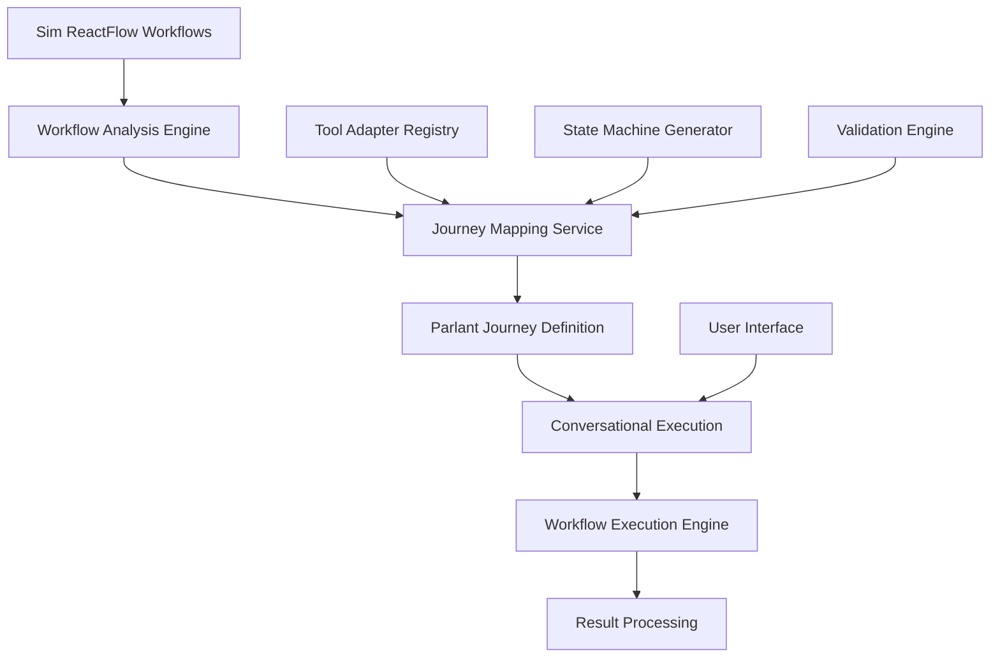

# Workflow to Journey Mapping System Architecture
## Technical Documentation for Sim-Parlant Integration

### Executive Summary

The Workflow to Journey Mapping System enables conversational execution of existing Sim ReactFlow workflows through Parlant's journey state machine framework. This system converts visual workflow representations into Parlant-compatible journey configurations while preserving all original functionality and execution capabilities.

**Key Benefits:**
- Seamless conversion from ReactFlow visual workflows to Parlant journeys
- Maintains backward compatibility with existing Sim workflows
- Enables conversational interaction with complex multi-step processes
- Preserves all tool integrations and execution logic

---

## System Architecture Overview

### Core Components



### Architecture Layers

#### 1. **Workflow Analysis Layer**
- **Purpose**: Parse and analyze existing ReactFlow workflows
- **Components**:
  - Workflow Parser: Extracts blocks, connections, and configuration
  - Dependency Analyzer: Maps block relationships and execution order
  - Tool Registry Interface: Identifies required tools and adapters

#### 2. **Journey Mapping Layer**
- **Purpose**: Convert workflow structures to Parlant journey format
- **Components**:
  - State Machine Generator: Creates journey state definitions
  - Tool Integration Mapper: Links Sim tools to Parlant tool adapters
  - Condition Logic Converter: Transforms conditional flows to journey branches

#### 3. **Execution Layer**
- **Purpose**: Execute journeys through conversational interface
- **Components**:
  - Journey Runtime: Manages journey state transitions
  - Tool Execution Engine: Executes mapped tools within journey context
  - Result Aggregation: Collects and formats execution results

#### 4. **Interface Layer**
- **Purpose**: Provide user interaction capabilities
- **Components**:
  - Conversation Interface: Chat-based workflow interaction
  - Progress Tracking: Visual journey progress indicators
  - Hybrid Mode: Switch between visual and conversational views

---

## Workflow to Journey Conversion Process

### Step 1: Workflow Analysis

```typescript
interface WorkflowAnalysisResult {
  blocks: BlockDefinition[]
  edges: EdgeDefinition[]
  entryPoints: string[]
  exitPoints: string[]
  conditionalPaths: ConditionalPath[]
  toolDependencies: ToolDependency[]
  parallelSections: ParallelSection[]
  loopStructures: LoopStructure[]
}

interface BlockDefinition {
  id: string
  type: string
  position: { x: number; y: number }
  configuration: BlockConfig
  inputs: IODefinition[]
  outputs: IODefinition[]
  toolMapping: ToolMapping
}
```

### Step 2: State Machine Generation

```typescript
interface JourneyDefinition {
  id: string
  name: string
  description: string
  states: JourneyState[]
  transitions: StateTransition[]
  initialState: string
  finalStates: string[]
  context: JourneyContext
}

interface JourneyState {
  id: string
  type: 'tool_execution' | 'conditional' | 'parallel' | 'loop' | 'input_collection'
  name: string
  description: string
  toolId?: string
  configuration: StateConfiguration
  onEntry?: Action[]
  onExit?: Action[]
}
```

### Step 3: Tool Integration Mapping

```typescript
interface ToolMapping {
  simToolId: string
  parlantToolId: string
  parameterMapping: ParameterMapping[]
  outputMapping: OutputMapping[]
  errorHandling: ErrorHandlingConfig
}

interface ParameterMapping {
  simParameter: string
  parlantParameter: string
  transformation?: TransformFunction
  validation?: ValidationRule[]
}
```

---

## Key Components Detail

### Workflow Analysis Engine

**Location**: `/apps/sim/services/parlant/workflow-mapping/analysis-engine.ts`

**Responsibilities**:
- Parse ReactFlow workflow definitions
- Extract block configurations and dependencies
- Identify execution paths and conditional logic
- Map tool requirements and capabilities

**Core Functions**:
```typescript
class WorkflowAnalysisEngine {
  async analyzeWorkflow(workflowId: string): Promise<WorkflowAnalysisResult>
  async extractExecutionGraph(workflow: SimWorkflow): Promise<ExecutionGraph>
  async identifyToolDependencies(blocks: BlockDefinition[]): Promise<ToolDependency[]>
  async validateWorkflowIntegrity(analysis: WorkflowAnalysisResult): Promise<ValidationResult>
}
```

### Journey Mapping Service

**Location**: `/apps/sim/services/parlant/workflow-mapping/journey-mapper.ts`

**Responsibilities**:
- Convert workflow analysis to Parlant journey format
- Generate appropriate state machines for different workflow patterns
- Ensure proper tool adapter integration
- Handle complex workflow structures (loops, parallel execution, conditionals)

**Core Functions**:
```typescript
class JourneyMappingService {
  async mapWorkflowToJourney(analysis: WorkflowAnalysisResult): Promise<JourneyDefinition>
  async generateStateTransitions(blocks: BlockDefinition[], edges: EdgeDefinition[]): Promise<StateTransition[]>
  async createConditionalStates(conditionalPaths: ConditionalPath[]): Promise<JourneyState[]>
  async optimizeJourneyStructure(journey: JourneyDefinition): Promise<JourneyDefinition>
}
```

### Conversational Execution Engine

**Location**: `/apps/sim/services/parlant/workflow-mapping/execution-engine.ts`

**Responsibilities**:
- Execute journey steps through conversational interface
- Manage journey state transitions
- Handle user input collection and validation
- Coordinate tool execution within journey context

**Core Functions**:
```typescript
class ConversationalExecutionEngine {
  async executeJourneyStep(stepId: string, context: ExecutionContext): Promise<StepResult>
  async handleUserInput(input: string, currentState: JourneyState): Promise<InputProcessingResult>
  async progressJourney(journeyId: string, transitionTrigger: TransitionTrigger): Promise<ProgressResult>
  async handleJourneyCompletion(journeyId: string, finalResult: any): Promise<CompletionResult>
}
```

---

## Data Flow Architecture

### Conversion Flow

```
1. User Initiates Workflow Conversion
   ↓
2. Workflow Analysis Engine extracts workflow definition
   ↓
3. Journey Mapping Service converts to Parlant format
   ↓
4. Tool Integration Layer maps Sim tools to Parlant adapters
   ↓
5. Journey Validation ensures integrity and completeness
   ↓
6. Journey Registration in Parlant system
   ↓
7. Conversational Interface becomes available
```

### Execution Flow

```
1. User starts conversational interaction with workflow
   ↓
2. Parlant agent loads journey definition
   ↓
3. Journey Runtime initializes execution context
   ↓
4. For each journey step:
   a. State evaluation and transition logic
   b. Tool execution through adapter layer
   c. Result processing and context update
   d. User interaction and feedback
   ↓
5. Journey completion and result aggregation
```

---

## Integration Points

### Sim Integration Points

1. **Workflow Storage**: Integration with existing workflow persistence
2. **Block Registry**: Access to all Sim block definitions and configurations
3. **Execution Engine**: Leverage existing workflow execution infrastructure
4. **User Management**: Workspace isolation and permission management
5. **Tool Adapters**: Reuse existing tool integration layer

### Parlant Integration Points

1. **Journey Management**: Create and manage journey definitions
2. **Agent Configuration**: Associate journeys with conversational agents
3. **Tool Registry**: Register Sim tool adapters with Parlant
4. **Session Management**: Handle conversational workflow sessions
5. **Context Management**: Maintain journey execution context

---

## Performance Considerations

### Optimization Strategies

#### 1. **Lazy Loading**
- Journey definitions loaded on-demand
- Tool adapters initialized only when required
- Progressive workflow analysis for large workflows

#### 2. **Caching Strategy**
```typescript
interface CacheStrategy {
  workflowAnalysis: CacheConfig    // Cache analysis results for 1 hour
  journeyDefinitions: CacheConfig  // Cache journey mappings for 4 hours
  toolMappings: CacheConfig       // Cache tool mappings for 8 hours
  executionContext: CacheConfig   // Cache active contexts for session duration
}
```

#### 3. **Parallel Processing**
- Concurrent tool execution where workflow permits
- Parallel journey state evaluation
- Asynchronous result aggregation

### Performance Metrics

- **Conversion Time**: Workflow to journey mapping < 2 seconds
- **Execution Latency**: Journey step execution < 500ms
- **Memory Footprint**: < 50MB per active journey session
- **Concurrent Sessions**: Support 100+ simultaneous journey executions

---

## Security Architecture

### Security Layers

#### 1. **Workspace Isolation**
- Journey execution scoped to workspace boundaries
- Tool adapter access controlled by workspace permissions
- Conversation context isolated per workspace

#### 2. **Authentication Integration**
```typescript
interface SecurityContext {
  userId: string
  workspaceId: string
  permissions: Permission[]
  toolAccess: ToolAccessConfig
  journeyAccessLevel: AccessLevel
}
```

#### 3. **Tool Security**
- All tool executions through existing Sim security layer
- Credential management preserved from original workflow
- Audit logging for all journey-based tool executions

### Security Validations

- **Input Sanitization**: All user inputs validated before journey processing
- **Permission Checks**: Tool access verified at each execution step
- **Context Validation**: Journey state transitions validated for security compliance
- **Audit Trail**: Complete execution logging for security analysis

---

## Error Handling and Resilience

### Error Categories

#### 1. **Conversion Errors**
```typescript
enum ConversionErrorType {
  INVALID_WORKFLOW_STRUCTURE = 'invalid_workflow_structure',
  UNSUPPORTED_BLOCK_TYPE = 'unsupported_block_type',
  TOOL_MAPPING_FAILURE = 'tool_mapping_failure',
  VALIDATION_FAILURE = 'validation_failure'
}
```

#### 2. **Execution Errors**
```typescript
enum ExecutionErrorType {
  JOURNEY_STATE_ERROR = 'journey_state_error',
  TOOL_EXECUTION_FAILURE = 'tool_execution_failure',
  CONTEXT_CORRUPTION = 'context_corruption',
  USER_INPUT_ERROR = 'user_input_error'
}
```

### Recovery Strategies

#### 1. **Graceful Degradation**
- Fall back to original workflow execution if journey fails
- Preserve user progress during error recovery
- Maintain conversation context across error boundaries

#### 2. **Error Recovery Patterns**
```typescript
class ErrorRecoveryManager {
  async handleConversionError(error: ConversionError): Promise<RecoveryResult>
  async recoverFromExecutionError(error: ExecutionError, context: ExecutionContext): Promise<RecoveryResult>
  async validateRecoveryState(recoveryResult: RecoveryResult): Promise<ValidationResult>
}
```

---

## Monitoring and Observability

### Metrics Collection

#### 1. **Performance Metrics**
- Conversion success rate and timing
- Journey execution performance
- Tool adapter response times
- User interaction patterns

#### 2. **Business Metrics**
- Workflow-to-journey adoption rate
- Conversational workflow completion rate
- User satisfaction indicators
- Error frequency analysis

### Logging Architecture

```typescript
interface LoggingContext {
  journeyId: string
  workflowId: string
  userId: string
  workspaceId: string
  sessionId: string
  executionStep: string
}

class JourneyLogger {
  logConversionEvent(event: ConversionEvent, context: LoggingContext): void
  logExecutionEvent(event: ExecutionEvent, context: LoggingContext): void
  logErrorEvent(error: Error, context: LoggingContext): void
  logPerformanceMetrics(metrics: PerformanceMetrics, context: LoggingContext): void
}
```

---

## Testing Strategy

### Test Categories

#### 1. **Unit Tests**
- Workflow analysis component testing
- Journey mapping logic verification
- Tool adapter integration testing
- State machine transition validation

#### 2. **Integration Tests**
- End-to-end workflow conversion testing
- Conversational execution flow testing
- Cross-component interaction validation
- Performance and load testing

#### 3. **User Acceptance Tests**
- Workflow conversion accuracy validation
- Conversational interface usability testing
- Feature parity verification between visual and conversational modes
- Error handling and recovery testing

### Test Data Management

```typescript
interface TestDataSet {
  simpleLinearWorkflows: WorkflowTestCase[]
  conditionalWorkflows: WorkflowTestCase[]
  parallelExecutionWorkflows: WorkflowTestCase[]
  loopWorkflows: WorkflowTestCase[]
  complexIntegratedWorkflows: WorkflowTestCase[]
}

interface WorkflowTestCase {
  id: string
  name: string
  description: string
  workflowDefinition: SimWorkflow
  expectedJourneyDefinition: JourneyDefinition
  testScenarios: TestScenario[]
  validationCriteria: ValidationCriteria[]
}
```

---

## Future Enhancements

### Phase 2 Enhancements

#### 1. **Advanced Journey Features**
- Dynamic journey modification during execution
- Multi-agent journey orchestration
- Journey templates and reusability
- Advanced conditional logic and branching

#### 2. **Enhanced User Experience**
- Visual journey progress indicators
- Hybrid visual-conversational interface
- Journey replay and debugging capabilities
- Advanced error recovery workflows

#### 3. **Performance Optimizations**
- Intelligent journey pre-compilation
- Advanced caching strategies
- Distributed journey execution
- Real-time performance monitoring

### Long-term Vision

- **AI-Powered Journey Optimization**: Machine learning-based journey path optimization
- **Natural Language Journey Creation**: Direct natural language to journey conversion
- **Cross-Platform Journey Portability**: Export journeys to other conversation platforms
- **Enterprise Journey Governance**: Advanced workflow approval and compliance features

---

This architecture provides a comprehensive foundation for the Workflow to Journey Mapping System, ensuring scalable, secure, and maintainable conversion of Sim workflows into conversational experiences through Parlant's journey framework.