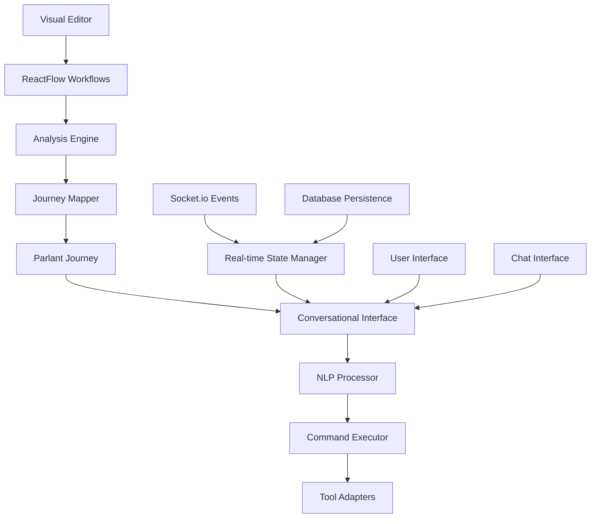

# Workflow to Journey Mapping System Documentation

## Overview

The Workflow to Journey Mapping System is a comprehensive solution that bridges Sim's ReactFlow visual workflows with Parlant's conversational AI framework. This system enables users to interact with complex multi-step workflows through natural language conversations while preserving all the power and functionality of the original visual workflow editor.

## 📚 Documentation Structure

This documentation package provides complete guidance for developers, users, and administrators working with the workflow-to-journey mapping system.

### For Developers

- **[Technical API Reference](./api-reference.md)** - Complete API documentation for all endpoints, types, and interfaces
- **[Architecture Guide](./architecture-guide.md)** - Deep dive into system architecture and design patterns
- **[Integration Guide](./integration-guide.md)** - Step-by-step integration procedures with existing Sim infrastructure
- **[Extension Guide](./extension-guide.md)** - How to extend and customize the system
- **[Testing Guide](./testing-guide.md)** - Comprehensive testing strategies and test cases

### For Users

- **[User Guide](./user-guide.md)** - Complete user manual for the conversational workflow experience
- **[Tutorial Collection](./tutorials/)** - Step-by-step tutorials for common use cases
- **[Quick Start Guide](./quick-start.md)** - Get up and running in 5 minutes
- **[Best Practices](./best-practices.md)** - Recommended patterns for workflow design and usage

### For Administrators

- **[Deployment Guide](./deployment-guide.md)** - Production deployment procedures and configuration
- **[Configuration Reference](./configuration-reference.md)** - Complete configuration options and settings
- **[Monitoring Guide](./monitoring-guide.md)** - System monitoring and performance optimization
- **[Troubleshooting Guide](./troubleshooting-guide.md)** - Common issues and resolution procedures

### Examples and Resources

- **[Example Workflows](./examples/)** - Real-world workflow examples and their conversational implementations
- **[Template Library](./templates/)** - Reusable templates for common workflow patterns
- **[FAQ](./faq.md)** - Frequently asked questions and answers
- **[Glossary](./glossary.md)** - Terms and definitions

## 🚀 Quick Navigation

### Getting Started
1. [Quick Start Guide](./quick-start.md) - 5-minute setup
2. [User Guide](./user-guide.md) - Learn the basics
3. [Example Workflows](./examples/) - See it in action

### Implementation
1. [Architecture Guide](./architecture-guide.md) - Understand the system
2. [Integration Guide](./integration-guide.md) - Implement the system
3. [API Reference](./api-reference.md) - Use the APIs

### Operations
1. [Deployment Guide](./deployment-guide.md) - Deploy to production
2. [Configuration Reference](./configuration-reference.md) - Configure the system
3. [Monitoring Guide](./monitoring-guide.md) - Monitor performance

## 🎯 Key Features

### ✅ **Seamless Workflow Conversion**
- Convert existing ReactFlow workflows to conversational journeys
- Preserve all workflow functionality and tool integrations
- Maintain backward compatibility with visual editor

### ✅ **Natural Language Interaction**
- Full conversational interface for workflow execution
- Intent recognition and entity extraction
- Context-aware conversation management

### ✅ **Hybrid Experience**
- Switch between visual and conversational modes
- Real-time synchronization between interfaces
- Progressive disclosure of complexity

### ✅ **Enterprise Grade**
- Workspace isolation and security
- Comprehensive error handling and recovery
- Performance monitoring and optimization

## 🏗️ System Architecture

## 📋 Prerequisites

### System Requirements
- **Node.js**: 18.0 or higher
- **PostgreSQL**: 14.0 or higher
- **Redis**: 6.0 or higher (for session management)
- **Python**: 3.8 or higher (for Parlant server)

### Dependencies
- **Sim Platform**: Latest version with ReactFlow workflows
- **Parlant Server**: Configured and running
- **Socket.io**: For real-time communication
- **Better Auth**: For authentication and workspace isolation

## 📊 Status and Roadmap

### Current Implementation Status

| Component | Status | Notes |
|-----------|---------|-------|
| **Architecture Design** | ✅ Complete | Comprehensive architecture document |
| **Type Definitions** | ✅ Complete | Full TypeScript interface definitions |
| **Core Service** | ✅ Implemented | Conversational workflow service |
| **Tool Adapters** | ✅ Complete | Universal tool adapter system |
| **Database Schema** | ✅ Complete | Parlant integration schema |
| **API Endpoints** | 🚧 In Progress | RESTful API implementation |
| **Frontend Interface** | 🚧 In Progress | React chat components |
| **Testing Suite** | 🚧 In Progress | Comprehensive test coverage |
| **Documentation** | 🚧 In Progress | This documentation package |

### Upcoming Features

- **Advanced NLP**: Enhanced intent recognition and entity extraction
- **Multi-agent Orchestration**: Complex workflow delegation to specialized agents
- **Visual Journey Builder**: Drag-and-drop journey creation interface
- **Analytics Dashboard**: Conversation analytics and workflow performance metrics

## 🤝 Contributing

We welcome contributions to the Workflow to Journey Mapping System! Please see our [Contributing Guide](./contributing.md) for details on:

- Code style and standards
- Testing requirements
- Documentation standards
- Pull request process

## 📧 Support

- **Technical Issues**: Create an issue in the project repository
- **Documentation Questions**: Check the [FAQ](./faq.md) or reach out to the team
- **Feature Requests**: Use the feature request template in the repository

## 📄 License

This project is part of the Sim platform and follows the same licensing terms.

---

*This documentation is maintained by the Sim Platform team and is updated regularly. Last updated: $(date)*