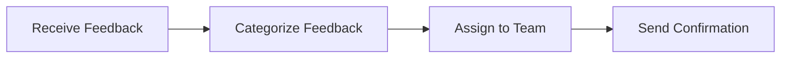

# Example: Simple Linear Workflow

## Overview

This example demonstrates how to convert a basic linear workflow into a conversational experience. The workflow processes customer feedback through a simple 4-step process.

## Visual Workflow



### Workflow Definition

**Name**: Customer Feedback Processing
**Description**: Categorizes and routes customer feedback to appropriate teams

**Steps**:
1. **Receive Feedback**: Collect customer feedback from form submission
2. **Categorize Feedback**: Use AI to categorize feedback (bug, feature, compliment, complaint)
3. **Assign to Team**: Route to appropriate team based on category
4. **Send Confirmation**: Send acknowledgment email to customer

## Conversational Experience

### Session Initialization

When a user enables chat mode for this workflow:

```
Assistant: 👋 Hello! I'm here to help you with the "Customer Feedback Processing" workflow.

This workflow processes customer feedback through 4 simple steps:
• Receive and validate the feedback
• Categorize the feedback using AI
• Assign it to the right team
• Send confirmation to the customer

I have some feedback ready to process. Would you like to start?
```

### Natural Language Interactions

#### Starting the Workflow

**User**: *"Let's process this feedback"*

```
Assistant: Perfect! Starting the feedback processing workflow.

🔄 Step 1: Receive Feedback
I can see we have feedback from Sarah Johnson:
"The new dashboard is great, but the export function seems broken when I try to download large reports."

✅ Feedback received and validated
Ready for categorization. Should I continue?
```

**User**: *"Yes, categorize it"*

```
Assistant: 🔄 Step 2: Categorize Feedback
Analyzing the feedback using AI...

✅ Categorization complete!
- **Category**: Bug Report
- **Subcategory**: Export Functionality
- **Priority**: Medium (affects functionality but has workarounds)
- **Sentiment**: Constructive (mentions positive aspects)

Moving to team assignment. Continue?
```

#### Interactive Decision Making

**User**: *"Which team will handle this?"*

```
Assistant: 🔄 Step 3: Assign to Team
Based on the "Bug Report" category and "Export Functionality" subcategory:

**Recommended Assignment**: Engineering Team (Dashboard Squad)
- **Reason**: Export functionality is handled by the dashboard engineering team
- **Team Lead**: Alex Chen (alex@company.com)
- **SLA**: Bug fixes typically resolved within 3-5 business days

Should I assign it to the Dashboard Squad, or would you prefer a different team?
```

**User**: *"That sounds right, assign it to them"*

```
Assistant: ✅ Step 3: Assigned to Dashboard Squad
- Ticket #FB-2024-0158 created in Engineering backlog
- Team lead Alex Chen has been notified
- Priority: Medium, Target resolution: 3-5 business days

🔄 Step 4: Send Confirmation
Preparing confirmation email to Sarah Johnson...

✅ Confirmation email sent!
Subject: "Thank you for your feedback - We're on it!"
- Included ticket reference #FB-2024-0158
- Provided estimated timeline
- Added contact info for follow-up

🎉 Workflow completed successfully!
**Summary**: Bug report categorized and assigned to Dashboard Squad
**Customer**: Sarah Johnson notified
**Next steps**: Engineering team will begin investigation
```

### Advanced Interactions

#### Workflow Control

**User**: *"Can you pause after categorization so I can review?"*

```
Assistant: Absolutely! I'll pause after the categorization step for your review.

🔄 Step 1: Receive Feedback
✅ Feedback from Sarah Johnson received and validated

🔄 Step 2: Categorize Feedback
✅ Categorized as: Bug Report (Export Functionality, Medium priority)

⏸ **Paused for review as requested**

The AI categorized this as a medium-priority bug report. Does this look correct to you?
- Say "continue" to proceed with team assignment
- Say "change category" if you want to adjust the categorization
- Say "restart" to begin the process again
```

#### Error Handling

**User**: *"Actually, I think this should go to the Product team, not Engineering"*

```
Assistant: Good catch! Let me update the assignment.

🔄 Modifying Step 3: Team Assignment
- **Previous**: Engineering Team (Dashboard Squad)
- **New**: Product Team
- **Reason**: Product-related feedback requiring product management review

✅ Updated assignment
- **New Assignee**: Product Team (Maria Rodriguez, maria@company.com)
- **Ticket**: Updated to Product backlog as #PR-2024-0089
- **SLA**: Product reviews typically completed within 2-3 business days

Should I continue with sending the confirmation email to Sarah?
```

#### Status Inquiries

**User**: *"What's the current progress?"*

```
Assistant: 📊 **Current Progress**: 75% Complete (3 of 4 steps)

**Completed Steps**:
✅ Step 1: Receive Feedback (Sarah Johnson's dashboard export issue)
✅ Step 2: Categorize Feedback (Bug Report - Export Functionality)
✅ Step 3: Assign to Team (Product Team - #PR-2024-0089)

**Current Step**:
🔄 Step 4: Send Confirmation (Ready to send email to Sarah)

**Estimated Time Remaining**: < 1 minute
**Total Processing Time**: 3 minutes 42 seconds

Would you like me to complete the final step?
```

## Workflow-to-Journey Mapping

### Node Mappings

| Visual Node | Journey State | Conversation Template |
|-------------|---------------|----------------------|
| Receive Feedback | `feedback_intake` | "I have feedback from {customer_name}: {feedback_text}" |
| Categorize Feedback | `ai_categorization` | "Analyzing feedback... Categorized as {category} with {priority} priority" |
| Assign to Team | `team_assignment` | "Assigning to {team_name} based on {category}" |
| Send Confirmation | `email_confirmation` | "Sending confirmation to {customer_email}" |

### Journey Definition

```json
{
  "journeyId": "feedback_processing_v1",
  "name": "Customer Feedback Processing",
  "states": [
    {
      "stateId": "feedback_intake",
      "stateName": "Receive Feedback",
      "stateType": "processing",
      "entryMessage": "Processing incoming feedback from {customer_name}...",
      "exitMessage": "Feedback received and validated ✅",
      "transitions": [
        {
          "targetStateId": "ai_categorization",
          "triggerConditions": ["feedback_validated"],
          "requiresConfirmation": true,
          "confirmationMessage": "Ready for categorization. Should I continue?"
        }
      ]
    },
    {
      "stateId": "ai_categorization",
      "stateName": "Categorize Feedback",
      "stateType": "processing",
      "entryMessage": "Analyzing feedback using AI...",
      "exitMessage": "Categorized as {category} - {subcategory} ✅",
      "transitions": [
        {
          "targetStateId": "team_assignment",
          "triggerConditions": ["categorization_complete"],
          "requiresConfirmation": false
        }
      ]
    },
    {
      "stateId": "team_assignment",
      "stateName": "Assign to Team",
      "stateType": "decision",
      "entryMessage": "Determining best team assignment...",
      "exitMessage": "Assigned to {team_name} ✅",
      "transitions": [
        {
          "targetStateId": "email_confirmation",
          "triggerConditions": ["assignment_confirmed"],
          "requiresConfirmation": true,
          "confirmationMessage": "Assigned to {team_name}. Continue to confirmation?"
        }
      ]
    },
    {
      "stateId": "email_confirmation",
      "stateName": "Send Confirmation",
      "stateType": "output",
      "entryMessage": "Preparing confirmation email...",
      "exitMessage": "Confirmation sent to {customer_email} ✅",
      "isEndState": true
    }
  ]
}
```

## Benefits Demonstrated

### **1. Simplified Execution**
- No need to navigate between forms and screens
- Natural language replaces complex UI interactions
- Real-time progress updates keep users informed

### **2. Interactive Decision Making**
- Users can review and modify AI categorizations
- Team assignments can be overridden with simple commands
- Flexible execution flow based on user preferences

### **3. Transparent Process**
- Every step is explained in plain English
- Users understand what's happening and why
- Easy to track progress and identify bottlenecks

### **4. Error Recovery**
- Simple commands to modify decisions
- Easy rollback and retry capabilities
- Graceful handling of edge cases

## Implementation Notes

### NLP Intent Mapping

```typescript
const intentMappings = {
  'start_workflow': ['start', 'begin', 'process', 'let\'s go'],
  'continue_step': ['continue', 'proceed', 'yes', 'go ahead'],
  'pause_workflow': ['pause', 'wait', 'hold', 'stop'],
  'get_status': ['status', 'progress', 'where are we', 'current step'],
  'modify_assignment': ['change team', 'assign to', 'different team'],
  'explain_step': ['what\'s happening', 'explain', 'tell me more'],
  'skip_step': ['skip', 'bypass', 'move on'],
  'restart': ['restart', 'start over', 'begin again']
}
```

### Context Variables

```typescript
interface FeedbackContext {
  customerName: string
  customerEmail: string
  feedbackText: string
  category: string
  subcategory: string
  priority: 'low' | 'medium' | 'high'
  assignedTeam: string
  ticketId: string
  estimatedResolution: string
}
```

### Tool Integrations

- **AI Categorization**: OpenAI GPT for sentiment and category analysis
- **Team Assignment**: Internal team routing service
- **Email Service**: SendGrid for confirmation emails
- **Ticketing**: Jira integration for ticket creation

## Testing Scenarios

### Happy Path
1. Start workflow with feedback
2. Accept AI categorization
3. Confirm team assignment
4. Complete with email confirmation

### User Override Path
1. Start workflow with feedback
2. Modify AI categorization
3. Change team assignment
4. Complete with custom confirmation

### Error Handling Path
1. Start workflow with invalid feedback
2. Handle categorization failure
3. Retry with manual categorization
4. Complete successfully

This simple example demonstrates how conversational workflows make complex processes more accessible while preserving all the power and flexibility of the original visual workflow.