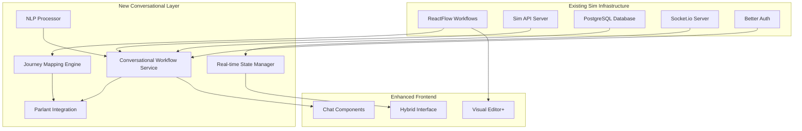

# Integration Guide - Workflow to Journey Mapping System

## Overview

This guide provides step-by-step instructions for integrating the Workflow to Journey Mapping System with your existing Sim infrastructure. The integration process preserves all existing functionality while adding conversational capabilities.

## Prerequisites

Before beginning the integration, ensure you have:

### System Requirements
- **Sim Platform**: Version 2.0 or higher with ReactFlow workflows
- **Node.js**: 18.0+
- **PostgreSQL**: 14.0+ with existing Sim database
- **Python**: 3.8+ for Parlant server
- **Redis**: 6.0+ for session management

### Access Requirements
- Database administrator access for schema updates
- Deployment permissions for service installations
- Workspace administrator access for configuration

### Dependencies
- Parlant server installed and configured
- Universal Tool Adapter System implemented
- Better Auth integration active

## Integration Architecture



## Step 1: Database Schema Extension

### 1.1 Add Conversational Workflow Tables

Execute the following SQL to extend your existing schema:

```sql
-- Conversational workflow sessions
CREATE TABLE conversational_workflow_sessions (
  id UUID PRIMARY KEY DEFAULT gen_random_uuid(),
  session_id VARCHAR(255) UNIQUE NOT NULL,
  workflow_id UUID NOT NULL REFERENCES workflows(id) ON DELETE CASCADE,
  journey_id VARCHAR(255) NOT NULL,
  user_id UUID NOT NULL REFERENCES users(id) ON DELETE CASCADE,
  workspace_id UUID NOT NULL REFERENCES workspaces(id) ON DELETE CASCADE,

  -- Configuration
  conversational_config JSONB NOT NULL DEFAULT '{}',
  execution_config JSONB NOT NULL DEFAULT '{}',

  -- State tracking
  current_node_id VARCHAR(255),
  current_state_id VARCHAR(255),
  execution_status VARCHAR(50) NOT NULL DEFAULT 'not-started',

  -- Context
  workflow_context JSONB NOT NULL DEFAULT '{}',
  journey_context JSONB NOT NULL DEFAULT '{}',
  user_inputs JSONB NOT NULL DEFAULT '{}',

  -- Metadata
  created_at TIMESTAMP WITH TIME ZONE DEFAULT NOW(),
  updated_at TIMESTAMP WITH TIME ZONE DEFAULT NOW(),
  started_at TIMESTAMP WITH TIME ZONE,
  completed_at TIMESTAMP WITH TIME ZONE,

  -- Indexes
  INDEX idx_cws_session_id ON conversational_workflow_sessions(session_id),
  INDEX idx_cws_workflow_id ON conversational_workflow_sessions(workflow_id),
  INDEX idx_cws_user_workspace ON conversational_workflow_sessions(user_id, workspace_id),
  INDEX idx_cws_status ON conversational_workflow_sessions(execution_status),
  INDEX idx_cws_updated_at ON conversational_workflow_sessions(updated_at)
);

-- Workflow to journey mappings
CREATE TABLE workflow_journey_mappings (
  id UUID PRIMARY KEY DEFAULT gen_random_uuid(),
  workflow_id UUID NOT NULL REFERENCES workflows(id) ON DELETE CASCADE,
  journey_id VARCHAR(255) NOT NULL,
  mapping_version VARCHAR(50) NOT NULL,

  -- Mapping configuration
  node_state_mappings JSONB NOT NULL DEFAULT '[]',
  edge_transition_mappings JSONB NOT NULL DEFAULT '[]',
  context_variable_mappings JSONB NOT NULL DEFAULT '[]',

  -- Configuration
  execution_config JSONB NOT NULL DEFAULT '{}',
  conversational_config JSONB NOT NULL DEFAULT '{}',

  -- Status
  is_active BOOLEAN DEFAULT true,
  validation_status VARCHAR(50) DEFAULT 'pending',
  validation_errors JSONB DEFAULT '[]',

  -- Metadata
  created_at TIMESTAMP WITH TIME ZONE DEFAULT NOW(),
  updated_at TIMESTAMP WITH TIME ZONE DEFAULT NOW(),
  created_by UUID REFERENCES users(id),

  -- Indexes
  UNIQUE INDEX idx_wjm_workflow_active ON workflow_journey_mappings(workflow_id) WHERE is_active = true,
  INDEX idx_wjm_journey_id ON workflow_journey_mappings(journey_id),
  INDEX idx_wjm_status ON workflow_journey_mappings(validation_status)
);

-- Conversation history
CREATE TABLE conversation_turns (
  id UUID PRIMARY KEY DEFAULT gen_random_uuid(),
  session_id VARCHAR(255) NOT NULL,
  turn_id VARCHAR(255) NOT NULL,

  -- Content
  speaker VARCHAR(20) NOT NULL CHECK (speaker IN ('user', 'agent')),
  content TEXT NOT NULL,

  -- Analysis
  intent VARCHAR(255),
  extracted_entities JSONB DEFAULT '[]',
  workflow_action VARCHAR(255),

  -- Metadata
  created_at TIMESTAMP WITH TIME ZONE DEFAULT NOW(),

  -- Indexes
  INDEX idx_ct_session_id ON conversation_turns(session_id),
  INDEX idx_ct_created_at ON conversation_turns(created_at),

  -- Foreign key
  FOREIGN KEY (session_id) REFERENCES conversational_workflow_sessions(session_id) ON DELETE CASCADE
);

-- Workflow execution events
CREATE TABLE workflow_execution_events (
  id UUID PRIMARY KEY DEFAULT gen_random_uuid(),
  session_id VARCHAR(255) NOT NULL,

  -- Event details
  event_type VARCHAR(100) NOT NULL,
  node_id VARCHAR(255),
  node_name VARCHAR(255),

  -- Event data
  event_data JSONB DEFAULT '{}',
  result JSONB,
  error_details JSONB,

  -- Timing
  started_at TIMESTAMP WITH TIME ZONE,
  completed_at TIMESTAMP WITH TIME ZONE,
  duration_ms INTEGER,

  -- Metadata
  created_at TIMESTAMP WITH TIME ZONE DEFAULT NOW(),

  -- Indexes
  INDEX idx_wee_session_id ON workflow_execution_events(session_id),
  INDEX idx_wee_event_type ON workflow_execution_events(event_type),
  INDEX idx_wee_created_at ON workflow_execution_events(created_at),

  -- Foreign key
  FOREIGN KEY (session_id) REFERENCES conversational_workflow_sessions(session_id) ON DELETE CASCADE
);
```

### 1.2 Add Database Triggers

```sql
-- Auto-update timestamp triggers
CREATE OR REPLACE FUNCTION update_updated_at_column()
RETURNS TRIGGER AS $$
BEGIN
    NEW.updated_at = NOW();
    RETURN NEW;
END;
$$ language 'plpgsql';

CREATE TRIGGER update_conversational_workflow_sessions_updated_at
    BEFORE UPDATE ON conversational_workflow_sessions
    FOR EACH ROW EXECUTE FUNCTION update_updated_at_column();

CREATE TRIGGER update_workflow_journey_mappings_updated_at
    BEFORE UPDATE ON workflow_journey_mappings
    FOR EACH ROW EXECUTE FUNCTION update_updated_at_column();
```

## Step 2: Service Installation

### 2.1 Install Conversational Workflow Service

Create the service directory structure:

```bash
mkdir -p apps/sim/services/parlant/conversational-workflows
mkdir -p apps/sim/services/parlant/conversational-workflows/{core,mapping,nlp,state}
```

Install the core service files:

```bash
# Copy the core service implementation
cp development/workflow-to-journey-mapping/src/core/* \
   apps/sim/services/parlant/conversational-workflows/core/

# Copy mapping engine
cp development/workflow-to-journey-mapping/src/mapping/* \
   apps/sim/services/parlant/conversational-workflows/mapping/

# Copy NLP components
cp development/workflow-to-journey-mapping/src/nlp/* \
   apps/sim/services/parlant/conversational-workflows/nlp/

# Copy state management
cp development/workflow-to-journey-mapping/src/state/* \
   apps/sim/services/parlant/conversational-workflows/state/
```

### 2.2 Install Dependencies

Add required dependencies to your package.json:

```json
{
  "dependencies": {
    "@parlant/client": "^1.0.0",
    "@parlant/journey-builder": "^1.0.0",
    "natural": "^6.5.0",
    "compromise": "^14.0.0",
    "sentiment": "^5.0.2",
    "uuid": "^9.0.0",
    "ws": "^8.13.0"
  }
}
```

Install dependencies:

```bash
npm install
```

### 2.3 Environment Configuration

Add environment variables to your `.env` file:

```bash
# Conversational Workflows Configuration
CONVERSATIONAL_WORKFLOWS_ENABLED=true
CONVERSATIONAL_WORKFLOWS_DEBUG=false

# Parlant Integration
PARLANT_SERVER_URL=http://localhost:8000
PARLANT_API_KEY=your_parlant_api_key
PARLANT_WORKSPACE_PREFIX=sim_

# NLP Configuration
NLP_PROVIDER=internal
NLP_MODEL_PATH=/models/nlp
NLP_CONFIDENCE_THRESHOLD=0.7

# Session Management
REDIS_URL=redis://localhost:6379
SESSION_TIMEOUT_MS=1800000  # 30 minutes
SESSION_CLEANUP_INTERVAL_MS=300000  # 5 minutes

# WebSocket Configuration
WS_HEARTBEAT_INTERVAL=30000
WS_CONNECTION_TIMEOUT=60000
```

## Step 3: API Integration

### 3.1 Add API Routes

Create the API route handlers in `apps/sim/app/api/v1/conversational-workflows/`:

```typescript
// apps/sim/app/api/v1/conversational-workflows/sessions/route.ts
import { NextRequest, NextResponse } from 'next/server'
import { getConversationalWorkflowService } from '@/services/parlant/conversational-workflows'
import { validateAuth } from '@/lib/auth/validate'

export async function POST(request: NextRequest) {
  try {
    const { user, workspace } = await validateAuth(request)
    const body = await request.json()

    const service = getConversationalWorkflowService()
    const session = await service.createConversationalWorkflow({
      ...body,
      userId: user.id,
      workspaceId: workspace.id
    })

    return NextResponse.json(session)
  } catch (error) {
    return NextResponse.json(
      { error: error.message },
      { status: error.statusCode || 500 }
    )
  }
}

export async function GET(request: NextRequest) {
  try {
    const { user, workspace } = await validateAuth(request)
    const sessionId = request.nextUrl.searchParams.get('sessionId')

    if (!sessionId) {
      return NextResponse.json(
        { error: 'Session ID required' },
        { status: 400 }
      )
    }

    const service = getConversationalWorkflowService()
    const state = await service.getWorkflowState(sessionId)

    if (!state) {
      return NextResponse.json(
        { error: 'Session not found' },
        { status: 404 }
      )
    }

    return NextResponse.json({ currentState: state })
  } catch (error) {
    return NextResponse.json(
      { error: error.message },
      { status: error.statusCode || 500 }
    )
  }
}
```

### 3.2 Add Command Processing Endpoint

```typescript
// apps/sim/app/api/v1/conversational-workflows/sessions/[sessionId]/commands/route.ts
import { NextRequest, NextResponse } from 'next/server'
import { getConversationalWorkflowService } from '@/services/parlant/conversational-workflows'
import { validateAuth } from '@/lib/auth/validate'

export async function POST(
  request: NextRequest,
  { params }: { params: { sessionId: string } }
) {
  try {
    const { user, workspace } = await validateAuth(request)
    const { sessionId } = params
    const { naturalLanguageInput } = await request.json()

    const service = getConversationalWorkflowService()
    const result = await service.processNaturalLanguageCommand({
      sessionId,
      naturalLanguageInput,
      userId: user.id,
      workspaceId: workspace.id,
      workflowId: '' // This would be retrieved from session
    })

    return NextResponse.json(result)
  } catch (error) {
    return NextResponse.json(
      { error: error.message },
      { status: error.statusCode || 500 }
    )
  }
}
```

## Step 4: Frontend Integration

### 4.1 Add Chat Components

Create React components for the conversational interface:

```bash
mkdir -p apps/sim/app/workspace/[workspaceId]/w/[workflowId]/components/conversational-chat
```

Install the chat component:

```typescript
// apps/sim/app/workspace/[workspaceId]/w/[workflowId]/components/conversational-chat/conversational-chat.tsx
'use client'

import React, { useState, useEffect, useRef } from 'react'
import { useWebSocket } from '@/hooks/use-websocket'
import { ConversationalWorkflowState, ConversationTurn } from '@/services/parlant/conversational-workflows/types'
import { ChatMessage } from './chat-message'
import { ChatInput } from './chat-input'
import { WorkflowProgress } from './workflow-progress'

interface ConversationalChatProps {
  workflowId: string
  workspaceId: string
  onStateChange?: (state: ConversationalWorkflowState) => void
}

export function ConversationalChat({
  workflowId,
  workspaceId,
  onStateChange
}: ConversationalChatProps) {
  const [session, setSession] = useState(null)
  const [messages, setMessages] = useState<ConversationTurn[]>([])
  const [isLoading, setIsLoading] = useState(false)
  const [currentState, setCurrentState] = useState<ConversationalWorkflowState | null>(null)

  const messagesEndRef = useRef<HTMLDivElement>(null)

  // WebSocket connection for real-time updates
  const { socket, isConnected } = useWebSocket('/api/v1/conversational-workflows/ws')

  // Initialize session
  useEffect(() => {
    initializeSession()
  }, [workflowId, workspaceId])

  // Handle WebSocket messages
  useEffect(() => {
    if (!socket) return

    socket.on('workflow-state-update', handleStateUpdate)
    socket.on('agent-message', handleAgentMessage)
    socket.on('execution-event', handleExecutionEvent)

    return () => {
      socket.off('workflow-state-update')
      socket.off('agent-message')
      socket.off('execution-event')
    }
  }, [socket])

  // Auto-scroll to bottom
  useEffect(() => {
    messagesEndRef.current?.scrollIntoView({ behavior: 'smooth' })
  }, [messages])

  const initializeSession = async () => {
    try {
      setIsLoading(true)

      const response = await fetch('/api/v1/conversational-workflows/sessions', {
        method: 'POST',
        headers: {
          'Content-Type': 'application/json'
        },
        body: JSON.stringify({
          workflowId,
          workspaceId,
          conversationalConfig: {
            communicationStyle: 'friendly',
            verbosityLevel: 'normal',
            showProgress: true,
            explainSteps: true
          }
        })
      })

      if (!response.ok) {
        throw new Error('Failed to create session')
      }

      const sessionData = await response.json()
      setSession(sessionData)
      setCurrentState(sessionData.initialState)

      // Add welcome message
      setMessages([{
        id: 'welcome',
        turnId: 'welcome',
        timestamp: new Date(),
        speaker: 'agent',
        content: sessionData.welcomeMessage,
        intent: 'welcome',
        extractedEntities: [],
        workflowAction: 'session-created'
      }])

      // Join WebSocket room
      if (socket) {
        socket.emit('join-session', {
          sessionId: sessionData.sessionId,
          workflowId,
          workspaceId
        })
      }

      onStateChange?.(sessionData.initialState)
    } catch (error) {
      console.error('Failed to initialize session:', error)
      // Handle error
    } finally {
      setIsLoading(false)
    }
  }

  const sendMessage = async (message: string) => {
    if (!session || isLoading) return

    // Add user message immediately
    const userMessage: ConversationTurn = {
      id: Date.now().toString(),
      turnId: Date.now().toString(),
      timestamp: new Date(),
      speaker: 'user',
      content: message,
      intent: undefined,
      extractedEntities: [],
      workflowAction: undefined
    }

    setMessages(prev => [...prev, userMessage])
    setIsLoading(true)

    try {
      const response = await fetch(`/api/v1/conversational-workflows/sessions/${session.sessionId}/commands`, {
        method: 'POST',
        headers: {
          'Content-Type': 'application/json'
        },
        body: JSON.stringify({
          naturalLanguageInput: message
        })
      })

      if (!response.ok) {
        throw new Error('Failed to process command')
      }

      const result = await response.json()

      // Add agent response
      const agentMessage: ConversationTurn = {
        id: (Date.now() + 1).toString(),
        turnId: (Date.now() + 1).toString(),
        timestamp: new Date(),
        speaker: 'agent',
        content: result.agentResponse,
        intent: result.workflowAction,
        extractedEntities: [],
        workflowAction: result.workflowAction
      }

      setMessages(prev => [...prev, agentMessage])
      setCurrentState(result.updatedState)
      onStateChange?.(result.updatedState)

    } catch (error) {
      console.error('Failed to send message:', error)

      // Add error message
      const errorMessage: ConversationTurn = {
        id: (Date.now() + 2).toString(),
        turnId: (Date.now() + 2).toString(),
        timestamp: new Date(),
        speaker: 'agent',
        content: 'I had trouble processing that request. Could you please try again?',
        intent: 'error',
        extractedEntities: [],
        workflowAction: 'error'
      }

      setMessages(prev => [...prev, errorMessage])
    } finally {
      setIsLoading(false)
    }
  }

  const handleStateUpdate = (update: any) => {
    setCurrentState(update.state)
    onStateChange?.(update.state)
  }

  const handleAgentMessage = (data: any) => {
    const agentMessage: ConversationTurn = {
      id: Date.now().toString(),
      turnId: Date.now().toString(),
      timestamp: new Date(data.timestamp),
      speaker: 'agent',
      content: data.message,
      intent: data.metadata?.intent,
      extractedEntities: [],
      workflowAction: data.metadata?.workflowAction
    }

    setMessages(prev => [...prev, agentMessage])
  }

  const handleExecutionEvent = (event: any) => {
    // Handle workflow execution events
    if (event.eventType === 'node-completed') {
      const eventMessage: ConversationTurn = {
        id: Date.now().toString(),
        turnId: Date.now().toString(),
        timestamp: new Date(event.timestamp),
        speaker: 'agent',
        content: `✅ Completed: ${event.nodeName}`,
        intent: 'execution-update',
        extractedEntities: [],
        workflowAction: 'node-completed'
      }

      setMessages(prev => [...prev, eventMessage])
    }
  }

  if (!session) {
    return (
      <div className="flex items-center justify-center h-full">
        <div className="text-center">
          <div className="animate-spin rounded-full h-8 w-8 border-b-2 border-primary mx-auto"></div>
          <p className="mt-2 text-sm text-muted-foreground">Initializing conversation...</p>
        </div>
      </div>
    )
  }

  return (
    <div className="flex flex-col h-full">
      {/* Progress indicator */}
      {currentState && (
        <WorkflowProgress state={currentState} />
      )}

      {/* Messages */}
      <div className="flex-1 overflow-y-auto p-4 space-y-4">
        {messages.map((message) => (
          <ChatMessage
            key={message.id}
            message={message}
            isLoading={isLoading && message === messages[messages.length - 1]}
          />
        ))}
        <div ref={messagesEndRef} />
      </div>

      {/* Input */}
      <div className="border-t">
        <ChatInput
          onSendMessage={sendMessage}
          isLoading={isLoading}
          disabled={!isConnected}
          placeholder="Type your command or question..."
        />
      </div>
    </div>
  )
}
```

### 4.2 Integrate with Workflow Page

Modify the main workflow page to include conversational mode:

```typescript
// apps/sim/app/workspace/[workspaceId]/w/[workflowId]/workflow.tsx
'use client'

import React, { useState } from 'react'
import { ReactFlowProvider } from 'reactflow'
import { WorkflowCanvas } from './components/workflow-canvas'
import { ConversationalChat } from './components/conversational-chat'
import { Button } from '@/components/ui/button'
import { MessageSquare, Eye, Split } from 'lucide-react'

export default function WorkflowPage({
  params
}: {
  params: { workspaceId: string; workflowId: string }
}) {
  const [viewMode, setViewMode] = useState<'visual' | 'chat' | 'hybrid'>('visual')
  const [conversationalState, setConversationalState] = useState(null)

  const { workspaceId, workflowId } = params

  return (
    <ReactFlowProvider>
      <div className="h-full flex flex-col">
        {/* Toolbar */}
        <div className="border-b bg-background p-2 flex items-center justify-between">
          <div className="flex items-center space-x-2">
            <Button
              variant={viewMode === 'visual' ? 'default' : 'ghost'}
              size="sm"
              onClick={() => setViewMode('visual')}
            >
              <Eye className="h-4 w-4 mr-1" />
              Visual
            </Button>
            <Button
              variant={viewMode === 'chat' ? 'default' : 'ghost'}
              size="sm"
              onClick={() => setViewMode('chat')}
            >
              <MessageSquare className="h-4 w-4 mr-1" />
              Chat
            </Button>
            <Button
              variant={viewMode === 'hybrid' ? 'default' : 'ghost'}
              size="sm"
              onClick={() => setViewMode('hybrid')}
            >
              <Split className="h-4 w-4 mr-1" />
              Both
            </Button>
          </div>
        </div>

        {/* Content */}
        <div className="flex-1 flex">
          {/* Visual Mode */}
          {(viewMode === 'visual' || viewMode === 'hybrid') && (
            <div className={`${viewMode === 'hybrid' ? 'w-1/2' : 'w-full'} relative`}>
              <WorkflowCanvas
                workflowId={workflowId}
                workspaceId={workspaceId}
                conversationalState={conversationalState}
              />
            </div>
          )}

          {/* Divider */}
          {viewMode === 'hybrid' && (
            <div className="w-px bg-border"></div>
          )}

          {/* Chat Mode */}
          {(viewMode === 'chat' || viewMode === 'hybrid') && (
            <div className={`${viewMode === 'hybrid' ? 'w-1/2' : 'w-full'} border-l`}>
              <ConversationalChat
                workflowId={workflowId}
                workspaceId={workspaceId}
                onStateChange={setConversationalState}
              />
            </div>
          )}
        </div>
      </div>
    </ReactFlowProvider>
  )
}
```

## Step 5: WebSocket Integration

### 5.1 Extend Socket.io Server

Add conversational workflow events to your existing Socket.io server:

```typescript
// apps/sim/socket-server/handlers/conversational-workflows.ts
import { Server } from 'socket.io'
import { getConversationalWorkflowService } from '../services/parlant/conversational-workflows'

export function setupConversationalWorkflowHandlers(io: Server) {
  const conversationalService = getConversationalWorkflowService()

  io.on('connection', (socket) => {
    // Join session room
    socket.on('join-session', async (data) => {
      const { sessionId, workflowId, workspaceId } = data

      try {
        // Validate session ownership
        const session = await conversationalService.getWorkflowState(sessionId)
        if (!session || session.workspaceId !== workspaceId) {
          socket.emit('error', { message: 'Unauthorized' })
          return
        }

        // Join room for real-time updates
        socket.join(`session:${sessionId}`)
        socket.join(`workflow:${workflowId}`)
        socket.join(`workspace:${workspaceId}`)

        socket.emit('session-joined', { sessionId })
      } catch (error) {
        socket.emit('error', { message: error.message })
      }
    })

    // Leave session room
    socket.on('leave-session', (data) => {
      const { sessionId } = data
      socket.leave(`session:${sessionId}`)
    })

    // Handle real-time command execution
    socket.on('execute-command', async (data) => {
      const { sessionId, command } = data

      try {
        const result = await conversationalService.processNaturalLanguageCommand({
          sessionId,
          naturalLanguageInput: command,
          // Other required fields would be extracted from session
        })

        // Broadcast to session participants
        io.to(`session:${sessionId}`).emit('command-result', result)
      } catch (error) {
        socket.emit('error', { message: error.message })
      }
    })
  })

  // Set up broadcast helper for the service
  conversationalService.setBroadcastHandler((event, data) => {
    const { sessionId, workflowId } = data

    // Broadcast to relevant rooms
    if (sessionId) {
      io.to(`session:${sessionId}`).emit(event, data)
    }
    if (workflowId) {
      io.to(`workflow:${workflowId}`).emit(event, data)
    }
  })
}
```

Add to your main socket server:

```typescript
// apps/sim/socket-server/index.ts
import { setupConversationalWorkflowHandlers } from './handlers/conversational-workflows'

// ... existing setup

setupConversationalWorkflowHandlers(io)
```

## Step 6: Testing Integration

### 6.1 Run Integration Tests

```bash
# Test database schema
npm run db:test-schema

# Test service integration
npm run test:integration -- --testPathPattern=conversational-workflows

# Test API endpoints
npm run test:api -- --testPathPattern=conversational-workflows

# Test WebSocket integration
npm run test:websocket -- --testPathPattern=conversational-workflows
```

### 6.2 Manual Testing

1. **Create a test workflow** in the visual editor
2. **Enable conversational mode** using the chat button
3. **Test basic commands**:
   - "Start the workflow"
   - "What's the current status?"
   - "Pause execution"
4. **Verify real-time updates** work between visual and chat modes
5. **Test error handling** with invalid commands

### 6.3 Validation Checklist

- [ ] Database tables created successfully
- [ ] Service dependencies installed
- [ ] API endpoints responding correctly
- [ ] WebSocket events working
- [ ] Frontend components rendering
- [ ] Conversational interface functional
- [ ] Real-time synchronization working
- [ ] Error handling operational

## Step 7: Production Deployment

### 7.1 Environment Configuration

Production environment variables:

```bash
# Production settings
NODE_ENV=production
CONVERSATIONAL_WORKFLOWS_ENABLED=true
CONVERSATIONAL_WORKFLOWS_DEBUG=false

# Parlant Production
PARLANT_SERVER_URL=https://parlant.yourdomain.com
PARLANT_API_KEY=prod_your_parlant_api_key

# Redis Production
REDIS_URL=redis://prod-redis:6379
REDIS_CLUSTER_MODE=true

# Monitoring
WORKFLOW_METRICS_ENABLED=true
CONVERSATION_ANALYTICS_ENABLED=true
```

### 7.2 Performance Optimization

Configure production optimizations:

```typescript
// Production configuration
const productionConfig = {
  // Session management
  sessionTimeout: 30 * 60 * 1000, // 30 minutes
  maxConcurrentSessions: 1000,
  sessionCleanupInterval: 5 * 60 * 1000, // 5 minutes

  // NLP processing
  nlpBatchSize: 10,
  nlpCacheTimeout: 60 * 60 * 1000, // 1 hour
  nlpConfidenceThreshold: 0.8,

  // WebSocket
  heartbeatInterval: 30000,
  maxConnections: 5000,
  connectionTimeout: 60000,

  // Database
  poolSize: 20,
  queryTimeout: 30000,
  connectionRetries: 3
}
```

### 7.3 Monitoring Setup

Add monitoring for conversational workflows:

```typescript
// Monitoring metrics
const metrics = {
  // Session metrics
  'cw.sessions.active': () => activeSessions.size,
  'cw.sessions.created': sessionCreateCounter,
  'cw.sessions.completed': sessionCompleteCounter,

  // Command metrics
  'cw.commands.processed': commandProcessCounter,
  'cw.commands.failed': commandFailCounter,
  'cw.commands.response_time': commandResponseTimeHistogram,

  // NLP metrics
  'cw.nlp.confidence': nlpConfidenceGauge,
  'cw.nlp.processing_time': nlpProcessingTimeHistogram,

  // Integration metrics
  'cw.parlant.requests': parlantRequestCounter,
  'cw.parlant.errors': parlantErrorCounter
}
```

## Troubleshooting

### Common Integration Issues

#### Database Connection Errors
```bash
# Check database connectivity
psql -h localhost -U postgres -d sim_db -c "SELECT 1;"

# Verify schema migration
npm run db:migrate:status
```

#### Parlant Integration Errors
```bash
# Test Parlant server connection
curl -H "Authorization: Bearer $PARLANT_API_KEY" \
     "$PARLANT_SERVER_URL/health"

# Check Parlant logs
docker logs parlant-server
```

#### WebSocket Connection Issues
```bash
# Test WebSocket endpoint
wscat -c ws://localhost:3000/socket.io/?transport=websocket

# Check Redis connectivity
redis-cli ping
```

### Performance Issues

#### High Memory Usage
- Monitor session cleanup intervals
- Check for memory leaks in NLP processing
- Verify WebSocket connection limits

#### Slow Response Times
- Enable database query logging
- Monitor Parlant server performance
- Check Redis cache hit rates

For additional support, see the [Troubleshooting Guide](./troubleshooting-guide.md).

---

*Integration Guide last updated: $(date)*