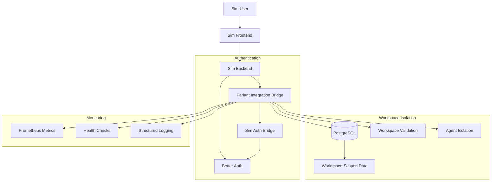

# Sim-Parlant Integration Bridge Documentation

## Overview

This documentation suite provides comprehensive guidance for the Sim-Parlant Integration Bridge, a secure, scalable system that connects Sim's existing infrastructure with Parlant conversational AI agents. The integration maintains strict workspace isolation while providing seamless authentication and powerful API capabilities.

## Documentation Structure

### 📋 [Architecture Documentation](./architecture.md)
**Complete integration architecture and design decisions**
- System architecture overview with detailed diagrams
- Authentication bridge architecture and user context mapping
- Workspace isolation implementation and multi-tenant security
- Performance considerations and scalability features
- Error handling strategies and recovery mechanisms

**Key Topics Covered:**
- Security-first design principles
- Microservice architecture patterns
- Database-level and API-level isolation
- Multi-layer security implementation
- Integration patterns and circuit breakers

### 🔌 [API Documentation](./api-documentation.md)
**Comprehensive API specifications and usage examples**
- Authentication flows and token management
- Agent management endpoints (create, list, get, update)
- Session management with workspace isolation
- Real-time messaging and WebSocket integration
- Error handling and response formats

**Key Topics Covered:**
- RESTful API endpoints with full examples
- WebSocket event specifications
- Rate limiting and security headers
- SDK examples for Python and JavaScript
- Comprehensive error codes and troubleshooting

### 🚀 [Deployment Guide](./deployment.md)
**Complete deployment and operations procedures**
- Environment configuration and secrets management
- Docker, direct deployment, and Kubernetes options
- Database setup and migration procedures
- Load balancing and reverse proxy configuration
- Backup and recovery procedures

**Key Topics Covered:**
- Production-ready deployment configurations
- Security configurations and SSL setup
- Database migration and schema management
- Monitoring integration and health checks
- Automated backup and disaster recovery

### 👨‍💻 [Developer Integration Guide](./developer-guide.md)
**Comprehensive guide for developers and integrators**
- Development environment setup and tooling
- Architecture extension points and customization
- Best practices for error handling and performance
- Testing strategies and security patterns
- Code examples for common integration scenarios

**Key Topics Covered:**
- Custom authentication providers
- Custom agent implementations and tool extensions
- Workspace isolation enhancements
- Performance optimization techniques
- Comprehensive testing patterns (unit, integration, load)

### 🔧 [Troubleshooting Guide](./troubleshooting.md)
**Operational troubleshooting and monitoring procedures**
- Common issues and diagnostic procedures
- Monitoring setup with Prometheus and Grafana
- Alerting configuration and incident response
- Performance monitoring and optimization
- Automated health checks and recovery procedures

**Key Topics Covered:**
- Authentication and database connection issues
- API performance and memory management
- Comprehensive monitoring and alerting setup
- Performance testing and load testing procedures
- Incident response and service restart procedures

## Quick Start Guide

### Prerequisites
- Python 3.11+
- PostgreSQL 14+
- Node.js 18+ (for tooling)
- Docker (recommended)

### Basic Setup
```bash
# Clone and setup
git clone https://github.com/sim/parlant-integration-bridge.git
cd parlant-integration-bridge

# Environment setup
python3.11 -m venv venv
source venv/bin/activate
pip install -r requirements.txt

# Configuration
cp .env.example .env
# Edit .env with your settings

# Database setup
python migrations/migrate.py

# Start development server
uvicorn main:app --host 0.0.0.0 --port 8001 --reload
```

### Health Check
```bash
curl http://localhost:8001/health
```

### Basic API Usage
```bash
# Get authentication status
curl -H "Authorization: Bearer <your_sim_token>" \
     http://localhost:8001/api/v1/auth/status

# Create an agent
curl -X POST \
     -H "Authorization: Bearer <your_sim_token>" \
     -H "Content-Type: application/json" \
     -d '{"name":"Test Agent","workspace_id":"your_workspace_id"}' \
     http://localhost:8001/api/v1/agents
```

## Architecture Summary



## Key Features

### 🔐 **Security & Authentication**
- **Better Auth Integration**: Seamless integration with Sim's existing authentication system
- **Workspace Isolation**: Strict boundaries preventing cross-workspace data access
- **Multi-Tenant Security**: Enterprise-grade security with role-based access control
- **Token Validation**: Real-time session validation with intelligent caching

### ⚡ **Performance & Scalability**
- **Async Architecture**: FastAPI-based async implementation for high performance
- **Connection Pooling**: Optimized database connection management
- **Intelligent Caching**: Multi-layer caching for authentication and frequent operations
- **Horizontal Scaling**: Stateless design enables easy scaling across instances

### 📊 **Monitoring & Observability**
- **Prometheus Metrics**: Comprehensive metrics for monitoring and alerting
- **Structured Logging**: JSON-formatted logs with contextual information
- **Health Checks**: Multi-layer health monitoring with automated recovery
- **Performance Tracking**: Response time and error rate monitoring

### 🛠️ **Developer Experience**
- **Comprehensive APIs**: RESTful APIs with full OpenAPI/Swagger documentation
- **WebSocket Support**: Real-time messaging and event streaming
- **SDK Support**: Python and JavaScript SDK examples
- **Testing Framework**: Complete testing setup with fixtures and examples

### 🔄 **Operational Excellence**
- **Database Migrations**: Automated schema management and versioning
- **Backup & Recovery**: Automated backup procedures with integrity verification
- **Circuit Breakers**: Fault tolerance with automatic fallback mechanisms
- **Graceful Degradation**: Service continues operating during partial failures

## Security Considerations

### Data Protection
- All data encrypted in transit (TLS/HTTPS)
- Database connections use SSL/TLS encryption
- Sensitive configuration via environment variables or secrets manager
- No hardcoded credentials or API keys in source code

### Access Control
- JWT-based authentication with configurable expiration
- Workspace-scoped authorization on all operations
- Role-based permissions inherited from Sim system
- API rate limiting to prevent abuse

### Audit & Compliance
- Comprehensive audit logging of all operations
- Request tracing with unique correlation IDs
- Data retention policies configurable per workspace
- GDPR compliance considerations for user data

## Deployment Considerations

### Environment Requirements
- **Development**: 2 vCPU, 4GB RAM, 20GB storage
- **Production**: 4+ vCPU, 8+ GB RAM, 100+ GB storage with backups
- **Database**: Shared PostgreSQL instance with Sim (recommended) or dedicated instance

### Scaling Strategies
- **Horizontal Scaling**: Deploy multiple instances behind load balancer
- **Database Scaling**: Connection pooling, read replicas for heavy read workloads
- **Caching**: Redis for distributed caching across instances
- **CDN**: Static assets and frequently accessed data

### Monitoring Requirements
- **Metrics**: Prometheus for metrics collection and alerting
- **Logging**: Centralized logging with ELK stack or similar
- **APM**: Application performance monitoring for request tracing
- **Alerting**: PagerDuty, Slack, or email integration for critical issues

## Support and Contributing

### Getting Help
- **Documentation Issues**: Open GitHub issue with "documentation" label
- **Bug Reports**: Use issue template with reproduction steps
- **Feature Requests**: Discuss on GitHub Discussions before opening issue
- **Security Issues**: Email security@sim.com directly

### Contributing Guidelines
- Follow existing code style and linting rules
- Include comprehensive tests for new features
- Update documentation for API changes
- Ensure all CI checks pass before submitting PR

### Development Workflow
1. Fork repository and create feature branch
2. Implement changes with tests and documentation
3. Run full test suite and linting checks
4. Submit PR with clear description and rationale
5. Address code review feedback promptly

## License and Legal

This integration bridge is proprietary software developed for Sim's internal use. Access to source code and documentation is restricted to authorized personnel.

For questions about licensing or usage rights, contact legal@sim.com.

---

**Last Updated**: 2024-01-23
**Version**: 1.0.0
**Maintainer**: Sim Engineering Team