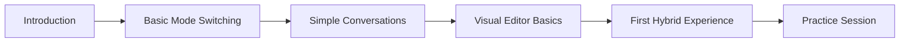
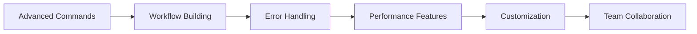
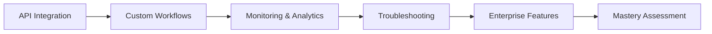

# Interactive Learning Materials - Hybrid Visual/Conversational Workflow Experience

## Overview

This comprehensive learning resource provides hands-on tutorials, interactive examples, and guided experiences designed to help users master the hybrid visual/conversational workflow system. The materials are structured for progressive learning, from basic concepts to advanced techniques.

## Table of Contents

- [Learning Path Overview](#learning-path-overview)
- [Quick Start Tutorial](#quick-start-tutorial)
- [Interactive Examples](#interactive-examples)
- [Scenario-Based Learning](#scenario-based-learning)
- [Video Walkthroughs](#video-walkthroughs)
- [Practice Challenges](#practice-challenges)
- [Troubleshooting Scenarios](#troubleshooting-scenarios)
- [Assessment Materials](#assessment-materials)

---

## Learning Path Overview

### Beginner Path (2-4 hours)


### Intermediate Path (4-6 hours)


### Advanced Path (6-8 hours)


---

## Quick Start Tutorial

### Tutorial 1: Your First Hybrid Workflow (15 minutes)

#### Step 1: Setting Up Your Environment
```markdown
**Objective**: Enable hybrid mode and explore the interface

**Actions**:
1. Open any workflow in your Sim workspace
2. Look for the "Chat with Workflow" button in the toolbar
3. Click to activate conversational mode
4. Notice the split interface: visual editor on left, chat on right

**Expected Result**: You should see both interfaces active simultaneously

**Screenshot Reference**: [Interface with chat panel enabled]
```

#### Step 2: First Conversation
```markdown
**Objective**: Start your first conversation with a workflow

**Actions**:
1. In the chat panel, type: "Hello, what does this workflow do?"
2. Wait for the AI response explaining the workflow
3. Ask: "Show me the first step"
4. Notice how the visual editor highlights the corresponding node

**Expected Conversation**:
User: "Hello, what does this workflow do?"

AI: "Hello! This is a Customer Onboarding workflow with 6 steps. It handles new customer registration, sends welcome emails, creates accounts, and sets up initial preferences. Would you like me to walk you through each step or start running the workflow?"

User: "Show me the first step"

AI: "The first step is 'Validate Customer Data' (highlighted in green on the visual editor). This step checks that all required customer information is present and properly formatted. It validates email addresses, phone numbers, and required fields. Would you like to see the validation rules or move to the next step?"
```

#### Step 3: Mode Switching Practice
```markdown
**Objective**: Practice switching between different modes

**Actions**:
1. Click the "Visual" mode button - chat panel disappears
2. Click the "Chat" mode button - visual editor minimizes
3. Click the "Hybrid" mode button - both panels return
4. Try keyboard shortcuts: Alt+V, Alt+C, Alt+H

**Key Learning**: Each mode has distinct advantages for different tasks
```

### Tutorial 2: Executing Your First Workflow (20 minutes)

#### Step 1: Preparing Input Data
```markdown
**Objective**: Learn to provide input data through conversation

**Chat Example**:
User: "I want to run this workflow for a new customer"

AI: "Great! I'll need some customer information to get started. Can you provide:
- Customer name
- Email address
- Phone number
- Company name (optional)"

User: "Name is John Smith, email john.smith@example.com, phone 555-123-4567"

AI: "Perfect! I've recorded:
✓ Name: John Smith
✓ Email: john.smith@example.com
✓ Phone: 555-123-4567
✓ Company: (not provided - will use default)

Ready to start the workflow? I can run it step-by-step so you can see what happens, or run it automatically. What would you prefer?"
```

#### Step 2: Step-by-Step Execution
```markdown
**Objective**: Experience guided workflow execution

**Chat Flow**:
User: "Let's go step by step"

AI: "Excellent choice for learning! Starting step 1: Data Validation...

✅ Step 1 Complete: All customer data is valid
- Email format: ✓ Valid
- Phone format: ✓ Valid
- Required fields: ✓ Complete

Ready for Step 2: 'Send Welcome Email'? This will send a welcome message to john.smith@example.com using our standard template. Should I proceed?"

User: "Yes, send the email"

AI: "✅ Step 2 Complete: Welcome email sent successfully
- Sent to: john.smith@example.com
- Template: New Customer Welcome
- Delivery status: Confirmed

Moving to Step 3: 'Create User Account'..."
```

#### Step 3: Visual Synchronization
```markdown
**Objective**: Observe how chat actions update the visual editor

**What to Notice**:
- As each step executes, the corresponding visual node changes color
- Completed steps show green checkmarks
- Current step pulses or highlights
- Progress bar updates in real-time
- Connections between nodes show data flow

**Try This**: While the workflow runs, click on different nodes in the visual editor and notice how the chat provides context about each step.
```

---

## Interactive Examples

### Example 1: Customer Support Workflow

#### Workflow Structure
```yaml
Name: "Customer Support Ticket Processing"
Steps:
  1. Receive Support Request
  2. Classify Issue Type
  3. Assign Priority Level
  4. Route to Specialist
  5. Generate Response
  6. Send to Customer
  7. Update Ticket Status
```

#### Interactive Conversation Script
```markdown
**Scenario**: A customer support ticket needs processing

**Try This Conversation**:

User: "I have a new support ticket to process"

AI: "I'll help you process this support ticket! Can you tell me about the customer's issue?"

User: "Customer can't log into their account, says password reset isn't working"

AI: "I understand. This sounds like an authentication issue. Let me process this:

🔍 Step 1: Support request received
📋 Step 2: Classifying as 'Authentication Issue'
⚡ Step 3: Setting priority to 'Medium' (account access issues)
👤 Step 4: Routing to Authentication Specialist team

For Step 5, I can generate a response. Would you like me to:
A) Create a standard password reset response
B) Create a custom response for complex cases
C) Let you write a custom response"

User: "Create a standard response"

AI: "✅ Step 5: Generated standard response:

'Hi [Customer Name],

We understand you're having trouble with password reset. I've initiated a fresh password reset for your account. Please check your email (including spam folder) for reset instructions.

If you still have issues, please reply with your account email and we'll assist further.

Best regards,
Support Team'

Should I send this to the customer now?"
```

### Example 2: Data Processing Pipeline

#### Workflow Structure
```yaml
Name: "Daily Sales Report Generation"
Steps:
  1. Connect to Database
  2. Extract Sales Data
  3. Apply Filters and Calculations
  4. Generate Charts
  5. Format Report
  6. Email to Stakeholders
```

#### Advanced Conversation Features
```markdown
**Try These Advanced Commands**:

User: "Run the sales report but exclude refunded transactions"

AI: "I'll modify the filters for this run. In Step 3 'Apply Filters', I'll add:
- Exclude transactions with status = 'refunded'
- Keep all other standard filters (date range, completed sales)

Should I proceed with this modification?"

User: "Yes, and make the date range last 7 days instead of yesterday"

AI: "Perfect! Modified filters:
✓ Date range: Last 7 days (instead of yesterday)
✓ Exclude refunds: Yes
✓ Status: Completed sales only

This will give us a weekly view without any refunded transactions. Starting execution..."

**[Visual editor shows modified node with different color indicating customization]**
```

### Example 3: Multi-Branch Workflow

#### Conditional Logic Example
```markdown
**Workflow**: Invoice Processing with Approval Routing

User: "Process this invoice for $15,000"

AI: "I see this is a $15,000 invoice. Based on our approval rules:
- Amount > $10,000 requires manager approval
- Amount > $25,000 requires executive approval

This invoice will follow the Manager Approval path. I can see two routes ahead:

Route A: Manager Approves → Process Payment
Route B: Manager Rejects → Send Back to Requestor

Should I proceed and wait for manager approval, or would you like to simulate an approval decision for learning purposes?"

User: "Simulate manager approval"

AI: "Simulating manager approval... ✅ Approved!

Following the green path in your visual editor:
✅ Manager Review: Approved
→ Moving to 'Process Payment' step
→ Then 'Send Confirmation Email'
→ Finally 'Update Financial Records'

Notice how the visual editor shows the active path in green while the rejected path (in gray) shows what would have happened if the manager had rejected it."
```

---

## Scenario-Based Learning

### Scenario 1: Onboarding New Team Member

#### Context
```markdown
**Situation**: You're training a new team member on hybrid workflows
**Duration**: 30 minutes
**Learning Goals**:
- Understand when to use each mode
- Practice common troubleshooting
- Learn collaboration features
```

#### Guided Roleplay
```markdown
**You are the trainer. The new team member asks:**

"I'm confused about when to use visual mode vs. chat mode. Can you show me?"

**Your Response Options**:
A) "Let me show you with this marketing campaign workflow..."
B) "Great question! Let's start with your specific use case..."
C) "I'll demonstrate with three different scenarios..."

**Recommended Approach**: Choose option C and demonstrate:

1. **Visual Mode Example**:
   "When I'm building a new workflow, I use visual mode because I can see all the connections and logic clearly. Watch as I drag these nodes and connect them..."

2. **Chat Mode Example**:
   "When I just need to run a routine workflow, chat is faster. I can say 'run the monthly report' and monitor progress without the visual complexity..."

3. **Hybrid Mode Example**:
   "When I'm troubleshooting or learning, hybrid mode is perfect. I can see what's happening visually while asking questions. Let me show you..."
```

### Scenario 2: Troubleshooting a Stuck Workflow

#### Problem-Solving Exercise
```markdown
**Situation**: A workflow has been running for 20 minutes and seems stuck

**Chat Conversation**:
User: "My workflow seems stuck. It's been on step 3 for 20 minutes."

AI: "Let me help you troubleshoot. I can see the workflow is indeed waiting on Step 3: 'API Data Fetch'. Here are the likely causes:

🔍 Diagnostic Results:
- API endpoint responding: ✓ Yes (200 OK)
- Network connectivity: ✓ Good
- Rate limiting: ⚠️ Possible (487 requests in last hour)
- Timeout settings: ⚠️ Current timeout: 30 minutes

**Most likely cause**: Rate limiting from the external API

**Suggested Actions**:
A) Wait for rate limit reset (in ~10 minutes)
B) Retry with backoff strategy
C) Skip this step and process manually
D) Cancel and reschedule for later

What would you like to do?"

**Learning Exercise**: Try each option and see the different outcomes and visual feedback.
```

### Scenario 3: Optimizing Workflow Performance

#### Performance Analysis Workshop
```markdown
**Scenario Setup**:
- Workflow takes 45 minutes to complete
- Business wants it under 15 minutes
- Multiple optimization opportunities exist

**Investigation Process**:

User: "This workflow is too slow. Can you help me identify bottlenecks?"

AI: "I'll analyze the performance data from recent runs:

📊 **Performance Breakdown** (Average times):
- Step 1 (Data Collection): 2 minutes ✅ Good
- Step 2 (Data Processing): 28 minutes ⚠️ BOTTLENECK
- Step 3 (Report Generation): 12 minutes ⚠️ Slow
- Step 4 (Email Delivery): 3 minutes ✅ Good

**Root Cause Analysis**:
- Step 2 processes 50,000 records sequentially
- Step 3 generates 47 different charts
- Both could benefit from parallel processing

**Optimization Suggestions**:
1. Enable parallel processing in Step 2 (estimated 80% reduction)
2. Generate only essential charts in Step 3 (estimated 60% reduction)
3. Add caching for repeated calculations

Would you like me to implement these optimizations?"

**Hands-on Learning**: Apply optimizations and measure results
```

---

## Video Walkthroughs

### Video Series: "Mastering Hybrid Workflows"

#### Video 1: "Introduction and First Steps" (8 minutes)
```markdown
**Content Overview**:
00:00 - Welcome and overview
01:30 - Enabling hybrid mode
02:45 - Interface tour and navigation
04:20 - First conversation example
06:10 - Mode switching demonstration
07:30 - Key takeaways and next steps

**Interactive Elements**:
- Pause points for hands-on practice
- Quiz questions at key moments
- "Try this yourself" callouts

**Accompanying Materials**:
- Practice worksheet
- Quick reference card
- Links to related examples
```

#### Video 2: "Building Workflows Conversationally" (12 minutes)
```markdown
**Content Overview**:
00:00 - Recap of basic concepts
01:00 - Creating workflows through chat
03:30 - Adding complex logic with conversation
05:45 - Visual validation and editing
08:20 - Testing and debugging
10:30 - Best practices
11:45 - Summary and resources

**Practical Exercise**:
Build a complete workflow using only conversational commands, then validate visually.
```

#### Video 3: "Advanced Features and Integration" (15 minutes)
```markdown
**Advanced Topics Covered**:
- API integrations through chat commands
- Custom tool configurations
- Team collaboration features
- Performance monitoring
- Troubleshooting complex issues

**Real-world Example**:
Complete walkthrough of enterprise sales pipeline automation
```

### Interactive Video Features

#### Choose Your Own Adventure
```markdown
**Format**: Interactive decision points in video content

**Example Decision Point** (at 4:32 in Video 2):
"Now that we've created the basic workflow structure, what should we do next?

A) Add error handling logic
B) Configure input parameters
C) Set up notifications
D) Test with sample data

**Click your choice to continue with that path...**

[Each choice leads to different video segments with tailored content]
```

#### Embedded Practice Sessions
```markdown
**Live Coding Segments**:
- Videos pause automatically at practice points
- Embedded Sim interface appears for hands-on work
- Progress tracked and validated
- Resume video after completing exercise

**Example Integration**:
Video shows workflow creation → Pauses → User creates similar workflow → Validation → Video continues with next concept
```

---

## Practice Challenges

### Challenge 1: "Speed Run - Basic Workflow" (Beginner)

#### Objective
```markdown
**Goal**: Complete a full workflow lifecycle in under 10 minutes
**Skills**: Mode switching, basic commands, execution monitoring

**Challenge Steps**:
1. Enable hybrid mode (30 seconds)
2. Create simple 3-step workflow via chat (3 minutes)
3. Add input parameters conversationally (2 minutes)
4. Execute workflow with test data (3 minutes)
5. Troubleshoot any issues (1.5 minutes)

**Success Criteria**:
✅ Workflow executes successfully
✅ Completed within time limit
✅ No syntax or configuration errors
✅ Results validated

**Scoring**:
- Gold: Under 7 minutes
- Silver: 7-9 minutes
- Bronze: 9-10 minutes
- Practice more: Over 10 minutes
```

#### Starter Template
```markdown
**Use this workflow idea**: Customer Feedback Processing
- Step 1: Receive feedback form
- Step 2: Analyze sentiment
- Step 3: Route to appropriate team

**Sample Input Data**:
{
  "customer_name": "Alice Johnson",
  "feedback": "The product is amazing but delivery was slow",
  "rating": 4,
  "category": "product_and_shipping"
}

**Expected Output**: Feedback routed to both Product team (positive) and Shipping team (improvement needed)
```

### Challenge 2: "Debugging Detective" (Intermediate)

#### The Mystery
```markdown
**Scenario**: A workflow that worked yesterday is now failing mysteriously

**Your Mission**:
1. Identify why the "Monthly Sales Analysis" workflow fails at Step 4
2. The error message is cryptic: "Processing timeout in analysis module"
3. Visual editor shows Step 4 in red, but no clear indication why
4. Previous runs completed successfully

**Clues Provided**:
- Workflow hasn't been modified
- Data source is accessible
- Network connectivity is normal
- Other workflows are working fine

**Detective Tools Available**:
- Conversation with AI assistant
- Visual workflow inspection
- Execution logs
- Performance metrics
- Historical run data
```

#### Investigation Process
```markdown
**Guided Investigation** (Try these approaches):

**Approach 1: Chat Investigation**
User: "Why is my workflow failing at Step 4?"

AI: "Let me investigate the failure... I found several clues:
- Step 4 processes 3x more data than usual (150,000 vs 50,000 records)
- Timeout is set to 10 minutes, but processing now takes 18 minutes
- Data volume increased due to Black Friday sales spike

**Root Cause**: Data volume exceeded timeout limits
**Solution**: Increase timeout or add data pagination"

**Approach 2: Visual Analysis**
- Click on failing Step 4 node
- Examine input/output data volumes
- Check timeout settings
- Compare with historical performance

**Challenge**: Find the solution using both chat and visual tools together
```

### Challenge 3: "Collaboration Master" (Advanced)

#### Team Scenario
```markdown
**Setup**: You're working with 3 other team members on a complex workflow

**Roles**:
- You: Project coordinator
- Sarah: Data analyst (prefers visual mode)
- Mike: Developer (prefers chat mode)
- Lisa: Business user (prefers hybrid mode)

**Challenge**: Coordinate workflow creation where everyone contributes using their preferred interface
```

#### Collaboration Exercise
```markdown
**Phase 1: Planning** (Chat-driven)
You: "Team, let's plan our customer journey workflow. Sarah, what data points do we need?"

Sarah: [Working in visual mode] "I've mapped out the data flow visually. We need 12 data points across 3 customer touchpoints."

Mike: [Working in chat mode] "I can handle the API integrations. Tell me about the data transformations needed."

Lisa: [Working in hybrid mode] "From a business perspective, we need approval gates at key decision points. I can see Sarah's visual layout and it looks good."

**Your Task**: Coordinate input from all team members and ensure the final workflow meets everyone's requirements.

**Success Criteria**:
- All team members contribute effectively
- Final workflow incorporates technical, business, and data requirements
- Everyone can work in their preferred mode
- No conflicts or integration issues
```

---

## Troubleshooting Scenarios

### Scenario 1: "The Mysterious Timeout"

#### Problem Description
```markdown
**User Report**: "My workflow keeps timing out, but it worked fine last week"

**Initial Investigation**:
Chat with user reveals:
- Same workflow, no changes made
- Different results each time it runs
- Sometimes completes in 5 minutes, sometimes times out at 30 minutes
- Timeout happens at different steps

**Your Diagnostic Process**:
Use hybrid mode to investigate systematically
```

#### Diagnostic Conversation
```markdown
User: "Help me figure out why this workflow is inconsistent"

AI: "Inconsistent performance suggests external dependencies or resource contention. Let me check:

🔍 **System Health Check**:
- Server resources: ✅ Normal (CPU: 45%, Memory: 62%)
- Database connections: ⚠️ High (85 of 100 connections used)
- External API status: ⚠️ Variable response times (2-45 seconds)
- Network latency: ⚠️ Inconsistent (50-800ms)

**Root Cause Identified**: External API performance is highly variable
- Monday mornings: High load (slow responses)
- Weekends: Low load (fast responses)
- Current time: Peak usage period

**Solutions**:
1. Add retry logic with exponential backoff
2. Implement API response caching
3. Use alternative API during peak times
4. Increase timeout thresholds during known peak periods

Would you like me to implement solution #1 first?"
```

### Scenario 2: "The Sync Problem"

#### Issue Description
```markdown
**Problem**: Visual editor and chat interface showing different states

**User Experience**:
- Chat says "Step 3 completed successfully"
- Visual editor shows Step 3 still in progress
- Confusion about actual workflow state
- Unable to proceed confidently
```

#### Resolution Steps
```markdown
**Troubleshooting Process**:

Step 1: Identify sync issue
User: "My visual and chat interfaces don't match"

AI: "I detect a synchronization issue. Let me force a refresh of both interfaces...

🔄 **Sync Status Check**:
- Visual editor state: Step 3 (In Progress)
- Chat interface state: Step 3 (Completed)
- Database state: Step 3 (Completed at 14:32:18)
- Socket connection: ⚠️ Degraded

**Issue Found**: Network interruption caused missed state update

**Resolution**:
1. Reconnecting real-time updates... ✅
2. Synchronizing visual editor... ✅
3. Validating state consistency... ✅

Both interfaces now show: Step 3 ✅ Completed, Step 4 ⏳ In Progress"

Step 2: Prevention
AI: "To prevent this in the future, I've enabled:
- Enhanced connection monitoring
- Automatic state reconciliation
- Offline state caching
- Connection recovery notifications"
```

### Scenario 3: "The Performance Mystery"

#### Complex Performance Issue
```markdown
**Situation**: Workflow performance degrades over time

**Symptoms**:
- First run: 8 minutes
- Second run: 12 minutes
- Third run: 18 minutes
- Fourth run: 25 minutes
- Pattern continues until restart

**Investigation Required**: Multi-layered performance analysis
```

#### Advanced Troubleshooting
```markdown
**Performance Investigation**:

User: "My workflow gets slower each time I run it"

AI: "This pattern suggests a resource leak or cumulative performance issue. Let me run comprehensive diagnostics:

📊 **Deep Performance Analysis**:

**Memory Usage Pattern**:
- Run 1: 2.1 GB → 2.3 GB (normal)
- Run 2: 2.3 GB → 2.8 GB (concerning)
- Run 3: 2.8 GB → 3.6 GB (memory leak detected)
- Run 4: 3.6 GB → 4.9 GB (critical)

**Database Connection Pool**:
- Run 1: 5 connections used
- Run 2: 8 connections used
- Run 3: 12 connections used
- Run 4: 18 connections used (connections not releasing)

**Root Cause**: Memory and connection leaks in Step 2 'Data Processing'

**Technical Details**:
- Large objects not being garbage collected
- Database connections not properly closed
- Cache growing without bounds

**Solutions Applied**:
1. ✅ Fixed connection cleanup in Step 2
2. ✅ Added explicit garbage collection triggers
3. ✅ Implemented cache size limits
4. ✅ Added resource monitoring alerts

**Verification**: Next run should show consistent 8-minute performance"

**Follow-up**: User runs workflow again, confirms performance is stable
```

---

## Assessment Materials

### Knowledge Check Quiz

#### Section 1: Basic Concepts (5 questions)

**Question 1**: When should you use Visual mode?
```markdown
A) When running routine workflows
B) When creating new workflows or making structural changes
C) When you want to minimize screen real estate
D) When working on mobile devices

**Correct Answer**: B
**Explanation**: Visual mode is optimal for workflow creation and structural modifications because you can see connections, logic flow, and overall architecture clearly.
```

**Question 2**: What keyboard shortcut switches to Hybrid mode?
```markdown
A) Ctrl + H
B) Alt + H
C) Shift + H
D) Tab

**Correct Answer**: B
**Explanation**: Alt + H switches to Hybrid mode, while Alt + V goes to Visual and Alt + C goes to Chat mode.
```

#### Section 2: Practical Application (3 scenarios)

**Scenario A**: You need to troubleshoot a workflow that's failing inconsistently. Which approach is most effective?

```markdown
A) Use Visual mode to examine node configurations
B) Use Chat mode to ask the AI for diagnostic help
C) Use Hybrid mode to correlate visual state with AI diagnostics
D) Switch between modes randomly until you find the issue

**Correct Answer**: C
**Explanation**: Hybrid mode allows you to see visual indicators of problems while simultaneously getting AI-powered diagnostic insights, making troubleshooting more effective.
```

### Practical Skills Assessment

#### Assessment 1: Complete Workflow Lifecycle

**Task Description**:
```markdown
**Time Limit**: 20 minutes
**Scenario**: Create a workflow for processing customer returns

**Requirements**:
1. Create workflow using conversational commands
2. Add conditional logic for different return reasons
3. Include approval processes for high-value returns
4. Test with sample data
5. Demonstrate error handling
6. Show performance metrics

**Evaluation Criteria**:
- Functional workflow (40 points)
- Proper use of hybrid interface (20 points)
- Error handling implementation (20 points)
- Code quality and best practices (20 points)

**Bonus Points**:
- Creative use of advanced features (+10)
- Excellent user experience design (+10)
```

#### Assessment 2: Collaborative Problem Solving

**Team Challenge**:
```markdown
**Setup**: Work with partner to solve complex workflow issue
**Time**: 30 minutes
**Roles**:
- Person A: Technical implementer (prefers visual mode)
- Person B: Business analyst (prefers chat mode)

**Scenario**: Optimize a slow workflow while maintaining business requirements

**Success Criteria**:
- Both team members contribute effectively
- Solution addresses technical and business needs
- Proper use of collaborative features
- Clear communication throughout process
- Measurable performance improvement achieved

**Assessment Dimensions**:
- Technical competency
- Communication effectiveness
- Tool utilization
- Problem-solving approach
- Collaboration quality
```

### Mastery Certification

#### Requirements for Certification

**Level 1: Hybrid Workflow Practitioner**
```markdown
**Prerequisites**: Complete all beginner tutorials

**Requirements**:
✅ Pass knowledge quiz (80% minimum)
✅ Complete 3 practical assessments successfully
✅ Demonstrate all three interface modes
✅ Show basic troubleshooting skills
✅ Create one original workflow from scratch

**Certification Benefits**:
- Digital badge for LinkedIn/resume
- Access to intermediate learning materials
- Community forum access
- Monthly expert Q&A sessions
```

**Level 2: Hybrid Workflow Expert**
```markdown
**Prerequisites**: Level 1 certification + 40 hours practice time

**Requirements**:
✅ Advanced skills assessment (85% minimum)
✅ Team collaboration project
✅ Performance optimization case study
✅ Troubleshooting complex scenarios
✅ Mentor one new user through Level 1

**Certification Benefits**:
- Expert badge and recognition
- Beta access to new features
- Invitation to expert advisory group
- Speaking opportunities at events
```

**Level 3: Hybrid Workflow Master**
```markdown
**Prerequisites**: Level 2 certification + proven expertise

**Requirements**:
✅ Contribute to product improvement suggestions
✅ Create advanced learning materials
✅ Lead team training sessions
✅ Solve enterprise-level implementation challenges
✅ Demonstrate innovation in workflow design

**Certification Benefits**:
- Master certification recognition
- Direct line to product development team
- Co-creation opportunities for new features
- Conference speaking and thought leadership
```

---

## Additional Resources

### Quick Reference Materials

#### Cheat Sheet: Common Commands
```markdown
**Mode Switching**:
- Alt + V: Visual mode
- Alt + C: Chat mode
- Alt + H: Hybrid mode
- Tab: Quick toggle

**Chat Commands**:
- "start" / "run" / "execute": Begin workflow
- "pause" / "stop": Pause execution
- "status" / "progress": Check current state
- "help": Show available commands
- "explain [step]": Get step details
- "skip" / "retry": Modify execution flow

**Troubleshooting**:
- "what's wrong?": General diagnostics
- "why is this slow?": Performance analysis
- "show errors": Display error details
- "fix this": Get solution suggestions
```

#### Performance Tips Card
```markdown
**Best Practices**:
✅ Use Visual mode for complex editing
✅ Use Chat mode for routine execution
✅ Use Hybrid mode for learning and troubleshooting
✅ Clear browser cache if experiencing sync issues
✅ Use keyboard shortcuts for faster mode switching
✅ Save workflows before making major changes
✅ Test workflows with sample data before production use

**Performance Optimization**:
- Close unused browser tabs when using Hybrid mode
- Use "technical" communication style for faster responses
- Batch similar commands when possible
- Monitor system resources during heavy workflows
```

### Community and Support

#### Learning Community
```markdown
**Official Forums**:
- Beginner Questions & Answers
- Advanced Techniques Discussion
- Workflow Sharing Gallery
- Troubleshooting Help
- Feature Requests and Ideas

**Community Events**:
- Weekly "Workflow Wednesday" tutorials
- Monthly expert AMAs
- Quarterly virtual conferences
- Annual user summit

**User-Generated Content**:
- Community tutorial videos
- Workflow template library
- Best practices wiki
- Success story case studies
```

#### Getting Help
```markdown
**Support Channels**:
- In-app help system (F1 key)
- Live chat support (business hours)
- Community forums (24/7 peer help)
- Video call support (enterprise customers)
- Email support (48-hour response)

**Self-Help Resources**:
- Comprehensive documentation
- Interactive tutorials
- Video learning library
- Troubleshooting guides
- FAQ database
```

---

*This interactive learning guide provides comprehensive hands-on materials for mastering the Hybrid Visual/Conversational Workflow Experience. Practice regularly, engage with the community, and don't hesitate to ask for help when needed. Happy learning!*