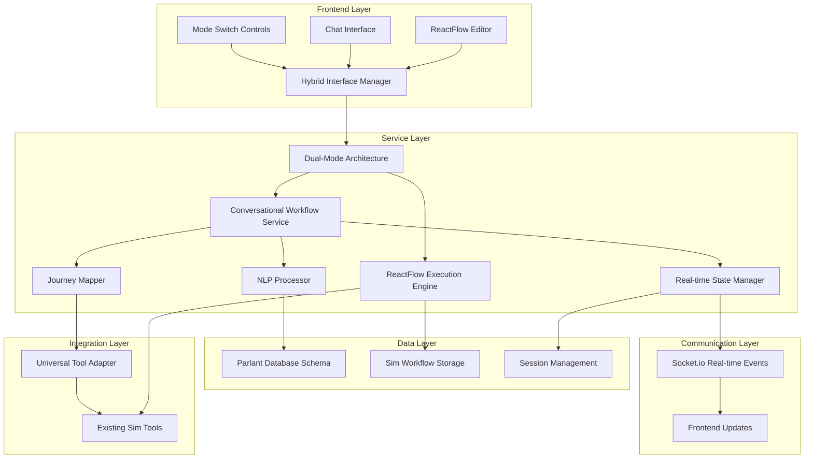

# Technical API Documentation - Hybrid Visual/Conversational Workflow Experience

## Overview

The Hybrid Visual/Conversational Workflow Experience is a comprehensive system that seamlessly bridges Sim's existing ReactFlow visual workflows with Parlant's conversational AI framework. This documentation provides complete technical specifications for developers implementing, extending, and integrating with the hybrid workflow system.

## Architecture Overview



## Core Components

### 1. Dual-Mode Architecture

The foundation of the hybrid experience, enabling seamless switching between visual and conversational interfaces.

#### Class: `DualModeExecutionArchitecture`

**Location**: `/apps/sim/lib/workflow-journey-mapping/dual-mode-architecture.ts`

```typescript
class DualModeExecutionArchitecture {
  constructor(config: DualModeConfig)

  // Core Methods
  async initializeDualModeContext(workflowId: string, reactFlowState: WorkflowState): Promise<WorkflowExecutionContext>
  async executeWorkflow(workflowId: string, options?: any): Promise<any>
  async switchExecutionMode(workflowId: string, mode: 'reactflow' | 'journey'): Promise<void>
  async synchronizeStates(context: WorkflowExecutionContext): Promise<void>
}
```

#### Configuration Interface

```typescript
interface DualModeConfig {
  reactFlowEnabled: boolean           // Enable ReactFlow visual editor
  journeyMappingEnabled: boolean      // Enable conversational mode
  preferredMode: 'reactflow' | 'journey' | 'auto'  // Default execution mode
  fallbackMode: 'reactflow' | 'journey'  // Fallback when preferred mode fails
  synchronizationEnabled: boolean     // Enable real-time state sync
}
```

#### Execution Context

```typescript
interface WorkflowExecutionContext {
  workflowId: string
  executionMode: ExecutionMode
  reactFlowState: WorkflowState       // Current ReactFlow state
  journeyState?: any                  // Mapped Parlant journey state
  synchronizationStatus: SynchronizationStatus
}
```

### 2. Conversational Workflow Service

Orchestrates conversational interactions with workflows.

#### Class: `ConversationalWorkflowService`

**Location**: `/apps/sim/services/parlant/conversational-workflows/core.ts`

```typescript
class ConversationalWorkflowService {
  // Session Management
  async createConversationalWorkflow(config: ConversationalWorkflowConfig): Promise<ConversationalWorkflowSession>
  async terminateWorkflowSession(sessionId: string): Promise<void>
  async processNaturalLanguageCommand(sessionId: string, input: string): Promise<CommandProcessingResult>

  // State Management
  async getWorkflowState(sessionId: string): Promise<ConversationalWorkflowState>
  async updateWorkflowState(sessionId: string, updates: Partial<ConversationalWorkflowState>): Promise<void>

  // Monitoring
  async getSessionMetrics(sessionId: string): Promise<SessionMetrics>
}
```

#### Configuration Interfaces

```typescript
interface ConversationalWorkflowConfig {
  workflowId: string
  conversationalConfig?: ConversationalConfig
  executionConfig?: WorkflowExecutionConfig
  initialInput?: Record<string, any>
  sessionMetadata?: Record<string, any>
}

interface ConversationalConfig {
  personalityProfile: string          // 'helpful-assistant' | 'professional' | 'casual'
  communicationStyle: 'formal' | 'casual' | 'technical' | 'friendly'
  verbosityLevel: 'minimal' | 'normal' | 'detailed' | 'verbose'
  showProgress: boolean               // Display progress indicators
  explainSteps: boolean              // Provide step explanations
  askForConfirmation: boolean        // Request confirmation before actions
  provideSuggestions: boolean        // Offer suggested actions
  gracefulDegradation: boolean       // Handle errors gracefully
  fallbackToVisual: boolean          // Fallback to visual editor on complex operations
}
```

### 3. Natural Language Processing

Processes user input and maps it to workflow actions.

#### Class: `NaturalLanguageProcessor`

```typescript
class NaturalLanguageProcessor {
  async processInput(input: string, context: ConversationContext): Promise<NLPResult>
  async extractIntent(input: string): Promise<IntentResult>
  async extractEntities(input: string): Promise<EntityResult[]>
  async generateResponse(intent: string, context: ConversationContext): Promise<string>
}

interface NLPResult {
  detectedIntent: string
  intentConfidence: number
  extractedEntities: EntityResult[]
  contextualReferences: ContextReference[]
  commandMapping: WorkflowCommand | null
  responseText: string
  suggestedActions: AvailableAction[]
}
```

#### Supported Intents

```typescript
type WorkflowIntent =
  | 'start-workflow'
  | 'pause-execution'
  | 'resume-execution'
  | 'cancel-workflow'
  | 'get-status'
  | 'explain-step'
  | 'skip-step'
  | 'retry-step'
  | 'modify-input'
  | 'get-help'
  | 'switch-mode'
```

### 4. Real-time State Management

Manages live updates and communication between interfaces.

#### Class: `RealtimeStateManager`

```typescript
class RealtimeStateManager {
  // Subscription Management
  async subscribeToWorkflowUpdates(sessionId: string, callback: UpdateCallback): Promise<void>
  async unsubscribeFromWorkflowUpdates(sessionId: string): Promise<void>

  // State Broadcasting
  async broadcastStateUpdate(update: WorkflowStateUpdate): Promise<void>
  async broadcastCommandProcessed(result: CommandProcessingResult): Promise<void>

  // Session Management
  async createSessionRoom(sessionId: string): Promise<void>
  async cleanupSession(sessionId: string): Promise<void>
}
```

## API Endpoints

### REST API

#### POST `/api/conversational-workflows`

Create a new conversational workflow session.

**Request Body:**
```typescript
{
  workflowId: string
  conversationalConfig?: ConversationalConfig
  executionConfig?: WorkflowExecutionConfig
  initialInput?: Record<string, any>
  sessionMetadata?: Record<string, any>
}
```

**Response:**
```typescript
{
  success: boolean
  data: {
    sessionId: string
    journeyId: string
    initialState: ConversationalWorkflowState
    welcomeMessage: string
    availableCommands: string[]
  }
  executionTime: number
}
```

#### POST `/api/conversational-workflows/{sessionId}/commands`

Process a natural language command.

**Request Body:**
```typescript
{
  naturalLanguageInput: string
  context?: Record<string, any>
}
```

**Response:**
```typescript
{
  success: boolean
  data: {
    commandProcessed: boolean
    workflowAction: string | null
    agentResponse: string
    updatedState: ConversationalWorkflowState
    suggestedActions: AvailableAction[]
  }
  executionTime: number
}
```

#### GET `/api/conversational-workflows/{sessionId}/state`

Get current workflow state and conversation history.

**Response:**
```typescript
{
  success: boolean
  data: {
    currentState: ConversationalWorkflowState
    recentHistory: ConversationTurn[]
    availableActions: AvailableAction[]
    progressSummary: string
  }
}
```

#### DELETE `/api/conversational-workflows/{sessionId}`

Terminate a conversational workflow session.

**Response:**
```typescript
{
  success: boolean
  data: {
    sessionId: string
    terminated: boolean
    finalState: ConversationalWorkflowState
  }
}
```

### Socket.io Events

#### Client → Server Events

##### `create-conversational-workflow`

```typescript
// Request
{
  workflowId: string
  conversationalConfig?: ConversationalConfig
  executionConfig?: WorkflowExecutionConfig
  initialInput?: Record<string, any>
  sessionMetadata?: Record<string, any>
}

// Response
{
  success: boolean
  data: {
    sessionId: string
    journeyId: string
    initialState: ConversationalWorkflowState
    welcomeMessage: string
    availableCommands: string[]
  }
  executionTime: number
}
```

##### `process-nl-command`

```typescript
// Request
{
  sessionId: string
  workflowId: string
  naturalLanguageInput: string
}

// Response
{
  success: boolean
  data: {
    commandProcessed: boolean
    workflowAction: string | null
    agentResponse: string
    updatedState: ConversationalWorkflowState
    suggestedActions: AvailableAction[]
  }
  executionTime: number
}
```

##### `switch-workflow-mode`

```typescript
// Request
{
  sessionId: string
  workflowId: string
  targetMode: 'visual' | 'conversational' | 'hybrid'
}

// Response
{
  success: boolean
  data: {
    currentMode: string
    modeCapabilities: ModeCapability[]
    transitionComplete: boolean
  }
}
```

#### Server → Client Events

##### `conversational-workflow-update`

Broadcast when workflow state changes occur.

```typescript
{
  updateId: string
  workflowId: string
  sessionId: string
  updateType: 'execution-started' | 'step-completed' | 'execution-paused' | 'execution-completed' | 'error-occurred'
  timestamp: Date
  data: Record<string, any>
  userMessage?: string
  agentMessage?: string
  showNotification?: boolean
}
```

##### `mode-switched`

Broadcast when interface mode changes.

```typescript
{
  sessionId: string
  workflowId: string
  previousMode: string
  currentMode: string
  capabilities: ModeCapability[]
  timestamp: Date
}
```

## Data Models

### Core State Interfaces

```typescript
interface ConversationalWorkflowState {
  sessionId: string
  workflowId: string
  executionStatus: 'idle' | 'running' | 'paused' | 'completed' | 'error'
  currentNodeId: string | null
  completedNodes: string[]
  progressPercentage: number
  lastActivity: Date
  conversationHistory: ConversationTurn[]
  availableActions: AvailableAction[]
  errorState?: ErrorState
}

interface ConversationTurn {
  id: string
  timestamp: Date
  userInput: string
  agentResponse: string
  workflowAction?: string
  metadata?: Record<string, any>
}

interface AvailableAction {
  id: string
  displayName: string
  description: string
  command: string
  parameters?: ActionParameter[]
  enabled: boolean
}
```

### Execution Interfaces

```typescript
interface WorkflowExecutionConfig {
  mode: 'step-by-step' | 'autonomous' | 'hybrid'
  pausePoints: string[]              // Node IDs where execution should pause
  autoApproval: boolean              // Auto-approve actions without confirmation
  timeoutMs: number                  // Maximum execution time
  retryPolicy: RetryPolicy
}

interface RetryPolicy {
  maxAttempts: number
  backoffStrategy: 'linear' | 'exponential' | 'fixed'
  backoffMs: number
  retryableErrors: string[]
}
```

### Error Handling

```typescript
interface ErrorState {
  errorCode: string
  message: string
  userMessage?: string              // User-friendly error message
  retryable: boolean
  context?: Record<string, any>
  suggestedActions: AvailableAction[]
}

class ConversationalWorkflowError extends Error {
  code: string
  userMessage?: string
  retryable: boolean
  context?: Record<string, any>

  constructor(code: string, message: string, options?: ErrorOptions)
}
```

## Integration Points

### Tool Integration

The hybrid workflow system integrates with Sim's existing tools through the Universal Tool Adapter system.

```typescript
interface ToolAdapter {
  toolId: string
  name: string
  description: string
  conversationalDescription: string
  parameters: ToolParameter[]

  // Execution methods
  execute(parameters: Record<string, any>): Promise<ToolResult>
  validateParameters(parameters: Record<string, any>): ValidationResult

  // Conversational methods
  explainUsage(context?: ConversationContext): string
  suggestParameters(context?: ConversationContext): ParameterSuggestion[]
}
```

### Authentication Integration

```typescript
interface AuthenticationContext {
  userId: string
  workspaceId: string
  permissions: Permission[]
  sessionToken: string
}

interface Permission {
  resource: string
  action: string
  granted: boolean
}
```

### Database Schema Extensions

The hybrid workflow system extends the existing Sim database with Parlant-specific tables:

```sql
-- Conversational workflow sessions
CREATE TABLE conversational_workflow_sessions (
  id UUID PRIMARY KEY,
  workflow_id UUID REFERENCES workflows(id),
  user_id UUID REFERENCES users(id),
  workspace_id UUID REFERENCES workspaces(id),
  journey_id VARCHAR(255),
  configuration JSONB,
  state JSONB,
  created_at TIMESTAMP DEFAULT NOW(),
  updated_at TIMESTAMP DEFAULT NOW(),
  expires_at TIMESTAMP
);

-- Conversation history
CREATE TABLE conversation_turns (
  id UUID PRIMARY KEY,
  session_id UUID REFERENCES conversational_workflow_sessions(id),
  user_input TEXT,
  agent_response TEXT,
  workflow_action VARCHAR(255),
  metadata JSONB,
  created_at TIMESTAMP DEFAULT NOW()
);

-- Session metrics
CREATE TABLE session_metrics (
  id UUID PRIMARY KEY,
  session_id UUID REFERENCES conversational_workflow_sessions(id),
  metric_name VARCHAR(255),
  metric_value DECIMAL,
  recorded_at TIMESTAMP DEFAULT NOW()
);
```

## Performance Considerations

### Caching Strategy

```typescript
interface CacheConfig {
  workflowMappings: {
    ttl: number                      // 1 hour
    maxEntries: number               // 1000 mappings
  }
  nlpResults: {
    ttl: number                      // 5 minutes
    maxEntries: number               // 500 results
  }
  sessionStates: {
    ttl: number                      // 30 minutes
    maxEntries: number               // 100 sessions
  }
}
```

### Resource Management

```typescript
interface ResourceLimits {
  maxConcurrentSessions: number     // 100 per instance
  maxConversationHistorySize: number // 100 turns
  maxSessionDurationMs: number      // 4 hours
  maxCommandProcessingTimeMs: number // 30 seconds
}
```

### Monitoring Metrics

```typescript
interface PerformanceMetrics {
  averageResponseTime: number       // Target: <500ms
  throughput: number               // Commands processed per minute
  errorRate: number                // Target: <1%
  memoryUsage: number              // MB per session
  cpuUsage: number                 // Percentage under load
}
```

## Security Considerations

### Input Validation

```typescript
interface InputValidation {
  maxInputLength: number           // 1000 characters
  allowedCommands: string[]        // Whitelist of commands
  sanitizeInput: boolean           // Remove potentially harmful content
  rateLimiting: RateLimitConfig
}

interface RateLimitConfig {
  windowMs: number                 // 1 minute
  maxRequests: number              // 60 requests per window
  skipSuccessfulRequests: boolean  // Don't count successful requests
}
```

### Workspace Isolation

```typescript
interface WorkspaceIsolation {
  enforceWorkspaceBoundaries: boolean
  validateUserPermissions: boolean
  auditAllActions: boolean
  encryptSensitiveData: boolean
}
```

## Testing Framework

### Unit Testing

```typescript
// Example test structure
describe('ConversationalWorkflowService', () => {
  describe('processNaturalLanguageCommand', () => {
    it('should process start workflow command', async () => {
      const service = new ConversationalWorkflowService()
      const result = await service.processNaturalLanguageCommand(
        'session-123',
        'start the workflow'
      )

      expect(result.commandProcessed).toBe(true)
      expect(result.workflowAction).toBe('start-workflow')
    })
  })
})
```

### Integration Testing

```typescript
// Socket.io integration test
describe('Socket.io Integration', () => {
  it('should handle conversational workflow creation', (done) => {
    const client = io('http://localhost:3002')

    client.emit('create-conversational-workflow', {
      workflowId: 'test-workflow'
    }, (response) => {
      expect(response.success).toBe(true)
      expect(response.data.sessionId).toBeDefined()
      done()
    })
  })
})
```

## Development Guidelines

### Code Structure

```
apps/sim/
├── lib/workflow-journey-mapping/          # Core dual-mode architecture
│   ├── dual-mode-architecture.ts
│   ├── compatibility-validator.ts
│   └── index.ts
├── services/parlant/conversational-workflows/  # Conversational service
│   ├── core.ts                           # Main service class
│   ├── nlp.ts                           # Natural language processing
│   ├── mapper.ts                        # Journey mapping
│   ├── state-manager.ts                 # Real-time state management
│   └── types.ts                         # TypeScript definitions
└── components/hybrid-workflow/            # React components
    ├── HybridWorkflowInterface.tsx
    ├── ConversationalPanel.tsx
    ├── ModeSwitch.tsx
    └── index.ts
```

### Best Practices

1. **Error Handling**: Always provide user-friendly error messages
2. **Logging**: Comprehensive logging for debugging and monitoring
3. **Type Safety**: Use TypeScript strict mode and comprehensive types
4. **Testing**: Maintain >90% test coverage
5. **Documentation**: JSDoc comments for all public APIs
6. **Performance**: Cache expensive operations and limit resource usage

## Deployment Considerations

### Environment Configuration

```typescript
interface EnvironmentConfig {
  PARLANT_SERVER_URL: string
  DATABASE_URL: string
  REDIS_URL: string
  SOCKET_IO_PORT: number
  MAX_CONCURRENT_SESSIONS: number
  ENABLE_DEBUG_LOGGING: boolean
  CACHE_TTL_SECONDS: number
}
```

### Health Checks

```typescript
// Health check endpoint
app.get('/health/hybrid-workflows', async (req, res) => {
  const health = {
    status: 'healthy',
    components: {
      parlantServer: await checkParlantServerHealth(),
      database: await checkDatabaseHealth(),
      redis: await checkRedisHealth(),
      socketIO: await checkSocketIOHealth()
    }
  }

  res.json(health)
})
```

This technical documentation provides the foundation for developers to understand, implement, and extend the hybrid visual/conversational workflow experience. For implementation examples and tutorials, refer to the user guides and interactive learning materials.