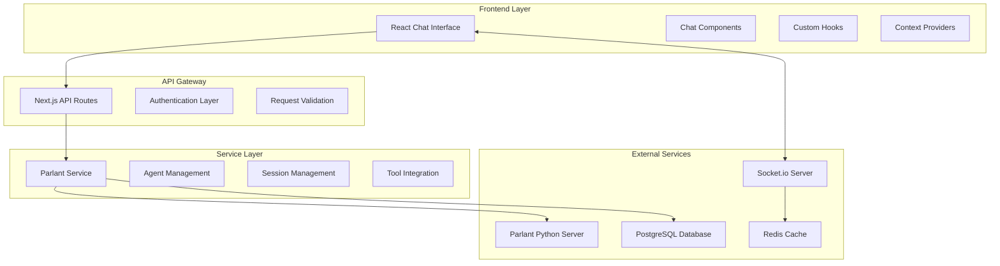

# Parlant React Chat Interface - Architecture & Integration Patterns

## Table of Contents

- [System Architecture Overview](#system-architecture-overview)
- [Integration Patterns](#integration-patterns)
- [Component Architecture](#component-architecture)
- [Data Flow Patterns](#data-flow-patterns)
- [Service Layer Integration](#service-layer-integration)
- [Real-time Communication Architecture](#real-time-communication-architecture)
- [Security Architecture](#security-architecture)
- [Scalability Patterns](#scalability-patterns)
- [Error Handling Architecture](#error-handling-architecture)

## System Architecture Overview

The Parlant React Chat Interface follows a distributed microservices architecture with clear separation of concerns and scalable integration patterns.

### High-Level Architecture



### Core Architecture Principles

1. **Separation of Concerns**: Clear boundaries between UI, business logic, and data layers
2. **Microservices**: Modular services with well-defined interfaces
3. **Event-Driven**: Real-time updates through event-driven architecture
4. **Stateless Design**: API endpoints are stateless with session state managed externally
5. **Progressive Enhancement**: Works without JavaScript, enhanced with real-time features

## Integration Patterns

### 1. Service Integration Pattern

The Parlant service acts as an adapter between Sim's existing infrastructure and the Parlant Python server:

```typescript
// Service Adapter Pattern Implementation
class ParlantServiceAdapter {
  private client: ParlantClient
  private logger: Logger
  private cache: CacheManager

  constructor(config: ParlantConfig) {
    this.client = new ParlantClient(config.serverUrl)
    this.logger = createLogger('ParlantService')
    this.cache = new CacheManager(config.cacheSettings)
  }

  // Adapter methods that transform between Sim and Parlant formats
  async createAgent(simAgentConfig: SimAgentConfig): Promise<ParlantAgent> {
    // Transform Sim config to Parlant format
    const parlantConfig = this.transformAgentConfig(simAgentConfig)

    // Call Parlant server
    const agent = await this.client.createAgent(parlantConfig)

    // Cache the result
    await this.cache.set(`agent:${agent.id}`, agent)

    return agent
  }

  private transformAgentConfig(simConfig: SimAgentConfig): ParlantAgentConfig {
    return {
      name: simConfig.name,
      description: simConfig.description,
      guidelines: simConfig.guidelines.map(g => ({
        condition: g.condition,
        action: g.action,
        priority: g.priority || 1
      })),
      tools: this.mapSimToolsToParlant(simConfig.tools)
    }
  }
}
```

### 2. Authentication Integration Pattern

Seamless integration with Sim's existing Better Auth system:

```typescript
// Authentication Bridge Pattern
class AuthenticationBridge {
  async validateChatAccess(
    request: NextRequest,
    chatConfig: ChatConfig
  ): Promise<AuthResult> {
    // Check public access first
    if (chatConfig.authType === 'public') {
      return { authorized: true }
    }

    // Check existing session cookie
    const sessionCookie = request.cookies.get('auth_session')
    if (sessionCookie) {
      const session = await this.validateSession(sessionCookie.value)
      if (session?.valid) {
        return { authorized: true, userId: session.userId }
      }
    }

    // Check chat-specific authentication
    if (chatConfig.authType === 'password') {
      return this.validatePasswordAuth(request, chatConfig)
    }

    if (chatConfig.authType === 'email') {
      return this.validateEmailAuth(request, chatConfig)
    }

    return { authorized: false, error: 'authentication_required' }
  }
}
```

### 3. Tool Integration Pattern

Universal tool adapter that bridges Sim's workflow tools with Parlant agents:

```typescript
// Universal Tool Adapter Pattern
class UniversalToolAdapter {
  private toolRegistry: Map<string, ToolAdapter>
  private naturalLanguageProcessor: NLProcessor

  registerSimTool(blockConfig: BlockConfig): void {
    const adapter = new SimToolAdapter(blockConfig)
    const enhancedDescription = this.generateNLDescription(blockConfig)

    this.toolRegistry.set(blockConfig.id, {
      adapter,
      description: enhancedDescription,
      executionHandler: this.createExecutionHandler(adapter)
    })
  }

  async executeToolFromNaturalLanguage(
    query: string,
    context: ConversationContext
  ): Promise<ToolExecutionResult> {
    // Parse natural language intent
    const intent = await this.naturalLanguageProcessor.parseIntent(query)

    // Find matching tools
    const candidates = await this.findMatchingTools(intent)

    // Execute best matching tool
    const bestMatch = candidates[0]
    return await bestMatch.executionHandler(intent.parameters, context)
  }
}
```

## Component Architecture

### React Component Hierarchy

```typescript
// Component Architecture Pattern
const ChatInterface = ({ subdomain }: { subdomain: string }) => {
  return (
    <ChatProvider subdomain={subdomain}>
      <AuthenticationProvider>
        <SessionProvider>
          <div className="chat-container">
            <ChatHeader />
            <MessageContainer />
            <InputArea />
          </div>
        </SessionProvider>
      </AuthenticationProvider>
    </ChatProvider>
  )
}

// Context Provider Pattern
const ChatProvider = ({ children, subdomain }) => {
  const [chatConfig, setChatConfig] = useState<ChatConfig | null>(null)
  const [messages, setMessages] = useState<ChatMessage[]>([])
  const [isLoading, setIsLoading] = useState(false)

  const contextValue = useMemo(() => ({
    chatConfig,
    messages,
    isLoading,
    sendMessage: (content: string) => sendMessageToAgent(content),
    loadChatConfig: () => fetchChatConfiguration(subdomain)
  }), [chatConfig, messages, isLoading])

  return (
    <ChatContext.Provider value={contextValue}>
      {children}
    </ChatContext.Provider>
  )
}
```

### Custom Hooks Pattern

```typescript
// Custom Hooks for State Management
export const useChatStreaming = () => {
  const [isStreaming, setIsStreaming] = useState(false)
  const abortControllerRef = useRef<AbortController | null>(null)

  const handleStreamedResponse = useCallback(async (
    response: Response,
    onMessage: (message: ChatMessage) => void
  ) => {
    setIsStreaming(true)
    abortControllerRef.current = new AbortController()

    try {
      const reader = response.body?.getReader()
      const decoder = new TextDecoder()

      while (true) {
        const { value, done } = await reader!.read()
        if (done) break

        const chunk = decoder.decode(value)
        const lines = chunk.split('\n')

        for (const line of lines) {
          if (line.startsWith('data: ')) {
            const data = JSON.parse(line.slice(6))
            handleStreamEvent(data, onMessage)
          }
        }
      }
    } finally {
      setIsStreaming(false)
      abortControllerRef.current = null
    }
  }, [])

  const stopStreaming = useCallback(() => {
    if (abortControllerRef.current) {
      abortControllerRef.current.abort()
    }
  }, [])

  return { isStreaming, handleStreamedResponse, stopStreaming }
}

// Voice Integration Hook
export const useVoiceInterface = () => {
  const [isListening, setIsListening] = useState(false)
  const [transcript, setTranscript] = useState('')
  const recognitionRef = useRef<SpeechRecognition | null>(null)

  const startListening = useCallback(() => {
    if (!recognitionRef.current) {
      recognitionRef.current = new (window.SpeechRecognition ||
        window.webkitSpeechRecognition)()

      recognitionRef.current.continuous = true
      recognitionRef.current.interimResults = true

      recognitionRef.current.onresult = (event) => {
        const current = event.resultIndex
        const transcript = event.results[current][0].transcript
        setTranscript(transcript)
      }
    }

    recognitionRef.current.start()
    setIsListening(true)
  }, [])

  return { isListening, transcript, startListening, stopListening }
}
```

## Data Flow Patterns

### Unidirectional Data Flow

```typescript
// Data Flow Management Pattern
interface ChatState {
  messages: ChatMessage[]
  sessionId: string | null
  agentStatus: 'idle' | 'typing' | 'processing'
  error: string | null
}

type ChatAction =
  | { type: 'ADD_MESSAGE'; payload: ChatMessage }
  | { type: 'UPDATE_MESSAGE'; payload: { id: string; updates: Partial<ChatMessage> } }
  | { type: 'SET_AGENT_STATUS'; payload: ChatState['agentStatus'] }
  | { type: 'SET_ERROR'; payload: string }

const chatReducer = (state: ChatState, action: ChatAction): ChatState => {
  switch (action.type) {
    case 'ADD_MESSAGE':
      return {
        ...state,
        messages: [...state.messages, action.payload],
        error: null
      }

    case 'UPDATE_MESSAGE':
      return {
        ...state,
        messages: state.messages.map(msg =>
          msg.id === action.payload.id
            ? { ...msg, ...action.payload.updates }
            : msg
        )
      }

    case 'SET_AGENT_STATUS':
      return { ...state, agentStatus: action.payload }

    case 'SET_ERROR':
      return { ...state, error: action.payload }

    default:
      return state
  }
}
```

### Event-Driven Updates

```typescript
// Event System for Real-time Updates
class ChatEventSystem {
  private eventBus: EventEmitter
  private socketConnection: Socket

  constructor() {
    this.eventBus = new EventEmitter()
    this.setupSocketListeners()
  }

  private setupSocketListeners() {
    this.socketConnection.on('message', (data) => {
      this.eventBus.emit('chat:message:received', data)
    })

    this.socketConnection.on('agent_typing', (data) => {
      this.eventBus.emit('chat:agent:typing', data)
    })

    this.socketConnection.on('session_ended', (data) => {
      this.eventBus.emit('chat:session:ended', data)
    })
  }

  subscribe(event: string, handler: Function) {
    this.eventBus.on(event, handler)
    return () => this.eventBus.off(event, handler)
  }

  publish(event: string, data: any) {
    this.eventBus.emit(event, data)
  }
}
```

## Service Layer Integration

### Service Registry Pattern

```typescript
// Service Registry for Dependency Injection
class ServiceRegistry {
  private services = new Map<string, any>()

  register<T>(name: string, service: T): void {
    this.services.set(name, service)
  }

  get<T>(name: string): T {
    const service = this.services.get(name)
    if (!service) {
      throw new Error(`Service ${name} not found`)
    }
    return service
  }

  // Service factory with dependencies
  create<T>(
    name: string,
    factory: (registry: ServiceRegistry) => T
  ): T {
    const service = factory(this)
    this.register(name, service)
    return service
  }
}

// Service initialization
const initializeServices = () => {
  const registry = new ServiceRegistry()

  registry.create('parlantClient', () => new ParlantClient(config.parlantUrl))
  registry.create('logger', () => createLogger('ChatSystem'))
  registry.create('cache', (reg) => new CacheManager(config.cache))

  registry.create('agentService', (reg) =>
    new AgentService(
      reg.get('parlantClient'),
      reg.get('logger'),
      reg.get('cache')
    )
  )

  return registry
}
```

### Circuit Breaker Pattern

```typescript
// Circuit Breaker for External Service Calls
class CircuitBreaker {
  private failures = 0
  private nextAttempt = Date.now()
  private state: 'CLOSED' | 'OPEN' | 'HALF_OPEN' = 'CLOSED'

  constructor(
    private threshold: number = 5,
    private timeout: number = 60000
  ) {}

  async execute<T>(operation: () => Promise<T>): Promise<T> {
    if (this.state === 'OPEN') {
      if (this.nextAttempt > Date.now()) {
        throw new Error('Circuit breaker is OPEN')
      }
      this.state = 'HALF_OPEN'
    }

    try {
      const result = await operation()
      this.onSuccess()
      return result
    } catch (error) {
      this.onFailure()
      throw error
    }
  }

  private onSuccess() {
    this.failures = 0
    this.state = 'CLOSED'
  }

  private onFailure() {
    this.failures++
    if (this.failures >= this.threshold) {
      this.state = 'OPEN'
      this.nextAttempt = Date.now() + this.timeout
    }
  }
}
```

## Real-time Communication Architecture

### Socket.io Integration Pattern

```typescript
// Socket.io Service Layer
class SocketService {
  private io: SocketIOServer
  private rooms: Map<string, Set<string>> = new Map()

  constructor(httpServer: HttpServer) {
    this.io = new SocketIOServer(httpServer, {
      cors: {
        origin: process.env.ALLOWED_ORIGINS?.split(','),
        credentials: true
      }
    })

    this.setupMiddleware()
    this.setupEventHandlers()
  }

  private setupMiddleware() {
    // Authentication middleware
    this.io.use(async (socket, next) => {
      try {
        const token = socket.handshake.auth.token
        const user = await validateJWT(token)
        socket.data.user = user
        next()
      } catch (error) {
        next(new Error('Authentication failed'))
      }
    })

    // Rate limiting middleware
    this.io.use(rateLimitMiddleware({
      windowMs: 60000, // 1 minute
      max: 100, // 100 events per minute
    }))
  }

  private setupEventHandlers() {
    this.io.on('connection', (socket) => {
      socket.on('join_session', async (data) => {
        const { sessionId } = data
        await this.joinSession(socket, sessionId)
      })

      socket.on('send_message', async (data) => {
        await this.handleMessage(socket, data)
      })

      socket.on('typing', (data) => {
        this.handleTyping(socket, data)
      })

      socket.on('disconnect', () => {
        this.handleDisconnect(socket)
      })
    })
  }

  private async joinSession(socket: Socket, sessionId: string) {
    // Validate session access
    const hasAccess = await this.validateSessionAccess(
      socket.data.user.id,
      sessionId
    )

    if (!hasAccess) {
      socket.emit('error', { message: 'Access denied' })
      return
    }

    socket.join(`session:${sessionId}`)
    socket.emit('session_joined', { sessionId })
  }
}
```

### Message Queue Pattern

```typescript
// Message Queue for Asynchronous Processing
class MessageQueue {
  private queues: Map<string, Queue> = new Map()
  private workers: Map<string, Worker[]> = new Map()

  constructor(private redisClient: Redis) {}

  async addJob(queueName: string, data: any, options?: JobOptions) {
    const queue = this.getOrCreateQueue(queueName)
    return await queue.add('process', data, {
      delay: options?.delay,
      attempts: options?.attempts || 3,
      backoff: {
        type: 'exponential',
        delay: 2000
      }
    })
  }

  private getOrCreateQueue(name: string): Queue {
    if (!this.queues.has(name)) {
      const queue = new Queue(name, {
        connection: this.redisClient,
        defaultJobOptions: {
          removeOnComplete: 100,
          removeOnFail: 50
        }
      })

      this.queues.set(name, queue)
      this.createWorker(name, queue)
    }

    return this.queues.get(name)!
  }

  private createWorker(name: string, queue: Queue) {
    const worker = new Worker(name, async (job) => {
      return await this.processJob(name, job)
    }, {
      connection: this.redisClient,
      concurrency: 5
    })

    worker.on('completed', (job) => {
      logger.info(`Job completed: ${job.id}`)
    })

    worker.on('failed', (job, err) => {
      logger.error(`Job failed: ${job?.id}`, err)
    })

    const workers = this.workers.get(name) || []
    workers.push(worker)
    this.workers.set(name, workers)
  }
}
```

## Security Architecture

### Multi-Layer Security Pattern

```typescript
// Security Middleware Stack
class SecurityStack {
  private middlewares: SecurityMiddleware[] = []

  use(middleware: SecurityMiddleware) {
    this.middlewares.push(middleware)
  }

  async execute(request: Request, context: SecurityContext): Promise<SecurityResult> {
    for (const middleware of this.middlewares) {
      const result = await middleware.execute(request, context)
      if (!result.passed) {
        return result
      }
      context = { ...context, ...result.context }
    }
    return { passed: true, context }
  }
}

// Security middleware implementations
class RateLimitMiddleware implements SecurityMiddleware {
  async execute(request: Request, context: SecurityContext): Promise<SecurityResult> {
    const key = this.generateRateLimitKey(request)
    const current = await this.cache.get(key) || 0

    if (current >= this.limit) {
      return {
        passed: false,
        error: 'Rate limit exceeded',
        statusCode: 429
      }
    }

    await this.cache.set(key, current + 1, this.window)
    return { passed: true }
  }
}

class InputValidationMiddleware implements SecurityMiddleware {
  async execute(request: Request, context: SecurityContext): Promise<SecurityResult> {
    const validation = this.validateInput(request.body)

    if (!validation.valid) {
      return {
        passed: false,
        error: 'Input validation failed',
        details: validation.errors,
        statusCode: 400
      }
    }

    return { passed: true }
  }
}
```

### Content Security Policy

```typescript
// CSP Configuration for Chat Interface
const CSP_POLICY = {
  'default-src': ["'self'"],
  'script-src': ["'self'", "'unsafe-inline'", 'https://cdn.socket.io'],
  'style-src': ["'self'", "'unsafe-inline'"],
  'img-src': ["'self'", 'data:', 'https:'],
  'connect-src': ["'self'", 'wss:', 'https:'],
  'font-src': ["'self'", 'https://fonts.gstatic.com'],
  'media-src': ["'self'"],
  'object-src': ["'none'"],
  'base-uri': ["'self'"],
  'form-action': ["'self'"],
  'frame-ancestors': ["'none'"],
  'upgrade-insecure-requests': []
}

// Apply CSP headers
app.use((req, res, next) => {
  const policy = Object.entries(CSP_POLICY)
    .map(([directive, sources]) => `${directive} ${sources.join(' ')}`)
    .join('; ')

  res.setHeader('Content-Security-Policy', policy)
  next()
})
```

## Scalability Patterns

### Horizontal Scaling Architecture

```typescript
// Load Balancer Configuration
class LoadBalancer {
  private servers: Server[] = []
  private healthChecks: Map<string, HealthStatus> = new Map()

  addServer(server: Server) {
    this.servers.push(server)
    this.startHealthCheck(server)
  }

  selectServer(request: Request): Server {
    const healthyServers = this.servers.filter(s =>
      this.healthChecks.get(s.id)?.healthy
    )

    if (healthyServers.length === 0) {
      throw new Error('No healthy servers available')
    }

    // Round-robin with session affinity
    if (request.session?.serverId) {
      const preferredServer = healthyServers.find(s =>
        s.id === request.session.serverId
      )
      if (preferredServer) return preferredServer
    }

    return healthyServers[
      Math.floor(Math.random() * healthyServers.length)
    ]
  }

  private startHealthCheck(server: Server) {
    setInterval(async () => {
      try {
        await fetch(`${server.url}/health`)
        this.healthChecks.set(server.id, {
          healthy: true,
          lastCheck: Date.now()
        })
      } catch (error) {
        this.healthChecks.set(server.id, {
          healthy: false,
          lastCheck: Date.now(),
          error: error.message
        })
      }
    }, 30000) // Check every 30 seconds
  }
}
```

### Caching Strategy

```typescript
// Multi-Level Caching System
class CachingStrategy {
  private l1Cache: Map<string, CacheEntry> = new Map() // In-memory
  private l2Cache: Redis // Distributed cache
  private l3Cache: Database // Persistent storage

  async get<T>(key: string): Promise<T | null> {
    // L1: Check in-memory cache
    const l1Entry = this.l1Cache.get(key)
    if (l1Entry && !this.isExpired(l1Entry)) {
      return l1Entry.data
    }

    // L2: Check Redis cache
    const l2Data = await this.l2Cache.get(key)
    if (l2Data) {
      const parsedData = JSON.parse(l2Data)
      this.setL1Cache(key, parsedData)
      return parsedData
    }

    // L3: Fallback to database
    const dbData = await this.l3Cache.get(key)
    if (dbData) {
      await this.setL2Cache(key, dbData)
      this.setL1Cache(key, dbData)
      return dbData
    }

    return null
  }

  async set<T>(key: string, data: T, ttl?: number): Promise<void> {
    // Set at all levels
    this.setL1Cache(key, data, ttl)
    await this.setL2Cache(key, data, ttl)
  }

  private setL1Cache<T>(key: string, data: T, ttl?: number) {
    this.l1Cache.set(key, {
      data,
      timestamp: Date.now(),
      ttl: ttl || 300000 // 5 minutes default
    })
  }

  private async setL2Cache<T>(key: string, data: T, ttl?: number) {
    const serialized = JSON.stringify(data)
    if (ttl) {
      await this.l2Cache.setex(key, ttl / 1000, serialized)
    } else {
      await this.l2Cache.set(key, serialized)
    }
  }
}
```

## Error Handling Architecture

### Centralized Error Handling

```typescript
// Global Error Handler
class GlobalErrorHandler {
  private errorReporters: ErrorReporter[] = []
  private errorFilters: ErrorFilter[] = []

  addReporter(reporter: ErrorReporter) {
    this.errorReporters.push(reporter)
  }

  addFilter(filter: ErrorFilter) {
    this.errorFilters.push(filter)
  }

  async handleError(error: Error, context?: ErrorContext) {
    // Apply filters
    for (const filter of this.errorFilters) {
      if (filter.shouldIgnore(error, context)) {
        return
      }
    }

    // Process error
    const processedError = this.processError(error, context)

    // Report to all reporters
    await Promise.allSettled(
      this.errorReporters.map(reporter =>
        reporter.report(processedError, context)
      )
    )
  }

  private processError(error: Error, context?: ErrorContext): ProcessedError {
    return {
      message: error.message,
      stack: error.stack,
      type: error.constructor.name,
      timestamp: new Date().toISOString(),
      severity: this.determineSeverity(error),
      context: {
        ...context,
        userAgent: context?.request?.headers['user-agent'],
        url: context?.request?.url,
        userId: context?.user?.id
      }
    }
  }
}

// Error Recovery Patterns
class ErrorRecovery {
  static async withRetry<T>(
    operation: () => Promise<T>,
    options: RetryOptions = {}
  ): Promise<T> {
    const {
      maxAttempts = 3,
      baseDelay = 1000,
      maxDelay = 10000,
      backoffFactor = 2
    } = options

    let lastError: Error

    for (let attempt = 1; attempt <= maxAttempts; attempt++) {
      try {
        return await operation()
      } catch (error) {
        lastError = error as Error

        if (attempt === maxAttempts) {
          break
        }

        const delay = Math.min(
          baseDelay * Math.pow(backoffFactor, attempt - 1),
          maxDelay
        )

        await this.delay(delay)
      }
    }

    throw lastError!
  }

  static async withCircuitBreaker<T>(
    operation: () => Promise<T>,
    circuitBreaker: CircuitBreaker
  ): Promise<T> {
    return circuitBreaker.execute(operation)
  }

  private static delay(ms: number): Promise<void> {
    return new Promise(resolve => setTimeout(resolve, ms))
  }
}
```

This architecture documentation provides comprehensive patterns for integrating, scaling, and maintaining the Parlant React Chat Interface within the Sim platform. Each pattern addresses specific architectural concerns while maintaining consistency with the overall system design.