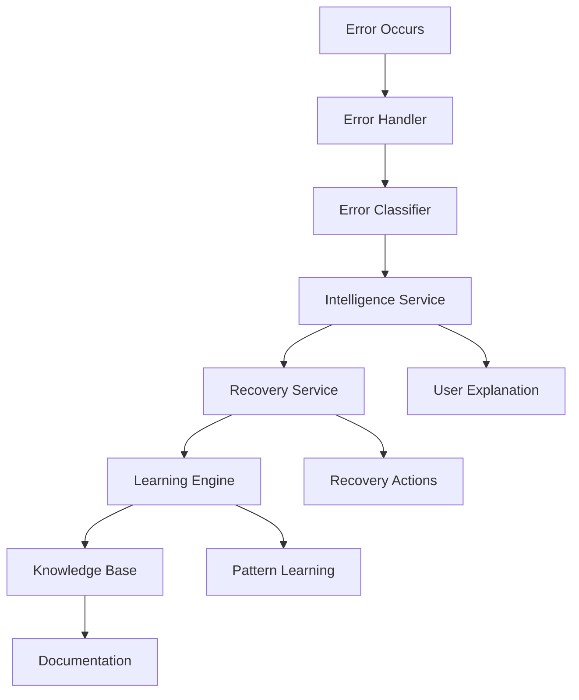

# Intelligent Error Handling System - Integration Guide

## Overview

The Intelligent Error Handling System is a comprehensive solution that transforms technical errors into actionable, user-friendly explanations with automated recovery, learning capabilities, and continuous improvement. This guide covers integration, configuration, and usage patterns.

## Table of Contents

1. [Quick Start](#quick-start)
2. [System Architecture](#system-architecture)
3. [Integration Patterns](#integration-patterns)
4. [Configuration](#configuration)
5. [API Reference](#api-reference)
6. [Examples](#examples)
7. [Best Practices](#best-practices)
8. [Troubleshooting](#troubleshooting)
9. [Performance Optimization](#performance-optimization)
10. [Monitoring and Maintenance](#monitoring-and-maintenance)

## Quick Start

### Installation

```typescript
// Install required dependencies
import {
  // Core error handling
  BaseToolError,
  universalErrorHandler,

  // Error classification
  ErrorCategory,
  ErrorSeverity,
  errorClassifier,

  // Intelligent explanations
  errorIntelligenceService,
  SupportedLanguage,
  UserSkillLevel,

  // Recovery system
  errorRecoveryService,
  executeWithRecovery,

  // Learning engine
  errorLearningEngine,
  learnFromResolution,

  // Knowledge base
  errorKnowledgeBase,
  searchKnowledgeBase,

  // Testing system
  errorTestingSystem,
} from './error-system'
```

### Basic Usage

```typescript
// 1. Create and handle an error
try {
  // Your operation that might fail
  await someRiskyOperation()
} catch (originalError) {
  // Create intelligent error
  const error = new ToolExecutionError(
    'Operation failed due to timeout',
    'timeout',
    'my-tool',
    { userId: 'user123', operation: 'data-processing' },
    originalError
  )

  // Handle with intelligent processing
  const result = await universalErrorHandler.handleError(error)

  // Get user-friendly explanation
  const explanation = await errorIntelligenceService.generateIntelligentExplanation(
    error,
    {
      userId: 'user123',
      userSkillLevel: UserSkillLevel.INTERMEDIATE,
      preferredLanguage: SupportedLanguage.ENGLISH,
      communicationStyle: CommunicationStyle.EMPATHETIC,
      // ... other context
    }
  )

  // Present to user
  console.log(explanation.messages.intermediate)
  console.log('Suggested actions:', explanation.quickActions)
}
```

## System Architecture

### Component Overview



### Core Components

1. **Error Handler** (`error-handler.ts`)
   - Base error classes with rich metadata
   - Automatic error tracking and classification
   - User-friendly message generation

2. **Error Taxonomy** (`error-taxonomy.ts`)
   - Comprehensive error classification system
   - Severity and impact assessment
   - Recovery strategy mapping

3. **Intelligence Service** (`error-intelligence.ts`)
   - Natural language error translation
   - Multi-language support
   - Personalized explanations

4. **Recovery Service** (`error-recovery.ts`)
   - Automated recovery mechanisms
   - Circuit breakers and fallbacks
   - Adaptive retry strategies

5. **Learning Engine** (`error-learning.ts`)
   - Pattern recognition and machine learning
   - Continuous improvement
   - Predictive analysis

6. **Knowledge Base** (`error-knowledge-base.ts`)
   - Searchable error documentation
   - Community-driven content
   - Auto-generated articles

7. **Testing System** (`error-testing.ts`)
   - Comprehensive validation
   - Automated testing
   - Quality assurance

## Integration Patterns

### Pattern 1: Basic Error Handling

```typescript
import { BaseToolError, universalErrorHandler } from './error-system'

class MyService {
  async processData(data: any) {
    try {
      return await this.performProcessing(data)
    } catch (error) {
      const toolError = new ToolExecutionError(
        'Data processing failed',
        'processing_error',
        'data-processor',
        {
          userId: this.getCurrentUser(),
          dataSize: data.length,
          operation: 'data-processing'
        },
        error
      )

      const result = await universalErrorHandler.handleError(toolError)

      if (result.recovered) {
        // Operation was automatically recovered
        return result.recoveredResult
      } else {
        // Present user-friendly error to user
        throw new Error(result.userMessage)
      }
    }
  }
}
```

### Pattern 2: Intelligent Recovery

```typescript
import { executeWithRecovery } from './error-system'

class APIClient {
  async makeRequest(endpoint: string, options: RequestOptions) {
    return executeWithRecovery(
      // Operation to execute
      () => this.httpClient.request(endpoint, options),

      // Context for intelligent handling
      {
        operationId: `api-${endpoint}-${Date.now()}`,
        component: 'api-client',
        category: ErrorCategory.EXTERNAL_SERVICE,
        subcategory: 'api_request',
        toolName: 'http-client',
        parlantContext: {
          userId: options.userId,
          operation: 'api-request',
          metadata: { endpoint, method: options.method }
        }
      },

      // Custom retry configuration
      {
        maxAttempts: 5,
        initialDelayMs: 1000,
        backoffMultiplier: 2,
        retryableErrors: [ErrorCategory.EXTERNAL_SERVICE, ErrorCategory.EXTERNAL_TIMEOUT]
      }
    )
  }
}
```

### Pattern 3: User Experience Integration

```typescript
import {
  errorIntelligenceService,
  UserSkillLevel,
  SupportedLanguage
} from './error-system'

class UserInterface {
  async handleError(error: BaseToolError, user: User) {
    // Generate personalized explanation
    const explanation = await errorIntelligenceService.generateIntelligentExplanation(
      error,
      {
        userId: user.id,
        userSkillLevel: user.skillLevel || UserSkillLevel.INTERMEDIATE,
        preferredLanguage: user.language || SupportedLanguage.ENGLISH,
        communicationStyle: user.preferredStyle,
        deviceType: user.deviceType,
        accessibility: user.accessibilityPreferences,
        previousInteractions: await this.getUserInteractionHistory(user.id)
      }
    )

    // Present contextual help
    this.showErrorDialog({
      title: explanation.title,
      message: explanation.messages[user.skillLevel],
      quickActions: explanation.quickActions,
      troubleshooting: explanation.troubleshootingTree,
      relatedArticles: await this.getRelatedArticles(error),
      voiceOutput: explanation.voiceOutput
    })
  }

  async getRelatedArticles(error: BaseToolError) {
    return errorKnowledgeBase.getRecommendations(
      error,
      this.getCurrentUserContext(),
      5
    )
  }
}
```

### Pattern 4: Learning Integration

```typescript
import {
  errorLearningEngine,
  learnFromResolution,
  learnFromFeedback
} from './error-system'

class ErrorTrackingService {
  async trackResolution(
    error: BaseToolError,
    resolution: ResolutionOutcome,
    userFeedback?: LearningFeedback
  ) {
    // Learn from the resolution
    await learnFromResolution(
      error,
      resolution,
      this.getCurrentContext(),
      userFeedback
    )

    // Update system predictions
    const predictions = await errorLearningEngine.predictErrors(
      { start: Date.now(), end: Date.now() + 86400000 }, // Next 24 hours
      this.getCurrentContext(),
      0.7 // Confidence threshold
    )

    // Implement preventive measures
    if (predictions.length > 0) {
      await this.implementPreventiveMeasures(predictions)
    }
  }

  async collectUserFeedback(explanationId: string, feedback: any) {
    await learnFromFeedback({
      explanationId,
      userId: feedback.userId,
      feedback: {
        clarity: feedback.clarity,
        helpfulness: feedback.helpfulness,
        accuracy: feedback.accuracy,
        completeness: feedback.completeness
      },
      textFeedback: feedback.comments,
      suggestedImprovements: feedback.suggestions,
      timestamp: new Date().toISOString()
    })
  }
}
```

## Configuration

### Environment Variables

```bash
# Error System Configuration
ERROR_HANDLING_ENABLED=true
ERROR_LOG_LEVEL=info
ERROR_RETENTION_DAYS=30

# Intelligence Service
TRANSLATION_SERVICE_KEY=your-key
SUPPORTED_LANGUAGES=en,es,fr,de,ja,zh-CN

# Recovery Service
CIRCUIT_BREAKER_ENABLED=true
DEFAULT_RETRY_ATTEMPTS=3
DEFAULT_TIMEOUT_MS=30000

# Learning Engine
MACHINE_LEARNING_ENABLED=true
LEARNING_DATA_RETENTION_DAYS=90
MODEL_RETRAINING_INTERVAL_HOURS=6

# Knowledge Base
KB_SEARCH_ENABLED=true
KB_AUTO_GENERATION_ENABLED=true
KB_TRANSLATION_ENABLED=true

# Testing
AUTOMATED_TESTING_ENABLED=true
TEST_EXECUTION_INTERVAL_HOURS=24
CONTINUOUS_VALIDATION_ENABLED=true
```

### System Configuration

```typescript
// config/error-system.ts
export const errorSystemConfig = {
  // Core settings
  errorHandling: {
    enabled: true,
    logLevel: 'info',
    retentionDays: 30,
    maxErrorsPerHour: 1000
  },

  // Intelligence settings
  intelligence: {
    translationEnabled: true,
    supportedLanguages: [
      'en', 'es', 'fr', 'de', 'ja', 'zh-CN'
    ],
    personalizationEnabled: true,
    voiceOutputEnabled: true
  },

  // Recovery settings
  recovery: {
    circuitBreakerEnabled: true,
    defaultRetryAttempts: 3,
    maxRetryAttempts: 10,
    defaultTimeoutMs: 30000,
    adaptiveRecoveryEnabled: true
  },

  // Learning settings
  learning: {
    machineLearningEnabled: true,
    dataRetentionDays: 90,
    modelRetrainingHours: 6,
    predictionEnabled: true,
    patternRecognitionEnabled: true
  },

  // Knowledge base settings
  knowledgeBase: {
    searchEnabled: true,
    autoGenerationEnabled: true,
    translationEnabled: true,
    userVotingEnabled: true,
    moderationEnabled: true
  },

  // Testing settings
  testing: {
    automatedTestingEnabled: true,
    executionIntervalHours: 24,
    continuousValidationEnabled: true,
    loadTestingEnabled: false,
    performanceMonitoringEnabled: true
  }
}
```

## API Reference

### Core Error Classes

#### BaseToolError

```typescript
abstract class BaseToolError extends Error {
  readonly id: string
  readonly timestamp: string
  readonly category: ErrorCategory
  readonly subcategory: string
  readonly severity: ErrorSeverity
  readonly impact: ErrorImpact
  readonly component: string
  readonly context: ParlantLogContext
  readonly recoverable: boolean

  constructor(
    message: string,
    category: ErrorCategory,
    subcategory: string,
    component: string,
    context?: ParlantLogContext,
    originalError?: Error
  )

  getUserMessage(): string
  getRecoveryActions(): string[]
  shouldEscalate(): boolean
  toJSON(): object
}
```

#### ToolExecutionError

```typescript
class ToolExecutionError extends BaseToolError {
  readonly operationId?: string
  readonly executionTime?: number

  constructor(
    message: string,
    subcategory: string,
    toolName: string,
    context?: ParlantLogContext,
    originalError?: Error,
    operationId?: string,
    executionTime?: number
  )
}
```

### Intelligence Service

#### Generate Intelligent Explanation

```typescript
errorIntelligenceService.generateIntelligentExplanation(
  error: BaseToolError,
  context: ExplanationContext
): Promise<IntelligentErrorExplanation>
```

#### Translate Error Message

```typescript
errorIntelligenceService.translateErrorMessage(
  error: BaseToolError,
  targetLanguage: SupportedLanguage,
  context: ExplanationContext
): Promise<string>
```

### Recovery Service

#### Execute with Recovery

```typescript
executeWithRecovery<T>(
  operation: () => Promise<T>,
  context: {
    operationId: string
    component: string
    category?: ErrorCategory
    subcategory?: string
    toolName?: string
    parlantContext?: ParlantLogContext
  },
  customConfig?: Partial<RetryConfig>
): Promise<T>
```

### Learning Engine

#### Learn from Resolution

```typescript
errorLearningEngine.learnFromResolution(
  error: BaseToolError,
  resolutionOutcome: ResolutionOutcome,
  context: ParlantLogContext,
  userFeedback?: LearningFeedback
): Promise<void>
```

#### Predict Errors

```typescript
errorLearningEngine.predictErrors(
  timeWindow: { start: number; end: number },
  context: ParlantLogContext,
  confidenceThreshold?: number
): Promise<ErrorPrediction[]>
```

### Knowledge Base

#### Search Knowledge Base

```typescript
errorKnowledgeBase.search(
  query: SearchQuery
): Promise<{
  results: SearchResult[]
  totalCount: number
  suggestions: string[]
  relatedTopics: string[]
}>
```

#### Get Article Recommendations

```typescript
errorKnowledgeBase.getRecommendations(
  error: BaseToolError,
  userContext?: UserContext,
  limit?: number
): Promise<SearchResult[]>
```

## Examples

### Example 1: Database Connection Error

```typescript
// Service layer
class DatabaseService {
  async connect() {
    return executeWithRecovery(
      () => this.database.connect(),
      {
        operationId: 'db-connect',
        component: 'database-service',
        category: ErrorCategory.INTEGRATION_DATABASE,
        subcategory: 'connection_failed'
      },
      {
        maxAttempts: 5,
        initialDelayMs: 2000,
        backoffMultiplier: 2
      }
    )
  }
}

// UI layer
class DatabaseErrorHandler {
  async handleConnectionError(error: BaseToolError) {
    const explanation = await errorIntelligenceService.generateIntelligentExplanation(
      error,
      {
        userSkillLevel: UserSkillLevel.INTERMEDIATE,
        preferredLanguage: SupportedLanguage.ENGLISH,
        communicationStyle: CommunicationStyle.DIRECT
      }
    )

    return {
      title: "Database Connection Issue",
      message: explanation.messages.intermediate,
      actions: [
        {
          label: "Retry Connection",
          action: () => this.retryConnection()
        },
        {
          label: "View Troubleshooting Guide",
          action: () => this.showTroubleshooting(explanation.troubleshootingTree)
        }
      ]
    }
  }
}
```

### Example 2: API Rate Limiting

```typescript
class APIRateLimitHandler {
  async handleRateLimit(error: BaseToolError) {
    // Check if we have learned patterns for this error
    const patterns = await errorLearningEngine.getLearnedPatterns(
      ErrorCategory.EXTERNAL_QUOTA,
      0.8, // High confidence only
      'effectiveness'
    )

    const rateLimitPattern = patterns.find(p =>
      p.name.toLowerCase().includes('rate limit')
    )

    if (rateLimitPattern) {
      // Apply learned recovery strategy
      const recommendations = rateLimitPattern.recommendations
      return this.applyLearnedStrategy(recommendations)
    } else {
      // Use default recovery
      return this.defaultRateLimitStrategy(error)
    }
  }

  async applyLearnedStrategy(recommendations: PatternRecommendation[]) {
    const preventionActions = recommendations.filter(r => r.type === 'prevention')

    // Implement learned prevention measures
    for (const action of preventionActions) {
      await this.implementPreventionAction(action)
    }
  }
}
```

### Example 3: User Feedback Collection

```typescript
class FeedbackCollector {
  async collectErrorFeedback(errorId: string, userId: string) {
    // Show feedback form to user
    const feedbackData = await this.showFeedbackForm()

    // Process feedback
    await errorIntelligenceService.processLearningFeedback({
      explanationId: errorId,
      userId: userId,
      feedback: {
        clarity: feedbackData.clarity,
        helpfulness: feedbackData.helpfulness,
        accuracy: feedbackData.accuracy,
        completeness: feedbackData.completeness
      },
      textFeedback: feedbackData.comments,
      suggestedImprovements: feedbackData.suggestions,
      timestamp: new Date().toISOString()
    })

    // Thank the user
    this.showThankYouMessage()
  }

  async showFeedbackForm(): Promise<FeedbackData> {
    return {
      clarity: 4,
      helpfulness: 5,
      accuracy: 4,
      completeness: 4,
      comments: "The explanation was helpful but could use more examples",
      suggestions: ["Add code examples", "Include troubleshooting steps"]
    }
  }
}
```

## Best Practices

### 1. Error Creation

```typescript
// ✅ Good: Rich context and proper classification
const error = new ToolExecutionError(
  'Failed to process user data due to validation errors',
  'validation_failed',
  'data-processor',
  {
    userId: request.userId,
    operation: 'data-processing',
    dataSize: data.length,
    validationErrors: validationResults.errors,
    requestId: request.id
  },
  originalError
)

// ❌ Bad: Minimal context
const error = new Error('Data processing failed')
```

### 2. Recovery Strategy Selection

```typescript
// ✅ Good: Context-aware recovery
const recoveryConfig = {
  maxAttempts: error.severity === ErrorSeverity.CRITICAL ? 1 : 3,
  initialDelayMs: error.category === ErrorCategory.EXTERNAL_SERVICE ? 2000 : 1000,
  retryableErrors: [
    ErrorCategory.EXTERNAL_TIMEOUT,
    ErrorCategory.SYSTEM_RESOURCE
  ]
}

// ❌ Bad: One-size-fits-all approach
const recoveryConfig = { maxAttempts: 3 }
```

### 3. User Experience

```typescript
// ✅ Good: Personalized and actionable
const explanation = await errorIntelligenceService.generateIntelligentExplanation(
  error,
  {
    userId: user.id,
    userSkillLevel: user.determineSkillLevel(),
    preferredLanguage: user.language,
    communicationStyle: user.preferredCommunicationStyle,
    deviceType: request.deviceType,
    accessibility: user.accessibilityNeeds
  }
)

// ❌ Bad: Generic message
const message = "An error occurred. Please try again."
```

### 4. Learning Integration

```typescript
// ✅ Good: Learn from every resolution
await errorLearningEngine.learnFromResolution(
  error,
  {
    resolved: true,
    resolutionMethod: 'automatic',
    timeToResolution: Date.now() - error.startTime,
    stepsRequired: 2,
    retryCount: 1,
    finalStrategy: RecoveryStrategy.RETRY,
    userSatisfaction: feedbackScore,
    success: true
  },
  context,
  userFeedback
)

// ❌ Bad: No learning integration
// Just handle the error and move on
```

### 5. Testing and Validation

```typescript
// ✅ Good: Comprehensive testing
const testCase: TestCase = {
  id: 'api-timeout-test',
  name: 'API Timeout Handling',
  description: 'Test timeout handling and recovery',
  category: TestCategory.INTEGRATION,
  priority: TestPriority.HIGH,
  setup: {
    environment: { name: 'test', configuration: {}, resources: [], isolation: true },
    dependencies: [
      { name: 'mock-api', type: 'mock', configuration: { timeout: 1000 }, required: true }
    ],
    mockData: [],
    preconditions: []
  },
  execution: {
    steps: [
      {
        id: 'trigger-timeout',
        name: 'Trigger API timeout',
        action: 'call_api_with_timeout',
        parameters: { endpoint: '/test', timeout: 500 },
        expectedResult: { type: 'error' },
        validation: [],
        continueOnFailure: true
      }
    ],
    timeout: 30000,
    retries: 2,
    parallelization: false
  },
  validation: {
    assertions: [
      {
        id: 'recovery_attempted',
        description: 'Recovery should be attempted',
        condition: (result) => result.recoveryAttempted === true,
        critical: true,
        message: 'Recovery was not attempted'
      }
    ],
    metrics: [],
    qualityGates: [],
    performance: {
      maxExecutionTime: 10000,
      maxMemoryUsage: 100,
      maxCpuUsage: 50,
      throughputThreshold: 100
    }
  },
  cleanup: { actions: [], verifications: [] },
  metadata: {
    author: 'test-team',
    created: new Date().toISOString(),
    lastModified: new Date().toISOString(),
    version: '1.0.0',
    tags: ['api', 'timeout', 'recovery'],
    requirements: ['api-client', 'error-recovery'],
    documentation: 'Tests API timeout handling and recovery mechanisms'
  }
}

await errorTestingSystem.registerTestCase(testCase)
```

## Troubleshooting

### Common Issues

#### Issue 1: High Memory Usage

**Symptoms:**
- System becoming slow
- Out of memory errors
- High memory usage in monitoring

**Diagnosis:**
```typescript
// Check learning data size
const stats = errorLearningEngine.getLearningStatistics()
console.log('Learning data points:', stats.totalLearningDataPoints)

// Check knowledge base size
const kbStats = errorKnowledgeBase.getStatistics()
console.log('KB articles:', kbStats.totalArticles)
```

**Solutions:**
1. Configure data retention limits
2. Enable data compression
3. Implement data archiving

#### Issue 2: Slow Error Processing

**Symptoms:**
- Slow error handling
- High response times
- User complaints about delays

**Diagnosis:**
```typescript
// Monitor processing times
const metrics = universalErrorHandler.getPerformanceMetrics()
console.log('Average processing time:', metrics.averageProcessingTime)
```

**Solutions:**
1. Enable caching
2. Optimize classification algorithms
3. Use async processing

#### Issue 3: Poor Recovery Success Rate

**Symptoms:**
- Low recovery success rates
- Frequent manual interventions
- User frustration

**Diagnosis:**
```typescript
// Check recovery statistics
const recoveryStats = errorRecoveryService.getRecoveryMetrics()
console.log('Success rate:', recoveryStats.successfulRecoveries / recoveryStats.totalRecoveryAttempts)
```

**Solutions:**
1. Tune retry configurations
2. Implement better fallback strategies
3. Learn from successful recoveries

### Debug Mode

Enable debug mode for detailed logging:

```typescript
// Enable debug logging
process.env.ERROR_LOG_LEVEL = 'debug'

// Enable detailed metrics
process.env.ERROR_METRICS_ENABLED = 'true'

// Enable performance tracking
process.env.ERROR_PERFORMANCE_TRACKING = 'true'
```

## Performance Optimization

### Caching Strategy

```typescript
// Configure intelligent caching
const cacheConfig = {
  explanationCache: {
    enabled: true,
    ttl: 3600000, // 1 hour
    maxSize: 10000
  },
  translationCache: {
    enabled: true,
    ttl: 86400000, // 24 hours
    maxSize: 50000
  },
  knowledgeBaseCache: {
    enabled: true,
    ttl: 1800000, // 30 minutes
    maxSize: 5000
  }
}
```

### Batch Processing

```typescript
// Process errors in batches
const batchProcessor = new ErrorBatchProcessor({
  batchSize: 100,
  processingInterval: 5000,
  maxRetries: 3
})

batchProcessor.addError(error)
```

### Async Processing

```typescript
// Use async processing for non-critical operations
await errorLearningEngine.learnFromResolutionAsync(
  error,
  resolution,
  context
) // Non-blocking

// Critical operations remain synchronous
const explanation = await errorIntelligenceService.generateIntelligentExplanation(
  error,
  context
) // Blocking
```

## Monitoring and Maintenance

### Key Metrics

```typescript
// System health metrics
const healthMetrics = {
  errorRate: 'errors_per_minute',
  recoverySuccessRate: 'recovery_success_percentage',
  averageResolutionTime: 'resolution_time_ms',
  userSatisfactionScore: 'satisfaction_score_1_to_5',
  systemResponseTime: 'response_time_ms',
  memoryUsage: 'memory_usage_mb',
  learningAccuracy: 'learning_accuracy_percentage'
}
```

### Alerting

```typescript
// Configure alerts
const alertConfig = {
  errorRateHigh: {
    threshold: 100, // errors per minute
    severity: 'high',
    notification: ['email', 'slack']
  },
  recoveryRateLow: {
    threshold: 0.8, // 80% success rate
    severity: 'medium',
    notification: ['email']
  },
  systemResponseSlow: {
    threshold: 5000, // 5 seconds
    severity: 'high',
    notification: ['slack', 'pager']
  }
}
```

### Maintenance Tasks

```typescript
// Daily maintenance
const dailyMaintenance = async () => {
  // Clean up old data
  await errorLearningEngine.cleanupOldData()

  // Update search indices
  await errorKnowledgeBase.updateSearchIndices()

  // Generate health reports
  await generateHealthReport()
}

// Weekly maintenance
const weeklyMaintenance = async () => {
  // Retrain machine learning models
  await errorLearningEngine.retrainModels()

  // Update knowledge base rankings
  await errorKnowledgeBase.updateSearchRankings()

  // Perform system optimization
  await optimizeSystemPerformance()
}
```

### Health Checks

```typescript
// Implement health check endpoint
app.get('/health/error-system', async (req, res) => {
  const health = {
    status: 'healthy',
    components: {
      errorHandler: await checkErrorHandler(),
      intelligence: await checkIntelligenceService(),
      recovery: await checkRecoveryService(),
      learning: await checkLearningEngine(),
      knowledgeBase: await checkKnowledgeBase(),
      testing: await checkTestingSystem()
    },
    metrics: await getSystemMetrics(),
    timestamp: new Date().toISOString()
  }

  const overallHealthy = Object.values(health.components).every(
    component => component.status === 'healthy'
  )

  res.status(overallHealthy ? 200 : 503).json(health)
})
```

## Migration Guide

### From Basic Error Handling

If you're migrating from basic error handling:

1. **Phase 1: Replace Error Classes**
   ```typescript
   // Before
   throw new Error('Something went wrong')

   // After
   throw new ToolExecutionError(
     'Operation failed due to timeout',
     'timeout',
     'my-tool',
     { userId: 'user123' }
   )
   ```

2. **Phase 2: Add Recovery**
   ```typescript
   // Before
   try {
     await operation()
   } catch (error) {
     console.error(error)
     throw error
   }

   // After
   return executeWithRecovery(
     () => operation(),
     { operationId: 'my-op', component: 'my-service' }
   )
   ```

3. **Phase 3: Enable Intelligence**
   ```typescript
   // Add intelligent explanations
   const explanation = await errorIntelligenceService.generateIntelligentExplanation(
     error,
     userContext
   )
   ```

4. **Phase 4: Enable Learning**
   ```typescript
   // Learn from resolutions
   await errorLearningEngine.learnFromResolution(
     error,
     resolution,
     context
   )
   ```

### Performance Considerations

- Start with core error handling
- Gradually enable intelligence features
- Monitor performance impact
- Scale based on usage patterns

---

## Support

For support, issues, or feature requests:

- Check the troubleshooting section
- Review the knowledge base
- Contact the development team
- Submit issues through the project repository

## Contributing

Contributions are welcome! Please:

1. Follow the coding standards
2. Add comprehensive tests
3. Update documentation
4. Submit pull requests

---

*This documentation is automatically updated and maintained by the Intelligent Error Handling System.*