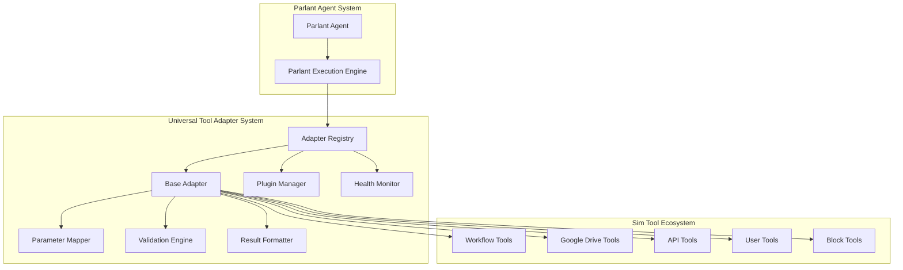

# Universal Tool Adapter System - Technical Specifications

**Version:** 1.0.0
**Author:** Claude Code Adapter Pattern Design Agent
**Date:** September 24, 2025

## Executive Summary

The Universal Tool Adapter System is a comprehensive framework that enables seamless integration between Sim's existing tool ecosystem and Parlant's conversational AI agent system. This specification provides detailed technical guidance for implementing adapters that transform Sim tools into Parlant-compatible interfaces while preserving full functionality and adding conversational enhancements.

## Table of Contents

1. [Architecture Overview](#architecture-overview)
2. [Core Components](#core-components)
3. [Implementation Guidelines](#implementation-guidelines)
4. [Type System](#type-system)
5. [Configuration Patterns](#configuration-patterns)
6. [Extension Points](#extension-points)
7. [Testing Framework](#testing-framework)
8. [Deployment Guide](#deployment-guide)
9. [Integration Examples](#integration-examples)
10. [Performance Considerations](#performance-considerations)
11. [Security Requirements](#security-requirements)
12. [Monitoring and Observability](#monitoring-and-observability)

## Architecture Overview

### System Design Principles

The Universal Tool Adapter System follows these core principles:

1. **Universal Compatibility** - Any Sim tool can be adapted without modification
2. **Type Safety** - Full TypeScript support with comprehensive type definitions
3. **Conversational Enhancement** - Natural language descriptions and context-aware responses
4. **Extensibility** - Plugin system for custom functionality and enhancements
5. **Performance** - Minimal overhead with caching and optimization
6. **Reliability** - Robust error handling and recovery mechanisms
7. **Observability** - Comprehensive logging, metrics, and health monitoring

### High-Level Architecture



### Data Flow

1. **Tool Discovery**: Parlant agents discover tools through the Adapter Registry
2. **Parameter Mapping**: Conversational parameters are mapped to Sim tool format
3. **Validation**: Input parameters and business rules are validated
4. **Execution**: The underlying Sim tool is executed with mapped parameters
5. **Result Formatting**: Tool results are formatted for conversational presentation
6. **Response**: Formatted results are returned to the Parlant agent

## Core Components

### 1. Base Adapter (`BaseAdapter`)

The foundation class that all tool adapters inherit from.

**Key Responsibilities:**
- Parameter mapping and validation orchestration
- Sim tool execution management
- Result formatting coordination
- Error handling and recovery
- Performance monitoring and logging

**Usage Pattern:**
```typescript
export class WorkflowToolAdapter extends BaseAdapter<SimWorkflowArgs, SimWorkflowResult, ParlantWorkflowArgs> {
  protected buildParameterDefinitions(): ParameterDefinition[] {
    return [
      {
        name: 'workflowName',
        description: 'Name of the workflow to execute',
        type: { baseType: 'string' },
        required: true,
        examples: ['customer-onboarding', 'data-processing']
      }
    ]
  }

  protected buildInputSchema(): z.ZodSchema<ParlantWorkflowArgs> {
    return z.object({
      workflowName: z.string().min(1),
      parameters: z.record(z.any()).optional()
    })
  }
}
```

### 2. Parameter Mapper (`ParameterMapper`)

Transforms conversational parameters into Sim tool format.

**Key Features:**
- Built-in transformation functions for common conversions
- Custom transformation registration
- Contextual value resolution
- Conditional mapping based on rules

**Transformation Types:**
- **Direct**: No transformation, direct value copying
- **String**: Text manipulation (lowercase, trim, template substitution)
- **Number**: Numeric operations (round, clamp, format)
- **Array**: Collection operations (join, filter, unique)
- **Object**: Object manipulation (pick, omit, flatten)
- **Contextual**: Context-aware values (user ID, workspace ID, timestamps)
- **Custom**: User-defined transformation functions

### 3. Validation Engine (`ValidationEngine`)

Comprehensive validation system for ensuring data integrity and business rule compliance.

**Validation Layers:**
1. **Schema Validation**: Zod-based type and structure validation
2. **Business Rules**: Domain-specific validation logic
3. **Custom Validators**: User-defined validation functions
4. **Conditional Validation**: Context-dependent validation rules

**Built-in Validators:**
- Basic types (string, number, boolean, date, UUID, email, URL)
- Collections (arrays with constraints, unique items)
- File types (size limits, MIME types, extensions)
- Business entities (workspace ID, user ID, workflow ID)

### 4. Result Formatter (`ResultFormatter`)

Converts Sim tool outputs into conversational, context-aware responses.

**Formatting Strategies:**
- **String Results**: URL detection, content summarization
- **Numerical Results**: Formatting with units, threshold analysis
- **Array Results**: List formatting, pagination handling
- **Object Results**: Property highlighting, pattern recognition
- **Error Results**: User-friendly error messages with recovery suggestions
- **File Results**: File metadata presentation, action suggestions

### 5. Adapter Registry (`AdapterRegistry`)

Central registry for managing tool adapters with extensibility and health monitoring.

**Core Functions:**
- Tool registration and discovery
- Health monitoring and status tracking
- Plugin management
- Performance metrics collection
- Migration management for version compatibility

## Implementation Guidelines

### Creating a New Adapter

1. **Identify Tool Requirements**
   ```typescript
   // Analyze the Sim tool interface
   interface SimToolDefinition {
     name: string
     execute: (ctx: ToolExecutionContext, args: Args) => Promise<ToolRunResult>
     // ... other properties
   }
   ```

2. **Define Parlant Interface**
   ```typescript
   // Define the conversational parameters
   interface ParlantToolArgs {
     primaryAction: string
     targetResource?: string
     options?: Record<string, any>
   }
   ```

3. **Create Adapter Class**
   ```typescript
   export class MyToolAdapter extends BaseAdapter<SimArgs, SimResult, ParlantArgs> {
     // Implementation details
   }
   ```

4. **Configure Parameter Mappings**
   ```typescript
   const config: AdapterConfiguration = {
     parameterMappings: [
       {
         parlantParameter: 'primaryAction',
         simParameter: 'action',
         transformations: [
           { type: 'string.toLowerCase' }
         ]
       }
     ]
   }
   ```

5. **Register with Registry**
   ```typescript
   await registry.registerAdapter(simTool, config)
   ```

### Parameter Mapping Patterns

#### Simple Direct Mapping
```typescript
{
  parlantParameter: 'fileName',
  simParameter: 'filename',
  required: true
}
```

#### Transformation Chain
```typescript
{
  parlantParameter: 'userInput',
  simParameter: 'processedInput',
  transformations: [
    { type: 'string.trim' },
    { type: 'string.toLowerCase' },
    { type: 'validation.required' }
  ]
}
```

#### Contextual Mapping
```typescript
{
  parlantParameter: 'targetUser',
  simParameter: 'userId',
  contextualValue: {
    source: 'context',
    path: 'userId'
  }
}
```

#### Conditional Mapping
```typescript
{
  parlantParameter: 'mode',
  simParameter: 'executionMode',
  conditions: [
    {
      field: 'userRole',
      operator: 'equals',
      value: 'admin'
    }
  ],
  transformations: [
    { type: 'custom', config: { adminMode: true } }
  ]
}
```

### Validation Patterns

#### Schema Validation
```typescript
const inputSchema = z.object({
  workflowId: z.string().uuid(),
  parameters: z.record(z.any()),
  executeImmediately: z.boolean().default(false)
})
```

#### Business Rule Validation
```typescript
const businessRules: BusinessRule[] = [
  {
    name: 'workspace_access',
    type: 'workspace_access',
    description: 'User must have access to the target workspace'
  },
  {
    name: 'rate_limit',
    type: 'rate_limit',
    description: 'Enforce API rate limits'
  }
]
```

#### Custom Validation
```typescript
const customValidator = async (value: any, context: any): Promise<boolean> => {
  // Custom validation logic
  return isValidForContext(value, context)
}
```

### Result Formatting Patterns

#### Template-Based Formatting
```typescript
const template: FormattingTemplate = {
  name: 'workflow_execution',
  condition: (data) => data.type === 'workflow_result',
  summary: 'Workflow "{{workflowName}}" executed successfully',
  details: 'Processing completed in {{duration}}ms with {{itemCount}} items processed',
  actions: ['View Details', 'Run Again', 'Modify Workflow']
}
```

#### Custom Formatting
```typescript
protected async customResultFormatting(
  baseResult: ParlantToolResult,
  simResult: SimToolResult,
  context: ParlantExecutionContext,
  originalArgs: ParlantArgs
): Promise<ParlantToolResult> {
  // Custom formatting logic
  if (simResult.data?.specialCase) {
    baseResult.conversational = {
      summary: 'Special processing completed',
      suggestion: 'Consider reviewing the results for accuracy'
    }
  }
  return baseResult
}
```

## Type System

### Core Type Definitions

The adapter system uses a comprehensive type system to ensure type safety and developer experience:

```typescript
// Base adapter types
export interface AdapterConfiguration {
  parlantId?: string
  displayName?: string
  description?: string
  parameterMappings?: ParameterMapping[]
  validation?: ValidationConfig
  resultFormatting?: ResultFormatting
  naturalLanguage?: NaturalLanguageConfig
}

// Parameter mapping types
export interface ParameterMapping {
  parlantParameter: string
  simParameter: string
  required?: boolean
  transformations?: MappingTransformation[]
  validation?: ValidationConfig
  conditions?: MappingRule[]
}

// Validation types
export interface ValidationConfig {
  required?: boolean
  type?: string | string[]
  schema?: z.ZodSchema<any>
  businessRules?: BusinessRule[]
  custom?: (value: any, fieldName: string) => Promise<boolean | string>
}
```

### Generic Type Constraints

Adapters use generic types to maintain type safety throughout the transformation pipeline:

```typescript
export abstract class BaseAdapter<
  TSimArgs = any,     // Sim tool argument type
  TSimResult = any,   // Sim tool result type
  TParlantArgs = any  // Parlant argument type
> implements ParlantTool {
  // Type-safe implementation
}
```

## Configuration Patterns

### Basic Configuration
```typescript
const basicConfig: AdapterConfiguration = {
  parlantId: 'sim_workflow_executor',
  displayName: 'Workflow Executor',
  description: 'Execute Sim workflows with conversational parameters',
  category: 'workflow',
  tags: ['automation', 'workflow', 'execution']
}
```

### Advanced Configuration with All Features
```typescript
const advancedConfig: AdapterConfiguration = {
  // Basic identification
  parlantId: 'sim_advanced_tool',
  displayName: 'Advanced Tool',
  description: 'Comprehensive tool with all adapter features',

  // Parameter mapping
  parameterMappings: [
    {
      parlantParameter: 'input',
      simParameter: 'processedInput',
      required: true,
      transformations: [
        { type: 'string.trim' },
        { type: 'validation.required' }
      ],
      validation: {
        schema: z.string().min(1).max(1000)
      }
    }
  ],

  // Natural language enhancement
  naturalLanguage: {
    usageDescription: 'Use this tool to process complex data with advanced algorithms',
    exampleUsage: [
      'Process customer data for analysis',
      'Transform input data for reporting',
      'Validate and clean data sets'
    ],
    conversationalHints: {
      whenToUse: 'When you need to process or transform data',
      parameters: 'Provide the data to process and any transformation options',
      results: 'The tool will return processed data with analysis summary'
    }
  },

  // Result formatting
  resultFormatting: {
    enableConversationalFormatting: true,
    enableTemplateFormatting: true,
    templates: [
      {
        name: 'success_template',
        condition: (data) => data.success === true,
        summary: 'Processing completed successfully',
        details: 'Processed {{itemCount}} items in {{duration}}ms',
        actions: ['View Results', 'Export Data', 'Process More']
      }
    ]
  },

  // Error handling
  errorHandling: {
    strategies: {
      validation: 'lenient',
      execution: 'retry',
      timeout: 'partial'
    },
    retry: {
      maxAttempts: 3,
      backoffMs: 1000
    }
  },

  // Performance optimization
  caching: {
    enabled: true,
    ttlMs: 300000, // 5 minutes
    keyStrategy: 'parameters'
  },

  // Monitoring
  monitoring: {
    metrics: {
      enabled: true,
      includeParameters: false,
      includeResults: true
    },
    performance: {
      enabled: true,
      slowExecutionThresholdMs: 5000
    }
  }
}
```

## Extension Points

### Plugin System

The adapter system supports plugins for extending functionality:

```typescript
export interface AdapterPlugin {
  name: string
  version: string
  description?: string

  // Lifecycle hooks
  onInitialize?: (adapter: BaseAdapter) => Promise<void>
  onBeforeExecution?: (context: AdapterExecutionContext, args: any) => Promise<void>
  onAfterExecution?: (context: AdapterExecutionContext, result: any) => Promise<void>
  onParameterMapping?: (params: any, context: any) => Promise<any>
  onResultFormatting?: (result: any, context: any) => Promise<any>
  onError?: (error: Error, context: AdapterExecutionContext) => Promise<void>
}
```

### Custom Plugin Example
```typescript
const analyticsPlugin: AdapterPlugin = {
  name: 'analytics-tracker',
  version: '1.0.0',
  description: 'Tracks usage analytics for tools',

  onBeforeExecution: async (context, args) => {
    // Track execution start
    analytics.track('tool_execution_start', {
      toolId: context.toolId,
      userId: context.userId
    })
  },

  onAfterExecution: async (context, result) => {
    // Track execution completion
    analytics.track('tool_execution_complete', {
      toolId: context.toolId,
      success: result.success,
      duration: Date.now() - context.startedAt.getTime()
    })
  }
}
```

## Testing Framework

### Unit Testing

```typescript
describe('WorkflowToolAdapter', () => {
  let adapter: WorkflowToolAdapter
  let mockSimTool: SimToolDefinition

  beforeEach(() => {
    mockSimTool = {
      name: 'test-workflow-tool',
      execute: jest.fn()
    }

    adapter = new WorkflowToolAdapter(mockSimTool, testConfig)
  })

  it('should map parameters correctly', async () => {
    const parlantArgs = { workflowName: 'test-workflow' }
    const context: ParlantExecutionContext = {
      // ... mock context
    }

    const result = await adapter.testParameterMapping(parlantArgs, context)
    expect(result.simArgs).toEqual({
      workflow_name: 'test-workflow'
    })
  })

  it('should format results for conversation', async () => {
    const mockResult: SimToolResult = {
      status: 200,
      data: { success: true, itemsProcessed: 42 }
    }

    const formatted = await adapter.testFormatting(mockResult, mockContext)
    expect(formatted.summary).toContain('42 items')
  })
})
```

### Integration Testing

```typescript
describe('Adapter Registry Integration', () => {
  let registry: AdapterRegistry

  beforeEach(async () => {
    registry = new AdapterRegistry(testRegistryConfig)
  })

  it('should register and discover tools', async () => {
    await registry.registerAdapter(mockSimTool, testConfig)

    const discovered = await registry.search({
      query: 'workflow',
      limit: 10
    })

    expect(discovered).toHaveLength(1)
    expect(discovered[0].tool.name).toBe('test-workflow-tool')
  })
})
```

### End-to-End Testing

```typescript
describe('Complete Adapter Flow', () => {
  it('should execute full adapter pipeline', async () => {
    // Register adapter
    await registry.registerAdapter(realSimTool, productionConfig)

    // Get adapter instance
    const adapter = await registry.getAdapter('sim_workflow_tool')

    // Execute with real parameters
    const result = await adapter.execute(realContext, realArgs)

    // Verify complete flow
    expect(result.type).toBe('success')
    expect(result.conversational.summary).toBeDefined()
    expect(result.data).toBeDefined()
  })
})
```

## Deployment Guide

### Package Structure
```
packages/universal-tool-adapter/
├── src/
│   ├── core/
│   │   └── base-adapter.ts
│   ├── mapping/
│   │   └── parameter-mapper.ts
│   ├── validation/
│   │   └── validation-engine.ts
│   ├── formatting/
│   │   └── result-formatter.ts
│   ├── registry/
│   │   └── adapter-registry.ts
│   ├── types/
│   │   ├── adapter-interfaces.ts
│   │   └── parlant-interfaces.ts
│   ├── errors/
│   │   └── adapter-errors.ts
│   └── utils/
│       └── logger.ts
├── adapters/
│   ├── workflow/
│   ├── gdrive/
│   ├── api/
│   └── user/
├── tests/
└── docs/
```

### Installation and Setup

1. **Install Dependencies**
   ```bash
   npm install zod lucide-react
   npm install --dev @types/node vitest
   ```

2. **Initialize Registry**
   ```typescript
   import { AdapterRegistry, RegistryConfig } from './src/registry/adapter-registry'

   const registryConfig: RegistryConfig = {
     storage: { type: 'memory' },
     plugins: { enabled: true },
     healthMonitoring: { enabled: true },
     caching: { enabled: true }
   }

   const registry = new AdapterRegistry(registryConfig)
   ```

3. **Register Adapters**
   ```typescript
   import { workflowTools } from '@sim/copilot/tools'
   import { WorkflowToolAdapter } from './adapters/workflow'

   // Register all workflow tools
   for (const tool of workflowTools) {
     const config = createWorkflowAdapterConfig(tool)
     await registry.registerAdapter(tool, config)
   }
   ```

### Integration with Parlant

```typescript
// In your Parlant integration layer
export class SimToolProvider implements ToolDiscovery {
  constructor(private registry: AdapterRegistry) {}

  async search(query: ToolSearchQuery): Promise<ToolSearchResult[]> {
    return this.registry.search(query)
  }

  async getTool(id: string): Promise<ParlantTool | null> {
    return this.registry.getTool(id)
  }

  // ... other ToolDiscovery methods
}
```

## Integration Examples

### Workflow Tool Integration
```typescript
// 1. Define the adapter
export class WorkflowRunnerAdapter extends BaseAdapter<
  SimWorkflowArgs,
  SimWorkflowResult,
  ParlantWorkflowArgs
> {
  protected buildParameterDefinitions(): ParameterDefinition[] {
    return [
      {
        name: 'workflowName',
        description: 'Name or ID of the workflow to execute',
        type: { baseType: 'string' },
        required: true,
        examples: ['customer-onboarding', 'data-processing-v2'],
        conversationalHints: {
          prompt: 'Which workflow would you like to run?',
          clarification: 'Please provide the exact workflow name or ID'
        }
      },
      {
        name: 'inputData',
        description: 'Input data for the workflow',
        type: { baseType: 'object' },
        required: false
      }
    ]
  }

  protected buildInputSchema(): z.ZodSchema<ParlantWorkflowArgs> {
    return z.object({
      workflowName: z.string().min(1),
      inputData: z.record(z.any()).optional(),
      waitForCompletion: z.boolean().default(true)
    })
  }

  protected async customParameterMapping(
    mappedArgs: Record<string, any>,
    originalArgs: ParlantWorkflowArgs,
    context: ParlantExecutionContext
  ): Promise<SimWorkflowArgs> {
    return {
      workflowId: mappedArgs.workflowName,
      parameters: mappedArgs.inputData || {},
      userId: context.userId,
      workspaceId: context.workspaceId,
      async: !originalArgs.waitForCompletion
    }
  }
}

// 2. Configure the adapter
const workflowConfig: AdapterConfiguration = {
  parlantId: 'sim_workflow_runner',
  displayName: 'Workflow Runner',
  description: 'Execute Sim workflows with conversational input',
  category: 'automation',
  tags: ['workflow', 'automation', 'execution'],

  naturalLanguage: {
    usageDescription: 'Run automated workflows and processes',
    exampleUsage: [
      'Run the customer onboarding workflow',
      'Execute data processing on the uploaded file',
      'Start the monthly report generation'
    ],
    conversationalHints: {
      whenToUse: 'When you need to execute an automated workflow or process',
      parameters: 'Specify the workflow name and any required input data',
      results: 'I\'ll show you the workflow execution results and any outputs'
    }
  },

  resultFormatting: {
    templates: [
      {
        name: 'workflow_success',
        condition: (data) => data.status === 'completed' && data.success,
        summary: 'Workflow "{{workflowName}}" completed successfully',
        details: 'Processed {{stepsCompleted}} steps in {{duration}}. {{outputs.length}} outputs generated.',
        actions: ['View Outputs', 'Download Results', 'Run Again']
      }
    ]
  }
}

// 3. Register with the registry
await registry.registerAdapter(simWorkflowTool, workflowConfig)
```

### Google Drive Tool Integration
```typescript
export class GDriveListAdapter extends BaseAdapter<
  SimGDriveListArgs,
  SimGDriveListResult,
  ParlantGDriveArgs
> {
  protected buildParameterDefinitions(): ParameterDefinition[] {
    return [
      {
        name: 'searchQuery',
        description: 'Search terms to find files (optional)',
        type: { baseType: 'string' },
        required: false,
        examples: ['name contains "report"', 'modifiedTime > "2023-01-01"']
      },
      {
        name: 'maxResults',
        description: 'Maximum number of files to return',
        type: { baseType: 'number' },
        required: false,
        defaultValue: 10,
        constraints: { minimum: 1, maximum: 100 }
      }
    ]
  }

  protected buildInputSchema(): z.ZodSchema<ParlantGDriveArgs> {
    return z.object({
      searchQuery: z.string().optional(),
      maxResults: z.number().int().min(1).max(100).default(10),
      includeShared: z.boolean().default(false)
    })
  }
}

const gdriveConfig: AdapterConfiguration = {
  parlantId: 'sim_gdrive_list',
  displayName: 'Google Drive File Lister',
  description: 'List and search files in Google Drive',
  category: 'integration',
  tags: ['google-drive', 'files', 'search', 'storage'],

  parameterMappings: [
    {
      parlantParameter: 'searchQuery',
      simParameter: 'q',
      transformations: [
        { type: 'string.trim' }
      ]
    },
    {
      parlantParameter: 'maxResults',
      simParameter: 'pageSize'
    }
  ],

  naturalLanguage: {
    usageDescription: 'Find and list files in your Google Drive',
    exampleUsage: [
      'Show me my recent documents',
      'Find files containing "budget" in the name',
      'List shared files from last week'
    ],
    conversationalHints: {
      whenToUse: 'When you need to find or browse files in Google Drive',
      parameters: 'Describe what files you\'re looking for or specify search criteria',
      results: 'I\'ll show you a list of matching files with details and actions'
    }
  },

  resultFormatting: {
    templates: [
      {
        name: 'file_list',
        condition: (data) => Array.isArray(data.files),
        summary: 'Found {{files.length}} files in Google Drive',
        details: '{{#files}}• {{name}} ({{humanSize}}) - {{modifiedTime}}{{/files}}',
        actions: ['Download', 'Share', 'Open in Drive', 'Get More Details']
      }
    ]
  }
}
```

## Performance Considerations

### Caching Strategy
- **Parameter-based caching** for deterministic operations
- **Result caching** with TTL for expensive computations
- **Registry caching** for tool discovery and metadata

### Optimization Techniques
- **Lazy loading** of adapter instances
- **Connection pooling** for external services
- **Batch processing** for multiple tool operations
- **Async execution** for non-blocking operations

### Performance Monitoring
```typescript
// Built-in performance tracking
logger.timeAsync('workflow_execution', async () => {
  return await workflowTool.execute(context, args)
})

// Custom performance metrics
adapter.updateStatistics(executionId, {
  success: true,
  durationMs: 1250
})
```

## Security Requirements

### Authentication and Authorization
- **JWT token validation** for user authentication
- **Permission-based access control** for tool execution
- **Workspace isolation** to prevent cross-tenant access
- **Rate limiting** to prevent abuse

### Input Sanitization
```typescript
// Automatic input sanitization
const sanitizationConfig: SecurityConfig = {
  sanitization: {
    enabled: true,
    stripScripts: true,
    maxInputLength: 10000
  },
  accessControl: {
    requiredPermissions: ['tool:execute'],
    workspaceRestrictions: ['current_workspace_only']
  }
}
```

### Data Privacy
- **Parameter logging controls** to avoid sensitive data exposure
- **Result filtering** to remove confidential information
- **Audit trails** for compliance and security monitoring

## Monitoring and Observability

### Logging Framework
```typescript
import { createLogger } from './utils/logger'

const logger = createLogger('WorkflowAdapter')

// Structured logging with context
logger.info('Workflow execution started', {
  workflowId: 'wf-123',
  userId: 'user-456',
  executionId: 'exec-789'
})
```

### Metrics Collection
- **Execution count** and **success rates**
- **Performance metrics** (duration, throughput)
- **Error rates** and **error types**
- **User adoption** and **usage patterns**

### Health Monitoring
```typescript
// Automatic health checks
registry.registerHealthCheck('workflow_adapter', async () => {
  try {
    await workflowService.ping()
    return true
  } catch {
    return false
  }
})
```

### Alerting and Notifications
- **Error rate thresholds** for proactive monitoring
- **Performance degradation** alerts
- **Service availability** monitoring
- **Custom business metric** alerts

## Conclusion

The Universal Tool Adapter System provides a comprehensive framework for integrating Sim tools with Parlant agents while maintaining full functionality and adding conversational enhancements. This specification serves as a complete guide for implementing adapters that are:

- **Type-safe** and **reliable**
- **Extensible** and **maintainable**
- **Performant** and **scalable**
- **Observable** and **monitorable**
- **Secure** and **compliant**

For additional support and implementation guidance, refer to the example adapters and test cases included in the repository.

---

**Next Steps for Implementation Teams:**

1. **Tool Registry Agent**: Implement the adapter registry system with health monitoring and plugin support
2. **Core Tool Implementation Agent**: Create adapters for high-priority Sim tools (workflow, Google Drive, API tools)
3. **Integration Testing Agent**: Develop comprehensive test suites for adapter validation
4. **Result Formatting Agent**: Implement conversational result formatting with template system
5. **Performance Monitoring Agent**: Set up observability and performance tracking
6. **Documentation Agent**: Create user guides and API documentation

The system is designed to be implemented incrementally, with each component building upon the previous ones to create a robust, production-ready tool adaptation framework.